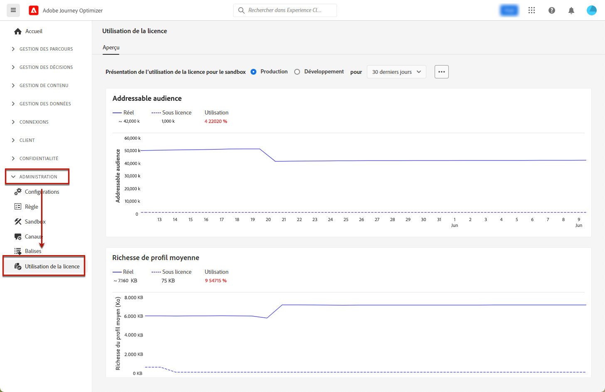

# Tableau de bord d’utilisation des licences {#license-usage}

>[!BEGINSHADEBOX]

**Sur cette page :** Découvrez comment naviguer dans le tableau de bord d’utilisation de la licence Adobe Journey Optimizer et résoudre les problèmes liés aux augmentations inattendues de votre nombre de profils engageables.

>[!ENDSHADEBOX]

L’[interface d’utilisation](../start/user-interface.md) d’[!DNL Adobe Journey Optimizer] fournit un tableau de bord qui affiche des informations importantes sur l’utilisation des licences de votre entreprise, telles qu’elles sont capturées lors d’un instantané quotidien.

Pour accéder à ce tableau de bord, accédez à **[!UICONTROL Administration]** > **[!UICONTROL Utilisation des licences]**. L’onglet **[!UICONTROL Vue d’ensemble]** s’ouvre alors. Il affiche le tableau de bord.

>[!NOTE]
>
>* Pour afficher le tableau de bord, vous devez disposer de l’autorisation [Afficher le tableau de bord d’utilisation des licences](https://experienceleague.adobe.com/docs/experience-platform/dashboards/permissions.html?lang=fr#available-permissions){target="_blank"}.
>
>* Certaines mesures (par exemple, les heures de calcul, les e-mails) ne sont pas affichées pour les sandbox de développement, comme indiqué par `N/A` dans la colonne quota. Seules les valeurs non nulles sont affichées dans le tableau de bord : lorsque les mesures sont nulles ou proches de zéro, elles ne sont pas renseignées.

Par [!DNL Adobe Journey Optimizer], le tableau de bord vous permet de vérifier le nombre de profils **Profils engageables** uniques engagés par le biais de parcours, de campagnes ou de prises de décision sur une fenêtre dynamique de 12 mois. Pour une explication complète de la définition et du calcul des profils engageables, voir [Profils engageables et utilisation de la licence](get-started-profiles.md#engageable-profiles).

>[!NOTE]
>
>Si vous constatez un pic soudain dans votre nombre de profils engageables, reportez-vous à la [section Dépannage](#troubleshooting-engageable-profiles) ci-dessous pour obtenir des conseils détaillés sur la compréhension et la résolution du problème.

## Dépannage : augmentation significative du nombre de profils engageables {#troubleshooting-engageable-profiles}

Si vous constatez un pic soudain dans le nombre de profils engageables (par exemple, le nombre de profils passe de centaines de milliers à des millions en une journée), cette section fournit des conseils pour comprendre et résoudre le problème.

### Comprendre l’augmentation

La mesure Profils engageables reflète le nombre de profils uniques engagés par des parcours ou des campagnes au cours des 12 derniers mois. Une augmentation soudaine peut résulter de :

* Les nouvelles campagnes ou les nouveaux parcours ciblent de grandes audiences
* Modifications des jeux de données activés pour le service de profil
* Traitement par lots des audiences qui n’ont pas été engagées récemment

### Étapes de résolution

Pour résoudre ce problème, procédez comme suit :

1. **Comprendre la logique de comptage des profils :**

   * Les profils engageables sont calculés en fonction des profils uniques engagés par des parcours ou des campagnes au cours des 12 derniers mois.
   * Si un profil accède à plusieurs parcours, il est comptabilisé comme un seul profil engageable pour cette sandbox.
   * La mesure ne peut pas diminuer à moins qu’il n’y ait aucun engagement avec certains profils pendant plus de 12 mois ou si des profils pseudonymes sont regroupés avec des profils connus.
   * Les profils engageables sont calculés à l’aide de l’audience adressable d’un client.
   * L’audience engagée au cours des 12 derniers mois à l’aide de l’une des fonctionnalités de Journey Optimizer, sur l’audience adressable totale, détermine le nombre de profils adressables.

2. **Examiner les parcours, les campagnes et la prise de décision ciblant de grandes audiences :**

   * Examinez les parcours et campagnes récents ciblant un grand nombre de profils à l’aide de [requêtes de profils engageables](../reports/query-examples.md#engageable-profiles-queries) ou [Query Service](https://experienceleague.adobe.com/fr/docs/experience-platform/query/home){target="_blank"}.
   * Identifier les versions de parcours spécifiques qui ont contribué au pic du nombre de profils.
   * Les parcours, campagnes et prises de décisions impliquant de nouveaux profils sont susceptibles d’entraîner une augmentation du nombre d’événements dans les jeux de données Parcours, contribuant ainsi à l’augmentation du nombre de profils engageables.

3. **Filtrage des audiences au niveau du parcours et des campagnes :**

   * Appliquez des filtres au niveau de l’audience avant de lancer des parcours ou des campagnes pour éviter toute augmentation inutile des profils engageables.
   * S’assurer que seules les audiences pertinentes sont ciblées lors des engagements.

4. **Réduire la taille de l’audience adressable :**

   * Supprimez les profils pseudonymes si nécessaire. Notez que cette action affecte à la fois Journey Optimizer et Real-Time Customer Data Platform.
   * Apprenez-en davantage sur l’[expiration des données de profils pseudonymes](https://experienceleague.adobe.com/fr/docs/experience-platform/profile/pseudonymous-profiles){target="_blank"} dans le Guide du profil client en temps réel.
   * **Remarque :** l’expiration des données de profils pseudonymes ne peut pas être configurée via l’interface utilisateur ou les API de Platform. Vous devez contacter le support technique pour activer cette fonctionnalité.

5. **Surveiller les modifications du jeu de données :**

   * Vérifiez les jeux de données activés pour le profilage et assurez-vous qu’ils ne contiennent pas un nombre excessif d’ECID (Experience Cloud ID).
   * Si nécessaire, supprimez les jeux de données avec un nombre d’ECID élevé et recréez-les avec des enregistrements réduits.

6. **Élaborer une stratégie de réduction à long terme :**

   * Le nombre de profils engageables diminue naturellement si certains profils restent non engagés pendant plus de 12 mois.

**Voir également :**

* [Exemples de requête de profils engageables](../reports/query-examples.md#engageable-profiles-queries) - Exemples de requêtes pour surveiller et analyser vos profils engageables
* [Présentation de Adobe Experience Platform Query Service](https://experienceleague.adobe.com/fr/docs/experience-platform/query/home){target="_blank"}

## Documentation connexe {#related-documentation}

Pour en savoir plus, consultez la documentation Adobe Experience Platform :

* [Présentation du tableau de bord d’utilisation des licences](https://experienceleague.adobe.com/docs/experience-platform/dashboards/guides/license-usage.html?lang=fr){target="_blank"}
* [Exploration du tableau de bord d’utilisation des licences](https://experienceleague.adobe.com/docs/experience-platform/dashboards/guides/license-usage.html?lang=fr#exploring-the-license-usage-dashboard){target="_blank"}
* [Mesures disponibles](https://experienceleague.adobe.com/docs/experience-platform/dashboards/guides/license-usage.html?lang=fr#available-metrics){target="_blank"}
* [Expiration des données de profils pseudonymes](https://experienceleague.adobe.com/docs/experience-platform/profile/pseudonymous-profiles.html?lang=fr){target="_blank"}
