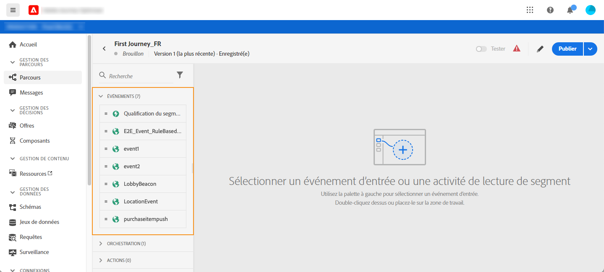
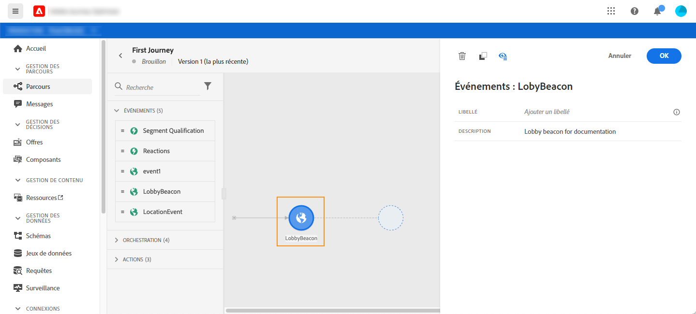
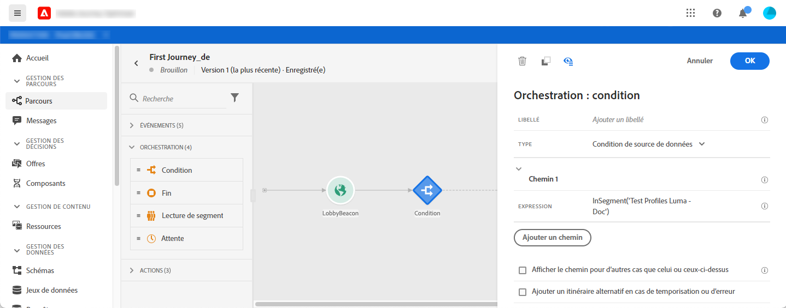

# À propos des activités de parcours {#about-journey-activities}

Combinez les différentes activités d’événement, d’orchestration et d’action pour élaborer vos scénarios à plusieurs étapes sur plusieurs canaux.

## Événements activités {#event-activities}

Les événements configurés par l’utilisateur technique (voir [cette page](../event/about-events.md)) s’affichent tous dans la première catégorie de la palette, sur le côté gauche de l’écran. Les événements activités suivants sont disponibles :

* [Événements généraux](../building-journeys/general-events.md)
* [Réaction](../building-journeys/reaction-events.md)
* [Qualification de segment](../building-journeys/segment-qualification-events.md)

Début votre parcours en faisant glisser et en déplaçant une activité de événement. Vous pouvez également cliquer sur le doublon-clic dessus.

## Activités d&#39;orchestration {#orchestration-activities}

Dans la palette, sur le côté gauche de l’écran, les activités d’orchestration suivantes sont disponibles :

* [Condition](../building-journeys/condition-activity.md)
* [Fin](../building-journeys/end-activity.md)
* [Attendre](../building-journeys/wait-activity.md)
* [Segment lu](../building-journeys/read-segment.md)

## Activités d&#39;action {#action-activities}

À partir de la palette, sur le côté gauche de l’écran, sous **[!UICONTROL Événements]** et **[!UICONTROL Orchestration]**, vous trouverez la catégorie **[!UICONTROL Actions]**. Les activités d’action suivantes sont disponibles :

* [Message](../building-journeys/journeys-message.md)
* [Actions personnalisées](../building-journeys/using-custom-actions.md)
* [Sauter](../building-journeys/jump.md)

Ces activités représentent les différents canaux de communication disponibles. Vous pouvez les combiner pour créer un scénario de plusieurs canaux.

Si vous avez configuré des actions personnalisées, elles s’affichent ici (voir [cette page](../building-journeys/using-custom-actions.md)).

## Meilleures pratiques {#best-practices}

La plupart des activités vous permettent de définir une **[!UICONTROL étiquette]**. Ceci ajoute un suffixe au nom qui apparaîtra sous votre activité dans la trame. Cela s’avère utile si vous utilisez plusieurs fois la même activité dans votre parcours et souhaitez les identifier plus facilement. Il facilitera également le débogage en cas d’erreur et facilitera la lecture des rapports. Vous pouvez également ajouter une **[!UICONTROL Description]** facultative.

Lorsqu’une erreur se produit dans une action ou une condition, le parcours d’une personne s’arrête. La seule façon de le faire continuer est de cocher la case **[!UICONTROL Ajouter un autre chemin en cas de dépassement de délai ou d&#39;erreur]**. Voir [cette section](../building-journeys/using-the-journey-designer.md#paths).

