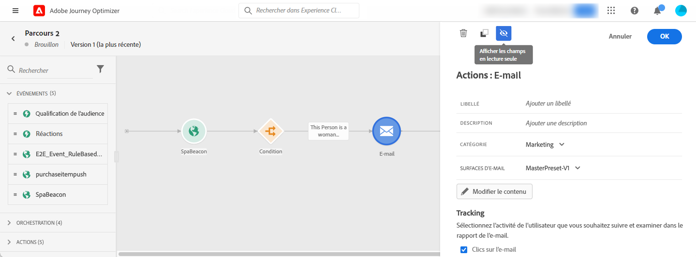

# À propos des activités de parcours {#about-journey-activities}

Combinez les différentes activités d&#39;événement, d&#39;orchestration et d&#39;action afin de créer des scénarios cross-canal à plusieurs étapes.

## Activités d’événement {#event-activities}

Les événements configurés par l’utilisateur technique (voir [cette page](../event/about-events.md)) sont tous affichés dans la première catégorie de la palette, dans la partie gauche de l’écran. Les activités d&#39;événement suivantes sont disponibles :

* [Événements généraux](../building-journeys/general-events.md)
* [Réaction](../building-journeys/reaction-events.md)
* [Qualification du segment](../building-journeys/segment-qualification-events.md)

Commencez votre parcours en faisant glisser et déposer une activité d’événement. Vous pouvez également double-cliquer sur celle-ci.

## Activités d’orchestration {#orchestration-activities}

Les activités d’orchestration ci-dessous sont disponibles dans la palette située dans la partie gauche de l’écran :

* [Activité de ](../building-journeys/condition-activity.md)
* [Attente](../building-journeys/wait-activity.md)
* [Lecture de segment](../building-journeys/read-segment.md)

## Activités d&#39;action {#action-activities}

La catégorie **[!UICONTROL Actions]** se trouve dans la palette située dans la partie gauche de l’écran, sous **[!UICONTROL Événements]** et **[!UICONTROL Orchestration.]** Les activités d&#39;action suivantes sont disponibles :

* [Email, SMS, Push](../building-journeys/journeys-message.md)
* [Actions personnalisées](../building-journeys/using-custom-actions.md)
* [Sauter](../building-journeys/jump.md)

Ces activités représentent les différents canaux de communication disponibles. Vous pouvez les combiner pour créer un scénario cross-canal.

Si vous avez configuré des actions personnalisées, elles s’affichent à cet emplacement (voir [cette page](../building-journeys/using-custom-actions.md)).

## Bonnes pratiques {#best-practices}

La plupart des activités vous permettent de définir un **[!UICONTROL libellé]**. Vous pouvez ainsi ajouter un suffixe au nom qui apparaîtra sous votre activité dans la zone de travail. Cela s’avère utile si vous utilisez plusieurs fois la même activité dans votre parcours et souhaitez faciliter son identification. Cela facilite également le débogage lorsque des erreurs se produisent et permet une lecture plus facile des rapports. Vous pouvez, en outre, ajouter une **[!UICONTROL description]** facultative.

Lorsqu&#39;une erreur se produit dans une action ou une condition, le parcours d&#39;un individu s&#39;arrête. La seule façon de le faire continuer est de cocher la case **[!UICONTROL Ajouter un itinéraire alternatif en cas de temporisation ou d&#39;erreur]**. Consultez [cette section](../building-journeys/using-the-journey-designer.md#paths).

