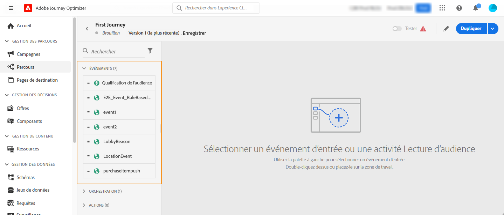
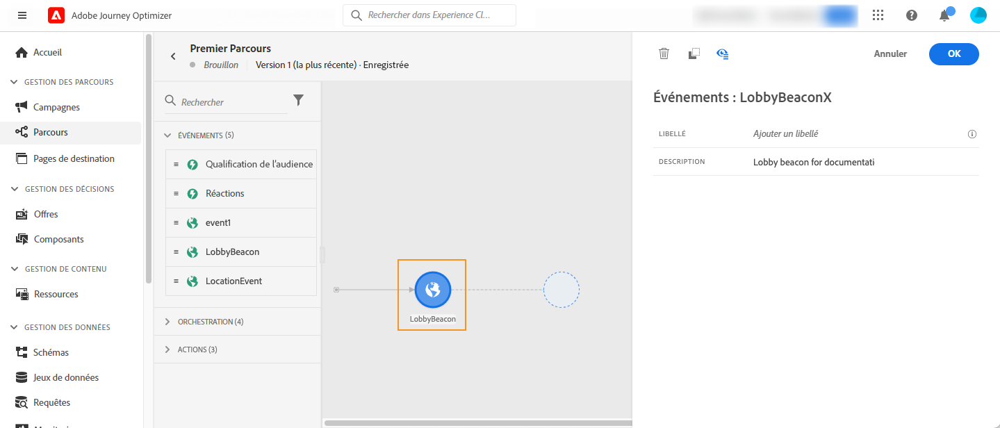
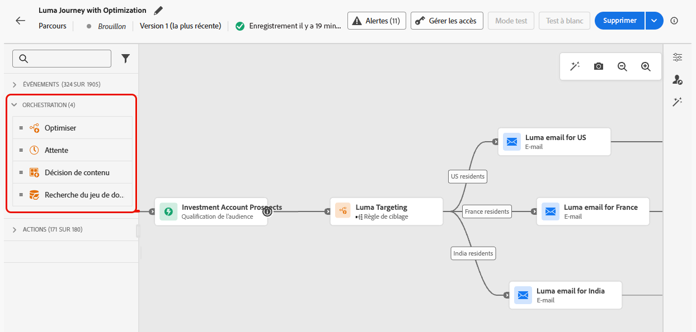
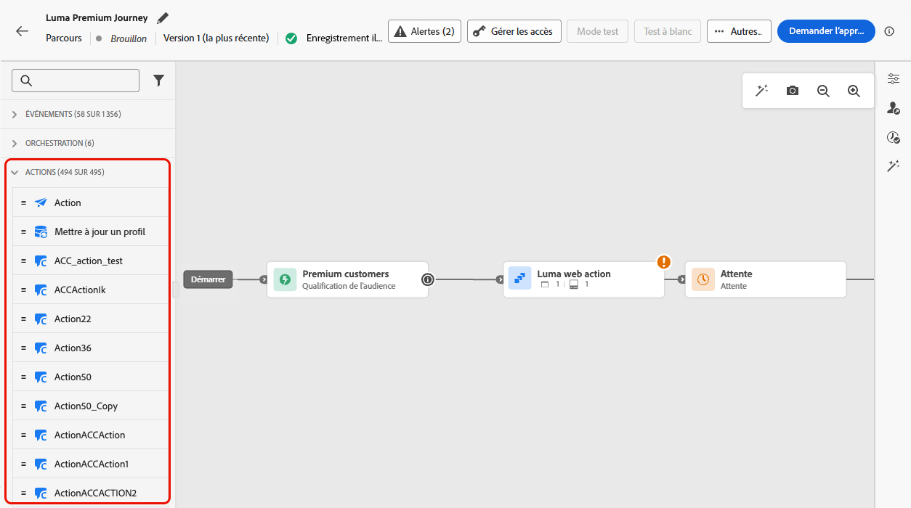
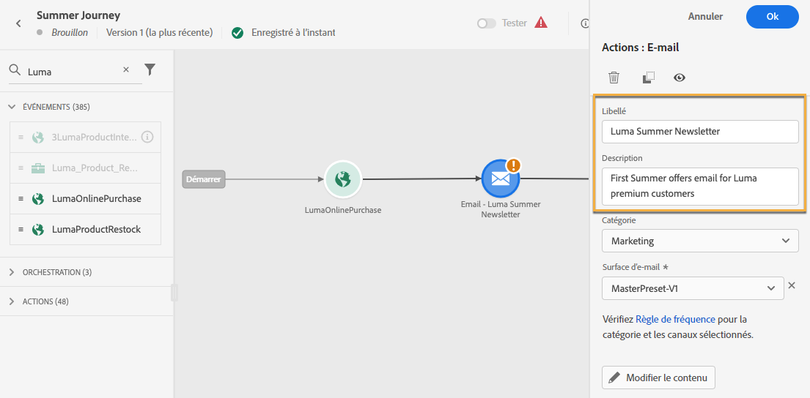
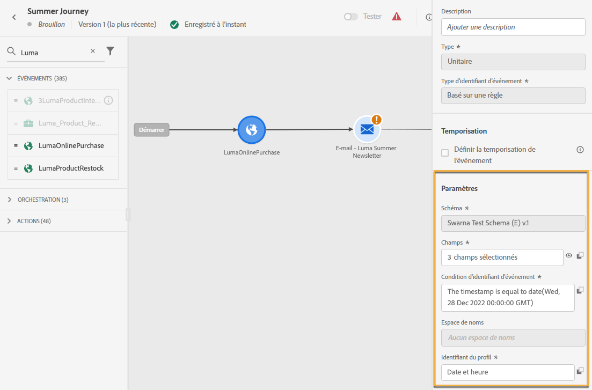
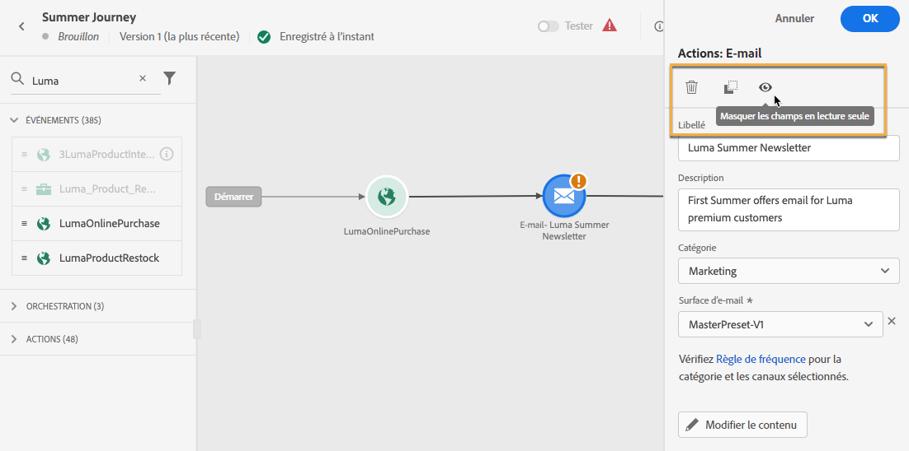
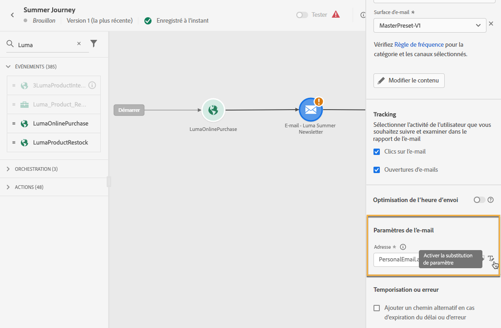
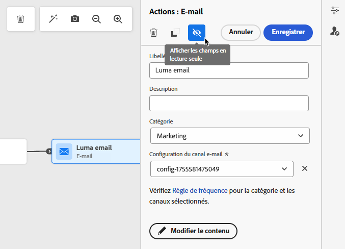
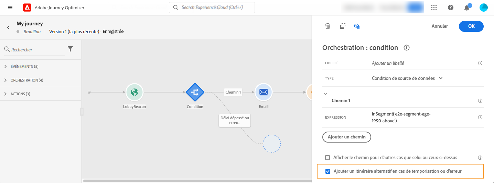

# Prise en main des activités de parcours {#about-journey-activities}

>[!BEGINSHADEBOX]

**Sur cette page :** découvrez comment combiner des activités d’événement, d’orchestration et d’action afin de créer des parcours cross-canal à plusieurs étapes, avec des bonnes pratiques pour les activités d’étiquetage, la gestion des paramètres et le dépannage.

>[!ENDSHADEBOX]

Combinez des activités d’événement, d’orchestration et d’action afin de créer des scénarios cross-canal à plusieurs étapes.

## Activités d’événement {#event-activities}

Les parcours personnalisés commencent par des événements tels qu’un achat en ligne. Une fois qu’un profil entre dans un parcours, il le parcourt tout seul. Chaque profil peut suivre un chemin et un rythme différents. Lorsque vous commencez avec un événement, le parcours se déclenche lorsque l’événement arrive. Chaque profil suit ensuite les étapes définies dans votre parcours.

Les événements configurés par l’utilisateur ou l’utilisatrice technique (voir [cette page](../event/about-events.md)) apparaissent dans la première catégorie de la palette. Cette catégorie se trouve dans la partie gauche de l&#39;écran. Les activités d’événement suivantes sont disponibles :

* [Événements généraux](../building-journeys/general-events.md)
* [Réaction](../building-journeys/reaction-events.md)
* [Qualification d’audience](../building-journeys/audience-qualification-events.md)

Pour démarrer votre parcours, faites glisser et déposez une activité d’événement. Vous pouvez également double-cliquer sur celle-ci.

## Activités d’orchestration {#orchestration-activities}

Les activités d’orchestration sont des conditions qui permettent de déterminer l’étape suivante du parcours. Ces conditions peuvent inclure le fait que la personne ait un dossier d’assistance ouvert ou qu’elle ait effectué un achat. Ils peuvent également inclure les prévisions météorologiques locales ou indiquer si la personne a atteint 10 000 points de fidélité.

Les activités d’orchestration ci-dessous sont disponibles dans la palette située dans la partie gauche de l’écran :

* [Optimiser](optimize.md)
* [Lecture d’audience](read-audience.md)
* [Attente](wait-activity.md)
* [Fragments de parcours](journey-fragments.md)
* [Décision de contenu](content-decision.md)
* [Recherche de jeu de données](dataset-lookup.md)

## Activités d’action {#action-activities}

Les actions sont ce que vous souhaitez qu’il se produise à la suite d’un déclencheur, comme l’envoi d’un message. Il s’agit de l’élément du parcours que le client ou la cliente rencontre.

La catégorie **[!UICONTROL Actions]** se trouve dans la palette située dans la partie gauche de l’écran, sous **[!UICONTROL Événements]** et **[!UICONTROL Orchestration]**. Les activités d’action suivantes sont disponibles :

* [Actions de canal intégrées](../building-journeys/journey-action.md) disponible à partir de l’activité **Action**
* [Actions personnalisées](../building-journeys/using-custom-actions.md)
* [Saut](../building-journeys/jump.md)

Ces activités représentent les différents canaux de communication disponibles. Vous pouvez les combiner pour créer un scénario cross-canal.

Vous pouvez également configurer des actions spécifiques pour envoyer des messages :

* Si vous utilisez un système tiers pour envoyer des messages, vous pouvez créer une action personnalisée spécifique. [En savoir plus](../action/action.md)

* Si vous utilisez [!DNL Adobe Campaign] et [!DNL Adobe Journey Optimizer], reportez-vous aux sections suivantes :

   * [[!DNL Adobe Journey Optimizer] et [!DNL Adobe Campaign] v7/v8](../action/acc-action.md)
   * [[!DNL Adobe Journey Optimizer] et  [!DNL Adobe Campaign]  Standard](../action/acs-action.md)
   * [[!DNL Adobe Journey Optimizer] et  [!DNL Adobe Marketo Engage]](../action/marketo-engage.md)

## Bonnes pratiques {#best-practices}

Utilisez ces recommandations pour que les parcours soient lisibles, cohérents et faciles à résoudre.

### Ajouter un libellé

La plupart des activités vous permettent de définir un **[!UICONTROL libellé]**. Un suffixe est alors ajouté au nom qui apparaît sous votre activité dans la zone de travail. Cela s’avère utile si vous utilisez plusieurs fois la même activité dans votre parcours et souhaitez faciliter son identification. Cela facilite également le débogage en cas d’erreurs et rend les rapports plus lisibles. Vous pouvez, en outre, ajouter une **[!UICONTROL description]** facultative.

>[!NOTE]
>
>Pour certaines activités, leur identifiant est également visible dans le volet. Cet identifiant peut être utilisé dans les rapports sous la forme d’une clé plus stable que le libellé, qui peut changer.

### Gérer les paramètres avancés {#advanced-parameters}

La plupart des activités affichent un certain nombre de paramètres avancés et/ou techniques que vous ne pouvez pas modifier.

Pour une meilleure lisibilité, masquez ces paramètres à l’aide du bouton **[!UICONTROL Masquer les champs en lecture seule]** situé en haut du volet de droite.

Dans certains contextes précis, vous pouvez remplacer les valeurs de ces paramètres pour une utilisation spécifique. Pour forcer une valeur, cliquez sur l’icône **[!UICONTROL Activer le remplacement du paramètre]** à droite du champ. [En savoir plus](../configuration/primary-email-addresses.md#override-execution-address-journey)

>[!NOTE]
>
>Si les paramètres avancés sont masqués, cliquez sur le bouton **[!UICONTROL Afficher les champs en lecture seule]**.
>
>{width=60%}

### Ajouter un chemin d’accès alternatif

Lorsqu’une erreur se produit dans une action ou une condition, le parcours d’une personne s’arrête. La seule façon de le faire continuer est de cocher la case **[!UICONTROL Ajouter un chemin alternatif en cas de temporisation ou d’erreur]**. Voir [cette section](../building-journeys/using-the-journey-designer.md#paths)

## Dépannage {#troubleshooting}

Avant de tester et de publier votre parcours, vérifiez que toutes les activités sont correctement configurées. Vous ne pouvez pas effectuer de tests ou de publications si des erreurs sont détectées par le système.

Découvrez [dans cette page](troubleshooting.md) comment résoudre les erreurs dans les activités et dans le parcours.

Voir aussi [&#x200B; Surveillance et dépannage &#x200B;](../../rp_landing_pages/troubleshoot-journey-landing-page.md)

+++ Référence des connaissances sur l’IA

Cette section contient des connaissances structurées destinées à soutenir l’interprétation, la récupération et la réponse aux questions liées à ce sujet.

Pour une compréhension totale, ces informations doivent être combinées avec la documentation de cette page. Aucune des sources n’est conçue pour être autonome. La page décrit la fonctionnalité, tandis que cette section fournit un contexte supplémentaire qui permet de clarifier la terminologie, l’intention, l’applicabilité et les contraintes.

* **TL;DR:** Cette page présente les trois catégories d’activités de parcours (événements, orchestration et actions) et explique les bonnes pratiques en matière d’étiquetage, de gestion des paramètres et de gestion des erreurs dans les parcours Adobe Journey Optimizer.

**Intentions:**
* Identifier et distinguer les activités d’événement, d’orchestration et d’action dans un parcours
* Ajouter des libellés et des descriptions aux activités de parcours pour faciliter l’identification et la création de rapports
* Configurer un autre chemin pour gérer les délais d’expiration ou les erreurs dans une activité de parcours
* Remplacer les paramètres avancés sur une activité de parcours spécifique
* Combiner plusieurs types d’activité pour créer des scénarios de parcours cross-canal
* Résolution des erreurs de configuration d’activité avant de publier un parcours

**Glossaire:**
* **Activité d’événement** : activité de parcours déclenchée par un événement entrant (par exemple, achat, qualification d’audience) qui démarre ou fait progresser un profil via le *de parcours (spécifique au produit)*
* **Activité d’orchestration** : activité de parcours (par exemple, Optimiser, Lecture d’audience, Attente) qui contrôle le flux et la logique d’embranchement d’un *de parcours (spécifique au produit)*
* **Activité d’action** : activité de parcours qui diffuse une communication ou appelle un système externe à la suite d’une *de déclenchement (spécifique au produit)*
* **Action personnalisée** : action configurée par l’utilisateur qui connecte Journey Optimizer à un système tiers pour l’envoi de messages ou de *de données (spécifique au produit)*
* **Chemin alternatif** : branche de secours ajoutée à une activité pour que le parcours se poursuive même lorsqu’une temporisation ou une erreur se produit *(spécifique au produit)*

**Mécanismes de sécurisation :**
* Les tests et publications ne peuvent pas être effectués si des erreurs de configuration sont toujours détectées dans une activité
* Les paramètres avancés/techniques de la plupart des activités sont en lecture seule et ne peuvent pas être modifiés sans utiliser la fonction de remplacement des paramètres

**Terminologie:**
* Nom canonique : Parcours Activité — Acronyme : none — variantes : activité, nœud, étape
* Synonymes : « action activity » = « channel action » = « message action »
* Ne les confondez pas : « Activité d’orchestration » ≠ « Activité d’action » (l’orchestration contrôle le flux ; les actions diffusent les communications).

**FAQ:**
* **Q : Quelle est la différence entre les activités d’événement, d’orchestration et d’action ?** — les activités d’événement déclenchent l’entrée ou la progression du parcours ; les activités d’orchestration contrôlent la logique de branchement et de flux ; les activités d’action diffusent des messages ou appellent des systèmes externes.
* **Q : Comment ajouter un libellé à une activité de parcours ?** — Ouvrez le volet des propriétés de l&#39;activité et renseignez le champ Libellé ; le libellé apparaît sous forme de suffixe sous le nœud de l&#39;activité sur la zone de travail.
* **Q : Que se passe-t-il lorsqu’une erreur se produit dans une action ou une activité de condition ?** — Le parcours du profil s&#39;arrête, sauf si vous cochez l&#39;option « Ajouter un itinéraire alternatif en cas de temporisation ou d&#39;erreur » sur cette activité.
* **Q : Puis-je utiliser Adobe Campaign pour envoyer des messages à partir d’un parcours ?** — Oui, Journey Optimizer prend en charge l’intégration à Adobe Campaign v7/v8, Campaign Standard et Marketo Engage pour l’envoi de messages par le biais d’activités d’action personnalisée.
* **Q : Comment puis-je remplacer un paramètre avancé en lecture seule sur une activité ?** — Cliquez sur l&#39;icône « Activer le remplacement de paramètre » à droite du champ de paramètre pour forcer une valeur personnalisée.

+++
