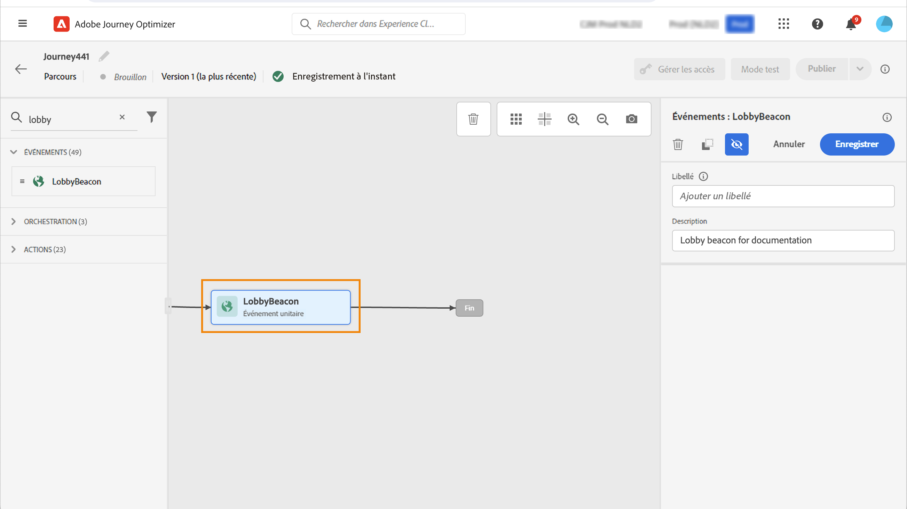
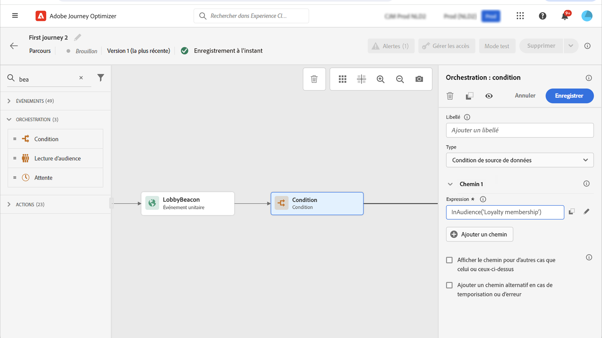
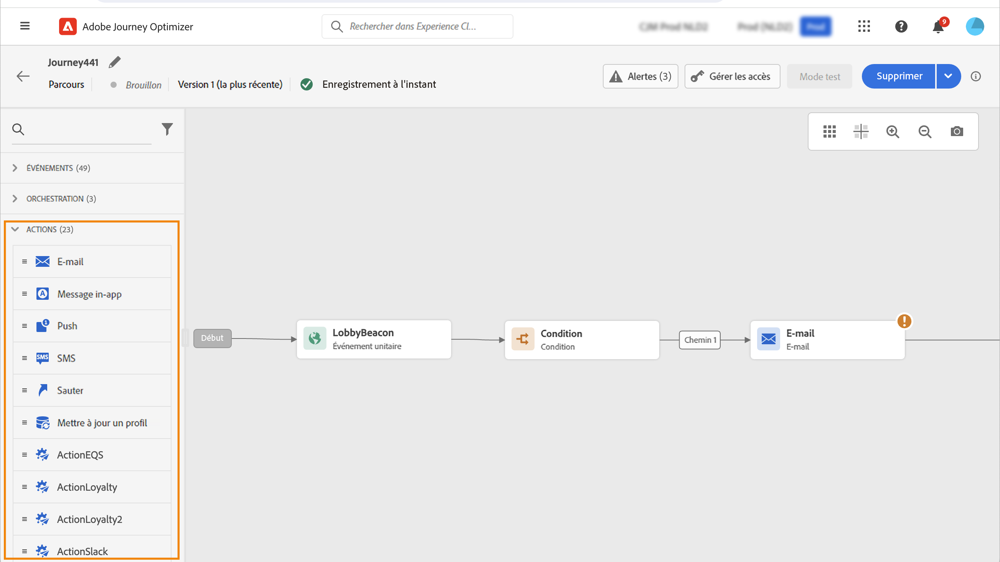
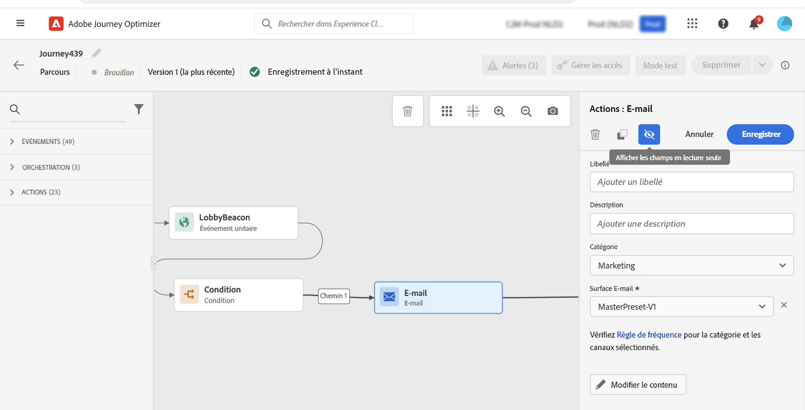
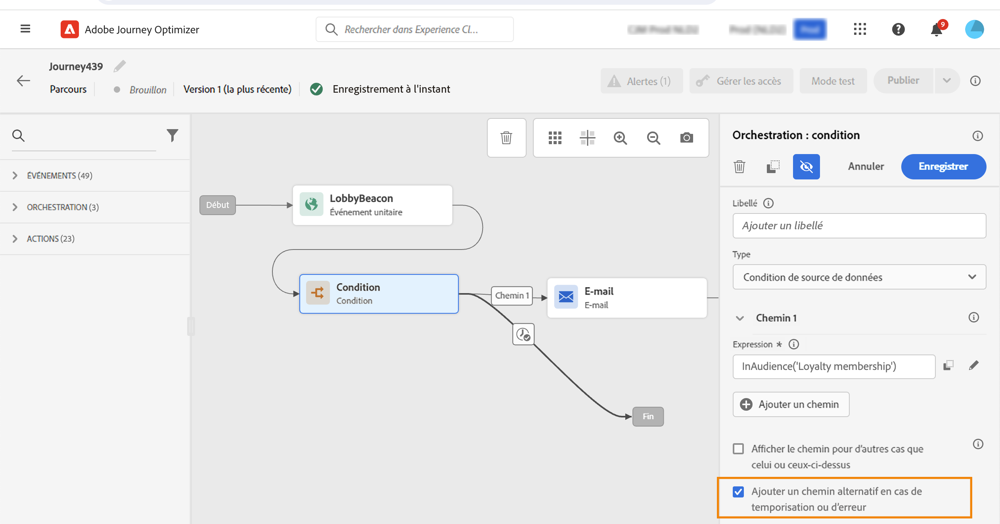

# Prise en main des activités de parcours {#about-journey-activities}

Combinez les différentes activités d’événement, d’orchestration et d’action pour créer vos scénarios cross-canal à plusieurs étapes.

## Activités d’événement {#event-activities}

Les événements sont ce qui déclenche un parcours personnalisé, tel qu’un achat en ligne. Une fois qu’une personne entre dans un parcours, elle le traverse en tant qu’individu, et aucun de deux individus ne se déplace au même rythme ou le long du même chemin. Lorsque vous commencez votre parcours avec un événement, celui-ci est déclenché à la réception de l’événement. Chaque personne du parcours suit ensuite, individuellement, les étapes suivantes définies dans le parcours.

Événements configurés par l’utilisateur technique (voir [cette page](../event/about-events.md)) sont toutes affichées dans la première catégorie de la palette, sur le côté gauche de l’écran. Les activités d’événement suivantes sont disponibles :

* [Événements généraux](../building-journeys/general-events.md)
* [Réaction](../building-journeys/reaction-events.md)
* [Qualification de segment](../building-journeys/segment-qualification-events.md)

Commencez votre parcours en faisant glisser une activité d’événement. Vous pouvez également double-cliquer dessus.

## Activités d’orchestration {#orchestration-activities}

Les activités d’orchestration sont des conditions différentes qui permettent de déterminer l’étape suivante du parcours. Cela peut être le cas si la personne a un cas de soutien ouvert ou non, les prévisions météorologiques à son emplacement actuel, si elle a effectué un achat ou non, ou si elle a atteint 10 000 points de fidélité.

Depuis la palette, située à gauche de l&#39;écran, les activités d&#39;orchestration suivantes sont disponibles :

* [Condition](../building-journeys/condition-activity.md)
* [Attente](../building-journeys/wait-activity.md)
* [Lecture de segment](../building-journeys/read-segment.md)

## Activités d&#39;action {#action-activities}

Les actions sont ce que vous voulez qu’il se produise à la suite d’un déclencheur, comme l’envoi d’un message. Il s’agit du parcours que le client traverse.

Dans la palette, située à gauche de l’écran, au-dessous **[!UICONTROL Events]** et **[!UICONTROL Orchestration]**, vous pouvez trouver la variable **[!UICONTROL Actions]** catégorie. Les activités d’action suivantes sont disponibles :

* [Email, SMS, Push](../building-journeys/journeys-message.md)
* [Actions personnalisées](../building-journeys/using-custom-actions.md)
* [Saut](../building-journeys/jump.md)

Ces activités représentent les différents canaux de communication disponibles. Vous pouvez les combiner pour créer un scénario cross-canal.

Si vous avez configuré des actions personnalisées, elles s’affichent également à cet emplacement. [En savoir plus](../building-journeys/using-custom-actions.md)).

## Bonnes pratiques {#best-practices}

La plupart des activités vous permettent de définir une **[!UICONTROL Label]**. Cela ajoute un suffixe au nom qui apparaîtra sous votre activité dans la zone de travail. Cela s’avère utile si vous utilisez plusieurs fois la même activité dans votre parcours et souhaitez les identifier plus facilement. Cela facilite également le débogage en cas d’erreur et facilite la lecture des rapports. Vous pouvez également ajouter une **[!UICONTROL Description]**.

Lorsqu’une erreur se produit dans une action ou une condition, le parcours d’un individu s’arrête. La seule façon de le faire continuer est de cocher la case. **[!UICONTROL Add an alternative path in case of a timeout or an error]**. Voir [cette section](../building-journeys/using-the-journey-designer.md#paths).

