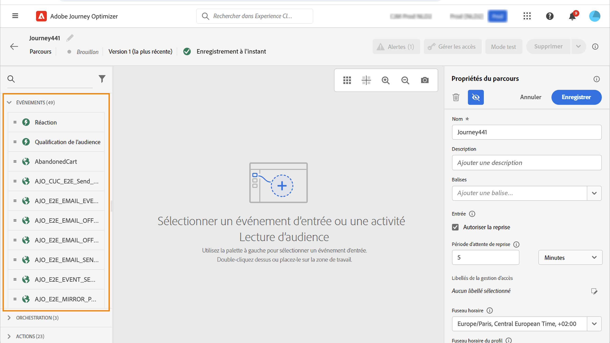
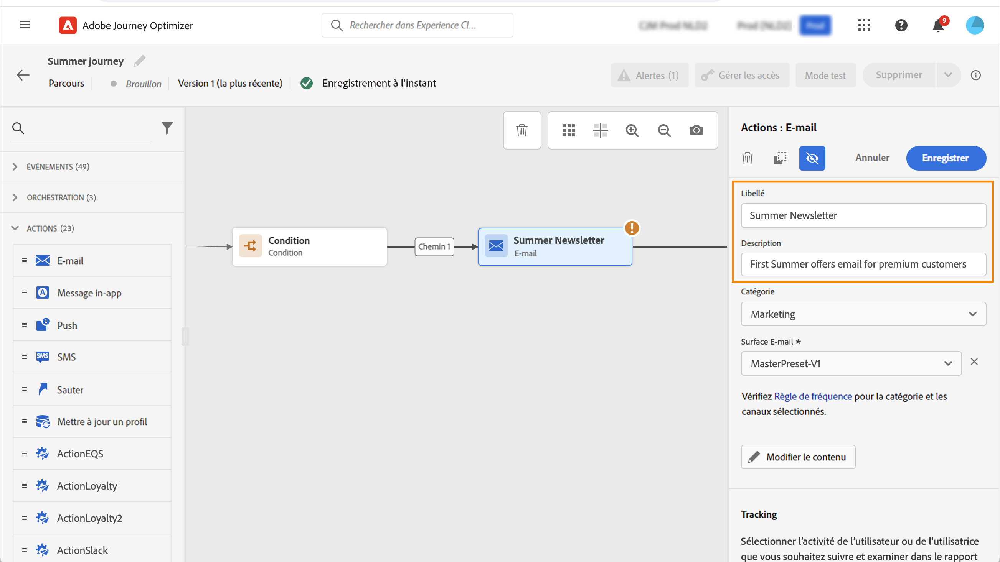
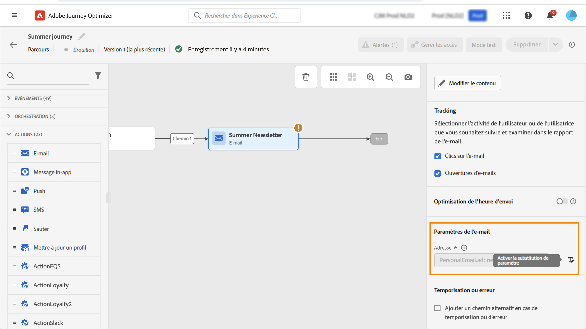

# Prise en main des activités du parcours {#about-journey-activities}

Combinez les différentes activités d’événement, d’orchestration et d’action afin de créer des scénarios cross-canal à plusieurs étapes.

## Activités d’événement {#event-activities}

Les parcours personnalisés sont déclenchés par des événements, tels qu’un achat en ligne. Lorsqu’un profil rejoint un parcours, il progresse de manière individuelle, et aucun individu ne suit le même rythme ni le même chemin. Lorsque vous commencez votre parcours avec un événement, le parcours est déclenché à la réception de cet événement. Ensuite, chaque personne du parcours suit individuellement les étapes suivantes définies dans votre parcours.

Les événements configurés par l’utilisateur ou l’utilisatrice technique (voir [cette page](../event/about-events.md)) sont tous affichés dans la première catégorie de la palette, dans la partie gauche de l’écran. Les activités d’événement suivantes sont disponibles :

* [Événements généraux](../building-journeys/general-events.md)
* [Réaction](../building-journeys/reaction-events.md)
* [Qualification de l’audience](../building-journeys/audience-qualification-events.md)

Pour démarrer votre parcours, faites glisser et déposez une activité d’événement. Vous pouvez également double-cliquer sur celle-ci.

## Activités d’orchestration {#orchestration-activities}

Les activités d’orchestration sont des conditions différentes qui permettent de déterminer l’étape suivante du parcours. Ces conditions peuvent inclure le fait de savoir si la personne a un dossier d’assistance ouvert, les prévisions météorologiques à son emplacement actuel, si elle a effectué un achat ou si elle a atteint 10 000 points de fidélité.

Les activités d’orchestration ci-dessous sont disponibles dans la palette située dans la partie gauche de l’écran :

<!--* [Optimize](optimize.md)-->
* [Lecture d’audience](read-audience.md)
* [Attente](wait-activity.md)
* [Décision de contenu](content-decision.md)
* [Recherche de jeu de données](dataset-lookup.md)

## Activités d’action {#action-activities}

Les actions sont ce que vous souhaitez qu’il se produise à la suite d’un déclencheur, comme l’envoi d’un message. Il s’agit de l’élément du parcours que le client ou la cliente rencontre.

La catégorie **[!UICONTROL Actions]** se trouve dans la palette située dans la partie gauche de l’écran, sous **[!UICONTROL Événements]** et **[!UICONTROL Orchestration]**. Les activités d’action suivantes sont disponibles :

* [Actions de canal intégrées](../building-journeys/journeys-message.md)
* [Actions personnalisées](../building-journeys/using-custom-actions.md)
* [Sauter](../building-journeys/jump.md)

Ces activités représentent les différents canaux de communication disponibles. Vous pouvez les combiner pour créer un scénario cross-canal.

Vous pouvez également configurer des actions spécifiques pour envoyer des messages :

* Si vous utilisez un système tiers pour envoyer des messages, vous pouvez créer une action personnalisée spécifique. [En savoir plus](../action/action.md)

* Si vous utilisez Campaign et Journey Optimizer, reportez-vous aux sections suivantes :

   * [[!DNL Journey Optimizer] et Campaign v7/v8](../action/acc-action.md)
   * [[!DNL Journey Optimizer] et Campaign Standard](../action/acs-action.md)
   * [[!DNL Journey Optimizer] et Marketo Engage](../action/marketo-engage.md)

## Bonnes pratiques {#best-practices}

### Ajouter un libellé

La plupart des activités vous permettent de définir un **[!UICONTROL libellé]**. Un suffixe est alors ajouté au nom qui apparaît sous votre activité dans la zone de travail. Cela s’avère utile si vous utilisez plusieurs fois la même activité dans votre parcours et souhaitez faciliter son identification. Cela facilite également le débogage en cas d’erreurs et rend les rapports plus lisibles. Vous pouvez, en outre, ajouter une **[!UICONTROL description]** facultative.

>[!NOTE]
>
>Pour certaines activités, leur identifiant est également visible dans le volet. Cet identifiant peut être utilisé dans les rapports sous la forme d’une clé plus stable que le libellé, qui peut changer.

### Gérer les paramètres avancés {#advanced-parameters}

La plupart des activités affichent un certain nombre de paramètres avancés et/ou techniques que vous ne pouvez pas modifier.

Pour une meilleure lisibilité, masquez ces paramètres à l’aide du bouton **[!UICONTROL Masquer les champs en lecture seule]** situé en haut du volet de droite.

Dans certains contextes précis, vous pouvez remplacer les valeurs de ces paramètres pour une utilisation spécifique. Pour forcer une valeur, cliquez sur l’icône **[!UICONTROL Activer le remplacement du paramètre]** à droite du champ. [En savoir plus](../configuration/primary-email-addresses.md#override-execution-address-journey).

>[!NOTE]
>
>Si les paramètres avancés sont masqués, cliquez sur le bouton **[!UICONTROL Afficher les champs en lecture seule]**.
>
>{width=60%}

### Ajouter un chemin d’accès alternatif

Lorsqu’une erreur se produit dans une action ou une condition, le parcours d’une personne s’arrête. La seule façon de le faire continuer est de cocher la case **[!UICONTROL Ajouter un chemin alternatif en cas de temporisation ou d’erreur]**. Consultez [cette section](../building-journeys/using-the-journey-designer.md#paths).

## Résolution des problèmes {#troubleshooting}

Avant de tester et de publier votre parcours, vérifiez que toutes les activités sont correctement configurées. Vous ne pouvez pas effectuer de tests ou de publications si des erreurs sont détectées par le système.

Découvrez [dans cette page](troubleshooting.md) comment résoudre les erreurs dans les activités et dans le parcours.

Voir aussi **[Surveillance et dépannage](/help/rp_landing_pages/troubleshoot-journey-landing-page.md)**.
