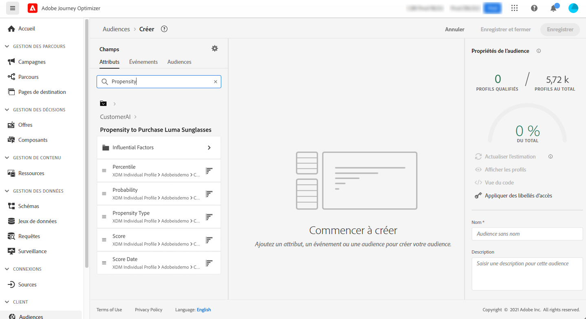

# Intégration aux services intelligents {#ai-overview}

L’intégration à **[!DNL Adobe Intelligent Services]** vous permet de tirer parti de l’intelligence artificielle et du machine learning dans des cas d’utilisation liés à l’expérience client. Elle permet aux analystes marketing de configurer des prédictions adaptées aux besoins spécifiques d’une entreprise à l’aide de configurations métier, sans nécessiter d’expertise en science des données.

[!DNL Intelligent Services], construit sur Adobe Experience Platform, fournit aux spécialistes marketing en charge de l’expérience client un accès à l’IA en tant que service (AI-as-a-Service). Cela facilite la prédiction du comportement de la clientèle, la mesure de l’impact d’une campagne ou l’optimisation du retour sur chaque investissement. Pour plus de détails sur [!DNL Adobe Intelligent Services], consultez la [documentation d’Adobe Experience Platform](https://experienceleague.adobe.com/docs/experience-platform/intelligent-services/home.html?lang=fr){target="_blank"}.

L&#39;intégration entre [!DNL Journey Optimizer] et [!DNL Intelligent Services] vous permet de tirer parti des prédictions de la clientèle.

L’IA dédiée aux clients, un composant de [!DNL Adobe Intelligent Services], prédit les actions probables de la clientèle. Consultez la [documentation d’Adobe Experience Platform](https://experienceleague.adobe.com/docs/experience-platform/intelligent-services/customer-ai/overview.html?lang=fr){target="_blank"}.

L’IA dédiée aux clients permet aux marques de créer des scores d’attrition ou à de conversion, basés sur le machine learning. Ces scores sont disponibles sous forme d’attributs de profil dans les profils Adobe Experience Platform (profil client en temps réel).

Par conséquent, ces attributs peuvent être utilisés comme n’importe quel autre attribut de profil dans les conditions de Journey Optimizer (pour prendre des décisions optimales), dans les actions ou lors de la création de segments.

