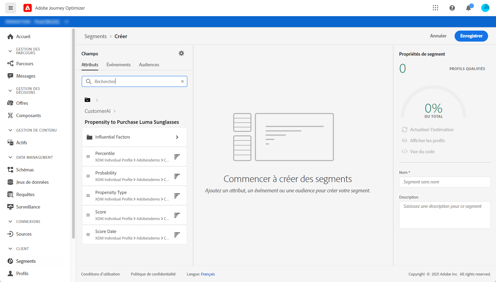

# Intégration avec les services intelligents {#ai-overview}

L’intégration avec les Services intelligents vous permet d’exploiter la puissance de l’intelligence artificielle et du machine learning dans les cas d’utilisation de l’expérience client. Les analystes marketing peuvent obtenir des prédictions spécifiques aux besoins d’une entreprise en utilisant des configurations au niveau de l’entreprise sans avoir besoin d’expertise en sciences des données.

Pour plus d’informations sur les Services intelligents, consultez la [documentation](https://docs.adobe.com/content/help/fr-FR/experience-platform/intelligent-services/home.html).

Cette intégration vous permet d’exploiter les prédictions des clients.

L’IA dédiée aux clients fait partie des Services intelligents. Elle permet de prévoir ce qu’un client est susceptible de faire. Reportez-vous à la [documentation](https://docs.adobe.com/content/help/fr-FR/experience-platform/intelligent-services/customer-ai/overview.html).

L’IA dédiée aux clients permet aux marques de créer des scores basés sur le machine learning d’attrition ou de conversion qui seront disponibles en tant qu’attributs de profil dans les profils Adobe Experience Platform (profil client en temps réel).

Par conséquent, ils peuvent être utilisés comme tout autre attribut de profil dans les conditions de Journey Optimizer (pour prendre les meilleures décisions), les actions ou la création de segments.

Veuillez noter que l’IA dédiée aux clients est une fonction payante d’Adobe Experience Platform.