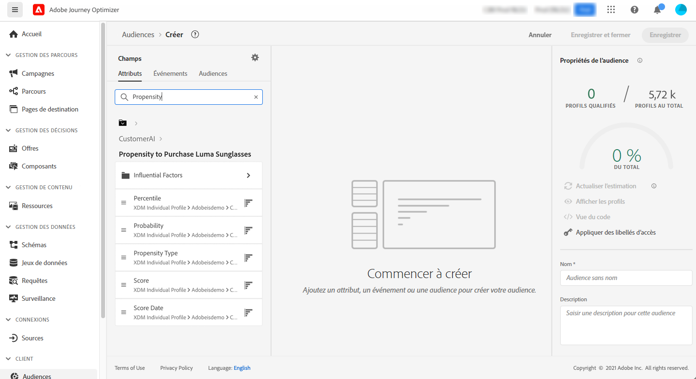

# Intégration aux services intelligents {#ai-overview}

L’intégration à **[!DNL Adobe Intelligent Services]** vous permet de tirer parti de l’intelligence artificielle et du machine learning dans des cas d’utilisation liés à l’expérience client. Elle permet aux analystes marketing de configurer des prédictions adaptées aux besoins spécifiques d’une entreprise à l’aide de configurations métier, sans nécessiter d’expertise en science des données.

[!DNL Intelligent Services], qui repose sur [!DNL Adobe Experience Platform], fournit une IA en tant que service pour les équipes chargées de l’expérience client. Il permet de prédire le comportement des clients, de mesurer l’impact de la campagne et d’améliorer le retour sur investissement. Pour plus d’informations, consultez la [[!DNL Adobe Experience Platform] documentation](https://experienceleague.adobe.com/docs/experience-platform/intelligent-services/home.html?lang=fr){target="_blank"}.

L&#39;intégration entre [!DNL Journey Optimizer] et [!DNL Intelligent Services] vous permet de tirer parti des prédictions de la clientèle.

L’IA dédiée aux clients, un composant de [!DNL Adobe Intelligent Services], prédit les actions probables de la clientèle. Reportez-vous à la [[!DNL Adobe Experience Platform] documentation](https://experienceleague.adobe.com/docs/experience-platform/intelligent-services/customer-ai/overview.html?lang=fr){target="_blank"}.

L’IA dédiée aux clients permet aux marques de créer des scores d’attrition ou à de conversion, basés sur le machine learning. Ces scores sont disponibles en tant qu’attributs de profil dans les profils [!DNL Adobe Experience Platform] (profil client en temps réel).

Par conséquent, ces attributs peuvent être utilisés comme n’importe quel autre attribut de profil dans Journey Optimizer. Utilisez-les dans des conditions pour la prise de décision, les actions ou la création de segments.

