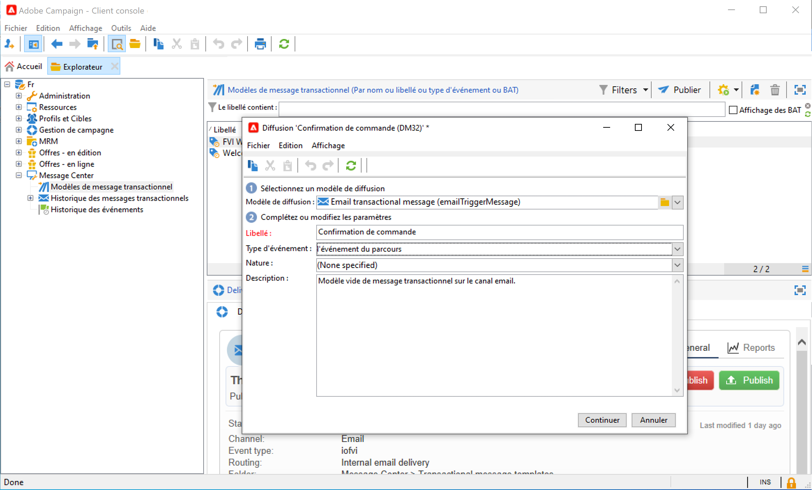
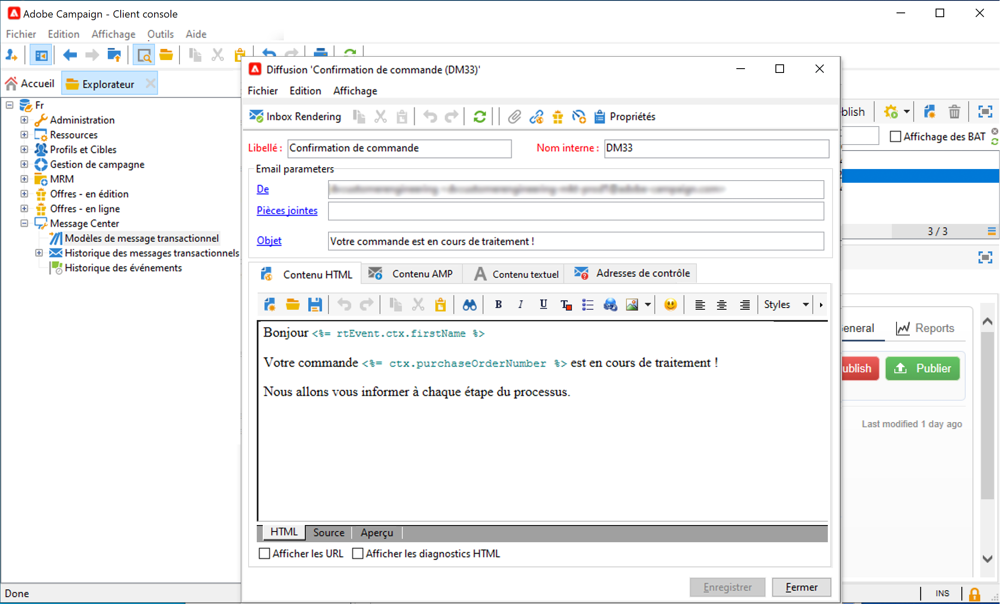
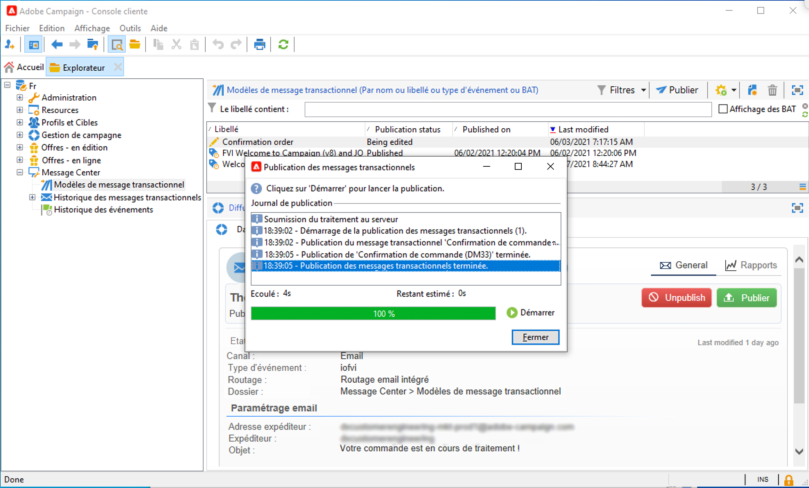
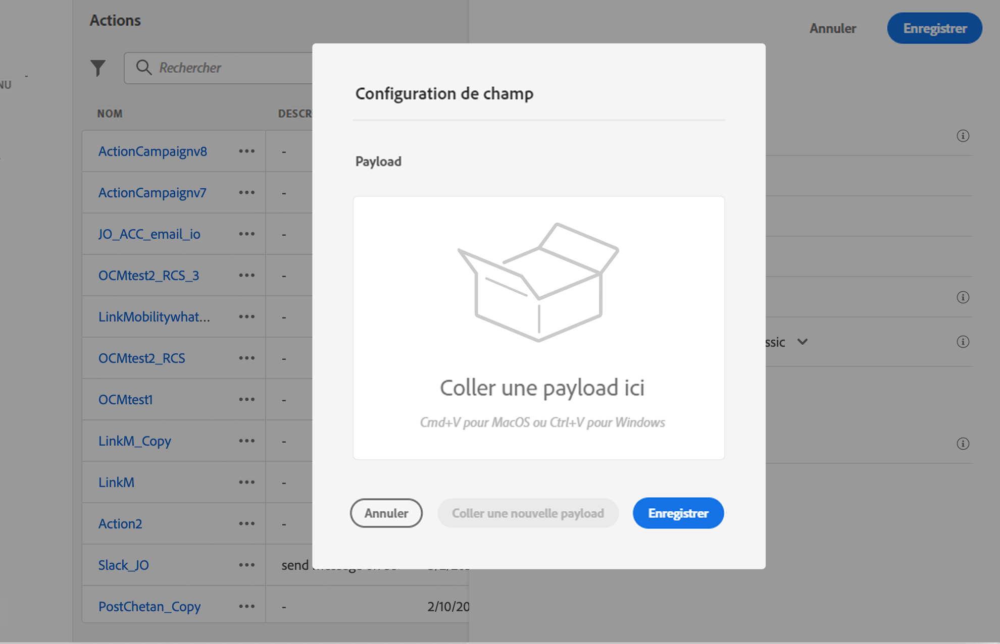
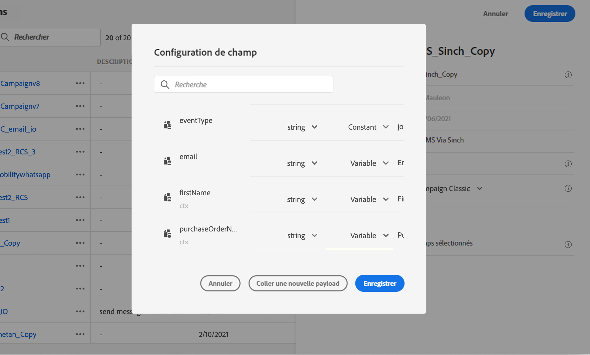
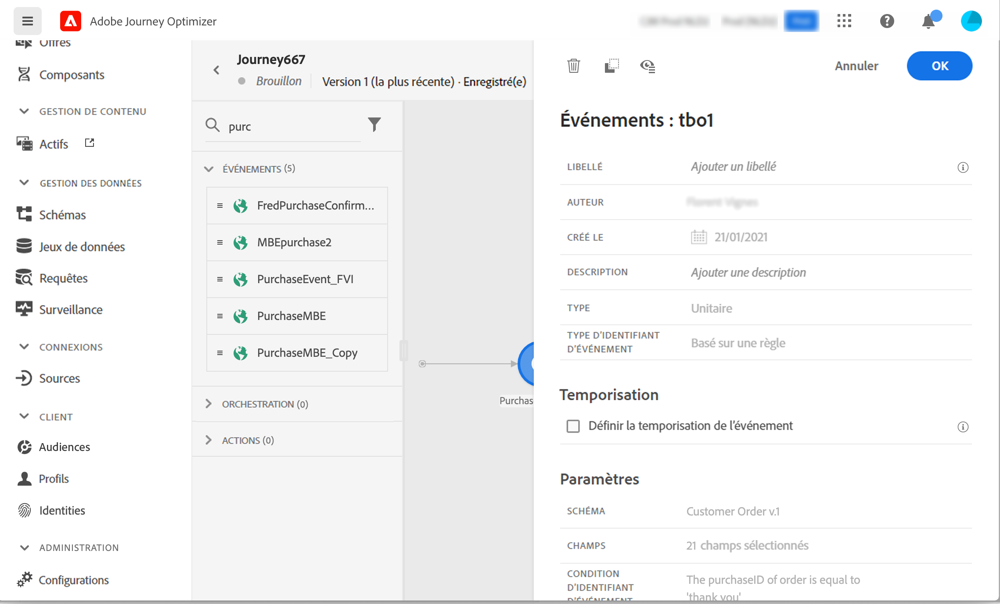
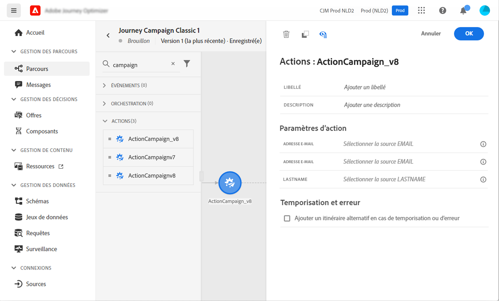
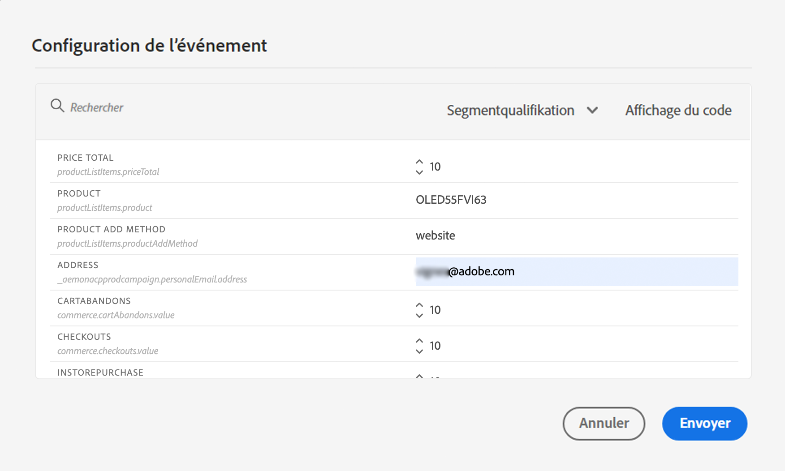

# Envoyer un message avec Campaign v7/v8 {#campaign-v7-v8-use-case}

>[!BEGINSHADEBOX]

**Sur cette page :** découvrez comment envoyer un e-mail à partir d’un parcours à l’aide de l’intégration à Adobe Campaign v7 et v8, y compris la création du modèle transactionnel, de l’événement et de l’action.

>[!ENDSHADEBOX]

Ce cas pratique décrit toutes les étapes requises pour envoyer un e-mail à l’aide de l’intégration à [!DNL Adobe Campaign] v7 et [!DNL Adobe Campaign] v8.

>[!NOTE]
>
>Pour utiliser cette intégration, vous devez disposer de la build 9125 de Campaign v7/v8 ou d’une build ultérieure.

Tout d’abord, créez un modèle d’e-mail transactionnel dans Campaign. Ensuite, dans Journey Optimizer, créez l’événement, l’action et concevez le parcours.

Pour en savoir plus sur l’intégration de Campaign, consultez les pages suivantes :

* [Création d&#39;une action Campaign](../action/acc-action.md)
* [Utilisation de l&#39;action dans un parcours](../building-journeys/using-adobe-campaign-v7-v8.md).

**[!DNL Adobe Campaign]**

Votre instance de Campaign doit être approvisionnée pour cette intégration. La fonctionnalité de messagerie transactionnelle doit être configurée.

1. Connectez-vous à votre instance de pilotage Campaign.

1. Sous **Administration** > **Plateforme** > **Énumérations**, sélectionnez l&#39;énumération **Type d&#39;événement** (eventType). Créez un type d&#39;événement (« journey-event », dans notre exemple). Utilisez le nom interne du type d’événement lors de l’écriture ultérieure du fichier JSON.

   ![Configuration d’un événement en [!DNL Adobe Journey Optimizer] avec la sélection de schémas et de champs](assets/accintegration-uc-1.png)

1. Déconnectez-vous et reconnectez-vous à l’instance pour que la création prenne effet.

1. Sous **Message Center** > **Modèles de messages transactionnels**, créez un modèle d’e-mail basé sur le type d’événement précédemment créé.

   

1. Concevez votre modèle. Dans cet exemple, la personnalisation est utilisée sur le prénom et le numéro de commande du profil. Le prénom se trouve dans la source de données [!DNL Adobe Experience Platform] et le numéro de commande est un champ de l’événement Journey Optimizer. Veillez à utiliser les noms de champ corrects dans Campaign.

   

1. Publiez votre modèle transactionnel.

   

1. Écrivez la payload JSON correspondant au modèle.

```
{
     "channel": "email",
     "eventType": "journey-event",
     "email": "Email address",
     "ctx": {
          "firstName": "First name", "purchaseOrderNumber": "Purchase order number"
     }
}
```

* Pour le canal, vous devez saisir le type &quot;e-mail&quot;.
* Pour eventType, utilisez le nom interne du type d&#39;événement créé précédemment.
* L&#39;adresse e-mail est une variable. Vous pouvez donc saisir n&#39;importe quel libellé.
* Sous ctx, les champs de personnalisation sont également des variables.

**Journey Optimizer**

1. Créez un événement. Incluez le champ « purchaseOrderNumber ».

   ![Écran de configuration d’une action personnalisée pour l’intégration [!DNL Adobe Campaign] Classic](assets/accintegration-uc-5.png)

1. Créez une action dans Journey Optimizer correspondant à votre modèle Campaign. Dans le menu déroulant **Type d’action**, sélectionnez **[!DNL Adobe Campaign]Classique**.

   ![Sélection du type d’action affichant [!DNL Adobe Campaign] option Classic](assets/accintegration-uc-6.png)

1. Cliquez sur le **champ Payload** et collez le JSON créé précédemment.

   

1. Pour l&#39;adresse e-mail et les deux champs de personnalisation, remplacez **Constante** par **Variable**.

   

1. Créez maintenant un parcours et commencez par l’événement précédemment créé.

   

1. Ajoutez l’action et mappez chaque champ au champ correct dans Journey Optimizer.

   

1. Testez votre parcours.

   

1. Vous pouvez maintenant publier votre parcours.

+++ Référence des connaissances sur l’IA

Cette section contient des connaissances structurées destinées à soutenir l’interprétation, la récupération et la réponse aux questions liées à ce sujet.

Pour une compréhension totale, ces informations doivent être combinées avec la documentation de cette page. Aucune des sources n’est conçue pour être autonome. La page décrit la fonctionnalité, tandis que cette section fournit un contexte supplémentaire qui permet de clarifier la terminologie, l’intention, l’applicabilité et les contraintes.

* **TL;DR:** Cette page présente un cas pratique détaillé pour l’envoi d’un e-mail transactionnel à partir de Adobe Journey Optimizer à l’aide de l’intégration à Adobe Campaign v7/v8, et couvre la création de modèles Campaign, la configuration d’événements et d’actions, ainsi que la conception de parcours.

**Intentions:**
* Configurer un modèle d’e-mail transactionnel dans Adobe Campaign v7/v8 à utiliser avec Journey Optimizer
* Créez un événement dans Journey Optimizer qui inclut des champs personnalisés tels qu’un numéro de bon de commande
* Création et configuration d’une action Campaign Classic dans Journey Optimizer avec une payload JSON
* Mappez les champs d’événement de parcours aux variables de personnalisation Campaign dans la configuration d’action.
* Créer et publier un parcours qui déclenche un e-mail transactionnel Campaign

**Glossaire:**
* **Messagerie transactionnelle** : une fonctionnalité de Campaign qui envoie des e-mails déclenchés en temps réel en fonction d’événements. Elle doit être configurée pour que cette intégration puisse être utilisée *(spécifique au produit)*
* **Type d’événement (eventType)** : valeur d’énumération définie dans Campaign qui identifie le type d’événement transactionnel ; son nom interne est référencé dans le *de payload JSON (spécifique au produit)*
* **Action Campaign Classic** : type d’action Journey Optimizer qui se connecte à Adobe Campaign v7/v8 pour envoyer des messages transactionnels *(spécifiques au produit)*
* **Champ de payload** : structure JSON collée dans une action Journey Optimizer qui définit les champs de données envoyés à Campaign *(spécifique au produit)*

**Mécanismes de sécurisation :**
* Campaign v7/v8 version 9125 ou ultérieure est requis pour cette intégration
* La fonctionnalité de messagerie transactionnelle doit être configurée dans l’instance Campaign avant utilisation
* Après avoir créé un nouveau type d&#39;événement dans Campaign, vous devez vous déconnecter et vous reconnecter à l&#39;instance pour qu&#39;elle prenne effet
* Les valeurs de champ Personalization définies comme « Constantes » dans l’action doivent être remplacées par « Variables » pour permettre la population dynamique au moment de l’exécution

**Terminologie:**
* Nom canonique : Adobe Campaign v7/v8 — Acronyme : ACC — variantes : Campaign Classic, Campaign v7, Campaign v8
* Synonymes : « eventType » = « nom interne du type d’événement »
* Ne les confondez pas : « action Campaign Classic » ≠ « action personnalisée » (l’action Campaign Classic est un type d’action intégré spécifique pour l’intégration ACC)

**FAQ:**
* **Q : Quelle version de Campaign est requise pour cette intégration ?** — Campaign v7/v8 build 9125 ou une version ultérieure est requis.
* **Q : Que doit-on configurer dans Campaign avant de commencer ?** — La fonction de messagerie transactionnelle doit être configurée et un modèle d&#39;e-mail transactionnel doit être créé en fonction du type d&#39;événement.
* **Q : Comment rendre les champs de personnalisation dynamiques dans l’action Journey Optimizer ?** — Dans la configuration de la payload de l&#39;action, modifiez la configuration des champs de « Constant » à « Variable » pour les champs qui seront renseignés au moment de l&#39;exécution.
* **Q : D’où proviennent les données de personnalisation de prénom dans ce cas d’utilisation ?** — Le prénom provient de la source de données Adobe Experience Platform, tandis que le numéro de commande provient de la payload d&#39;événement Journey Optimizer.
* **Q : Comment est-ce que je connecte l’action Journey Optimizer au modèle Campaign ?** — Sélectionnez « Adobe Campaign Classic » comme type d&#39;action, puis collez la payload JSON correspondant à la structure du modèle de message transactionnel.

+++
