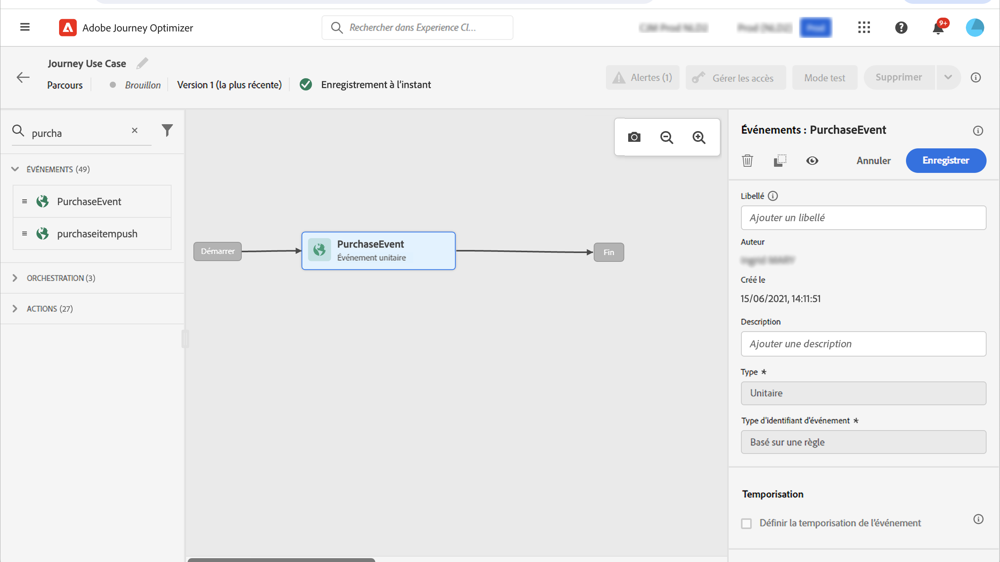

# Envoyer un message avec Campaign v7/v8 {#campaign-v7-v8-use-case}

Ce cas pratique décrit toutes les étapes requises pour envoyer un e-mail à l’aide de l’intégration à [!DNL Adobe Campaign] v7 et [!DNL Adobe Campaign] v8.

>[!NOTE]
>
>Pour utiliser cette intégration, vous devez disposer de la build 9125 de Campaign v7/v8 ou d’une build ultérieure.

Tout d’abord, créez un modèle d’e-mail transactionnel dans Campaign. Ensuite, dans Journey Optimizer, créez l’événement, l’action et concevez le parcours.

Pour en savoir plus sur l’intégration de Campaign, consultez les pages suivantes :

* [Création d&#39;une action Campaign](../action/acc-action.md)
* [Utilisation de l&#39;action dans un parcours](../building-journeys/using-adobe-campaign-v7-v8.md).

**[!DNL Adobe Campaign]**

Votre instance de Campaign doit être approvisionnée pour cette intégration. La fonctionnalité de messagerie transactionnelle doit être configurée.

1. Connectez-vous à votre instance de pilotage Campaign.

1. Sous **Administration** > **Plateforme** > **Énumérations**, sélectionnez l&#39;énumération **Type d&#39;événement** (eventType). Créez un type d&#39;événement (« journey-event », dans notre exemple). Utilisez le nom interne du type d’événement lors de l’écriture ultérieure du fichier JSON.

   ![Configuration d’un événement en [!DNL Adobe Journey Optimizer] avec la sélection de schémas et de champs](assets/accintegration-uc-1.png)

1. Déconnectez-vous et reconnectez-vous à l’instance pour que la création prenne effet.

1. Sous **Message Center** > **Modèles de messages transactionnels**, créez un modèle d’e-mail basé sur le type d’événement précédemment créé.

   

1. Concevez votre modèle. Dans cet exemple, la personnalisation est utilisée sur le prénom et le numéro de commande du profil. Le prénom se trouve dans la source de données [!DNL Adobe Experience Platform] et le numéro de commande est un champ de l’événement Journey Optimizer. Veillez à utiliser les noms de champ corrects dans Campaign.

   

1. Publiez votre modèle transactionnel.

   

1. Écrivez la payload JSON correspondant au modèle.

```
{
     "channel": "email",
     "eventType": "journey-event",
     "email": "Email address",
     "ctx": {
          "firstName": "First name", "purchaseOrderNumber": "Purchase order number"
     }
}
```

* Pour le canal, vous devez saisir le type &quot;e-mail&quot;.
* Pour eventType, utilisez le nom interne du type d&#39;événement créé précédemment.
* L&#39;adresse e-mail est une variable. Vous pouvez donc saisir n&#39;importe quel libellé.
* Sous ctx, les champs de personnalisation sont également des variables.

**Journey Optimizer**

1. Créez un événement. Incluez le champ « purchaseOrderNumber ».

   ![Écran de configuration d’une action personnalisée pour l’intégration [!DNL Adobe Campaign] Classic](assets/accintegration-uc-5.png)

1. Créez une action dans Journey Optimizer correspondant à votre modèle Campaign. Dans le menu déroulant **Type d’action**, sélectionnez **[!DNL Adobe Campaign]Classique**.

   ![Sélection du type d’action affichant [!DNL Adobe Campaign] option Classic](assets/accintegration-uc-6.png)

1. Cliquez sur le **champ Payload** et collez le JSON créé précédemment.

   

1. Pour l&#39;adresse e-mail et les deux champs de personnalisation, remplacez **Constante** par **Variable**.

   

1. Créez maintenant un parcours et commencez par l’événement précédemment créé.

   

1. Ajoutez l’action et mappez chaque champ au champ correct dans Journey Optimizer.

   

1. Testez votre parcours.

   

1. Vous pouvez maintenant publier votre parcours.
