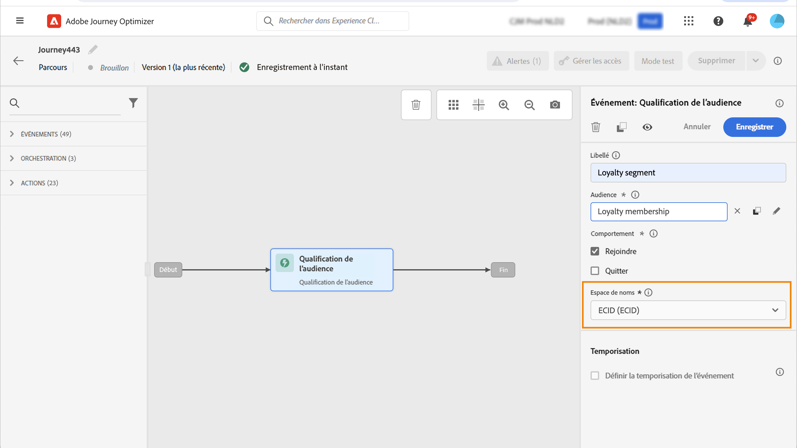

# Événements de qualification d’audience {#segment-qualification}

>[!CONTEXTUALHELP]
>id="ajo_journey_event_segment_qualification"
>title="Événements de qualification d’audience"
>abstract="Cette activité permet à votre parcours d’écouter les entrées et les sorties des profils dans les audiences Adobe Experience Platform pour que les personnes puissent rejoindre le parcours ou y progresser."

## À propos des événements de qualification d’audience{#about-segment-qualification}

Cette activité permet à votre parcours d’écouter les entrées et les sorties des profils dans les audiences Adobe Experience Platform pour que les personnes puissent rejoindre le parcours ou y progresser. Pour plus d’informations sur la création d’audiences, consultez cette [section](../audience/about-audiences.md).

Supposons que vous ayez une audience « cliente ou cliente Silver ». Avec cette activité, vous pouvez faire entrer tous les nouveaux clients Silver dans un parcours et leur envoyer une série de messages personnalisés.

Il est possible de positionner ce type d’événement dès la première étape, ou plus tard dans le parcours.

➡️ [Découvrez cette fonctionnalité en vidéo.](#video)

### Mécanismes de sécurisation et recommandations {#important-notes-segment-qualification}

Suivez les mécanismes de sécurisation et les recommandations ci-dessous pour créer des parcours de qualification d’audience. Consultez également la section [ Bonnes pratiques en matière de qualification d’audience](#best-practices-segments).

* Les parcours de qualification d’audience sont principalement conçus pour fonctionner avec les audiences en flux continu. Cette combinaison garantit une meilleure expérience en temps réel. Il est vivement recommandé d’utiliser des **audiences en flux continu** dans l’activité Qualification d’audience .

  Cependant, si vous souhaitez utiliser des attributs basés sur l’ingestion par lots dans votre audience de diffusion en streaming ou une audience par lots pour un parcours de qualification d’audience, tenez compte de la période d’évaluation/activation de l’audience. Une audience par lots ou une audience en flux continu utilisant des attributs ingérés par lots est prête à être utilisée dans l’activité **Qualification de l’audience** environ **2 heures** après la fin de votre tâche de segmentation. Cette tâche s’exécute une fois par jour, à l’heure définie par l’administrateur de votre organisation Adobe.

* Les audiences Adobe Experience Platform sont calculées une fois par jour (audiences **par lot**) ou en temps réel (pour les audiences **en flux continu**, à l’aide de l’option Audiences haute fréquence de Adobe Experience Platform).

   * Si l’audience sélectionnée est diffusée en continu, les individus appartenant à cette audience peuvent éventuellement rejoindre le parcours en temps réel.
   * Si l’audience est par lots, les personnes qui viennent d’être qualifiées pour cette audience peuvent éventuellement rejoindre le parcours lorsque le calcul de l’audience est exécuté sur Adobe Experience Platform.

  Il est recommandé d’utiliser les audiences de diffusion en continu dans une activité **Qualification d’audience**. Pour les cas d’utilisation par lots, utilisez une activité **[Lecture d’audience](read-audience.md)**.

  >[!NOTE]
  >
  >En raison de la nature par lot des audiences créées à l’aide des workflows de composition et des chargements personnalisés, ces audiences ne peuvent pas être ciblées dans une activité « Qualification d’audience ». Seules les audiences créées à l’aide de définitions de segment peuvent être utilisées dans cette activité.

* Les groupes de champs d’événement d’expérience ne peuvent pas être utilisés dans les parcours commençant par une activité **Lecture d’audience**, **Qualification d’audience** ou **Événement métier**.

* Lorsque vous utilisez une activité de **qualification d’audience** dans un parcours, cette activité peut prendre jusqu’à 10 minutes avant d’être active et d’écouter les profils entrant ou sortant de l’audience.

>[!CAUTION]
>
>[Les mécanismes de sécurisation pour les données et la segmentation du profil client en temps réel](https://experienceleague.adobe.com/docs/experience-platform/profile/guardrails.html?lang=fr){target="_blank"} s’appliquent également à Adobe Journey Optimizer.

### Configurer l’activité {#configure-segment-qualification}

Pour configurer l’activité **[!UICONTROL Qualification d’audience]**, procédez comme suit :

1. Développez la catégorie **[!UICONTROL Événements]** et déposez une activité de **[!UICONTROL qualification d’audience]** dans la zone de travail.

   

1. Ajoutez un **[!UICONTROL libellé]** à l’activité. Cette étape est facultative.

1. Cliquez dans le champ **[!UICONTROL Audience]** et sélectionnez les audiences à exploiter.

   >[!NOTE]
   >
   >Vous pouvez personnaliser les colonnes affichées dans la liste et les trier.

   

   Une fois l’audience ajoutée, le bouton **[!UICONTROL Copier]** permet de copier son nom et son ID :

   `{"name":"Loyalty membership","id":"8597c5dc-70e3-4b05-8fb9-7e938f5c07a3"}`

   

1. Dans le champ **[!UICONTROL Comportement]**, choisissez d’écouter les entrées de l’audience, les sorties ou les deux.

   >[!NOTE]
   >
   >**[!UICONTROL Entrée]** et **[!UICONTROL Sortie]** correspondent aux statuts de participation d’audience **Réalisé** et **Sorti** de Adobe Experience Platform. Pour plus d’informations sur l’évaluation d’une audience, consultez la [documentation du service de segmentation](https://experienceleague.adobe.com/fr/docs/experience-platform/segmentation/tutorials/evaluate-a-segment.html?lang=fr#interpret-segment-results){target="_blank"}.

1. Sélectionnez un espace de noms. Cela n’est nécessaire que si l’événement est considéré comme la première étape du parcours. Par défaut, le champ est prérempli avec le dernier espace de noms utilisé.

   >[!NOTE]
   >
   >Vous pouvez uniquement sélectionner un espace de noms d’identité basé sur les personnes. Si vous avez défini un espace de noms pour une table de correspondance (par exemple : espace de noms ProductID pour une recherche de produit), il ne sera pas disponible dans la liste déroulante **Espace de noms**.

   

La payload contient les informations contextuelles suivantes, utilisables dans des conditions et des actions :

* le comportement (entrée, sortie)
* l’horodatage de la qualification
* l’ID de l’audience

Lorsque vous utilisez l’éditeur d’expression dans une condition ou une action qui suit une activité de **[!UICONTROL qualification d’audience]**, vous avez accès au nœud **[!UICONTROL AudienceQualification]**. Vous pouvez choisir entre **[!UICONTROL l’heure de la dernière qualification]** et le **[!UICONTROL statut]** (entrée ou sortie).

Voir [Activité de condition](../building-journeys/condition-activity.md#about_condition).

Un nouveau parcours incluant un événement **Qualification de l’audience** devient opérationnel dix minutes après sa publication. Cet intervalle de temps correspond à l&#39;intervalle d&#39;actualisation du cache du service dédié. Par conséquent, vous devez attendre dix minutes avant d&#39;utiliser ce parcours.

## Bonnes pratiques {#best-practices-segments}

L’activité **[!UICONTROL Qualification de l’audience]** permet une entrée immédiate dans les parcours des personnes qualifiées ou disqualifiées d’une audience Adobe Experience Platform.

La vitesse de réception de ces informations est élevée. Les mesures montrent une vitesse de 10 000 événements reçus par seconde. Par conséquent, assurez-vous de comprendre comment les pics d’entrée peuvent se produire, comment les éviter et comment y préparer votre parcours.

### Audiences par lots {#batch-speed-segment-qualification}

Lors de l’utilisation de la qualification de l’audience pour une audience par lots, notez qu’un pic d’entrée se produit au moment du calcul quotidien. La taille du pic dépend du nombre de personnes qui rejoignent (ou quittent) l’audience quotidiennement.

De plus, si l’audience par lot est nouvellement créée et utilisée immédiatement dans un parcours, le premier lot de calculs peut entraîner l’entrée d’un très grand nombre d’individus dans le parcours.

### Audiences en flux continu {#streamed-speed-segment-qualification}

Lors de l’utilisation de la qualification de l’audience pour les audiences en flux continu, il y a moins de risque de pics importants d’entrées/sorties en raison de l’évaluation continue de l’audience. Cependant, si la définition de l’audience mène à un grand volume de clients se qualifiant simultanément, un pic peut toujours se produire.

Évitez d’utiliser des événements d’ouverture et d’envoi avec la segmentation par streaming. Utilisez plutôt les signaux d’activité des utilisateurs et utilisatrices, tels que les clics, les achats ou les données de balise. Pour la logique de fréquence ou de suppression, utilisez des règles métier plutôt que des événements d&#39;envoi. [En savoir plus](../audience/about-audiences.md#open-and-send-event-guardrails)

Pour plus d’informations sur la segmentation par streaming, consultez la [documentation d’Adobe Experience Platform](https://experienceleague.adobe.com/fr/docs/experience-platform/segmentation/methods/streaming-segmentation){target="_blank"}.

### Éviter les surcharges {#overloads-speed-segment-qualification}

Voici quelques bonnes pratiques pour éviter de surcharger les systèmes utilisés dans les parcours (sources de données, actions personnalisées, activités d’action de canal) :

* N’utilisez pas d’audience par lot immédiatement après sa création dans une activité **[!UICONTROL Qualification de l’audience]**. On évite ainsi le premier pic de calcul. Un avertissement jaune s&#39;affiche dans la zone de travail du parcours si vous êtes sur le point d&#39;utiliser une audience qui n&#39;a jamais été calculée.

  

* Mettez en place une règle de limitation pour les sources de données et les actions utilisées dans les parcours pour éviter de les surcharger. En savoir plus dans la documentation de [Journey Orchestration](https://experienceleague.adobe.com/docs/journeys/using/working-with-apis/capping.html?lang=fr){target="_blank"}. Notez que la règle de limitation ne permet pas de nouvelle tentative. Si vous devez réessayer, utilisez un autre chemin dans le parcours en cochant la case **[!UICONTROL Ajouter un autre chemin en cas de temporisation ou d’erreur]** dans les conditions ou les actions.

* Avant d’utiliser l’audience dans un parcours de production, évaluez quotidiennement le volume de particuliers qualifiés pour cette audience. Pour ce faire, vérifiez le menu **[!UICONTROL Audience]**, ouvrez l’audience et consultez le graphique **[!UICONTROL Profils au fil du temps]**.

  

## Vidéo pratique {#video}

Découvrez des cas d’utilisation des parcours de qualification d’audience dans cette vidéo. Découvrez comment créer un parcours avec qualification d’audience et les bonnes pratiques à appliquer.

>[!VIDEO](https://video.tv.adobe.com/v/3425028?quality=12)
