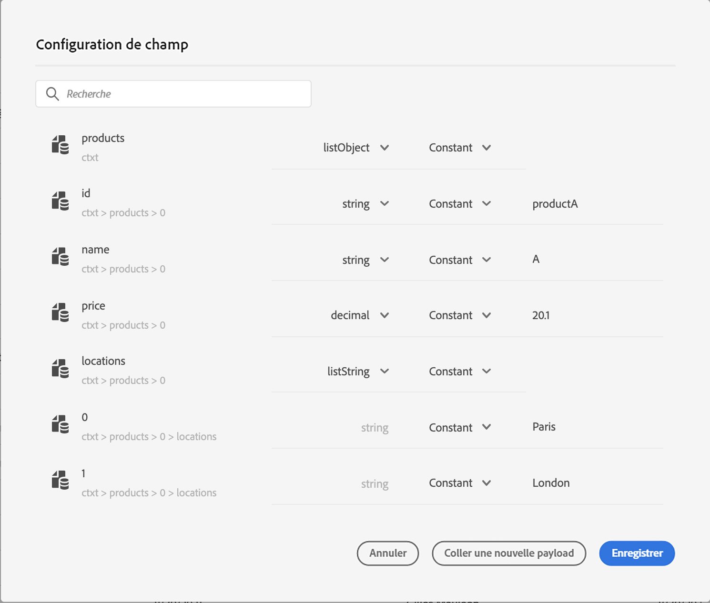
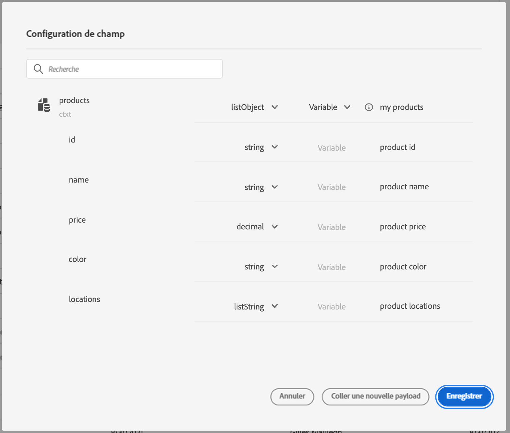
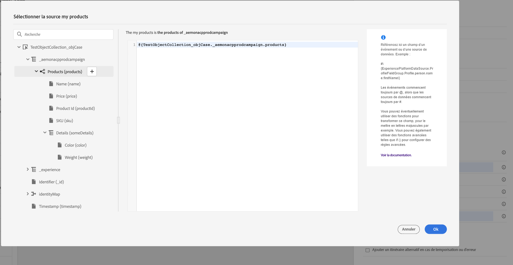
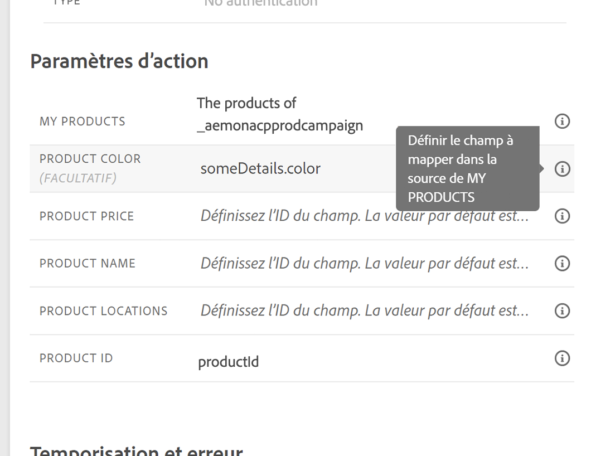
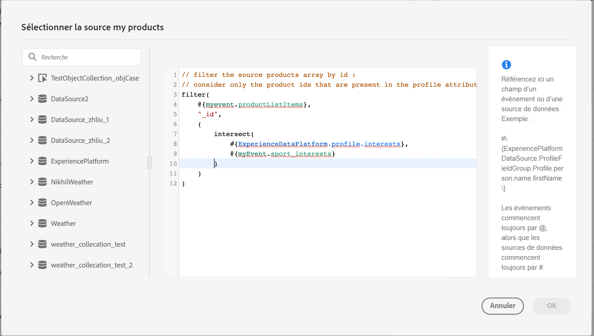
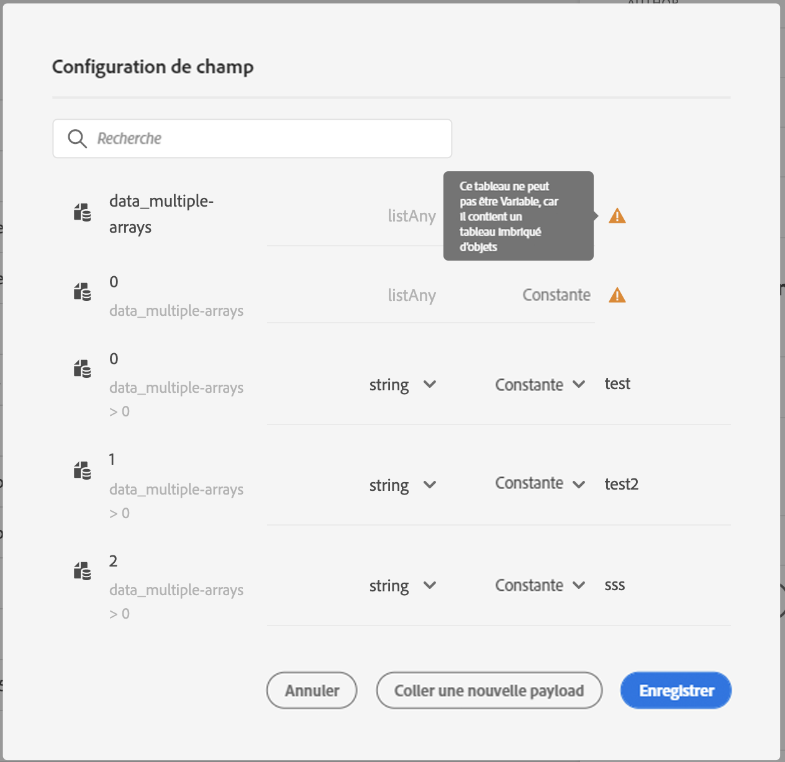

# Transmettre des collections dans des paramètres d’action personnalisés {#passing-collection}

Vous pouvez transmettre une collection dans des paramètres d’actions personnalisées qui seront renseignés dynamiquement au moment de l’exécution.

Deux types de collections sont pris en charge :

* **Collections simples**

  Vous pouvez utiliser des collections simples pour les listes de valeurs de base, telles que des chaînes, des nombres ou des booléens. Elles s’avèrent utiles lorsque vous n’avez besoin de transmettre qu’une liste d’éléments sans propriétés supplémentaires.

  Par exemple, une liste de types d’appareils :

  ```json
  {
   "deviceTypes": [
       "android",
       "ios"
   ]
  }
  ```

* **Collections d’objets**

  Vous pouvez utiliser des collections d’objets lorsque chaque élément comprend plusieurs champs ou propriétés. Elles servent habituellement à transmettre des données structurées, telles que des détails de produit, des enregistrements d’événement ou des attributs d’élément.

  Par exemple :

  ```json
  {
  "products":[
     {
        "id":"productA",
        "name":"A",
        "price":20.1
     },
     {
        "id":"productB",
        "name":"B",
        "price":10.0
     },
     {
        "id":"productC",
        "name":"C",
        "price":5.99
     }
   ]
  }
  ```

>[!NOTE]
>
>Les tableaux imbriqués dans les collections ne sont que partiellement pris en charge dans les payloads de requête d’action personnalisée. Pour plus d’informations, consultez la section [Limites](#limitations).

## Procédure générale {#general-procedure}

Dans cette section, nous utiliserons l’exemple de payload JSON ci-après. Il s’agit d’un tableau d’objets avec un champ qui est une collection simple.

```json
{
  "ctxt": {
    "products": [
      {
        "id": "productA",
        "name": "A",
        "price": 20.1,
        "color":"blue",
        "locations": [
          "Paris",
          "London"
        ]
      },
      {
        "id": "productB",
        "name": "B",
        "price": 10.99
      }
    ]
  }
}
```

Vous pouvez voir que `products` est un tableau de deux objets. Vous devez avoir au moins un objet.

1. Créez votre action personnalisée. En savoir plus sur [cette page](../action/about-custom-action-configuration.md).

1. Dans la section **[!UICONTROL Paramètres d’action]**, collez l’exemple JSON. La structure affichée est statique : lorsque vous collez la payload, tous les champs sont définis comme des constantes.

   

1. Si nécessaire, ajustez les types de champs. Les types de champs suivants sont pris en charge pour les collections : listString, listInteger, listDecimal, listBoolean, listDateTime, listDateTimeOnly, listDateOnly, listObject

   >[!NOTE]
   >
   >Le type de champ est automatiquement déduit en fonction de l’exemple de payload.

1. Si vous souhaitez transmettre des objets de façon dynamique, vous devez les définir en tant que variables. Dans cet exemple, nous définissons `products` comme variable. Tous les champs d’objet inclus dans l’objet sont automatiquement définis sur des variables.

   >[!NOTE]
   >
   >Le premier objet de l’exemple de payload est utilisé pour définir les champs.

1. Pour chaque champ, définissez le libellé qui sera affiché dans la zone de travail du parcours.

   {width="70%" align="left"}

1. Créez votre parcours et ajoutez l’action personnalisée que vous avez créée. En savoir plus sur [cette page](../building-journeys/using-custom-actions.md).

1. Dans la section **[!UICONTROL Paramètres d’action]**, définissez le paramètre de tableau (`products` dans notre exemple) à l’aide de l’éditeur d’expression avancé.

   

1. Pour chacun des champs d’objet suivants, saisissez le nom de champ correspondant à partir du schéma XDM source. Si les noms sont identiques, cela n’est pas nécessaire. Dans notre exemple, il nous suffit de définir `product id` et « color ».

   {width="50%" align="left"}

Pour le champ de tableau, vous pouvez également utiliser l’éditeur d’expression avancé pour effectuer une manipulation de données. Dans l’exemple suivant, nous utilisons les fonctions [filter](functions/list-functions.md#filter) et [intersect](functions/list-functions.md#intersect) :



## Limites {#limitations}

Bien que les collections dans les actions personnalisées offrent la flexibilité nécessaire pour transmettre des données dynamiques, certaines contraintes structurelles doivent être prises en compte :

* **Prise en charge des tableaux imbriqués dans les actions personnalisées**

  Adobe Journey Optimizer prend en charge les tableaux d’objets imbriqués dans les **payloads de réponse** des actions personnalisées, mais cette prise en charge est limitée dans les **payloads de requête**.

  Dans les payloads de requête, les tableaux imbriqués ne sont pris en charge que s’ils contiennent un nombre fixe d’éléments, comme défini dans la configuration de l’action personnalisée. Par exemple, si un tableau imbriqué comprend toujours exactement trois éléments, il peut être configuré comme une constante. Lorsque le nombre d’éléments doit être dynamique, seuls les tableaux non imbriqués (tableaux au niveau inférieur) peuvent être définis comme variables.

  Exemple :

   1. L’exemple suivant illustre un **cas d’utilisation non pris en charge**.

      Dans cet exemple, le tableau « products » comprend un tableau imbriqué (`locations`) avec un nombre dynamique d’éléments, qui n’est pas pris en charge dans les payloads de requête.

      ```json
      {
      "products": [
         {
            "id": "productA",
            "name": "A",
            "price": 20,
            "locations": [
            { "name": "Paris" },
            { "name": "London" }
            ]
         }
      ]
      }
      ```

   2. Exemple pris en charge, avec des éléments fixes définis comme des constantes.

      Dans ce cas, les emplacements imbriqués sont remplacés par des champs fixes (`location1`, `location2`), ce qui permet à la payload de rester valide dans la configuration prise en charge.

      ```json
      {
      "products": [
         {
            "id": "productA",
            "name": "A",
            "price": 20,
            "location1": { "name": "Paris" },
            "location2": { "name": "London" }
         }
      ]
      }
      ```


* **Test des collections** : pour tester des collections à l’aide du mode test, vous devez utiliser le mode d’affichage du code. Notez que le mode d’affichage du code n’est pas pris en charge pour les événements métier. Dans ce cas, vous ne pouvez donc envoyer qu’une collection contenant un seul élément.


## Cas particuliers{#examples}

Pour les types et les tableaux de tableaux hétérogènes, le tableau est défini avec le type listAny. Vous pouvez uniquement mapper des éléments individuels, mais ne pouvez pas modifier le tableau en variable.

{width="70%" align="left"}

Exemple de type hétérogène :

```json
{
    "data_mixed-types": [
        "test",
        "test2",
        null,
        0
    ]
}
```

Exemple de tableau de tableaux :

```json
{
    "data_multiple-arrays": [
        [
            "test",
            "test1",
            "test2"
        ]
    ]
}
```

## Ressources supplémentaires

Parcourez les sections suivantes pour en savoir plus sur la configuration des actions personnalisées, l’utilisation de celles-ci et la résolution des problèmes liés à celles-ci :

* [Commencer avec les actions personnalisées](../action/action.md) : découvrez en quoi consiste une action personnalisée et comment elle vous permet de vous connecter à vos systèmes tiers.
* [Configurer vos actions personnalisées](../action/about-custom-action-configuration.md) : découvrez comment créer et configurer une action personnalisée.
* [Utiliser des actions personnalisées](../building-journeys/using-custom-actions.md) : découvrez comment utiliser des actions personnalisées dans vos parcours.
* [Résolution des problèmes liés aux actions personnalisées](../action/troubleshoot-custom-action.md) : découvrez comment résoudre les problèmes liés à une action personnalisée.
* [Itérer sur les données contextuelles](../personalization/iterate-contextual-data.md#arrays-in-journeys) - Découvrez comment utiliser des tableaux dans les expressions de Parcours et effectuer une itération sur les réponses d’action personnalisée, les données d’événement et les recherches de jeux de données dans la personnalisation des messages

