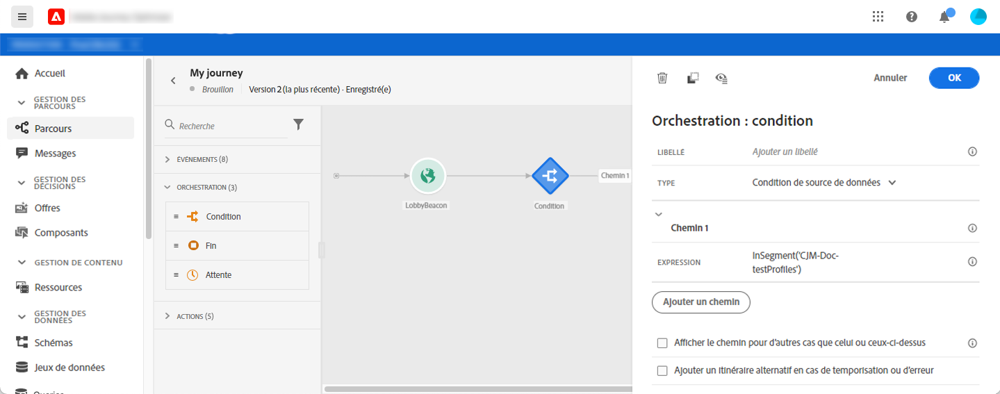
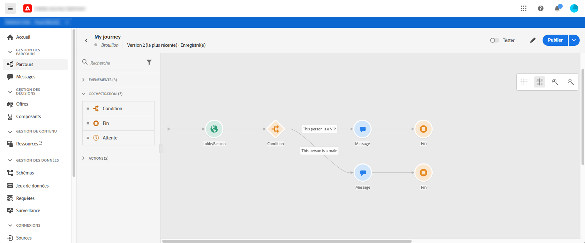
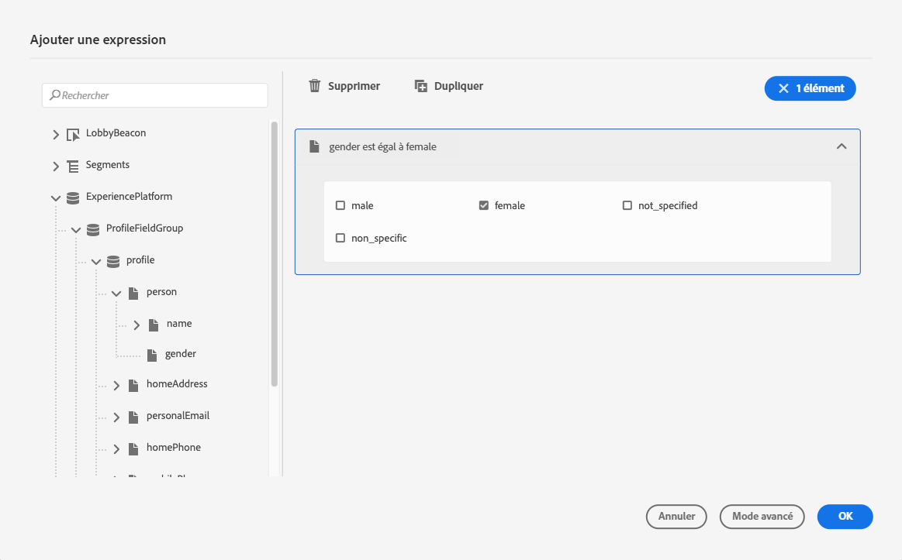
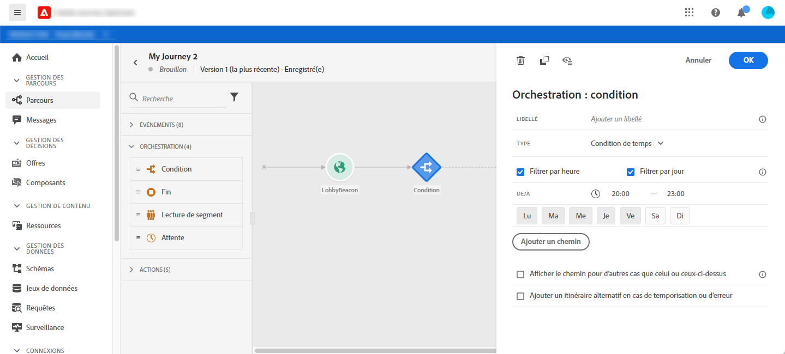
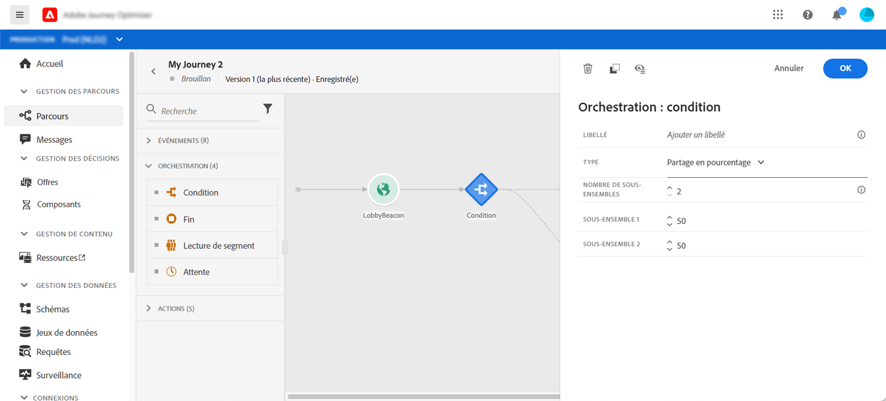
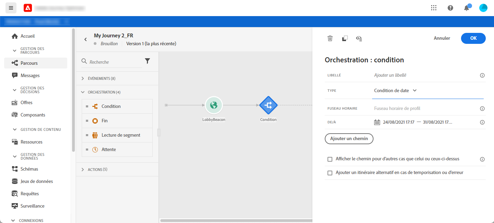
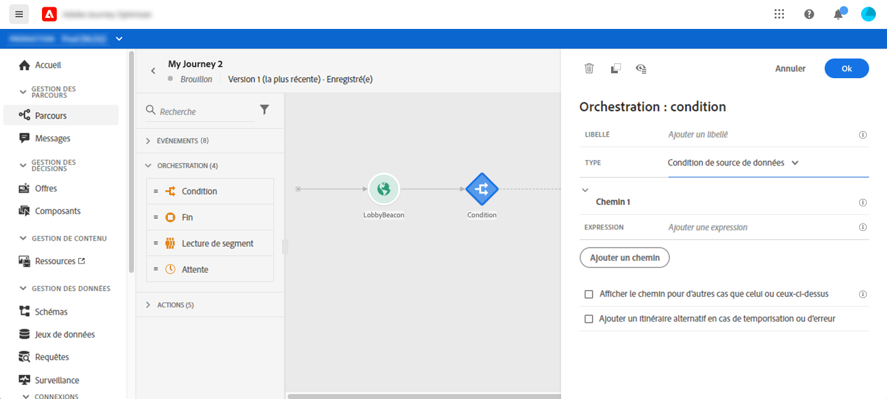
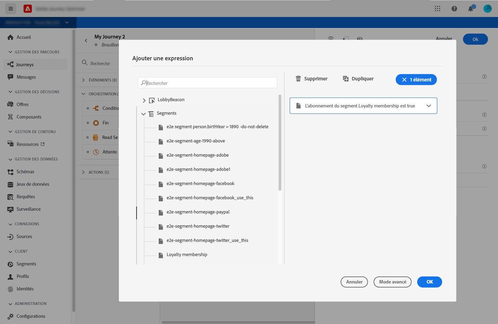

# Activité de condition{#section_e2n_pft_dgb}

Quatre types de conditions sont disponibles :

* [Condition de source de données](#data_source_condition)
* [Condition de temps](#time_condition)
* [Répartition en pourcentage](#percentage_split)
* [Condition de date](#date_condition)

## À propos de l&#39;activité de condition {#about_condition}

Lorsque vous utilisez plusieurs conditions dans un parcours, vous pouvez définir des étiquettes pour chacune d’elles afin de les identifier plus facilement.

Cliquez sur **[!UICONTROL Ajouter un chemin]** si vous souhaitez définir plusieurs conditions. Pour chaque condition, un nouveau chemin est ajouté dans la trame après l’activité.

Notez que la conception des parcours a des effets fonctionnels. Lorsque plusieurs chemins sont définis après une condition, seul le premier chemin éligible est exécuté. Cela signifie que vous pouvez modifier la définition des priorités des chemins en les plaçant au-dessus ou en dessous les uns des autres.

Par exemple, prenons l&#39;exemple de la condition &quot;La personne est un VIP&quot; d&#39;un premier chemin et la condition &quot;La personne est un homme&quot; d&#39;un second chemin. Si une personne remplissant les deux conditions (un homme VIP) franchit cette étape, la première voie sera choisie même si elle est également éligible à la seconde, parce que la première voie est &quot;au-dessus&quot;. Pour modifier cette priorité, déplacez vos activités dans un autre ordre vertical.

Vous pouvez créer un autre chemin pour les audiences qui ne sont pas éligibles aux conditions définies en cochant **[!UICONTROL Afficher le chemin pour les autres cas que ceux ci-dessus]**. Notez que cette option n’est pas disponible dans les conditions de fractionnement. Voir [Fractionnement du pourcentage](#percentage_split).

Le mode simple vous permet d’effectuer des requêtes simples basées sur une combinaison de champs. Tous les champs disponibles s’affichent sur le côté gauche de l’écran. Faites glisser les champs dans la zone principale. Pour combiner les différents éléments, vous devez les intercaler les uns dans les autres pour créer différents groupes et/ou niveaux de groupe. Vous pouvez ensuite sélectionner un opérateur logique pour combiner des éléments au même niveau :

* ET : une intersection de deux critères. Seuls les éléments correspondant à tous les critères sont pris en compte.
* OU : union de deux critères. Les éléments correspondant à au moins un des deux critères sont pris en compte.

Si vous utilisez [Adobe Experience Platform Segmentation Service](https://experienceleague.adobe.com/docs/experience-platform/segmentation/home.html) pour créer vos segments, vous pouvez les exploiter dans vos conditions de parcours. Reportez-vous à [Utilisation de segments dans des conditions](../building-journeys/condition-activity.md#using-a-segment).

>[!NOTE]
>
>Vous ne pouvez pas effectuer de requêtes sur des séries temporelles (par exemple, une liste d’achats, des clics sur des messages passés) avec l’éditeur simple. Pour ce faire, vous devez utiliser l’éditeur avancé. Voir [cette page](https://experienceleague.adobe.com/docs/journeys/using/building-advanced-conditions-journeys/expressionadvanced.html).

Lorsqu’une erreur se produit dans une action ou une condition, le parcours d’une personne s’arrête. La seule façon de le faire continuer est de cocher la case **[!UICONTROL Ajouter un autre chemin en cas de dépassement de délai ou d&#39;erreur]**. Voir [cette section](../building-journeys/using-the-journey-designer.md#paths).

## Condition de source de données {#data_source_condition}

Cela vous permet de définir une condition en fonction des champs des sources de données ou des événements précédemment positionnés dans le parcours. Pour savoir comment utiliser l’éditeur d’expressions, voir [cette page](https://experienceleague.adobe.com/docs/journeys/using/building-advanced-conditions-journeys/expressionadvanced.html). A l’aide de l’éditeur d’expressions avancé, vous pouvez configurer des conditions plus avancées pour manipuler les collections ou utiliser des sources de données nécessitant la transmission de paramètres. Voir [cette page](../datasource/external-data-sources.md).

## Condition d’heure {#time_condition}

Cela vous permet d’effectuer différentes actions en fonction de l’heure du jour et/ou du jour de la semaine. Par exemple, vous pouvez décider d&#39;envoyer des SMS pendant la journée et des courriels la nuit pendant la semaine.

>[!NOTE]
>
>Le fuseau horaire n’est plus spécifique à une condition et est maintenant défini au niveau du parcours dans les propriétés du parcours. Reportez-vous à [cette page](../building-journeys/timezone-management.md).

## Fractionnement en pourcentage {#percentage_split}

Cette option vous permet de fractionner l’audience de manière aléatoire afin de définir une action différente pour chaque groupe. Définissez le nombre de divisions et la répartition pour chaque chemin. Le calcul de la répartition est statistique, car le système ne peut pas anticiper le nombre de personnes qui vont circuler dans cette activité du parcours. En conséquence, la répartition présente une marge d&#39;erreur très faible. Cette fonction est basée sur un mécanisme Java aléatoire (voir cette [page](https://docs.oracle.com/javase/7/docs/api/java/util/Random.html)).

>[!NOTE]
>
>Notez qu’il n’existe aucun bouton pour ajouter un chemin dans la condition de fractionnement du pourcentage. Le nombre de chemins dépend du nombre de divisions. Dans les conditions de division, vous ne pouvez pas ajouter de chemin pour d’autres cas, car cela ne peut pas se produire. Les gens vont toujours emprunter l&#39;un des chemins les plus partagés.

## Condition de date {#date_condition}

Cela vous permet de définir un flux différent en fonction de la date. Par exemple, si la personne entre dans l’étape pendant la période &quot;ventes&quot;, vous lui enverrez un message spécifique. Le reste de l&#39;année, vous enverrez un autre message.

>[!NOTE]
>
>Le fuseau horaire n’est plus spécifique à une condition et est maintenant défini au niveau du parcours dans les propriétés du parcours. Voir [cette page](../building-journeys/timezone-management.md).

## Utilisation de segments dans les conditions {#using-a-segment}

Cette section explique comment utiliser un segment dans une condition de parcours. Pour plus d&#39;informations sur les segments et sur la manière de les créer, consultez [cette section](../segment/about-segments.md).

Pour utiliser un segment dans une condition de parcours, procédez comme suit :

1. Ouvrez un parcours, déposez une activité **[!UICONTROL Condition]** et choisissez **Condition de la source de données**.
   

1. Cliquez sur **[!UICONTROL Ajouter un chemin]** pour chaque chemin supplémentaire nécessaire. Pour chaque chemin, cliquez sur le champ **[!UICONTROL Expression]**.

   

1. Sur le côté gauche, dépliez **[!UICONTROL Segments]** noeud. Faites glisser et déposez le segment à utiliser pour votre condition. Par défaut, la condition sur le segment est vraie.

   

   >[!NOTE]
   >
   >Notez que seuls les individus présentant les états de participation **Réalisés** et **existants** seront considérés comme membres du segment. Pour plus d’informations sur l’évaluation d’un segment, consultez la [documentation du service de segmentation](https://experienceleague.adobe.com/docs/experience-platform/segmentation/tutorials/evaluate-a-segment.html?lang=en#interpret-segment-results).
