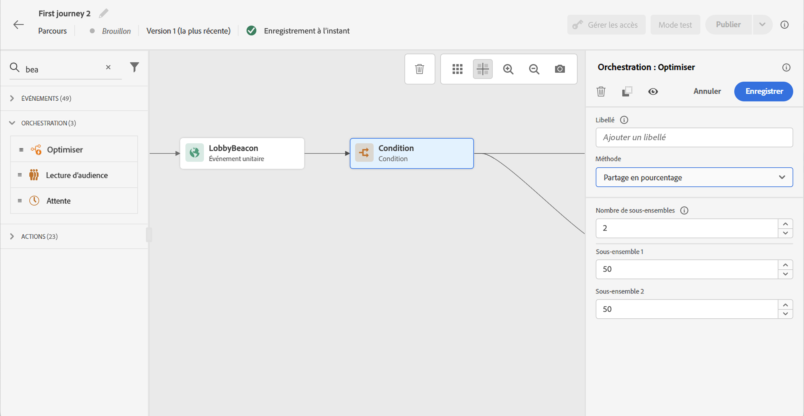
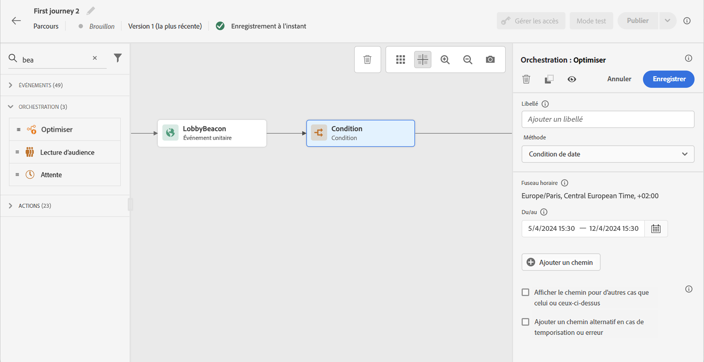

# Activité de condition{#condition-activity}

>[!CONTEXTUALHELP]
>id="ajo_journey_condition"
>title="Activité de condition"
>abstract="Cette activité vous permet de définir le flux de l’individu dans le parcours. Plusieurs chemins seront créés selon différents critères. Vous pouvez également créer un autre chemin en cas de dépassement de délai ou d’erreur."

Ces types de conditions sont disponibles :

* [Condition de source de données](#data_source_condition)
* [Condition de temps](#time_condition)
* [Division en pourcentage](#percentage_split)
* [Condition de date](#date_condition)
* [Limite de profil](#profile_cap)

## À propos de l’activité Condition {#about_condition}

>[!CONTEXTUALHELP]
>id="ajo_journey_expression_simple"
>title="À propos de l’éditeur d’expression simple"
>abstract="Le mode d’éditeur d’expression simple permet d’effectuer des requêtes simples basées sur une combinaison de champs. Tous les champs disponibles s’affichent dans la partie gauche de l’écran. Placez des champs dans la zone principale. Pour combiner les différents éléments, imbriquez-les les uns dans les autres afin de créer différents groupes et/ou niveaux de groupe. Vous pouvez ensuite sélectionner un opérateur logique pour combiner les éléments de même niveau."

Lorsque vous utilisez plusieurs conditions dans un parcours, vous pouvez définir des libellés pour chacune d’elles afin de les identifier plus facilement.

Cliquez sur **[!UICONTROL Add a path]** si vous souhaitez définir plusieurs conditions. Pour chaque condition, un nouveau chemin est ajouté dans la zone de travail après l’activité.

Notez que la conception des parcours a un impact fonctionnel. Lorsque plusieurs chemins sont définis après une condition, seul le premier chemin éligible est exécuté. Cela signifie que vous pouvez modifier la priorité des chemins en les plaçant les uns au-dessus ou en dessous des autres.

Prenons l’exemple de la condition d’un premier chemin &quot;La personne est un VIP&quot; et de la condition d’un second chemin &quot;La personne est un homme&quot;. Si une personne répondant aux deux conditions (un homme VIP) franchit cette étape, le premier chemin sera choisi même si cette personne est également éligible au second, car le premier chemin est &quot;au-dessus&quot;. Pour modifier cette priorité, déplacez vos activités verticalement.

Vous pouvez créer un autre chemin pour les audiences qui ne sont pas éligibles aux conditions définies en cochant **[!UICONTROL Show path for other cases than the one(s) above]**. Notez que cette option n’est pas disponible dans les conditions de division. Voir [Division en pourcentage](#percentage_split).

Le mode simple vous permet d’effectuer des requêtes simples basées sur une combinaison de champs. Tous les champs disponibles s’affichent dans la partie gauche de l’écran. Placez des champs dans la zone principale. Pour combiner les différents éléments, imbriquez-les les uns dans les autres afin de créer différents groupes et/ou niveaux de groupe. Vous pouvez ensuite sélectionner un opérateur logique pour combiner les éléments de même niveau :

* ET : intersection de deux critères. Seuls les éléments répondant à tous les critères sont pris en compte.
* OU : union de deux critères. Les éléments répondant à au moins un des deux critères sont pris en compte.

Si vous utilisez la variable [Adobe Experience Platform Segmentation Service](https://experienceleague.adobe.com/docs/experience-platform/segmentation/home.html){target=&quot;_blank&quot;} pour créer vos segments, vous pouvez les exploiter dans vos conditions de parcours. Voir [Utilisation de segments dans des conditions](../building-journeys/condition-activity.md#using-a-segment).

>[!NOTE]
>
>Vous ne pouvez pas effectuer de requêtes sur des séries temporelles (par exemple une liste d’achats, des clics précédents sur des messages) à l’aide de l’éditeur simple. Pour cela, vous devrez utiliser l’éditeur avancé. Voir [cette page](expression/expressionadvanced.md).

Lorsqu’une erreur se produit dans une action ou une condition, le parcours d’un individu s’arrête. La seule façon de le faire continuer est de cocher la case. **[!UICONTROL Add an alternative path in case of a timeout or an error]**. Voir [cette section](../building-journeys/using-the-journey-designer.md#paths).

Dans l’éditeur simple, vous trouverez également la catégorie Propriétés du parcours, sous les catégories Événement et Source de données. Cette catégorie contient des champs techniques liés au parcours pour un profil donné. Il s’agit des informations récupérées par le système à partir des parcours actifs, telles que l’identifiant du parcours ou les erreurs spécifiques rencontrées. [En savoir plus](expression/journey-properties.md)

## Condition de source de données {#data_source_condition}

Vous pouvez ainsi définir une condition en fonction des champs des sources de données ou des événements précédemment positionnés dans le parcours. Découvrez comment utiliser l’éditeur d’expression dans [cette section](expression/expressionadvanced.md).

À l’aide de l’éditeur d’expression avancé, vous pouvez configurer des conditions plus avancées pour manipuler des collections ou utiliser des sources de données nécessitant la transmission de paramètres. [En savoir plus](../datasource/external-data-sources.md).

## Condition de temps{#time_condition}

Vous pouvez ainsi effectuer différentes actions en fonction de l’heure et/ou du jour de la semaine. Par exemple, vous pouvez décider d’envoyer des notifications push pendant la journée et des emails la nuit pendant la semaine.

>[!NOTE]
>
>Le fuseau horaire n’est pas spécifique à une condition et est défini au niveau du parcours dans les propriétés du parcours. Voir [cette page](../building-journeys/timezone-management.md).

Trois options de filtrage sont disponibles :

* Heure : vous permet de configurer une condition en fonction de l’heure de la journée. Vous définissez ensuite les heures de début et de fin. Les individus ne saisissent le chemin que pendant la période définie.
* Jour de la semaine : vous permet de configurer une condition en fonction du jour de la semaine. Vous sélectionnez ensuite les jours où vous souhaitez que les individus entrent dans le chemin.
* Jour de la semaine et heure : cette option regroupe les deux premières options.

## Division en pourcentage {#percentage_split}

Cette option vous permet de fractionner l’audience de manière aléatoire afin de définir une action différente pour chaque groupe. Définissez le nombre de divisions et la répartition pour chaque chemin. Le calcul de la répartition est statistique, car le système ne peut pas anticiper le nombre de personnes qui vont participer à cette activité du parcours. Par conséquent, la marge d’erreur de la division est très faible. Cette fonction est basée sur un mécanisme Java aléatoire (voir ceci [page](https://docs.oracle.com/javase/7/docs/api/java/util/Random.html)).

En mode test, lorsque vous atteignez un partage, la branche supérieure est toujours choisie. Vous pouvez réorganiser la position des branches fractionnées si vous souhaitez que le test choisisse un autre chemin. Voir [cette page](../building-journeys/testing-the-journey.md)

>[!NOTE]
>
>Notez qu’il n’existe pas de bouton pour ajouter un chemin dans la condition de partage du pourcentage. Le nombre de chemins dépend du nombre de divisions. Dans les conditions de division, vous ne pouvez pas ajouter de chemin pour d’autres cas, car cela ne peut pas se produire. Les utilisateurs accèdent toujours à l’un des chemins de division.

## Condition de date {#date_condition}

Vous pouvez ainsi définir un flux différent en fonction de la date. Par exemple, si la personne entre dans l’étape pendant la période &quot;soldes&quot;, vous lui enverrez un message spécifique. Le reste de l&#39;année, vous enverrez un autre message.

>[!NOTE]
>
>Le fuseau horaire n’est plus spécifique à une condition et est désormais défini au niveau du parcours dans les propriétés du parcours. Voir [cette page](../building-journeys/timezone-management.md).

## Limite de profil {#profile_cap}

Utilisez ce type de condition pour définir un nombre maximal de profils pour un chemin de parcours. Lorsque cette limite est atteinte, les profils entrant prennent un autre chemin. Ainsi, vos parcours ne dépasseront jamais la limite définie.

>[!NOTE]
>
>Nous vous recommandons de définir une limite de profil à valeur élevée. La précision et la probabilité qu’une population atteigne le nombre exact de limites ne font qu’augmenter à mesure que la limite augmente. Pour les petits nombres (par exemple une limite de 50), les nombres ne correspondent pas toujours, car la limite peut ne pas être atteinte avant que les profils ne prennent un autre chemin.

Vous pouvez utiliser ce type de condition pour augmenter le volume de vos diffusions. Voir [cas pratique](ramp-up-deliveries-uc.md).

La limite par défaut est 1 000.

Le compteur s’applique uniquement à la version de parcours sélectionnée. Le compteur est réinitialisé à zéro au bout d’un mois. Après une réinitialisation, les profils entrant reprennent le chemin nominal jusqu’à ce que la limite de compteur soit atteinte.

Le chemin nominal a toujours la priorité sur le chemin alternatif, même si vous déplacez le chemin alternatif au-dessus du chemin nominal sur la zone de travail du parcours.

Pour les parcours actifs, voici les seuils à prendre en compte pour vous assurer que la limite est atteinte :

* Pour une limite supérieure à 10 000, le nombre de profils distincts à injecter doit être au moins 1,3 fois la limite.
* Pour une limite inférieure à 10 000, le nombre de profils distincts à injecter doit être de 1 000 plus la limite.

La limite de profil n’est pas prise en compte en mode test.

## Utilisation de segments dans des conditions {#using-a-segment}

Cette section explique comment utiliser un segment dans une condition de parcours. Pour plus d’informations sur les segments et leur création, reportez-vous à la section [cette section](../segment/about-segments.md).

Pour utiliser un segment dans une condition de parcours, procédez comme suit :

1. Ouvrez un parcours, déposez un **[!UICONTROL Condition]** et choisissez l’activité **Condition de source de données**.
   

1. Cliquez sur **[!UICONTROL Add a path]** pour chaque chemin supplémentaire nécessaire. Pour chaque chemin, cliquez sur le bouton **[!UICONTROL Expression]** champ .

   

1. Sur le côté gauche, développez **[!UICONTROL Segments]** noeud . Faites glisser et déposez le segment que vous souhaitez utiliser pour votre condition. Par défaut, la condition sur le segment est vraie.

   

   >[!NOTE]
   >
   >Notez que seuls les individus dotés de la variable **Réalisé** et **Existant** les états de participation au segment sont considérés comme des membres du segment. Pour plus d’informations sur l’évaluation d’un segment, reportez-vous à la section [Documentation de Segmentation Service](https://experienceleague.adobe.com/docs/experience-platform/segmentation/tutorials/evaluate-a-segment.html#interpret-segment-results){target=&quot;_blank&quot;}.
