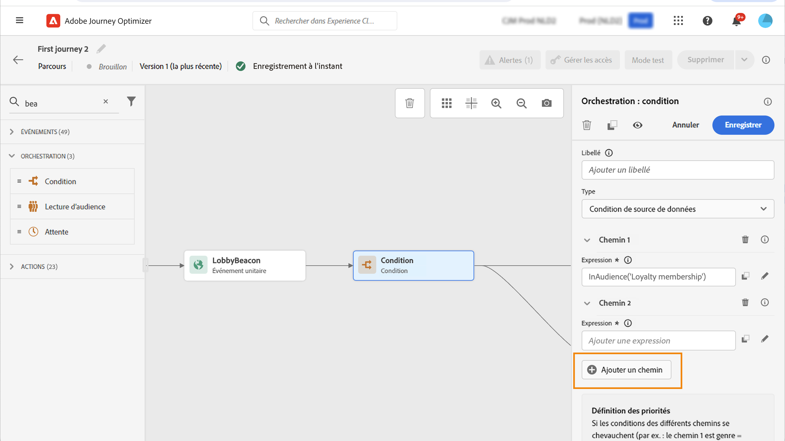
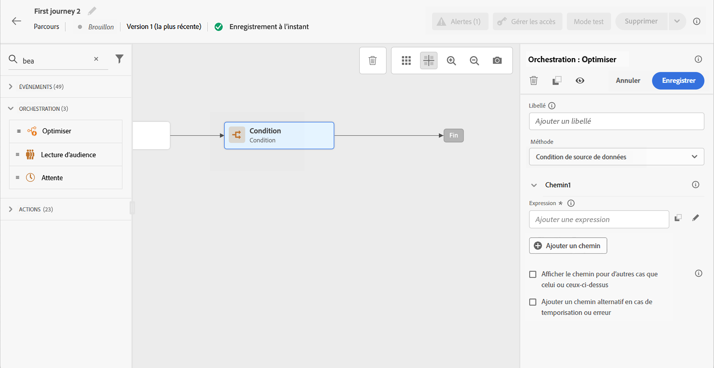

# Activité de condition {#condition-activity}

Utilisez l’activité de condition pour acheminer les profils vers différents chemins d’accès en fonction des règles et des données.

## Ajouter une activité de condition {#add-condition-activity}

>[!CONTEXTUALHELP]
>id="ajo_journey_condition"
>title="Activité de condition"
>abstract="L’activité **Condition** vous permet de définir la progression des individus dans votre parcours en créant plusieurs chemins d’accès en fonction de critères spécifiques. Vous pouvez également configurer un autre chemin pour gérer les temporisations ou les erreurs, assurant ainsi une expérience fluide."

L’activité **Condition** vous permet de définir la progression des individus dans votre parcours en créant plusieurs chemins d’accès en fonction de critères spécifiques. Vous pouvez également configurer un autre chemin pour gérer les temporisations ou les erreurs, assurant ainsi une expérience fluide.

Les types de condition disponibles sont les suivants :

* [Condition de source de données](#data_source_condition)
* [Condition de temps](#time_condition)
* [Partage en pourcentage](#percentage_split)
* [Condition de date](#date_condition)
* [Limite de profils](#profile_cap)

Vous pouvez également utiliser une audience dans une condition de parcours. [En savoir plus](#using-a-segment). Pour plus d’informations sur la génération et le suivi des audiences, voir [cette section](../audience/about-audiences.md).

>[!NOTE]
>
>L’évaluation de la condition échoue pour les profils qui incluent plus de deux identités inter-appareils dans le [magasin de profils](https://experienceleague.adobe.com/docs/experience-platform/profile/home.html?lang=fr#profile-data-store){target="_blank"}.

## Ajouter et gérer des chemins de condition {#about_condition}

>[!CONTEXTUALHELP]
>id="ajo_journey_expression_simple"
>title="À propos de l&#39;éditeur d&#39;expression simple"
>abstract="Le mode Éditeur d&#39;expression simple vous permet d&#39;exécuter des requêtes simples en fonction d&#39;une combinaison de champs. Tous les champs disponibles s’affichent dans la partie gauche de l’écran. Faites glisser des champs dans la zone principale. Pour combiner les différents éléments, imbriquez-les afin de créer différents groupes et/ou niveaux de groupes. Vous pouvez alors sélectionner un opérateur logique afin de combiner les éléments de même niveau."

Lorsque vous utilisez plusieurs conditions dans un parcours, vous pouvez définir des libellés pour chacune d’elles afin de les identifier plus facilement.

Cliquez sur **[!UICONTROL Ajouter un chemin]** si vous souhaitez définir plusieurs conditions. Pour chaque condition, un nouveau chemin est ajouté dans la zone de travail après l’activité.

Notez que la conception de parcours n’est pas sans conséquences sur le plan fonctionnel. Lorsque plusieurs chemins sont définis après une condition, seul le premier chemin éligible est exécuté. Cela signifie que vous pouvez modifier la priorité des chemins en les plaçant les uns au-dessus ou en dessous des autres.

Prenons deux conditions de chemin : « La personne est un VIP » et « La personne est un homme ». Si une personne remplit les deux conditions, le premier chemin est choisi, car il se situe au-dessus du second. Pour modifier cette priorité, déplacez vos activités vers un ordre vertical différent.

Vous pouvez créer un autre chemin pour les audiences qui ne sont pas éligibles aux conditions définies en cochant la case **[!UICONTROL Afficher le chemin pour d’autres cas que celui ou ceux ci-dessus]**. Notez que cette option n’est pas disponible dans les conditions de division. Voir [Division en pourcentage](#percentage_split).

Le mode simple vous permet d’exécuter des requêtes simples en fonction d’une combinaison de champs. Tous les champs disponibles s’affichent dans la partie gauche de l’écran. Faites glisser des champs dans la zone principale. Pour combiner les différents éléments, imbriquez-les afin de créer différents groupes et/ou niveaux de groupes. Vous pouvez alors sélectionner un opérateur logique afin de combiner les éléments de même niveau :

* ET : intersection de deux critères. Seuls les éléments répondant à tous les critères sont pris en compte.
* OU : union de deux critères. Les éléments répondant à au moins l’un des deux critères sont pris en compte.

Si vous utilisez le [[!DNL Adobe Experience Platform] service de segmentation](https://experienceleague.adobe.com/docs/experience-platform/segmentation/home.html?lang=fr){target="_blank"} pour créer vos audiences, vous pouvez les exploiter dans vos conditions de parcours. Consultez la section [Utilisation d’audiences dans des conditions](../building-journeys/condition-activity.md#using-a-segment). Pour plus d’informations sur la génération et le ciblage des audiences dans Journey Optimizer, consultez [cette section](../audience/about-audiences.md).

>[!NOTE]
>
>Vous ne pouvez pas effectuer de requêtes sur des séries temporelles (une liste d’achats ou des clics précédents sur des messages, par exemple) à l’aide de l’éditeur simple. Pour cela, vous devez utiliser l’éditeur avancé. Consultez [cette page](expression/expressionadvanced.md).

Lorsqu’une erreur se produit dans une action ou une condition, le parcours d’une personne s’arrête. La seule façon de le faire continuer est de cocher la case **[!UICONTROL Ajouter un chemin alternatif en cas de temporisation ou d’erreur]**. Consultez [cette section](../building-journeys/using-the-journey-designer.md#paths).

Dans l’éditeur simple, vous trouverez la catégorie Propriétés du parcours, sous les catégories d’événement et de source de données. Cette catégorie contient des champs techniques liés au parcours d’un profil donné. Il s’agit des informations récupérées par le système à partir de parcours dynamiques, telles que l’identifiant du parcours ou les erreurs spécifiques rencontrées. [En savoir plus](expression/journey-properties.md)

## Condition de source de données {#data_source_condition}

Utilisez une **[!UICONTROL condition de source de données]** pour définir une condition en fonction de champs issus des sources de données ou des événements positionnés précédemment dans le parcours. Ce type de condition est défini à l’aide de l’éditeur d’expression. Découvrez comment utiliser l’éditeur d’expression dans [cette section](expression/expressionadvanced.md).

Par exemple, si vous ciblez une audience avec des attributs d’enrichissement générés à l’aide d’un workflow de composition ou d’un chargement personnalisé (fichier CSV), vous pouvez utiliser ces attributs d’enrichissement pour créer votre condition.

>[!IMPORTANT]
>
>**Gestion des attributs manquants ou non ingérés**
>
>Si un champ de schéma est défini dans votre schéma de profil mais qu’aucune donnée n’a été ingérée pour ce champ, Journey Optimizer et le profil client en temps réel sous-jacent interprètent le champ comme `null`. Par conséquent, les conditions qui vérifient `isEmpty()`, `isNull()` ou des fonctions similaires seront évaluées à `true` même si l’attribut n’a jamais été ingéré. Cela peut entraîner un comportement de parcours inattendu si vous ne savez pas que le champ ne contient aucune donnée.
>
>Pour éviter toute confusion, assurez-vous que les attributs que vous utilisez dans les expressions de condition ont été ingérés avec des données réelles avant que le profil rejoigne le parcours. Vous pouvez vérifier les valeurs d’attribut dans le [profil client en temps réel](https://experienceleague.adobe.com/docs/experience-platform/profile/home.html?lang=fr){target="_blank"} afin de confirmer si des données existent pour les champs utilisés dans vos conditions.

L’éditeur d’expression avancé vous permet de configurer des conditions plus sophistiquées pour manipuler des collections ou utiliser des sources de données nécessitant la transmission de paramètres. [En savoir plus](../datasource/external-data-sources.md).

## Condition de temps {#time_condition}

Utilisez une **[!UICONTROL Condition de temps]** pour effectuer des actions différentes en fonction de l’heure du jour et/ou du jour de la semaine. Par exemple, les jours de semaine, vous pouvez choisir d’envoyer des notifications push pendant la journée et des e-mails le soir.

>[!NOTE]
>
>* Le fuseau horaire n’est plus spécifique à une condition et est désormais défini au niveau du parcours dans les propriétés de celui-ci. En savoir plus sur [cette page](../building-journeys/timezone-management.md).
>
>* Par défaut, la **[!UICONTROL Condition de temps]** est définie par heure, de 00:00 à 12:00.

Trois options de filtrage temporel sont disponibles :

* Heure : vous permet de configurer une condition en fonction de l’heure de la journée. Vous définissez ensuite les heures de début et de fin. Les personnes ne saisissent le chemin d’accès que pendant la plage d’heures définie.
* Jour de la semaine : vous permet de configurer une condition en fonction du jour de la semaine. Vous sélectionnez ensuite les jours où vous souhaitez que les individus rejoignent le chemin.
* Jour de la semaine et heure : cette option regroupe les deux premières options.

## Partage en pourcentage {#percentage_split}

Cette option vous permet de fractionner l’audience de manière aléatoire afin de définir une action différente pour chaque groupe. Définissez le nombre de divisions, ainsi que la répartition pour chaque chemin. La division est un calcul statistique, dans la mesure où le système ne peut pas prévoir le nombre de personnes qui suivront cette activité du parcours. Par conséquent, la marge d’erreur de la division est très faible. Cette fonction est basée sur un mécanisme Java aléatoire (pour en savoir plus, consultez cette [page](https://docs.oracle.com/javase/7/docs/api/java/util/Random.html){target="_blank"}).

En mode test, lorsqu&#39;un partage est atteint, la branche supérieure est toujours choisie. Vous pouvez réorganiser la position des branches partagées si vous souhaitez que le test choisisse un autre chemin. Voir [cette page](../building-journeys/testing-the-journey.md)

>[!NOTE]
>
>Notez qu’il n’existe aucun bouton permettant d’ajouter un chemin dans la condition de division en pourcentage. Le nombre de chemins dépend du nombre de divisions. Dans les conditions de division, vous ne pouvez pas ajouter de chemin pour d’autres cas, car cela ne peut pas se produire. Les utilisateurs se trouveront toujours dans l’un des chemins de division.

## Condition de date {#date_condition}

Cette condition vous permet de définir un flux différent en fonction de la date. Par exemple, si la personne accède à l’étape pendant la période de soldes, vous lui enverrez un message spécifique. Le reste de l’année, vous lui enverrez un autre message.

>[!NOTE]
>
>Le fuseau horaire n’est plus spécifique à une condition et est maintenant défini au niveau du parcours dans les propriétés de celui-ci. Consultez [cette page](../building-journeys/timezone-management.md).

## Limite de profils {#profile_cap}

Utilisez ce type de condition pour définir un nombre maximal de profils pour le chemin dʼun parcours. Lorsque cette limite est atteinte, les profils entrants prennent un autre chemin. De cette manière, vos parcours ne dépasseront jamais la limite définie.

>[!NOTE]
>
>Nous vous recommandons de définir une limite de profil à valeur élevée. La précision et la probabilité qu’une population atteigne le nombre exact de limites ne font qu’augmenter à mesure que la limite augmente. Pour les petits nombres (par exemple une limite de 50), les nombres ne correspondent pas toujours, car la limite peut ne pas être atteinte avant que les profils ne prennent un autre chemin.

<!--You can use this condition type to ramp up the volume of your deliveries. See this [use case](ramp-up-deliveries-uc.md).-->

La limite par défaut est fixée à 1 000.

Le compteur s’applique uniquement à la version du parcours sélectionnée. Le compteur se réinitialise à zéro lorsque le parcours est dupliqué ou qu’une nouvelle version est créée. Après une réinitialisation, les profils entrants reprennent le chemin nominal jusqu’à ce que la limite de compteur soit atteinte.

Lorsque la limite de profil est définie sur un parcours récurrent, le compteur ne se réinitialise pas après chaque périodicité.

Le chemin nominal a toujours la priorité sur le chemin alternatif, même si vous déplacez le chemin alternatif au-dessus du chemin nominal sur la zone de travail de parcours.

Pour les parcours actifs, voici les seuils à prendre en compte pour que la limite soit atteinte :

* Pour une limite supérieure à 10 000, le nombre de profils distincts à injecter doit être au moins égal à 1,3 fois la limite.
* Pour une limite inférieure à 10 000, le nombre de profils distincts à injecter doit être de 1 000 plus la limite.

La limite de profils n’est pas prise en compte en mode test.

## Utiliser des audiences dans des conditions {#using-a-segment}

Cette section explique comment utiliser une audience dans une condition de parcours. Pour plus d’informations sur les audiences et sur la manière de les créer, consultez [cette section](../audience/about-audiences.md).

Pour utiliser une audience dans une condition de parcours, procédez comme suit :

1. Ouvrez un parcours, déposez une activité **[!UICONTROL Condition]** et choisissez la **condition de source de données**.

   

1. Cliquez sur **[!UICONTROL Ajouter un chemin]** pour chaque chemin supplémentaire nécessaire. Pour chaque chemin, cliquez sur le champ **[!UICONTROL Expression]**.

1. Sur le côté gauche, développez le nœud **[!UICONTROL Audiences]**. Faites glisser et déposez l’audience à utiliser pour votre condition. Par défaut, la condition sur l’audience est « true ».

   

   >[!NOTE]
   >
   >Notez que seules les personnes ayant le statut de participation d’audience **Réalisé** sont considérées comme membres de l’audience. Pour plus d’informations sur l’évaluation d’une audience, consultez la [documentation du service de segmentation](https://experienceleague.adobe.com/docs/experience-platform/segmentation/tutorials/evaluate-a-segment.html?lang=fr#interpret-segment-results){target="_blank"}.
