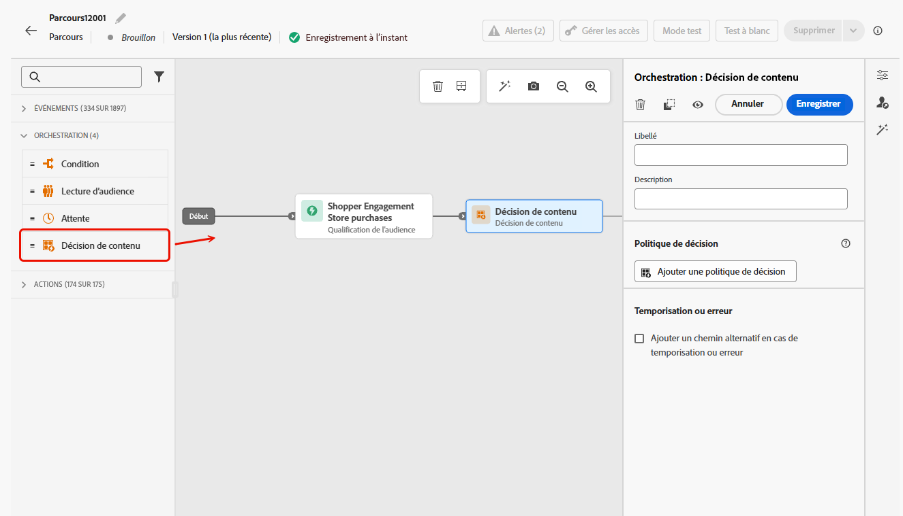
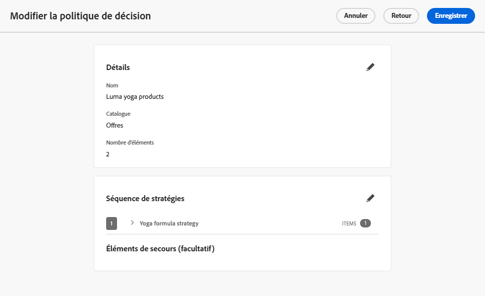
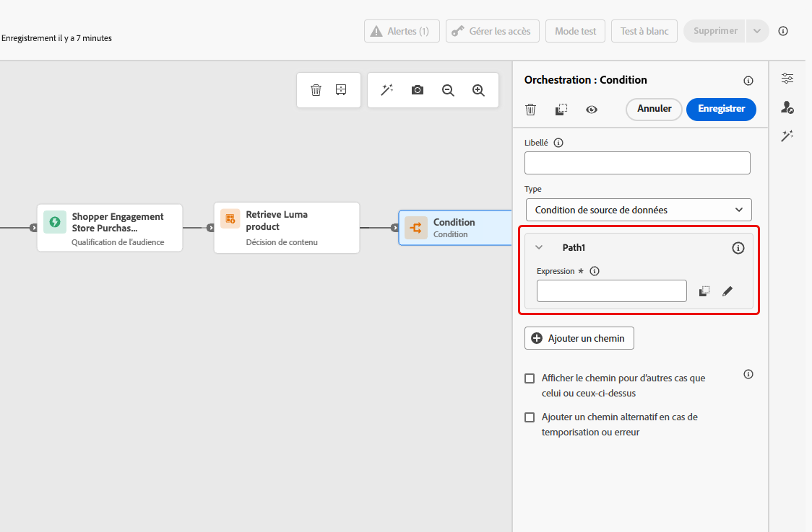
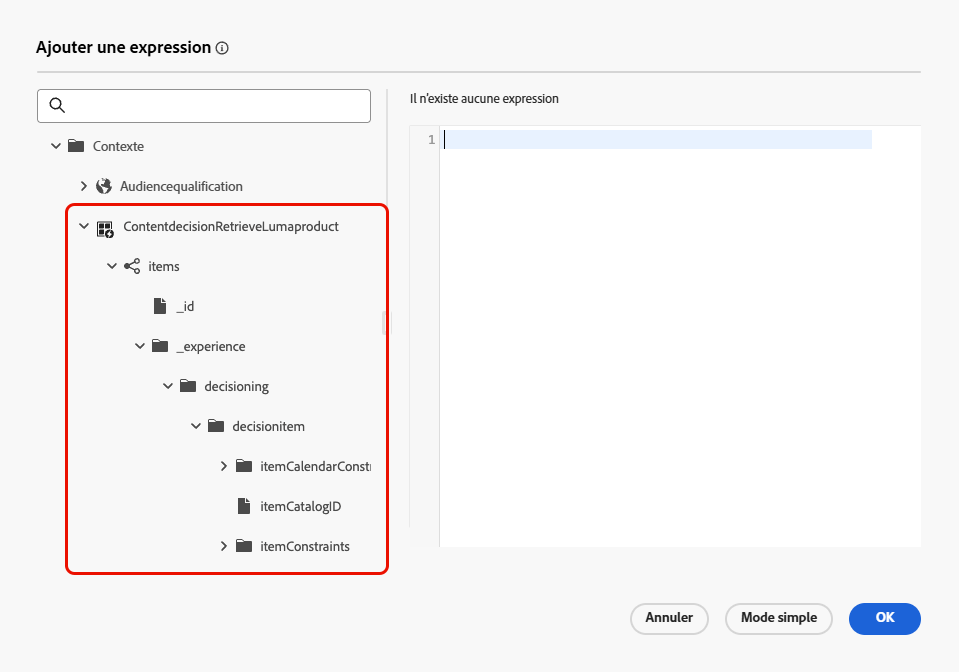
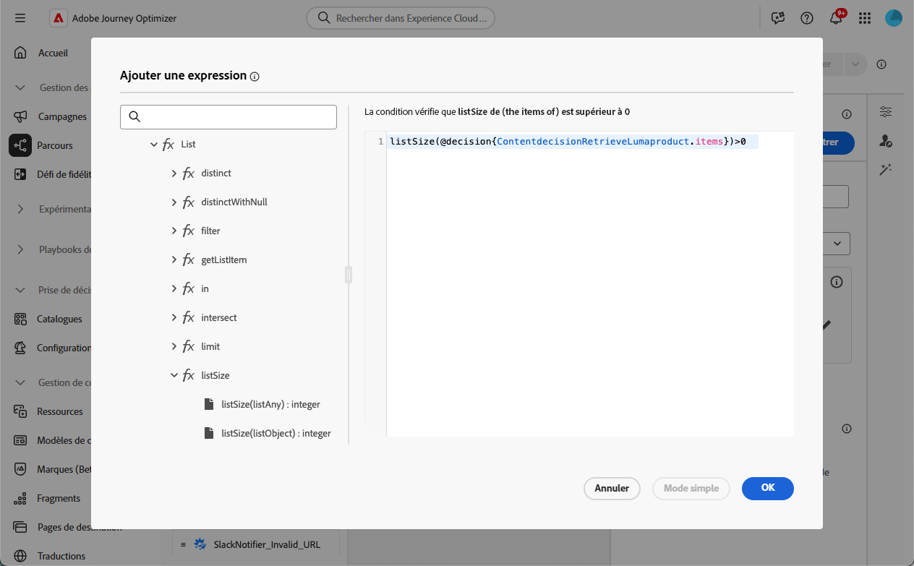
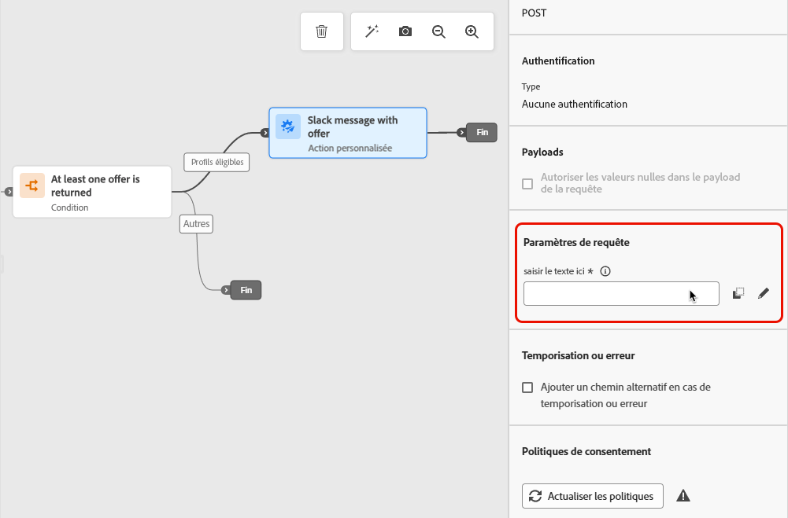
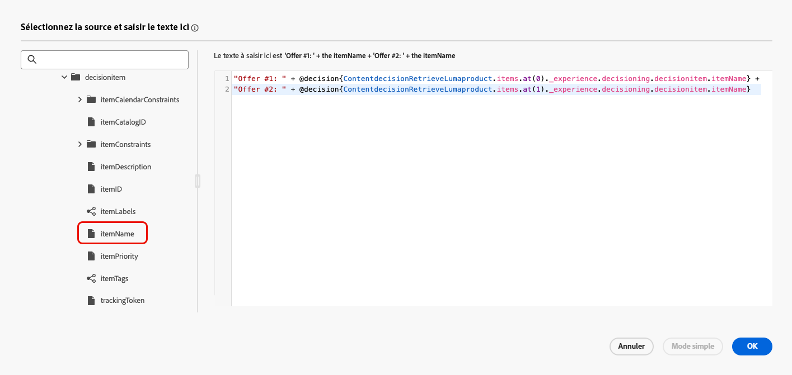
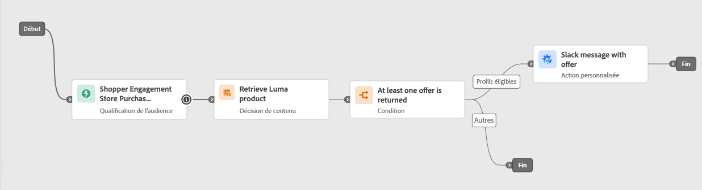

# Activité Décision de contenu {#content-decision}

[!DNL Journey Optimizer] vous permet d’inclure des offres dans vos parcours par le biais de l’activité dédiée **Décision de contenu** dans la zone de travail du parcours. Vous pouvez ensuite ajouter d’autres activités (telles que des [actions personnalisées](../action/about-custom-action-configuration.md)) à vos parcours pour cibler vos audiences avec ces offres personnalisées.

>[!NOTE]
>
>La sortie d’une activité Décision de contenu ne peut pas être utilisée dans les activités de canal natives.

Pour tirer parti de cette fonctionnalité, créez un parcours dans lequel vous ajoutez une [activité Décision de contenu](#add-content-decision-activity) pour définir les offres que vous souhaitez présenter aux profils éligibles.

Vous pouvez ensuite utiliser la sortie de l’activité Décision de contenu dans :

* Une [activité de condition](#add-condition-activity), pour déplacer des profils vers des chemins spécifiques en fonction des offres récupérées ;

* une [action personnalisée](#add-custom-action), via laquelle vous pouvez envoyer ces offres à des systèmes externes.

## Configurer une activité Décision de contenu {#add-content-decision-activity}

À l’aide de l’activité Décision de contenu, vous pouvez définir une politique de décision qui vous permet de sélectionner les meilleurs éléments de la Prise de décision [!DNL Journey Optimizer] et de les diffuser à l’audience appropriée.

<!--Their goal is to select the best offers for each profile, while the campaign/journey authoring allows you to indicate how the selected decision items should be presented, including which item attributes to be included in the message.-->

Pour configurer l’activité **[!UICONTROL Décision de contenu]**, suivez les étapes ci-après.

1. Développez la catégorie **[!UICONTROL Orchestration]** et déposez une activité **[!UICONTROL Décision de contenu]** dans votre zone de travail.

   {width=100%}

1. Vous pouvez, si vous le souhaitez, ajouter un libellé et une description à l’activité.

1. Cliquez sur **[!UICONTROL Ajouter une politique de décision]**. [En savoir plus sur les politiques de décision](../experience-decisioning/create-decision.md).

   >[!NOTE]
   >
   >Les autorisations de prise de décision sont nécessaires pour créer une politique de décision. [En savoir plus](../experience-decisioning/gs-experience-decisioning.md#steps)

1. Sélectionnez le nombre d’éléments que vous souhaitez renvoyer. Par exemple, si vous sélectionnez 2, les 2 meilleures offres éligibles seront présentées. Cliquez sur **[!UICONTROL Suivant]**.

1. Dans la section **[!UICONTROL Séquence de stratégies]**, sélectionnez les éléments de décision et/ou les stratégies de sélection à inclure avec la politique de décision. [En savoir plus](../experience-decisioning/create-decision.md#create-decision)

1. Organisez l’ordre d’évaluation selon vos besoins.

   Lors de l’ajout de plusieurs éléments de décision et/ou stratégies, ceux-ci sont évalués dans un ordre séquentiel, indiqué par des nombres à gauche de chaque objet ou groupe d’objets. Pour modifier la séquence par défaut, vous pouvez faire glisser et déposer les objets et/ou les groupes afin de les réorganiser selon vos besoins. [En savoir plus](../experience-decisioning/create-decision.md#create-decision)

1. (Facultatif) Ajoutez une offre de secours. [En savoir plus](../experience-decisioning/create-decision.md#create-decision)

1. Vérifiez et enregistrez votre politique de décision.

   {width=70%}<!--reshoot or change screen-->

Vous êtes maintenant en mesure d’utiliser la sortie de cette activité Décision de contenu dans votre parcours.

## Mécanismes de sécurisation et limitations {#guardrails}

**Politiques de consentement**

* Les mises à jour des politiques de consentement prennent jusqu’à 48 heures. Si une politique de décision fait référence à un attribut lié à une politique de consentement récemment mise à jour, les modifications ne sont pas appliquées immédiatement.

* De même, si de nouveaux attributs de profil soumis à une politique de consentement sont ajoutés à une politique de décision, ils seront utilisables, mais la politique de consentement qui leur est associée ne sera pas appliquée tant que le délai ne sera pas écoulé.

* Les politiques de consentement ne sont actuellement disponibles que pour les organisations disposant des modules complémentaires Adobe Healthcare Shield et Privacy and Security Shield.

## Utiliser la sortie de l’activité Décision de contenu {#use-content-decision-output}

La sortie d’une décision de contenu peut être utilisée dans plusieurs activités de parcours. Par exemple, vous pouvez utiliser une [activité de condition](#add-condition-activity) pour déplacer des profils vers des branches spécifiques de votre parcours, en fonction du nombre d’offres récupérées pour ces derniers.

Vous pouvez également ajouter une [action personnalisée](#add-custom-action) à votre parcours afin de partager les offres de l’activité de décision de contenu avec un système externe.

### Dans une activité de condition {#add-condition-activity}

Pour tirer parti de la sortie d’une activité Décision de contenu, vous pouvez ajouter une condition à votre parcours, dans laquelle vous pouvez définir des expressions pour déplacer des profils vers des chemins spécifiques à l’aide des données de ces offres. Suivez les étapes ci-après.

1. Dans la catégorie **[!UICONTROL Orchestration]**, déposez une activité **[!UICONTROL Condition]** dans votre zone de travail. [En savoir plus](condition-activity.md#add-condition-activity)

1. Vous pouvez, si vous le souhaitez, renommer **[!UICONTROL Path1]**, qui correspond à la première expression que vous définissez, pour lui donner un nom plus pertinent.

1. Pour ce premier chemin, cliquez dans le champ **[!UICONTROL Expression]** ou utilisez l’icône Modifier pour ajouter une expression.

   {width=80%}

1. Dans la fenêtre contextuelle qui s’ouvre, passez en **[!UICONTROL mode avancé]** afin d’utiliser l’[éditeur d’expression avancé](expression/expressionadvanced.md).

   >[!CAUTION]
   >
   >La sortie d’un nœud de décision de contenu est uniquement disponible en **[!UICONTROL mode avancé]**.

1. Développez le nœud **[!UICONTROL Contexte]** et accédez à votre politique de décision pour afficher tous les attributs disponibles dans le [schéma du catalogue des offres](../experience-decisioning/catalogs.md#access-catalog-schema).

   

   >[!NOTE]
   >
   >Toute étiquette restreinte définie sur un attribut peut entraîner une violation de la politique pour DULE ou le consentement. Cela s’applique aux événements d’expérience de parcours utilisés dans une règle de décision et au [schéma d’offres](../experience-decisioning/catalogs.md#access-catalog-schema). En savoir plus sur les politiques de gouvernance des données dans [cette section](../action/action-privacy.md).

1. Pour vérifier si une offre a été renvoyée pour les profils qui rejoignent le parcours, utilisez la fonction [listSize](functions/list-functions.md#listSize) avec la syntaxe suivante : `listSize(@decision{ContentdecisionName.items})>0`

   >[!NOTE]
   >
   >Dans cet exemple, `Name` est le libellé de la décision de contenu que vous avez ajoutée à votre parcours.

   

1. Cliquez sur **[!UICONTROL OK]**.

1. Ajoutez d’autres chemins pour définir d’autres conditions si nécessaire.

   Vous pouvez créer un autre chemin pour les profils qui ne répondent pas à la première condition en cochant la case **[!UICONTROL Afficher le chemin pour d’autres cas que celui ou ceux ci-dessus]**. <!--These profiles will then exit the journey if no other activity is added in that path.-->

1. Enregistrez l’activité de condition.

### Dans une action personnalisée {#add-custom-action}

Pour tirer parti de la sortie d’une activité Décision de contenu, vous pouvez ajouter une action personnalisée à votre parcours, dans laquelle vous partagerez avec un système externe les offres que vous avez définies. Suivez les étapes ci-après.

1. Ajoutez une action personnalisée à votre parcours. [En savoir plus](../action/about-custom-action-configuration.md)

1. Saisissez un libellé pour votre action.

1. Dans la section **[!UICONTROL Paramètres de requête]**, sélectionnez le paramètre que vous souhaitez mapper aux attributs des offres qui ont été récupérées.

   Cliquez dans le champ de texte modifiable et sélectionnez tout paramètre que vous souhaitez mapper aux attributs des offres qui ont été récupérées.

   

1. Passez en **[!UICONTROL mode avancé]** dans la fenêtre contextuelle qui s’ouvre. Dans l’[éditeur d’expression avancé](expression/expressionadvanced.md), développez le nœud **[!UICONTROL Contexte]** pour afficher tous les éléments de la politique de décision.

   >[!CAUTION]
   >
   >La sortie d’un nœud de décision de contenu est uniquement disponible en **[!UICONTROL mode avancé]**.

1. Parcourez le [schéma de catalogue d’offres](../experience-decisioning/catalogs.md#access-catalog-schema) à l’aide du tableau de `items`. Par exemple, utilisez le paramètre `itemName` de la première offre récupérée et le paramètre `itemName` de la seconde offre récupérée.

   

1. Pour enregistrer votre expression, cliquez sur **[!UICONTROL OK]**.

1. **[!UICONTROL Enregistrez]** votre configuration d’action personnalisée.

### Exemple complet {#use-case}

Vous trouverez ci-dessous l’exemple complet d’un parcours utilisant une activité Décision de contenu combinée à une activité de condition et à une action personnalisée, comme décrit ci-dessus.



<!--When all activities are properly configured and saved, [publish](publish-journey.md) your journey.-->

Une fois le parcours [activé](publish-journey.md) :

<!--* Profiles who enter the journey and are eligible for at least one offer are targeted by the custom action.

* If no offer is returned for a profile, they are excluded from the custom action.-->

1. Chaque fois qu’un profil se qualifie pour cette audience, il rejoint le parcours.

1. Par le biais de l’activité Décision de contenu, [!DNL Journey Optimizer] récupère les offres pertinentes pour chaque profil.

1. Seuls les profils pour lesquels au moins une offre est récupérée continuent le parcours (via le chemin « Profils éligibles »).

1. Si la condition est remplie, les offres correspondantes sont envoyées à un système externe via l’action personnalisée.

## Données de prise de décision dans les événements d’étape {#decisioning-step-events}

Lorsqu’une activité de décision de contenu est exécutée dans un parcours, les données de prise de décision sont disponibles dans les événements d’étape de parcours. Ces données fournissent des informations détaillées sur les éléments récupérés et la manière dont les décisions ont été prises.

Pour chaque activité de décision de contenu, l’événement d’étape comprend des données de prise de décision au niveau supérieur (telles que **exdRequestID** et **propositionEventType**), ainsi qu’un tableau de **propositions**. Chaque proposition comporte un tableau **id**, **scopeDetails** (y compris le fournisseur de décision, l&#39;ID de corrélation et la politique de décision) et un tableau **items**. Chaque élément contient :

* **id** : identifiant unique de l’élément
* **name** : nom de l’élément
* **score** : score attribué à l’élément
* **itemSelection** : données relatives à la manière dont la décision a été prise et dont l’élément a été récupéré, notamment :
   * **selectionDetail** : informations relatives à la stratégie de sélection utilisée
   * **rankingDetail** : informations relatives au processus de classement (stratégie, algorithme, étape, type de trafic)

**Exemple de données de prise de décision dans un événement d’étape :**

```json
"decisioning": {
  "exdRequestID": "8079d2bb-a8b2-4ecf-b9e7-32923dd6ad4e",
  "propositions": [
    {
      "id": "f475cb21-0842-44da-b0eb-70766ba53464",
      "scopeDetails": {
        "decisionProvider": "EXD",
        "correlationID": "6940d1c46208f3c00dae2ab94f3cd31c601461b47bf6d29ff8af0d0806a9c204",
        "decisionPolicy": {
          "id": "b913f724-3747-447b-a51e-8a2f9178f0db"
        }
      },
      "items": [
        {
          "id": "dps:14c7468e7f6271ff8023748a1146d11f05f77b7fc1368081:1bebbf0b7e0f1374",
          "name": "My item name",
          "score": 0.93,
          "itemSelection": {
            "selectionDetail": {
              "strategyID": "dps:selection-strategy:1bebbfc9245cb35e",
              "strategyName": "My selection strategy",
              "selectionType": "selectionStrategy",
              "version": "latest"
            },
            "rankingDetail": {
              "strategyID": "4FyRZTmpjrbzuL7rX7gvmu",
              "algorithmID": "RANDOM",
              "step": "aiModel",
              "trafficType": "random"
            }
          }
        }
      ]
    }
  ],
  "propositionEventType": {
    "decision": 1
  }
}
```
