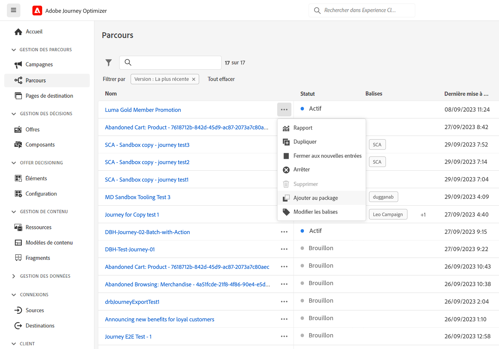
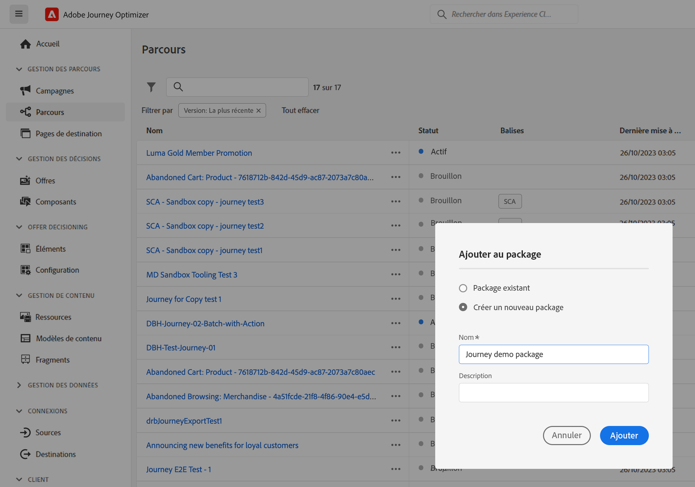
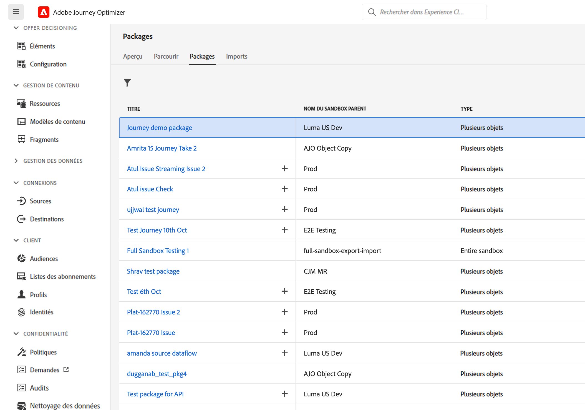
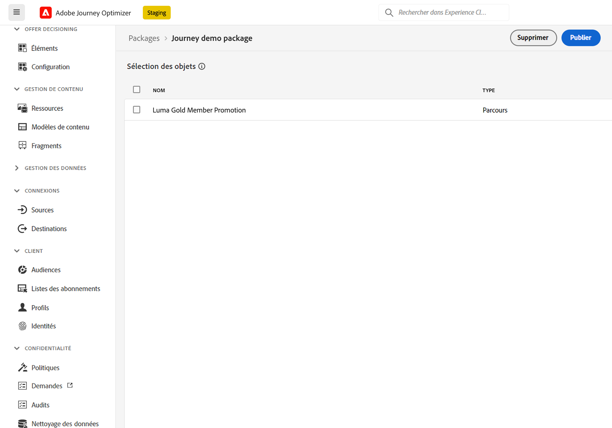
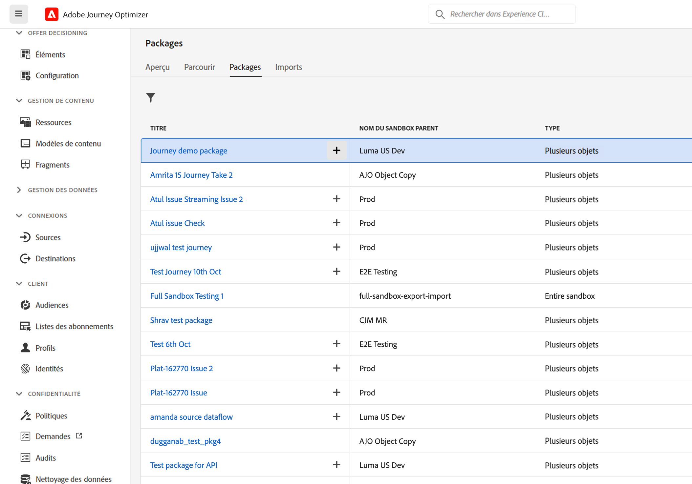
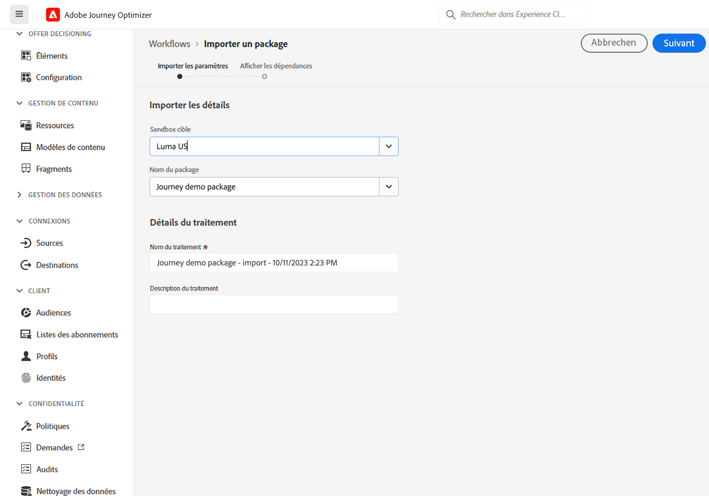
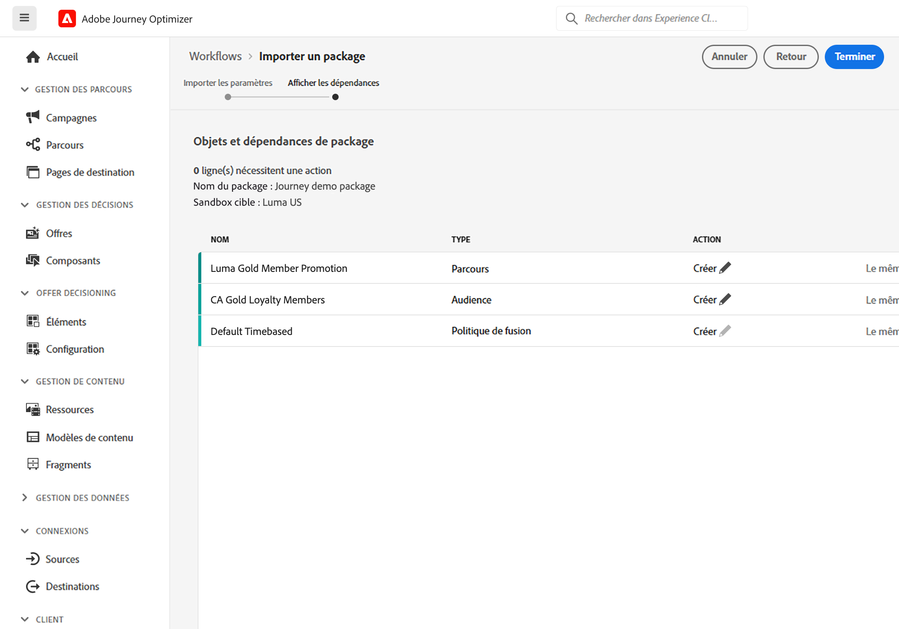
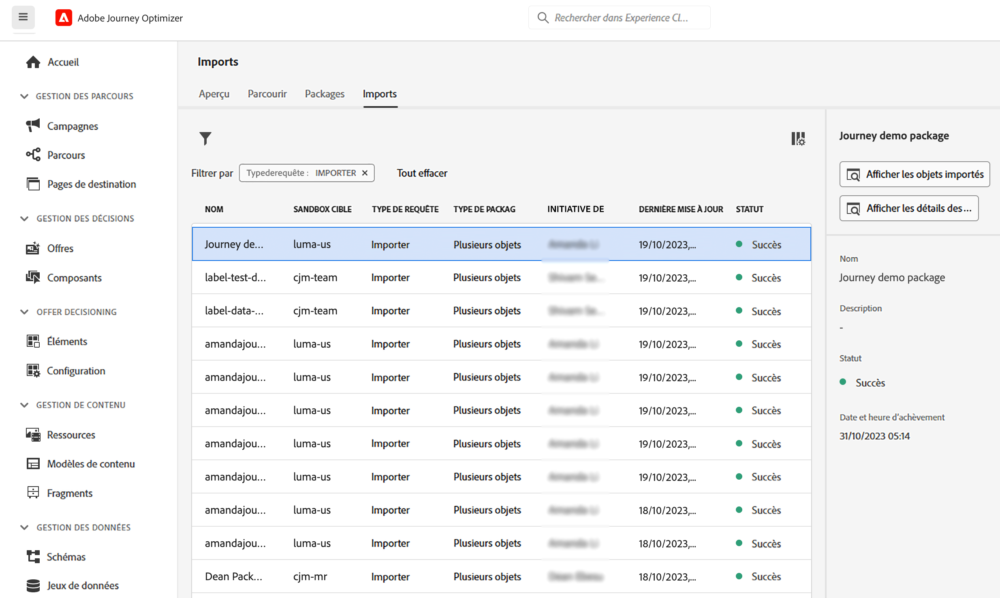

# Copier un parcours dans un autre sandbox {#copy-to-sandbox}

<!--
>[!CONTEXTUALHELP]
>id="ajo_journey_copy_main"
>title="Copy a journey to another sandbox"
>abstract="Journey Optimizer allows you to copy an entire journey from one sandbox to another. For example, you can copy a journey from the Stage sandbox environment to your Production sandbox. In addition to the Journey itself, Journey Optimizer also copies most of the objects the journey depends on."

>[!CONTEXTUALHELP]
>id="ajo_journey_copy_sandbox_details"
>title="Sandbox details"
>abstract="Select the destination sandbox you want to copy the journey to. Only sandboxes within your organization are available."

>[!CONTEXTUALHELP]
>id="ajo_journey_copy_object_details"
>title="Object details"
>abstract="This is the journey you are going to copy."

>[!CONTEXTUALHELP]
>id="ajo_journey_copy_dependent_objects"
>title="Dependent objects"
>abstract="This is the list of associated objects used in the journey. This list displays the name, the object type, as well as the internal Journey Optimizer ID."
-->

L’outil Sandbox vous permet de copier des objets sur plusieurs sandbox en exploitant l’export et l’import de packages. Un package peut se composer d’un ou de plusieurs objets. Tous les objets inclus dans un package doivent provenir du même sandbox.

Cette page décrit le cas d’utilisation de l’outil Sandbox dans le contexte de Journey Optimizer. Pour plus d’informations sur la fonctionnalité elle-même, consultez la [documentation Experience Platform](https://experienceleague.adobe.com/docs/experience-platform/sandbox/ui/sandbox-tooling.html?lang=fr).

>[!NOTE]
>
>Cette fonctionnalité nécessite les autorisations suivantes de la part de la fonctionnalité **Administration des sandbox** : gérer (ou afficher) les sandbox et gérer les packages. [En savoir plus](../administration/ootb-permissions.md)

## Prise en main de l’outil Sandbox{#sandbox-gs}

Journey Optimizer vous permet de copier un parcours complet d’un sandbox à un autre. Par exemple, vous pouvez copier un parcours de votre environnement de sandbox d’évaluation vers votre sandbox de production. En plus du parcours lui-même, Journey Optimizer copie également la plupart des objets dont dépend le parcours : audiences, schémas, événements et actions. Pour plus d’informations sur les objets copiés, reportez-vous à cette [section](https://experienceleague.adobe.com/docs/experience-platform/sandbox/ui/sandbox-tooling.html?lang=fr#abobe-journey-optimizer-objects).

>[!CAUTION]
>
>Certains éléments associés peuvent échapper à la copie dans le sandbox de destination. Il est vivement recommandé de vérifier la viabilité du parcours avant sa publication. Vous pourrez ainsi identifier tout objet potentiellement manquant.

Les objets copiés dans le sandbox cible sont uniques et il n’y a aucun risque de remplacer des éléments existants. Le parcours et tous les messages qu’il contient sont transférés en mode brouillon. Vous pouvez ainsi effectuer une validation approfondie du parcours avant sa publication sur le sandbox cible. Le processus de copie ne copie que les métadonnées et les objets de ce parcours. Aucune donnée de profil ou de jeu de données n’est copiée dans le cadre de ce processus.

Le processus de copie est réalisé via un export de package et un import entre les sandbox source et cible. Les étapes générales pour copier un parcours d’un sandbox vers un autre sont les suivantes :

1. Ajoutez le parcours en tant que package dans le sandbox source.
1. Exportez le package vers le sandbox cible.

En outre, vous pouvez tirer parti de l’**API REST du service de copie d’objet** Journey Optimizer pour gérer les objets des sandbox. [Découvrez comment utiliser l’API REST du service de copie d’objet.](https://developer.adobe.com/journey-optimizer-apis/references/sandbox/)

## Ajouter le parcours en tant que package{#export}

Pour copier un parcours dans un autre sandbox, vous devez d’abord ajouter le parcours en tant que package dans le sandbox source. Procédez de la façon suivante :

1. Dans la section du menu GESTION DES PARCOURS, cliquez sur **[!UICONTROL Parcours]**. La liste des parcours s&#39;affiche.

1. Recherchez le parcours à copier, puis cliquez sur l’icône **Plus d’actions** (les trois points en regard du nom du parcours) et sélectionnez **Ajouter au package**.

   

   La fenêtre **Ajouter au package** s’affiche.

   

1. Choisissez si vous souhaitez ajouter le parcours à un package existant ou créer un nouveau package :

   * **Package existant** : sélectionnez le package dans le menu déroulant.
   * **Créer un nouveau package** : saisissez le nom du package. Vous pouvez également ajouter une description.

1. Dans la section du menu ADMINISTRATION, cliquez sur **[!UICONTROL Sandbox]**, sélectionnez l’onglet **Packages** et cliquez sur le package à exporter.

   

1. Sélectionnez les objets à exporter, puis cliquez sur **Publier**.

   

   En cas d’échec de la publication, vous pouvez vérifier les journaux pour identifier la raison de l’échec. Ouvrez le package, puis cliquez sur **Voir Traitements en échec**, sélectionnez le traitement d’import, puis cliquez sur **Afficher les détails de l’import**.

   

## Exporter le package vers le sandbox cible {#import}

Une fois le package publié, vous devez l’exporter vers le sandbox cible.

1. Dans le sandbox source, cliquez sur le menu **[!UICONTROL Sandbox]**, sélectionnez l’onglet **Packages** et cliquez sur l’icône + en regard du package à exporter.

   

1. Sélectionnez le **sandbox cible** dans le champ déroulant, puis cliquez sur **Suivant**. Seules les sandbox de votre organisation sont disponibles.

   

1. Examinez les objets et les dépendances du package. Il s’agit de la liste des objets associés utilisés dans le parcours. Cette liste affiche le nom et le type d’objet. Pour chaque objet, vous pouvez choisir d’en créer un nouveau ou d’en utiliser un existant dans le sandbox cible.

   

1. Cliquez sur le bouton **Terminer** situé dans le coin supérieur droit pour commencer à copier le package dans le sandbox cible. La durée du processus de copie dépend de la complexité du parcours et du nombre d’objets à copier.

1. Cliquez sur le traitement d’import pour vérifier le résultat de la copie :

   * Cliquez sur **Afficher les objets importés** pour afficher chaque objet copié.
   * Cliquez sur **Afficher les détails de l’import** pour vérifier les résultats de l’import de chaque objet.

   

1. Accédez à votre sandbox cible et vérifiez minutieusement que tous les objets sont copiés.
