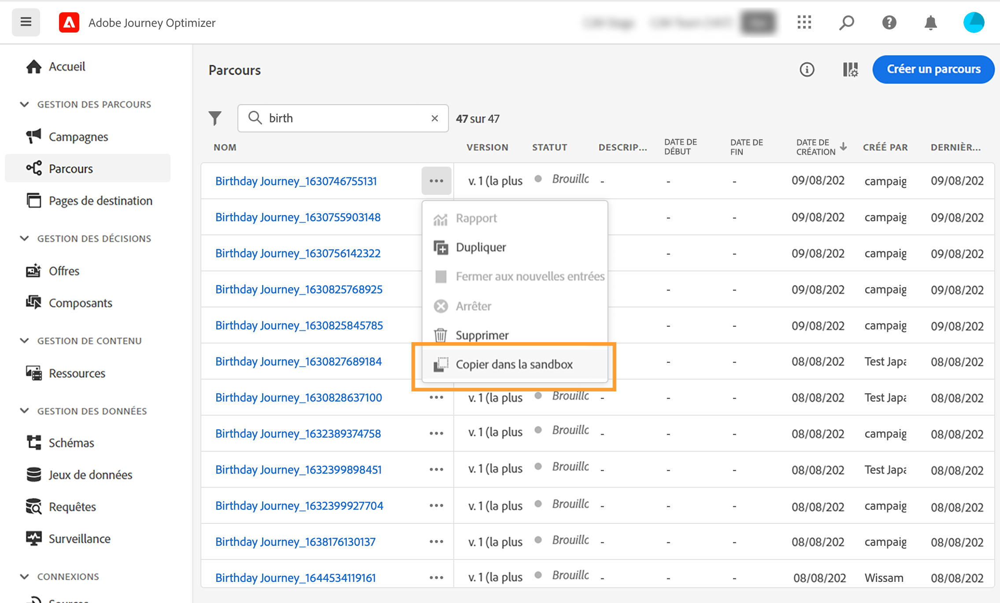
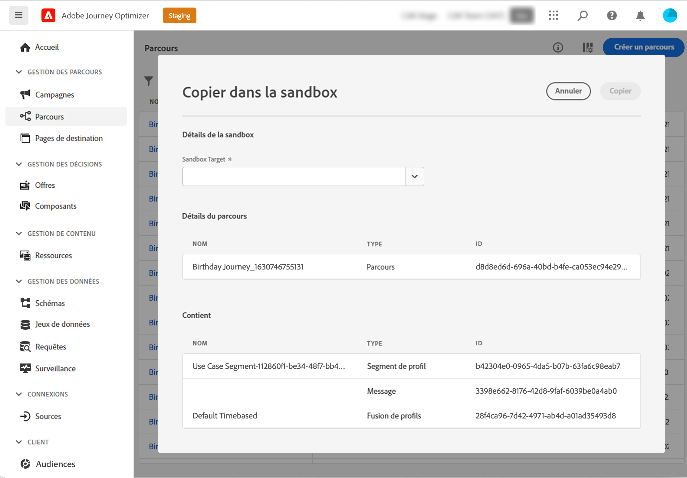
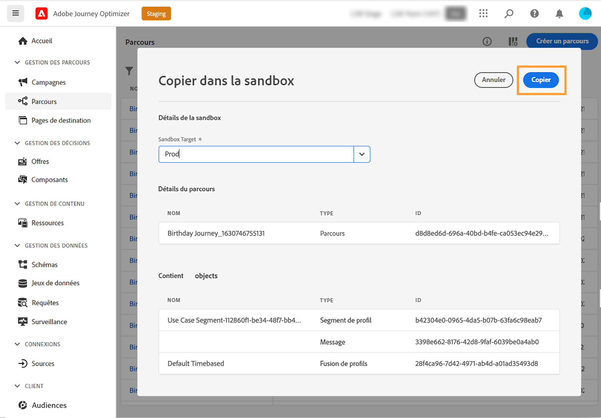
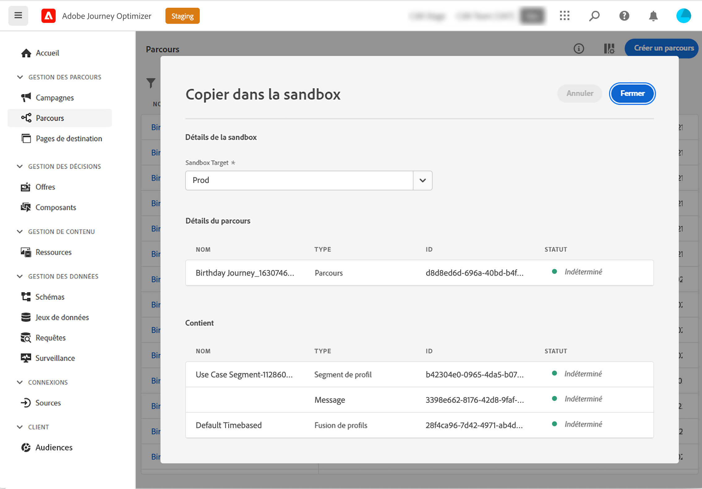

# Copier un parcours dans une autre sandbox {#copy-to-sandbox}

>[!CONTEXTUALHELP]
>id="ajo_journey_copy_main"
>title="Copier un parcours dans une autre sandbox"
>abstract="Journey Optimizer vous permet de copier un parcours complet d’une sandbox à une autre. Par exemple, vous pouvez copier un parcours de l’environnement de sandbox d’évaluation vers votre sandbox de production. En plus du parcours lui-même, Journey Optimizer copie également la plupart des objets dont dépend le parcours."

>[!CONTEXTUALHELP]
>id="ajo_journey_copy_sandbox_details"
>title="Détails des sandbox"
>abstract="Sélectionnez la sandbox de destination dans laquelle vous souhaitez copier le parcours. Seules les sandbox de votre organisation IMS sont disponibles."

>[!CONTEXTUALHELP]
>id="ajo_journey_copy_object_details"
>title="Détails de l’objet"
>abstract="Il s’agit du parcours que vous allez copier."

>[!CONTEXTUALHELP]
>id="ajo_journey_copy_dependent_objects"
>title="Objets dépendants"
>abstract="Il s’agit de la liste des objets associés utilisés dans le parcours. Cette liste affiche le nom, le type d’objet et l’ID Journey Optimizer interne."

Journey Optimizer vous permet de copier un parcours complet d’une sandbox à une autre. Par exemple, vous pouvez copier un parcours de votre environnement de sandbox d’évaluation vers votre sandbox de production. En plus du parcours lui-même, Journey Optimizer copie également la plupart des objets dont dépend le parcours : segments, surfaces (c’est-à-dire préréglages), schémas, événements et actions. Pour plus d’informations sur les objets copiés, reportez-vous à cette section [section](../building-journeys/copy-to-sandbox.md#limitations).

>[!CAUTION]
>
>Certains éléments associés peuvent échapper à la copie dans la sandbox de destination. Il est vivement recommandé de vérifier la viabilité du parcours avant sa publication. Vous pourrez ainsi identifier tout objet potentiellement manquant.

Les objets copiés dans la sandbox cible sont uniques et il n’y a aucun risque de remplacer des éléments existants. Le parcours et tous les messages qu’il contient sont transférés en mode brouillon. Vous pouvez ainsi effectuer une validation approfondie du parcours avant sa publication sur la sandbox cible. Le processus de copie ne copie que les métadonnées et les objets de ce parcours. Aucune donnée de profil ou de jeu de données n’est copiée dans le cadre de ce processus.

Pour copier un parcours dans une autre sandbox, procédez comme suit :

1. Dans la section du menu GESTION DES PARCOURS, cliquez sur **[!UICONTROL Parcours]**. La liste des parcours s&#39;affiche.

2. Recherchez le parcours à copier, puis cliquez sur l’icône **Plus d’actions** (les trois points en regard du nom du parcours) et sélectionnez **Copier dans la sandbox**.

   

   L’écran **Copier dans la sandbox** s’affiche.

   

3. Sélectionnez la **sandbox cible** dans le champ déroulant. Seules les sandbox de votre organisation IMS sont disponibles.

4. Consultez la section **Objets dépendants**. Il s’agit de la liste des objets associés utilisés dans le parcours. Cette liste affiche le nom, le type d’objet et l’ID Journey Optimizer interne.

5. Cliquez sur le bouton **Copier** situé dans le coin supérieur droit pour commencer à copier le parcours dans la sandbox cible.

   

   Le processus de copie démarre et la progression de chacun des objets est affichée. La durée du processus de copie dépend de la complexité du parcours et du nombre d’objets à copier. Si une erreur se produit, un message s’affiche pour l’objet concerné.

   

6. Lorsque la copie est terminée, cliquez sur **Fermer**.

7. Accédez à votre sandbox cible et vérifiez minutieusement que tous les objets sont copiés.

## Processus de copie et limitations {#limitations}

Certains éléments associés peuvent échapper à la copie dans la sandbox de destination. Il est vivement recommandé d’effectuer une vérification approfondie. Identifiez tout objet potentiel manquant et créez-le manuellement avant de publier le parcours.

Les objets suivants sont copiés :

* Segment

   Un segment ne peut être copié qu’une seule fois d’une sandbox à une autre. Un segment ayant été copié n’est pas modifiable sur la sandbox de destination.

* Schéma

   Les schémas utilisés dans ce parcours sont copiés.

* Message

   Les activités d’action de canal utilisées dans le parcours. L’exhaustivité des champs utilisés pour la personnalisation dans le message n’est pas vérifiée. Les blocs de contenu ne sont pas copiés.

* Parcours : détails de la zone de travail

   Représentation du parcours sur la zone de travail, y compris les objets du parcours tels que les conditions, les actions, les événements, les segments de lecture, etc. L’activité Saut n’est pas copiée.

* Événement

   Les événements et les détails des événements utilisés dans le parcours sont copiés.

* Action

   Les actions et les détails des actions utilisées dans le parcours sont copiés.

Les surfaces (c’est-à-dire les préréglages) ne sont pas copiées. Le système sélectionne automatiquement la correspondance la plus proche possible sur la sandbox de destination, en fonction du type de message et du nom de la surface. Si aucune surface n’est trouvée sur la sandbox cible, le processus de copie de la surface échoue. Cela signifie que la copie du message échouera également, car un message nécessite qu’une surface soit disponible pour la configuration. Dans ce cas, au moins une surface doit être créée, pour le bon canal du message, afin que la copie fonctionne.

Pour les schémas, les stratégies de fusion et les segments, la deuxième fois que ces objets tenteront d’être copiés, ils seront seulement référencés. Ils seront traités comme des objets qui existent déjà et seront à nouveau copiés. Cela signifie que ces objets ne peuvent être copiés qu’une seule fois.

Un délai de cinq minutes est nécessaire pour qu’Adobe Journey Optimizer puisse référencer les schémas, les stratégies de fusion et les segments sans afficher d’erreur dans la zone de travail. Patientez cinq minutes et ces références seront disponibles.
