# Créer des profils de test {#create-test-profiles}

Les profils de test sont requis lors de l’utilisation de la variable [mode test](../building-journeys/testing-the-journey.md) dans un parcours, et à [prévisualiser et tester votre contenu ;](../email/preview.md).

Il existe plusieurs façons de créer des profils de test. Vous trouverez dans cette page des informations détaillées sur :

* Transformer [profil existant](#turning-profile-into-test) dans un profil de test

* Créer des profils de test en chargeant un [fichier csv](#create-test-profiles-csv) ou en utilisant [Appels API](#create-test-profiles-api).

   Outre ces deux méthodes, Adobe Journey Optimizer est fourni avec une [cas d’utilisation interne au produit](#use-case-1) pour faciliter la création de profils de test.

Vous pouvez également charger un fichier json dans un jeu de données existant. Voir à ce sujet la section [Documentation sur Data Ingestion](https://experienceleague.adobe.com/docs/experience-platform/ingestion/tutorials/ingest-batch-data.html#add-data-to-dataset){target=&quot;_blank&quot;}.

Notez que la création d’un profil de test est similaire à la création de profils standard dans Adobe Experience Platform. Pour plus d’informations, reportez-vous à la section [Documentation sur Real-time Customer Profile](https://experienceleague.adobe.com/docs/experience-platform/profile/home.html){target=&quot;_blank&quot;}.

➡️ [Découvrez comment créer des profils de test dans cette vidéo](#video)

## Conditions préalables {#test-profile-prerequisites}

Pour pouvoir créer des profils, vous devez d’abord créer un schéma et un jeu de données dans Adobe. [!DNL Journey Optimizer].

À **création d’un schéma**, procédez comme suit :

1. Dans la section du menu DATA MANAGEMENT, cliquez sur **[!UICONTROL Schemas]**.
   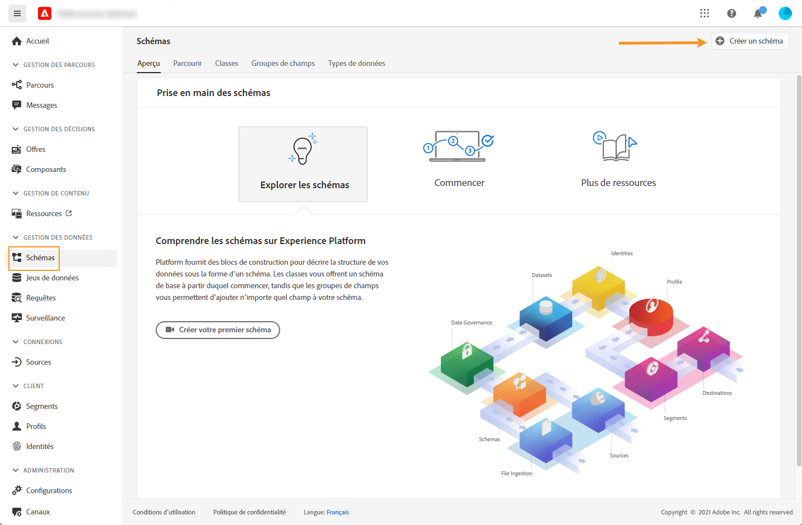
1. Cliquez sur **[!UICONTROL Create schema]**, en haut à droite, puis sélectionnez un type de schéma, par exemple **XDM Individual Profile**.
   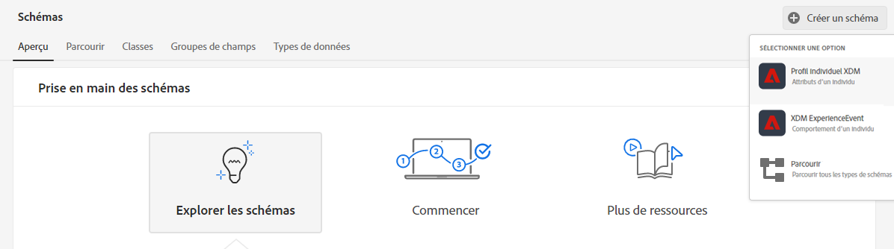
1. Sélectionnez les groupes de champs appropriés. Veillez à ajouter la variable **Détails du test de profil** groupe de champs.
   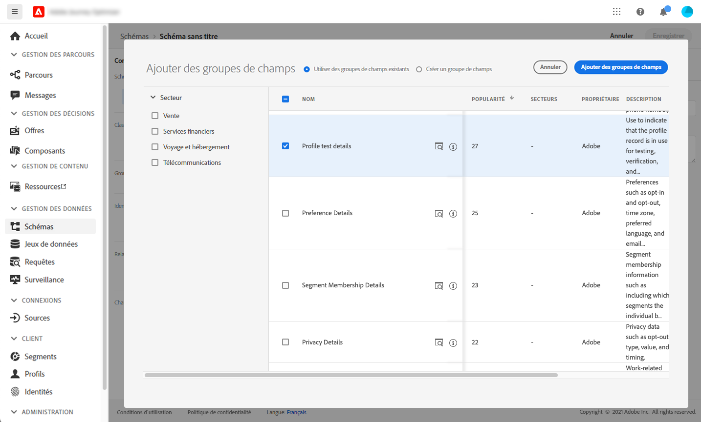
Une fois que vous avez terminé, cliquez sur **[!UICONTROL Add field groups]**: la liste des groupes de champs s’affiche dans l’écran aperçu du schéma.
   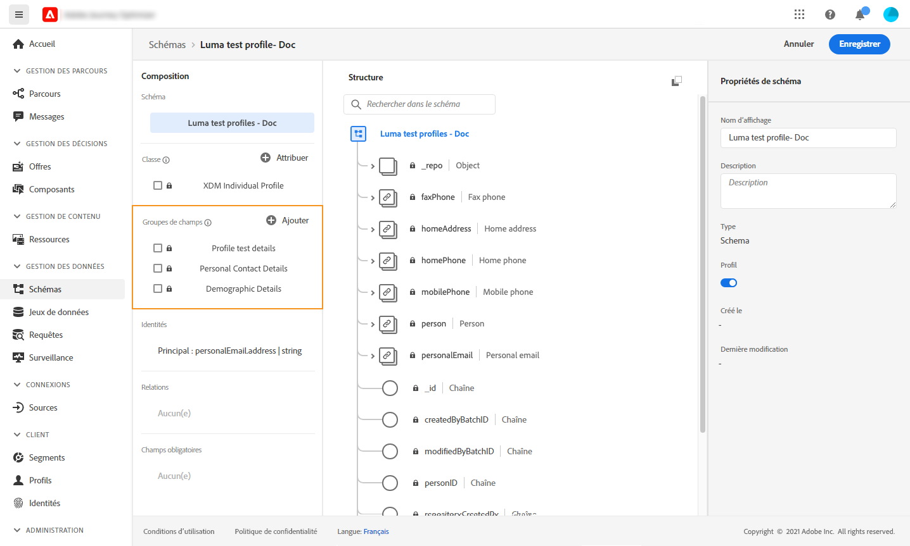

   >[!NOTE]
   >
   >* Cliquez sur le nom du schéma pour le modifier et mettre à jour ses propriétés.
   >
   >* Cliquez sur le bouton **[!UICONTROL Add]** dans la section Groupes de champs pour sélectionner d’autres groupes de champs à ajouter au schéma


1. Dans la liste des champs, cliquez sur le champ que vous souhaitez définir comme identité principale.
   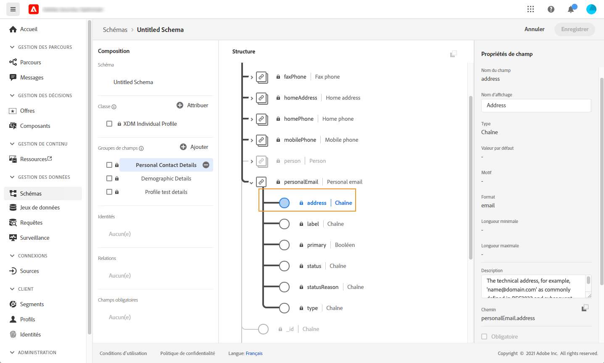
1. Dans le **[!UICONTROL Field properties]** dans le volet de droite, vérifiez **[!UICONTROL Identity]** et **[!UICONTROL Primary Identity]** et sélectionnez un espace de noms. Si vous souhaitez que l’identité principale soit une adresse électronique, choisissez la variable **[!UICONTROL Email]** espace de noms. Cliquez sur **[!UICONTROL Apply]**.
   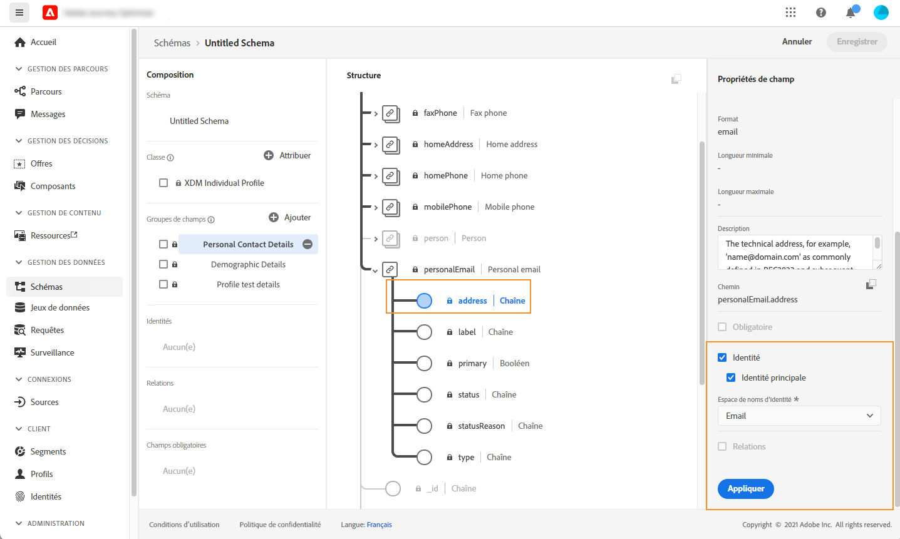
1. Sélectionnez le schéma et activez l’option **[!UICONTROL Profile]** dans le **[!UICONTROL Schema properties]** volet.
   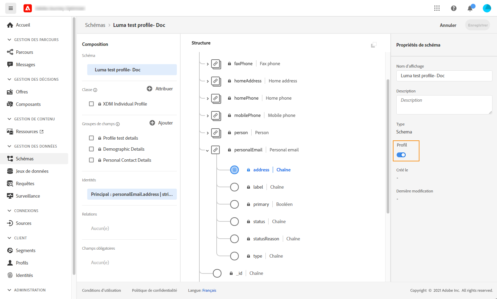
1. Cliquez sur **Enregistrer**.

>[!NOTE]
>
>Pour plus d’informations sur la création d’un schéma, reportez-vous à la section [Documentation XDM](https://experienceleague.adobe.com/docs/experience-platform/xdm/ui/resources/schemas.html#prerequisites){target=&quot;_blank&quot;}.

Ensuite, vous devez **création du jeu de données** dans laquelle les profils seront importés. Procédez comme suit :

1. Accédez à **[!UICONTROL Datasets]**, puis cliquez sur **[!UICONTROL Create dataset]**.
   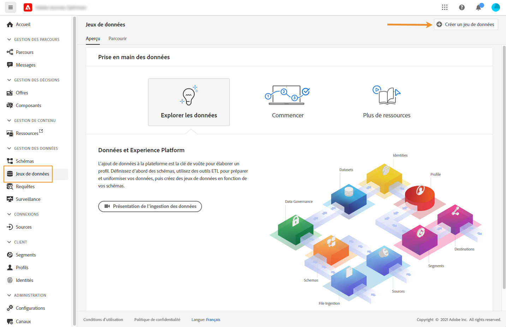
1. Choisir **[!UICONTROL Create dataset from schema]**.
   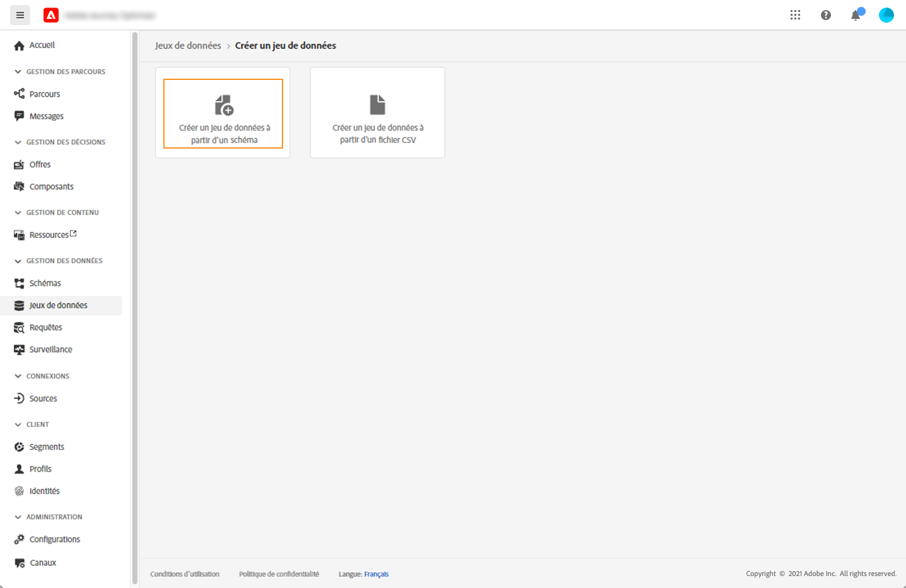
1. Sélectionnez le schéma créé précédemment, puis cliquez sur **[!UICONTROL Next]**.
   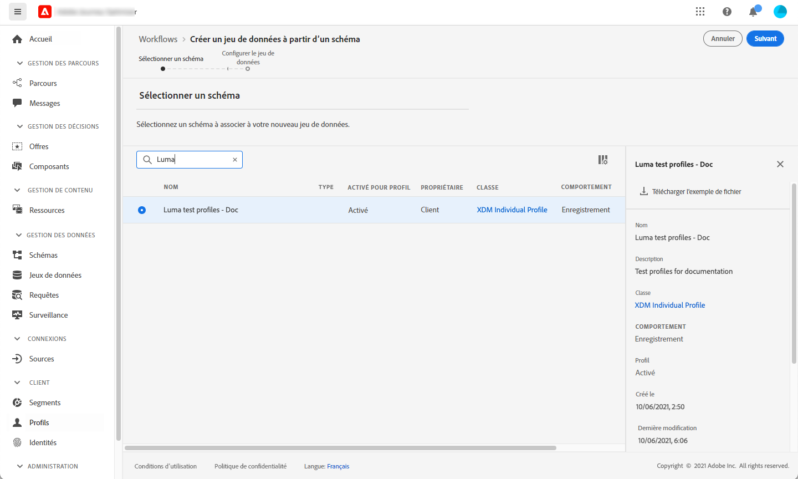
1. Choisissez un nom, puis cliquez sur **[!UICONTROL Finish]**.
   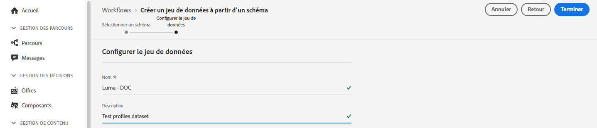
1. Activez la variable **[!UICONTROL Profile]** .
   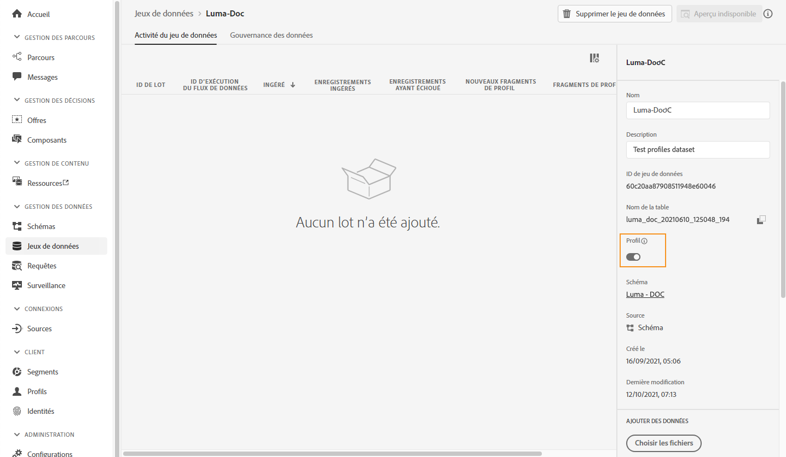

>[!NOTE]
>
> Pour plus d’informations sur la création de jeux de données, reportez-vous à la section [Documentation du service de catalogue](https://experienceleague.adobe.com/docs/experience-platform/catalog/datasets/user-guide.html#getting-started){target=&quot;_blank&quot;}.

## Cas d’utilisation interne au produit{#use-case-1}

Sur la page d’accueil d’Adobe Journey Optimizer, vous pouvez exploiter le cas d’utilisation des profils de test intégrés au produit. Ce cas pratique facilite la création de profils de test utilisés pour tester les parcours avant la publication.

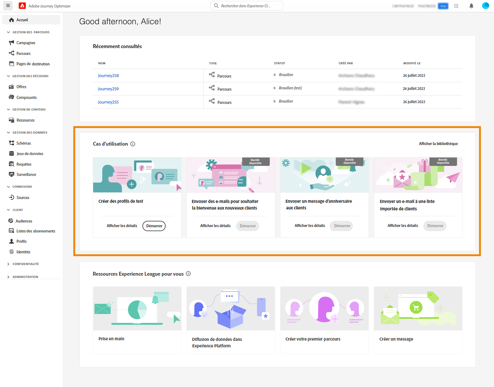

Cliquez sur le bouton **[!UICONTROL Begin]** pour lancer le cas d’utilisation.

Les informations suivantes sont requises :

1. **Espace de noms d’identité**: Le [namespace d’identité](../segment/get-started-identity.md) utilisé pour identifier de manière unique les profils de test. Par exemple, si le courrier électronique est utilisé pour identifier les profils de test, l’espace de noms d’identité **Email** doit être sélectionné. Si l’identifiant unique est le numéro de téléphone, alors l’espace de noms d’identité **Téléphone** doit être sélectionné.

2. **fichier CSV**: Fichier séparé par des virgules contenant la liste des profils de test à créer. Le cas d’utilisation exige un format prédéfini pour le fichier CSV contenant la liste des profils de test à créer. Chaque ligne du fichier doit inclure les champs suivants dans l’ordre correct :

   1. **ID de personne**: Identifiant unique du profil de test. Les valeurs de ce champ doivent refléter l’espace de noms d’identité sélectionné. (Par exemple, si **Téléphone** est sélectionné pour l’espace de noms d’identité, alors les valeurs de ce champ doivent être des numéros de téléphone. De même que si **Email** est sélectionné, alors les valeurs de ce champ doivent être des emails)
   1. **Adresse électronique**: Testez l’adresse électronique du profil. (La variable **ID de personne** et le champ **Adresse électronique** peut contenir potentiellement les mêmes valeurs si **Email** est sélectionné comme espace de noms d’identité)
   1. **Prénom**: Tester le prénom du profil.
   1. **Nom**: Nom du profil de test.
   1. **Ville**: Test de la ville de résidence du profil
   1. **Pays**: Test du pays de résidence du profil
   1. **Genre**: Testez le genre du profil. Les valeurs disponibles sont **male**, **female** et **non_specified**

Après avoir sélectionné l’espace de noms d’identité et fourni le fichier CSV en fonction du format ci-dessus, cliquez sur **[!UICONTROL Run]** en haut à droite. Le cas d’utilisation peut prendre quelques minutes. Une fois le cas d’utilisation terminé le traitement et la création des profils de test, une notification est envoyée à l’utilisateur.

>[!NOTE]
>
>Les profils de test peuvent remplacer les profils existants. Avant d’exécuter le cas d’utilisation, assurez-vous que le fichier CSV contient uniquement des profils de test et qu’il est exécuté sur le bon environnement de test.

## Transformer un profil en profil de test{#turning-profile-into-test}

Vous pouvez transformer un profil existant en profil de test : vous pouvez mettre à jour les attributs de profil de la même manière que lorsque vous créez un profil.

Pour ce faire, utilisez une méthode simple : **[!UICONTROL Update Profile]** activité d’action dans un parcours et modifiez la variable **testProfile** champ booléen de false à true.

Votre parcours se compose d’une **[!UICONTROL Read Segment]** et un **[!UICONTROL Update Profile]** activité. Vous devez d’abord créer un segment ciblant les profils que vous souhaitez transformer en profils de test.

>[!NOTE]
>
> Puisque vous allez mettre à jour la variable **testProfile** , les profils sélectionnés doivent inclure ce champ. Le schéma associé doit avoir la variable **Détails du test de profil** groupe de champs. Voir [cette section](../segment/creating-test-profiles.md#test-profiles-prerequisites).

1. Accédez à **Segments**, puis **Créer un segment**, en haut à droite.
   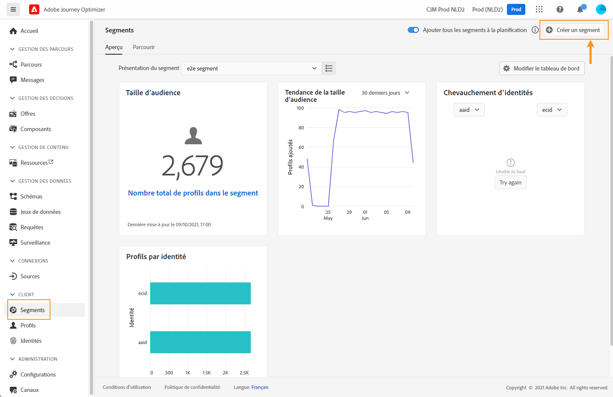
1. Définissez un nom pour votre segment et créez le segment : choisissez le(s) champ(s) et la(s) valeur(s) pour cibler les profils que vous souhaitez.
   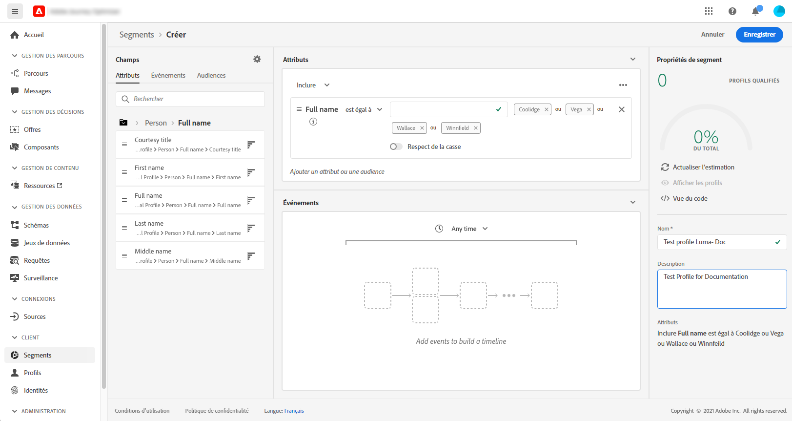
1. Cliquez sur **Enregistrer** et vérifiez que les profils sont correctement ciblés par le segment.
   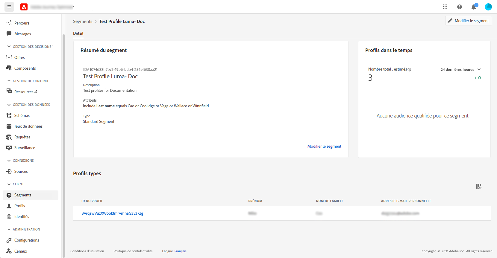

   >[!NOTE]
   >
   > Le calcul du segment peut prendre du temps. En savoir plus sur les segments dans [cette section](../segment/about-segments.md).

1. Créez maintenant un parcours et commencez par un **[!UICONTROL Read Segment]** activité d’orchestration.
1. Sélectionnez le segment créé précédemment et l’espace de noms utilisé par vos profils.
   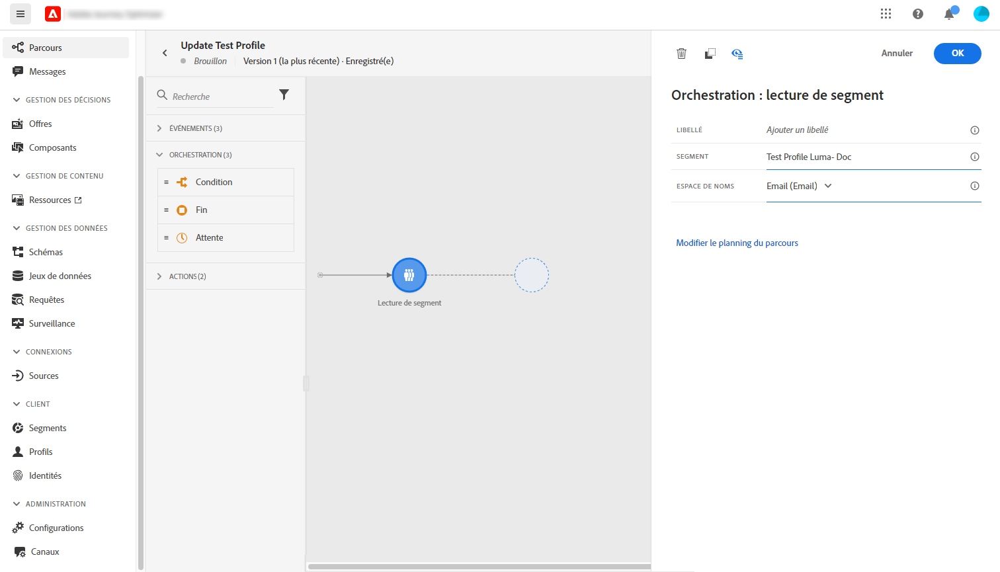
1. Ajoutez un **[!UICONTROL Update Profile]** activité d’action.
1. Sélectionnez le schéma, le **testProfiles** , le jeu de données et définissez la valeur sur **True**. Pour ce faire, dans le **[!UICONTROL VALUE]** , cliquez sur le champ **Pen** sur la droite, sélectionnez **[!UICONTROL Advanced mode]** et saisissez **true**.
   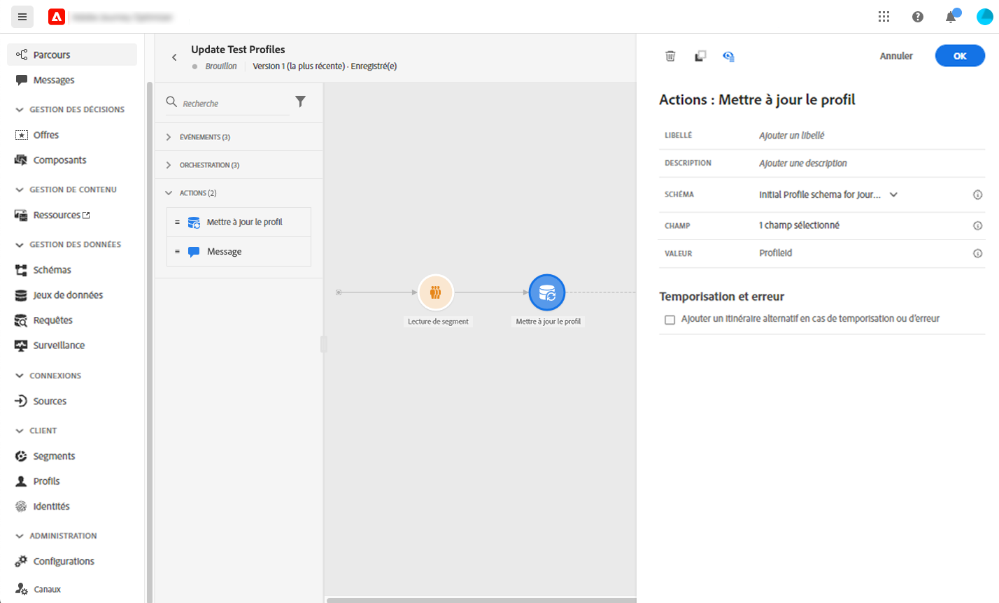
1. Cliquez sur **[!UICONTROL Publish]**.
1. Dans le **[!UICONTROL Segments]** , vérifiez que les profils ont été correctement mis à jour.
   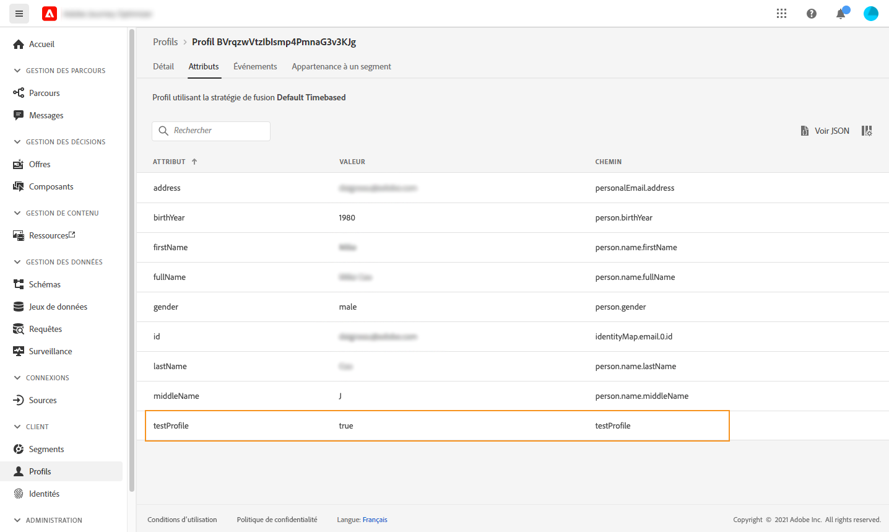

   >[!NOTE]
   >
   > Pour plus d’informations sur la variable **[!UICONTROL Update Profile]** activité, voir [cette section](../building-journeys/update-profiles.md).

## Création d’un profil de test à l’aide d’un fichier csv{#create-test-profiles-csv}

Dans Adobe Experience Platform, vous pouvez créer des profils en chargeant un fichier csv contenant les différents champs de profil dans votre jeu de données. Il s’agit de la méthode la plus simple.

1. Créez un fichier csv simple à l’aide d’un tableur.
1. Ajoutez une colonne pour chaque champ nécessaire. Veillez à ajouter le champ d’identité principal (&quot;personID&quot; dans notre exemple ci-dessus) et le champ &quot;testProfile&quot; défini sur &quot;true&quot;.
   
1. Ajoutez une ligne par profil et renseignez les valeurs de chaque champ.
   
1. Enregistrez la feuille de calcul en tant que fichier csv. Assurez-vous que les virgules sont utilisées comme séparateurs.
1. Accès à Adobe Experience Platform **Workflows**.
   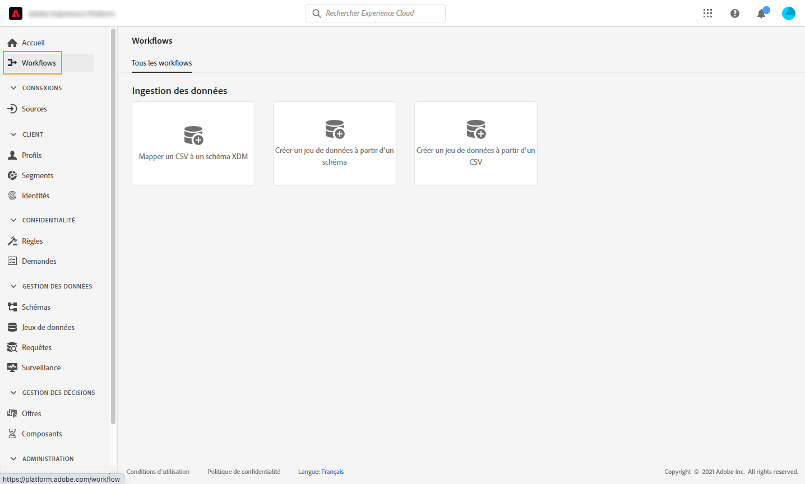
1. Choisir **Mappage du fichier CSV au schéma XDM**, puis cliquez sur **Launch**.
   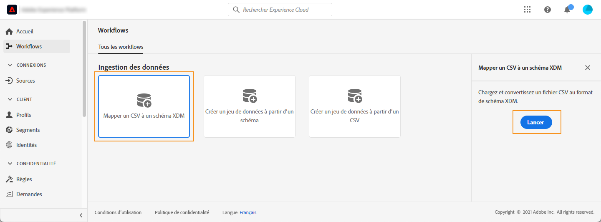
1. Sélectionnez le jeu de données dans lequel vous souhaitez importer les profils. Cliquez sur **Suivant**.
   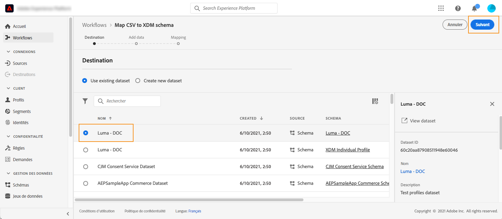
1. Cliquez sur **Sélection de fichiers** et sélectionnez votre fichier csv. Lorsque le fichier est chargé, cliquez sur **Suivant**.
   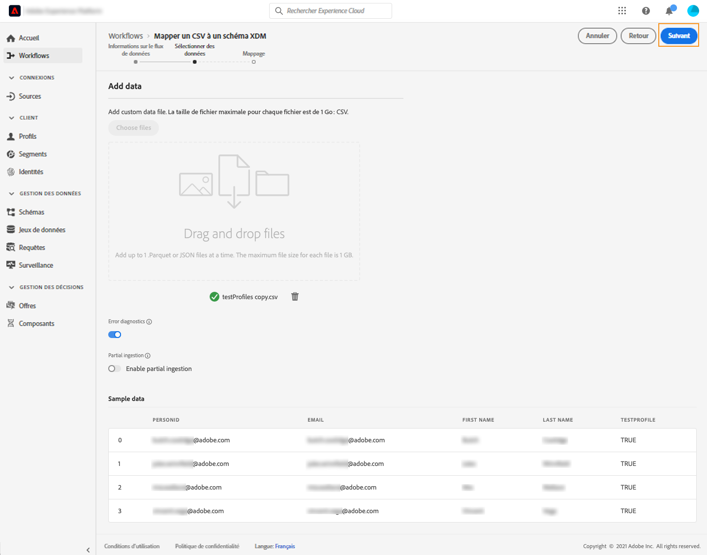
1. Faites correspondre les champs csv source aux champs de schéma, puis cliquez sur **Terminer**.
   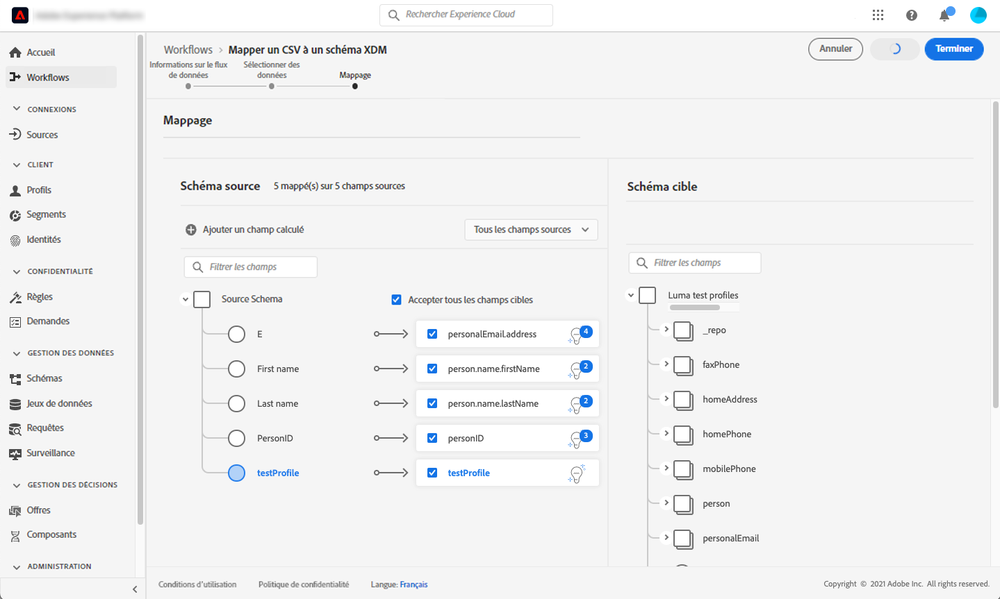
1. L’importation des données commence. Le statut passe de **Traitement** to **Succès**. Cliquez sur **Prévisualisation d’un jeu de données**, en haut à droite.
   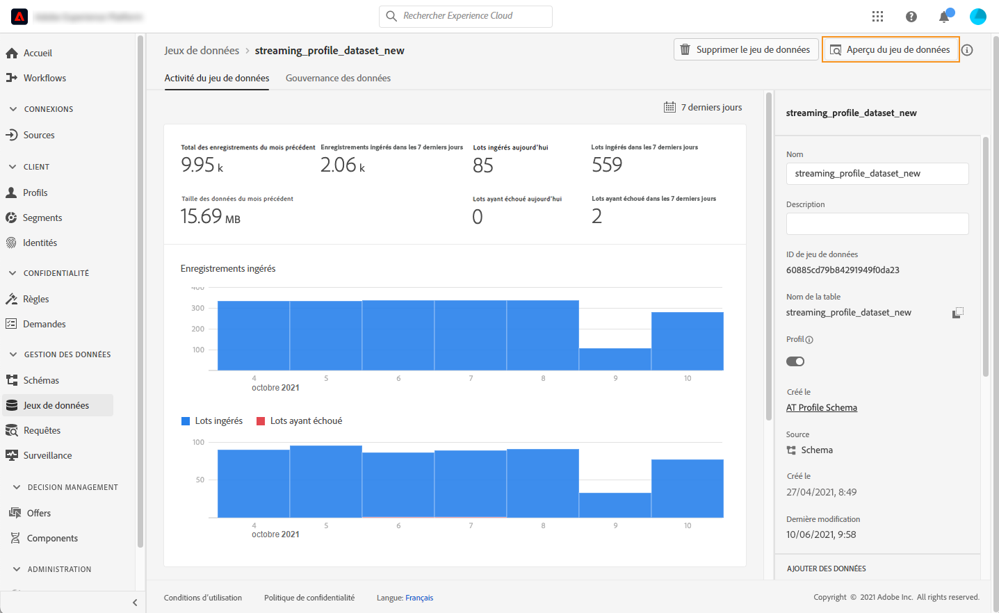
1. Vérifiez que les profils de test ont été correctement ajoutés.
   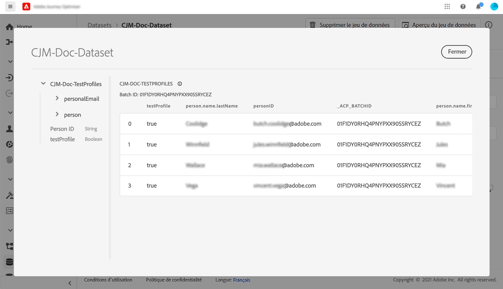

Vos profils de test sont ajoutés et peuvent désormais être utilisés lors du test d’un parcours. Voir [cette section](../building-journeys/testing-the-journey.md).
>[!NOTE]
>
> Pour plus d’informations sur les imports csv, reportez-vous à la section [Documentation sur Data Ingestion](https://experienceleague.adobe.com/docs/experience-platform/ingestion/tutorials/map-a-csv-file.html#tutorials){target=&quot;_blank&quot;}.

## Création de profils de test à l’aide d’appels API{#create-test-profiles-api}

Vous pouvez également créer des profils de test via des appels API. En savoir plus dans [Documentation d’Adobe Experience Platform](https://experienceleague.adobe.com/docs/experience-platform/profile/home.html){target=&quot;_blank&quot;}.

Vous devez utiliser un schéma de profil qui contient le groupe de champs &quot;Détails du test de profil&quot;. L’indicateur testProfile fait partie de ce groupe de champs.
Lors de la création d&#39;un profil, veillez à transmettre la valeur : testProfile = true.

Notez que vous pouvez également mettre à jour un profil existant pour remplacer son indicateur testProfile par &quot;true&quot;.

Voici un exemple d’appel API pour créer un profil de test :

```
curl -X POST \
'https://dcs.adobedc.net/collection/xxxxxxxxxxxxxx' \
-H 'Cache-Control: no-cache' \
-H 'Content-Type: application/json' \
-H 'Postman-Token: xxxxx' \
-H 'cache-control: no-cache' \
-H 'x-api-key: xxxxx' \
-H 'x-gw-ims-org-id: xxxxx' \
-d '{
"header": {
"msgType": "xdmEntityCreate",
"msgId": "xxxxx",
"msgVersion": "xxxxx",
"xactionid":"xxxxx",
"datasetId": "xxxxx",
"imsOrgId": "xxxxx",
"source": {
"name": "Postman"
},
"schemaRef": {
"id": "https://example.adobe.com/mobile/schemas/xxxxx",
"contentType": "application/vnd.adobe.xed-full+json;version=1"
}
},
"body": {
"xdmMeta": {
"schemaRef": {
"contentType": "application/vnd.adobe.xed-full+json;version=1"
}
},
"xdmEntity": {
"_id": "xxxxx",
"_mobile":{
"ECID": "xxxxx"
},
"testProfile":true
}
}
}'
```

## Vidéo pratique {#video}

Découvrez comment créer des profils de test.

>[!VIDEO](https://video.tv.adobe.com/v/334236?quality=12)
