# Création de profils de test {#create-test-profiles}

Les profils de test sont requis lors de l’utilisation du mode test Pour savoir comment utiliser le [mode test](../building-journeys/testing-the-journey.md) dans un parcours, ainsi que pour [prévisualiser et tester vos messages](../preview.md).

Les méthodes disponibles pour créer des profils de test sont présentées ci-dessous :

* Vous pouvez transformer un [profil existant](#turning-profile-into-test) en profil de test.

* Vous pouvez créer un profil de test en téléchargeant un fichier [csv](#create-test-profiles-csv) ou en utilisant les [appels d’API](#create-test-profiles-api). Outre ces deux méthodes, Adobe Journey Optimizer est fourni avec un [cas d’utilisation interne au produit](#use-case-1) spécifique pour faciliter la création de profils de test.

* Vous pouvez également charger un fichier json dans un jeu de données. Voir à ce propos la [documentation sur Data Ingestion](https://experienceleague.adobe.com/docs/experience-platform/ingestion/tutorials/ingest-batch-data.html?lang=fr#add-data-to-dataset).

Notez que la création d’un profil de test est similaire à la création de profils standard dans Adobe Experience Platform. Pour plus d’informations, consultez la [documentation du profil client en temps réel](https://experienceleague.adobe.com/docs/experience-platform/profile/home.html?lang=fr).

## Conditions préalables {#test-profile-prerequisites}

Pour pouvoir créer des profils, il vous faut d’abord créer un schéma ainsi qu’un jeu de données dans Adobe [!DNL Journey Optimizer].

Tout d’abord, vous devez **créer un schéma**. Procédez de la façon suivante :

1. Dans la section du menu DATA MANAGEMENT, cliquez sur **[!UICONTROL Schémas]**.
   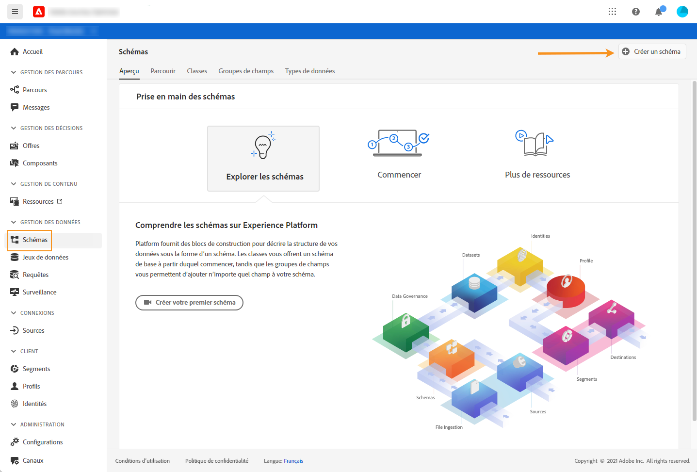
1. Cliquez sur **[!UICONTROL Créer un schéma]** dans le coin supérieur droit, puis sélectionnez un type de schéma, par exemple **Profil individuel XDM**.
   
1. Sélectionnez les groupes de champs appropriés. Veillez à ajouter le groupe de champs **Détails du test de profil** .
   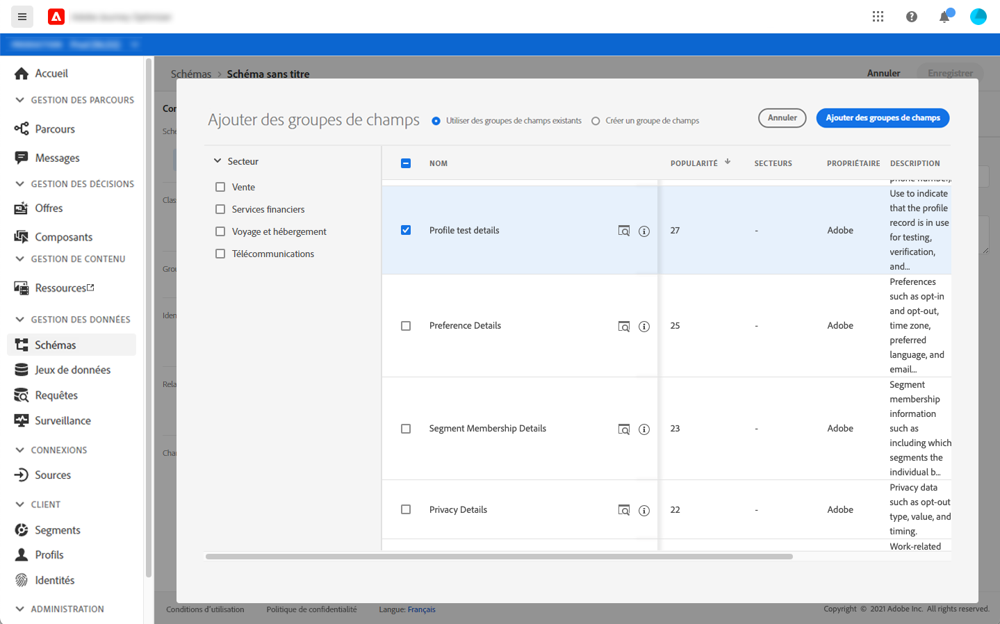
Une fois que vous avez terminé, cliquez sur  **[!UICONTROL Ajouter des groupes de champs]** : la liste des groupes de champs s’affiche dans l’écran aperçu du schéma.
   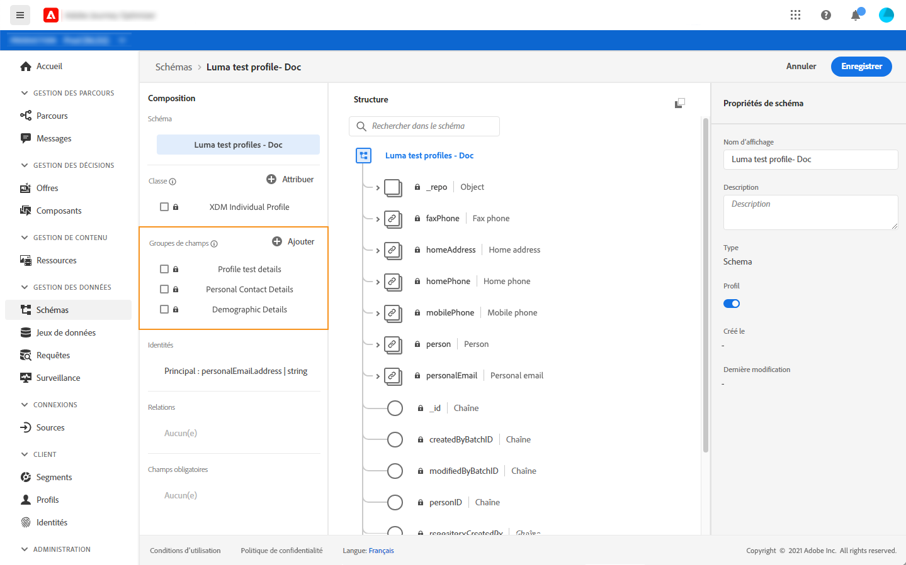

   >[!NOTE]
   >
   >* Cliquez sur le nom du schéma pour le modifier et mettre à jour ses propriétés.
      >
      >
   * Cliquez sur le bouton **[!UICONTROL Ajouter]** dans la section Groupes de champs pour sélectionner d’autres groupes de champs à ajouter au schéma.


1. Dans la liste des champs, cliquez sur le champ que vous souhaitez définir comme l’identité principale.
   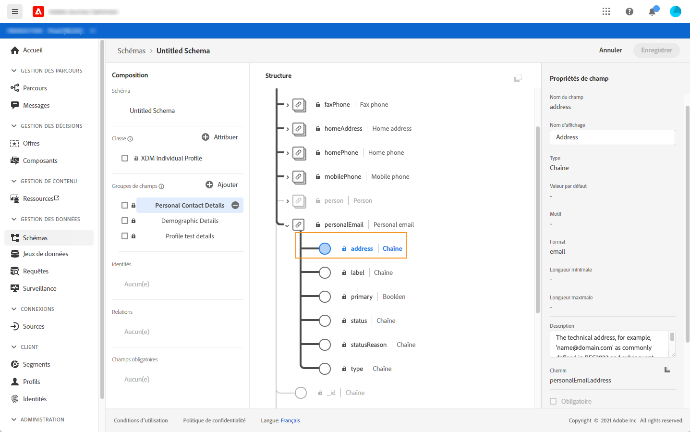
1. Dans le volet de droite **[!UICONTROL Propriétés du champ]**, cochez les options **[!UICONTROL Identité]** et **[!UICONTROL Identité Principal]** et sélectionnez un espace de noms. Si vous souhaitez que l’identité principale soit une adresse e-mail, choisissez l’espace de noms **[!UICONTROL E-mail]**. Cliquez sur **[!UICONTROL Appliquer]**.
   
1. Sélectionnez le schéma et activez l’option **[!UICONTROL Profil]** dans le volet **[!UICONTROL Propriétés du schéma]**.
   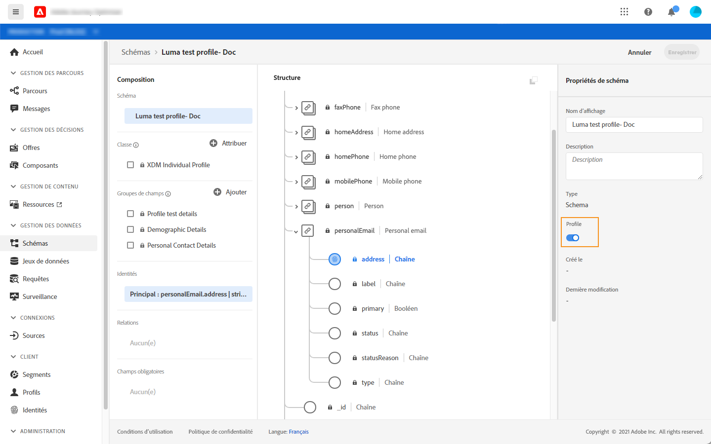
1. Cliquez sur **Enregistrer**.

>[!NOTE]
>
>Pour plus d’informations sur la création de schémas, consultez la [documentation XDM](https://experienceleague.adobe.com/docs/experience-platform/xdm/ui/resources/schemas.html?lang=fr#prerequisites).

Vous devez ensuite **créer le jeu de données** dans lequel les profils seront importés. Procédez de la façon suivante :

1. Accédez à **[!UICONTROL Jeux de données]**, puis cliquez sur **[!UICONTROL Créer un jeu de données]**.
   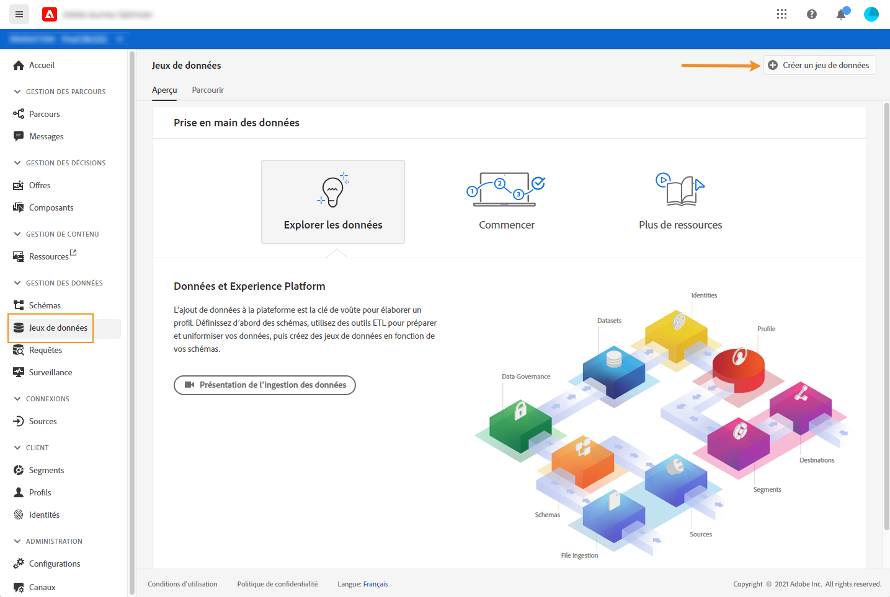
1. Choisissez **[!UICONTROL Créer un jeu de données à partir d’un schéma]**.
   
1. Sélectionnez le schéma créé précédemment, puis cliquez sur **[!UICONTROL Suivant]**.
   
1. Choisissez un nom, puis cliquez sur **[!UICONTROL Terminer]**.
   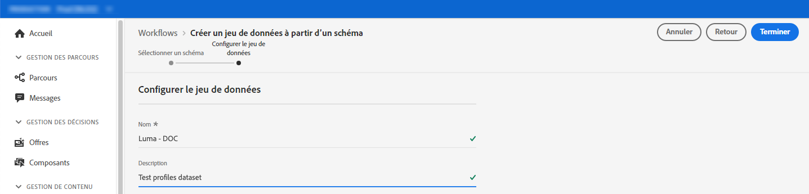
1. Activez l’option **[!UICONTROL Profil]**.
   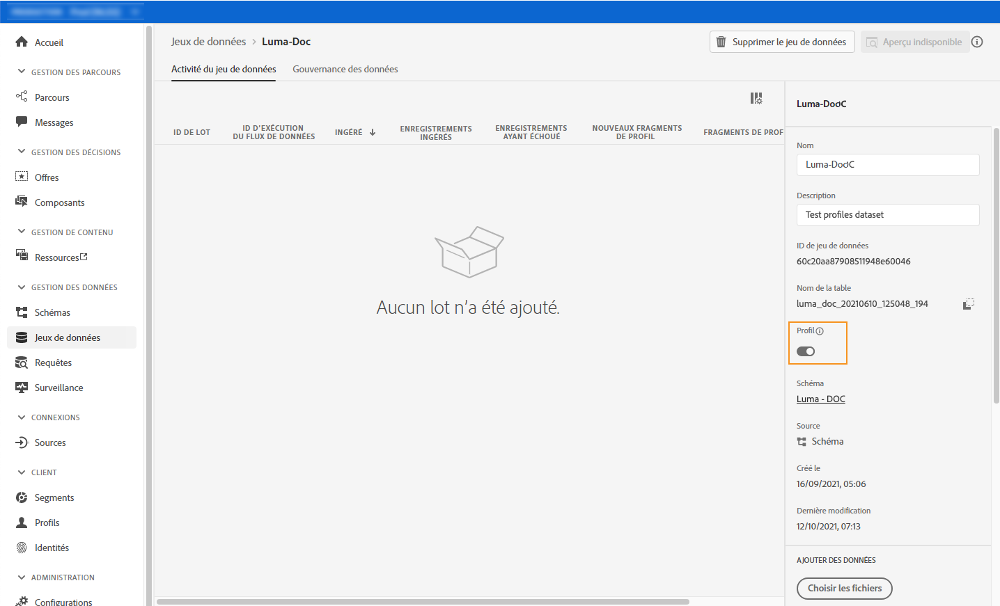

>[!NOTE]
>
> Pour plus d’informations sur la création de jeux de données, consultez la [documentation du service de catalogue](https://experienceleague.adobe.com/docs/experience-platform/catalog/datasets/user-guide.html?lang=fr#getting-started).

## Cas d’utilisation interne au produit{#use-case-1}

Depuis la page d’accueil de Adobe Journey Optimizer, vous pouvez exploiter le cas d’utilisation des profils de test intégrés au produit. Ce cas pratique facilite la création de profils de test utilisés pour les parcours de test avant la publication.


Cliquez sur le bouton **[!UICONTROL Commencer]** pour lancer le cas d’utilisation.

Les informations suivantes sont requises :

1. **Espace de noms** d’identité : L’espace de  [noms ](https://experienceleague.adobe.com/docs/experience-platform/identity/namespaces.html) d’identité utilisé pour identifier de manière unique les profils de test. Par exemple, si le courrier électronique est utilisé pour identifier les profils de test, l’espace de noms d’identité **Email** doit être sélectionné. Si l’identifiant unique est le numéro de téléphone, l’espace de noms d’identité **Phone** doit être sélectionné.

2. **Fichier** CSV : Fichier séparé par des virgules contenant la liste des profils de test à créer. Le cas d’utilisation exige un format prédéfini pour le fichier CSV contenant la liste des profils de test à créer. Chaque ligne du fichier doit inclure les champs suivants dans l’ordre correct :

   1. **ID de personne** : Identifiant unique du profil de test. Les valeurs de ce champ doivent refléter l’espace de noms d’identité sélectionné. (Par exemple, si **Téléphone** est sélectionné pour l’espace de noms d’identité, les valeurs de ce champ doivent être des numéros de téléphone. De même, si **Email** est sélectionné, les valeurs de ce champ doivent être Emails.)
   1. **Email** : Testez l’adresse électronique du profil. (Le champ **ID de personne** et le champ **Email** peuvent potentiellement contenir les mêmes valeurs si **Email** est sélectionné comme espace de noms d’identité)
   1. **Prénom** : Tester le prénom du profil.
   1. **Nom** : Nom du profil de test.
   1. **Ville** : Test de la ville de résidence du profil
   1. **Pays** : Test du pays de résidence du profil
   1. **Genre** : Testez le genre du profil. Les valeurs disponibles sont **male**, **femelle** et **non_spécifiée**

Après avoir sélectionné l’espace de noms d’identité et fourni le fichier CSV en fonction du format ci-dessus, cliquez sur le bouton **[!UICONTROL Exécuter]** en haut à droite. Le cas d’utilisation peut prendre quelques minutes. Une fois le cas d’utilisation terminé le traitement et la création des profils de test, une notification est envoyée à l’utilisateur.

>[!NOTE]
>
>Les profils de test peuvent remplacer les profils existants. Avant d’exécuter le cas d’utilisation, assurez-vous que le fichier CSV contient uniquement des profils de test et qu’il est exécuté sur le bon environnement de test.

## Transformer un profil en profil de test{#turning-profile-into-test}

Vous pouvez transformer un profil existant en profil de test : vous pouvez mettre à jour les attributs de profil de la même manière que lorsque vous créez un profil.

Pour ce faire, il suffit d’utiliser une activité d’action **[!UICONTROL Mettre à jour le profil]** dans un parcours et de remplacer le champ booléen testProfile par true.

Votre parcours sera composé d’un **[!UICONTROL segment de lecture]** et d’une activité **[!UICONTROL Mettre à jour le profil]**. Vous devez d’abord créer un segment ciblant les profils que vous souhaitez transformer en profils de test.

>[!NOTE]
>
> Puisque vous allez mettre à jour le champ **testProfile**, les profils sélectionnés doivent inclure ce champ. Le schéma associé doit comporter le groupe de champs **Détails du test de profil** . Consultez [cette section](../building-journeys/creating-test-profiles.md#test-profiles-prerequisites).

1. Accédez à **Segments**, puis **Créer un segment**, en haut à droite.
   
1. Définissez un nom pour votre segment et créez le segment : choisissez le ou les champs et la ou les valeurs pour cibler les profils de votre choix.
   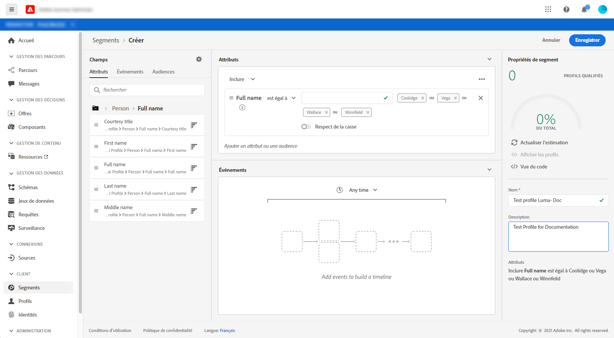
1. Cliquez sur **Enregistrer** et vérifiez que les profils sont correctement ciblés par le segment.
   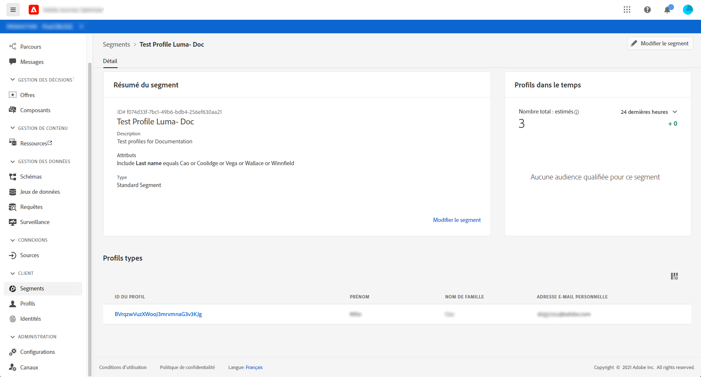

   >[!NOTE]
   >
   > Le calcul des segments peut prendre un certain temps. En savoir plus sur les segments dans [cette section](../segment/about-segments.md).

1. Créez maintenant un parcours et commencez par une activité d’orchestration **[!UICONTROL Lecture de segment]** .
1. Sélectionnez le segment créé précédemment et l’espace de noms utilisé par vos profils.
   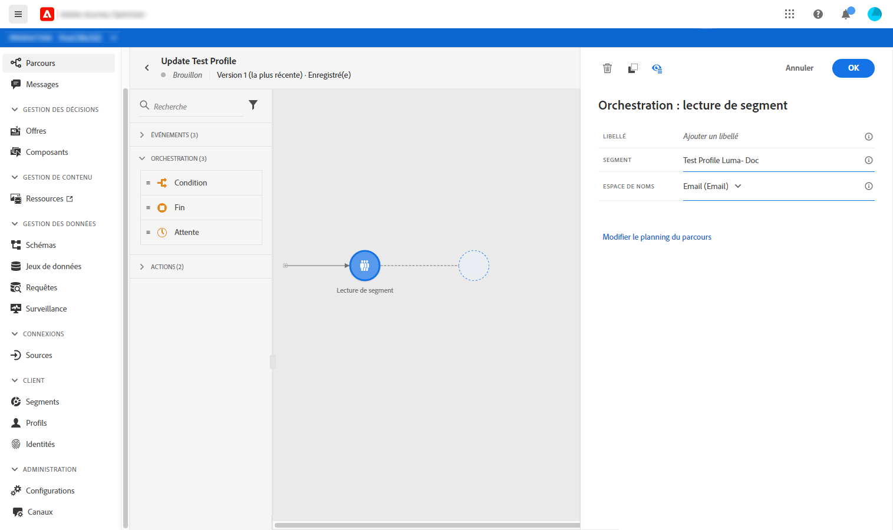
1. Ajoutez une activité d’action **[!UICONTROL Mettre à jour le profil]** .
1. Sélectionnez le schéma, le champ **testProfiles**, le jeu de données et définissez la valeur sur **True**. Pour ce faire, dans le champ **[!UICONTROL VALUE]** , cliquez sur l&#39;icône **Pen** à droite, sélectionnez **[!UICONTROL Mode avancé]** et saisissez **true**.
   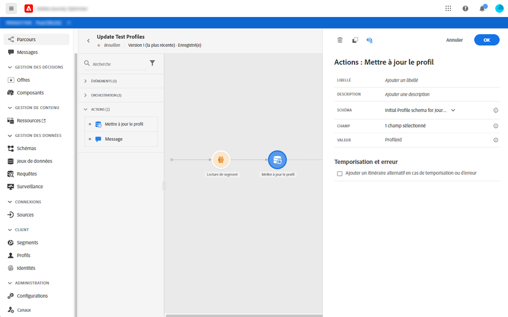
1. Ajoutez une activité **Fin** et cliquez sur **[!UICONTROL Publier]**.
1. Dans la section **[!UICONTROL Segments]** , vérifiez que les profils ont été correctement mis à jour.
   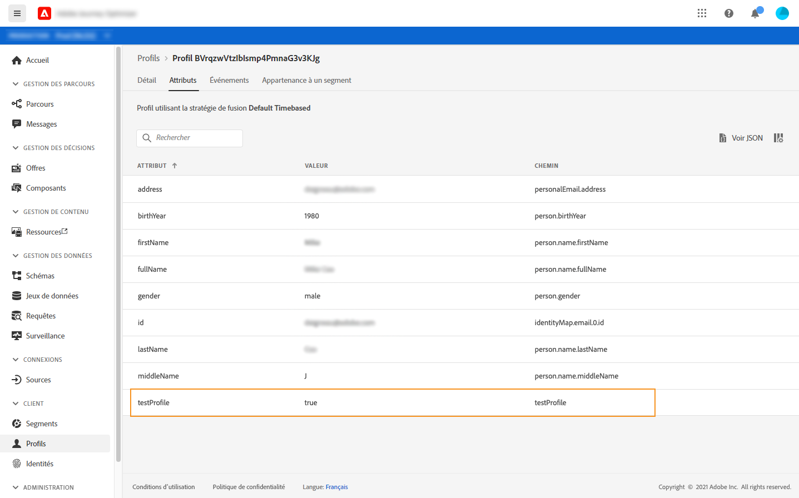

   >[!NOTE]
   >
   > Pour plus d’informations sur l’activité **[!UICONTROL Mettre à jour le profil]**, consultez [cette section](../building-journeys/update-profiles.md).

## Création d’un profil de test à l’aide d’un fichier csv{#create-test-profiles-csv}

Dans Adobe Experience Platform, vous pouvez créer des profils en téléchargeant un fichier CSV contenant les différents champs de profil dans votre jeu de données. Cette méthode est la plus simple.

1. Créez un fichier CSV simple à l’aide d’un tableur.
1. Ajoutez une colonne pour chaque champ nécessaire. Assurez-vous d’ajouter le champ de l’identité principale (« personID » dans l’exemple ci-dessus) et le champ « testProfile » défini sur « true ».
   
1. Ajoutez une ligne par profil et remplissez les valeurs de chaque champ.
   
1. Enregistrez la feuille de calcul au format CSV. Assurez-vous que les virgules sont utilisées comme séparateurs.
1. Accédez à Adobe Experience Platform **Workflows**.
   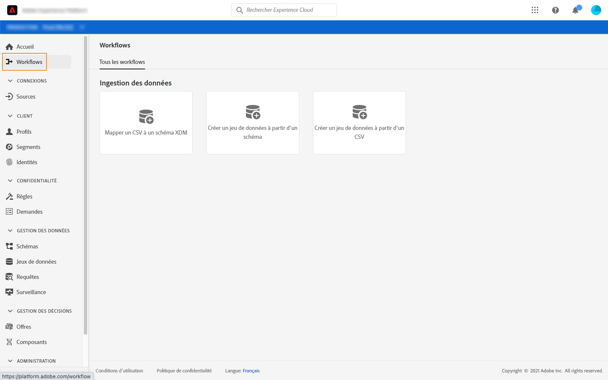
1. Sélectionnez **Mapper un CSV à un schéma XDM**, puis cliquez sur **Lancer**.
   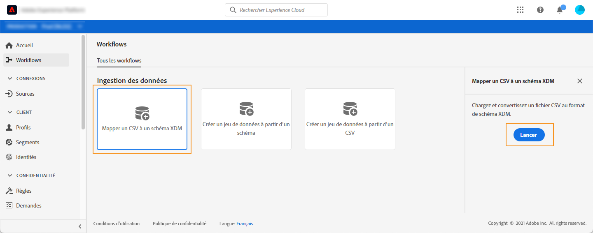
1. Sélectionnez le jeu de données dans lequel vous souhaitez importer les profils. Cliquez sur **Suivant**.
   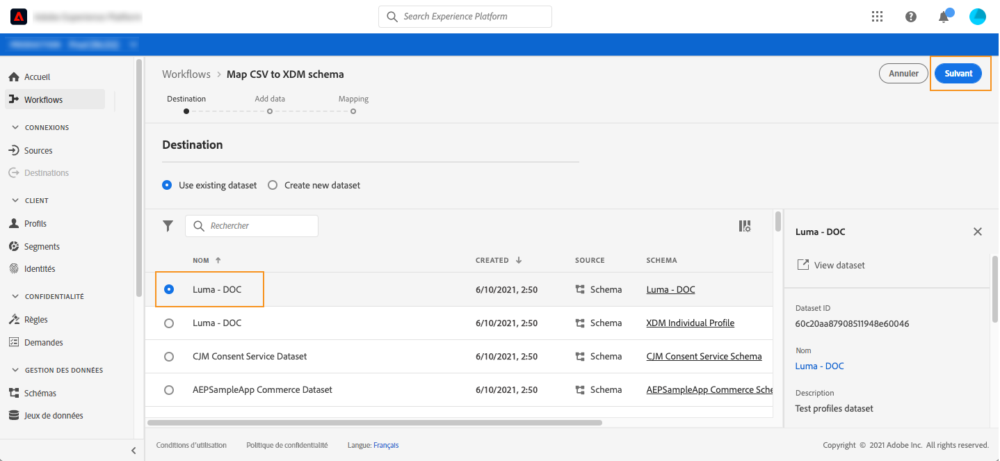
1. Cliquez sur **Choisir les fichiers** et sélectionnez votre fichier CSV. Une fois le fichier téléchargé, cliquez sur **Suivant**.
   
1. Mappez les champs CSV source aux champs du schéma, puis cliquez sur **Terminer**.
   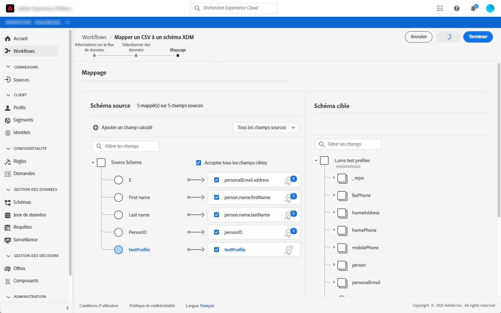
1. L’import de données démarre. Le statut passe de **Traitement** à **Succès**. Cliquez sur **Prévisualiser le jeu de données**, en haut à droite.
   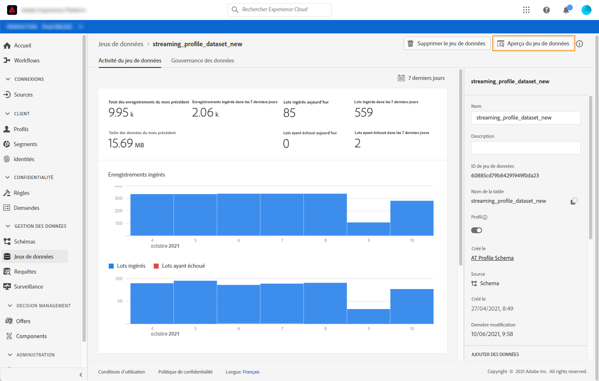
1. Vérifiez que les profils de test ont été correctement ajoutés.
   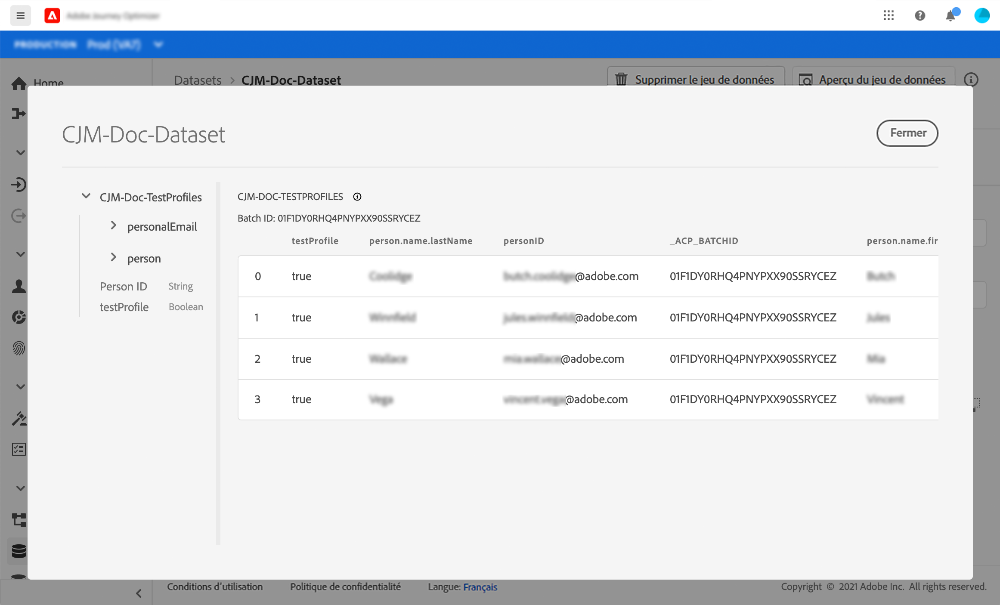

Vos profils de test sont ajoutés et peuvent désormais être utilisés lors du test d’un parcours. Reportez-vous à [cette section](../building-journeys/testing-the-journey.md).
>[!NOTE]
>
> Pour plus d’informations sur les imports de fichiers CSV, consultez la [documentation sur l’ingestion de données](https://experienceleague.adobe.com/docs/experience-platform/ingestion/tutorials/map-a-csv-file.html?lang=fr#tutorials).

## Créer des profils de test à l’aide des appels API{#create-test-profiles-api}

Vous pouvez également créer des profils de test au moyen d’appels d’API. En savoir plus sur cette [page](https://experienceleague.adobe.com/docs/experience-platform/profile/home.html).

Vous devez utiliser un schéma de profil qui contient le groupe de champs &quot;Détails du test de profil&quot;. L’indicateur testProfile fait partie de ce groupe de champs.
Lors de la création d’un profil, veillez à transmettre la valeur : testProfile = true.

Veuillez noter que vous pouvez également mettre à jour un profil existant pour remplacer son indicateur testProfile par « true ».

Voici un exemple d’appel API pour créer un profil de test :

```
curl -X POST \
'https://dcs.adobedc.net/collection/xxxxxxxxxxxxxx' \
-H 'Cache-Control: no-cache' \
-H 'Content-Type: application/json' \
-H 'Postman-Token: xxxxx' \
-H 'cache-control: no-cache' \
-H 'x-api-key: xxxxx' \
-H 'x-gw-ims-org-id: xxxxx' \
-d '{
"header": {
"msgType": "xdmEntityCreate",
"msgId": "xxxxx",
"msgVersion": "xxxxx",
"xactionid":"xxxxx",
"datasetId": "xxxxx",
"imsOrgId": "xxxxx",
"source": {
"name": "Postman"
},
"schemaRef": {
"id": "https://example.adobe.com/mobile/schemas/xxxxx",
"contentType": "application/vnd.adobe.xed-full+json;version=1"
}
},
"body": {
"xdmMeta": {
"schemaRef": {
"contentType": "application/vnd.adobe.xed-full+json;version=1"
}
},
"xdmEntity": {
"_id": "xxxxx",
"_mobile":{
"ECID": "xxxxx"
},
"testProfile":true
}
}
}'
```
