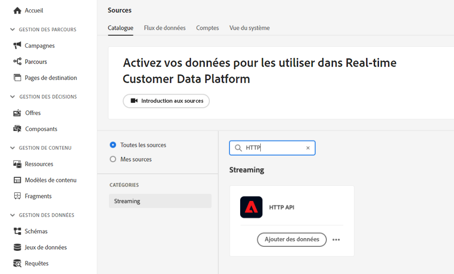
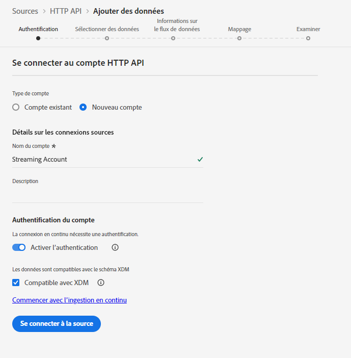
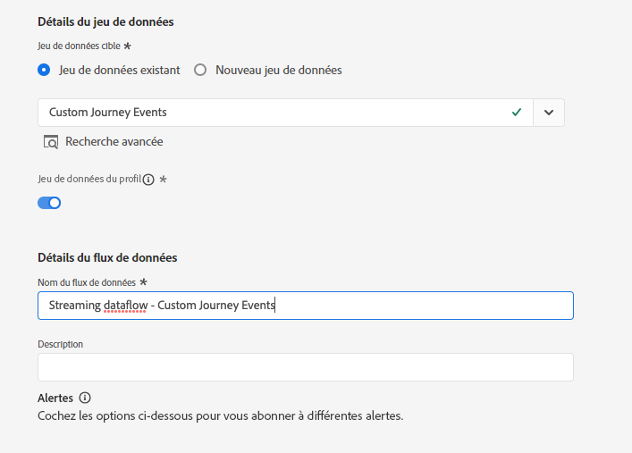
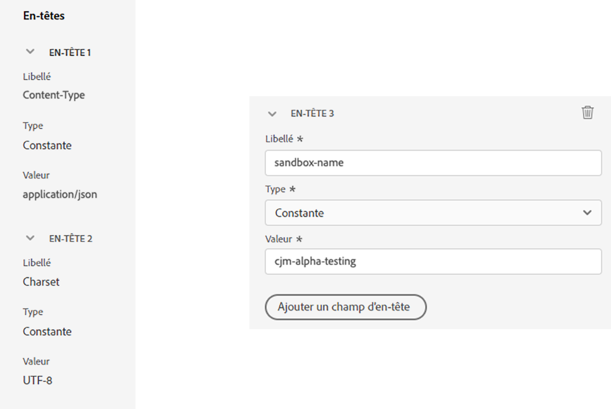
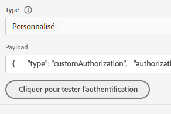
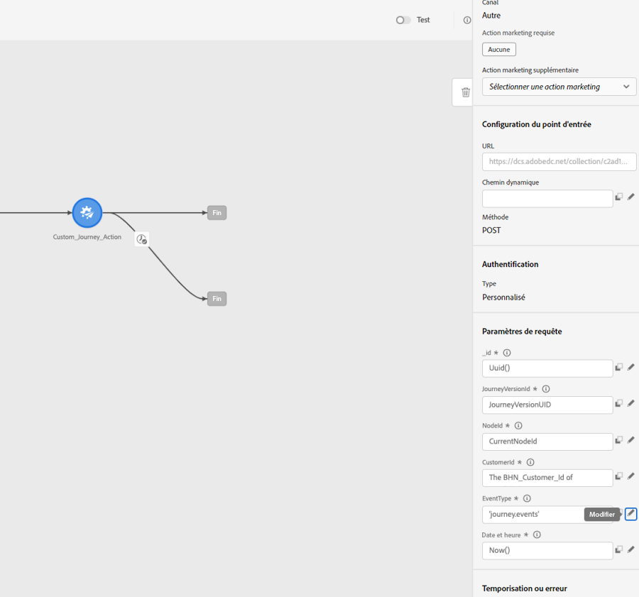

# Utiliser des actions personnalisées pour écrire des événements de parcours dans Experience Platform {#custom-action-aep}

Ce cas d’utilisation explique comment écrire des événements personnalisés dans Adobe Experience Platform à partir de parcours à l’aide d’actions personnalisées et d’appels authentifiés.

## Configurer un projet de développement {#custom-action-aep-IO}

1. Dans Adobe Developer Console, cliquez sur **Projet** et ouvrez votre projet IO.

1. Dans la section **Informations d’identification**, cliquez sur **OAuth de serveur à serveur**.

   

1. Cliquez sur **Afficher la commande cURL**.

   

1. Copiez la commande cURL et stockez les éléments client_id, client_secret, grant_type et scope.

```
curl -X POST 'https://ims-na1.adobelogin.com/ims/token/v3' -H 'Content-Type: application/x-www-form-urlencoded' -d 'grant_type=client_credentials&client_id=1234&client_secret=5678&scope=openid,AdobeID,read_organizations,additional_info.projectedProductContext,session'
```

>[!CAUTION]
>
>Après avoir créé votre projet sur Adobe Developer Console, assurez vous d’accorder aux développeurs et développeuses et aux API le contrôle d’accès avec les autorisations appropriées. Pour en savoir plus, consultez la [documentation Adobe Experience Platform](https://experienceleague.adobe.com/fr/docs/experience-platform/landing/platform-apis/api-authentication#grant-developer-and-api-access-control){target="_blank"}.

## Configurer la source à l’aide de l’inlet d’API HTTP

1. Créez un point d’entrée dans Adobe Experience Platform pour écrire les données de parcours.

1. Dans Adobe Experience Platform, cliquez sur **Sources** sous **Connexions** dans le menu de gauche. Sous **API HTTP**, cliquez sur **Ajouter des données**.

   

1. Sélectionnez **Nouveau compte** et activez l’authentification. Sélectionnez **Se connecter à la source**.

   

1. Cliquez sur **Suivant** et sélectionnez le jeu de données dans lequel vous souhaitez écrire les données. Cliquez sur **Suivant** et **Terminer**.

   

1. Ouvrez le flux de données nouvellement créé. Copiez la payload du schéma et enregistrez-la dans votre notepad.

```
{
"header": {
"schemaRef": {
"id": "https://ns.adobe.com/<your_org>/schemas/<schema_id>",
"contentType": "application/vnd.adobe.xed-full+json;version=1.0"
},
"imsOrgId": "<org_id>",
"datasetId": "<dataset_id>",
"source": {
"name": "Custom Journey Events"
}
},
"body": {
"xdmMeta": {
"schemaRef": {
"id": "https://ns.adobe.com/<your_org>/schemas/<schema_id>",
"contentType": "application/vnd.adobe.xed-full+json;version=1.0"
}
},
"xdmEntity": {
"_id": "test1",
"<your_org>": {
"journeyVersionId": "",
"nodeId": "", "customer_Id":""
},
"eventMergeId": "",
"eventType": "",
"producedBy": "self",
"timestamp": "2018-11-12T20:20:39+00:00"
}
}
}
```

## Configurer l’action personnalisée {#custom-action-config}

La configuration des actions personnalisées est présentée sur [cette page](../action/about-custom-action-configuration.md).

Pour cet exemple, procédez comme suit :

1. Ouvrez Adobe Journey Optimizer, puis cliquez sur **Configurations**, sous **Administration** dans le menu de gauche. Sous **Actions**, cliquez sur **Gérer** et sur **Créer une action**.

1. Définissez l’URL et sélectionnez la méthode POST.

   `https://dcs.adobedc.net/collection/<collection_id>?syncValidation=false`

1. Assurez-vous que les en-têtes (Content-Type, Charset, sandbox-name) sont configurés.

   

### Configurer l’authentification {#custom-action-aep-authentication}

1. Sélectionnez le **Type** **Personnalisé** avec la payload suivante.

1. Collez les éléments client_secret, client_id, scope et grant_type (à partir de la payload du projet IO utilisée précédemment).

   ```
   {
   "type": "customAuthorization",
   "authorizationType": "Bearer",
   "endpoint": "https://ims-na1.adobelogin.com/ims/token/v3",
   "method": "POST",
   "headers": {},
   "body": {
   "bodyType": "form",
   "bodyParams": {
   "grant_type": "client_credentials",
   "client_secret": "********",
   "client_id": "<client_id>",
   "scope": "openid,AdobeID,read_organizations,additional_info.projectedProductContext,session"
   }
   },
   "tokenInResponse": "json://access_token",
   "cacheDuration": {
   "duration": 28000,
   "timeUnit": "seconds"
   }
   }
   ```

1. Utilisez le bouton **Cliquer pour tester l’authentification** pour tester la connexion.

   

### Configurer la payload {#custom-action-aep-payload}

1. Dans les champs **Requête** et **Réponse**, collez la payload de la connexion source utilisée auparavant.

   ```
   {
   "xdmMeta": {
   "schemaRef": {
   "id": "https://ns.adobe.com/<your_org>/schemas/<schema_id>",
   "contentType": "application/vnd.adobe.xed-full+json;version=1.0"
   }
   },
   "xdmEntity": {
   "_id": "/uri-reference",
   "<your_org>": {
   "journeyVersionId": "Sample value",
   "nodeId": "Sample value",
   "customer_Id":""
   },
   "eventMergeId": "Sample value",
   "eventType": "advertising.completes,
   "producedBy": "self",
   "timestamp": "2018-11-12T20:20:39+00:00"
   }
   }
   ```

1. Modifiez la configuration du champ de **Constant** à **Variable** pour les champs qui seront renseignés dynamiquement.

1. Enregistrez l’action personnalisée.

## Parcours

1. Enfin, utilisez cette action personnalisée dans un parcours pour écrire les événements de parcours personnalisés.

1. Renseignez l’ID de version du parcours, l’ID de nœud, le nom du nœud et d’autres attributs en fonction de votre cas d’utilisation.

   
