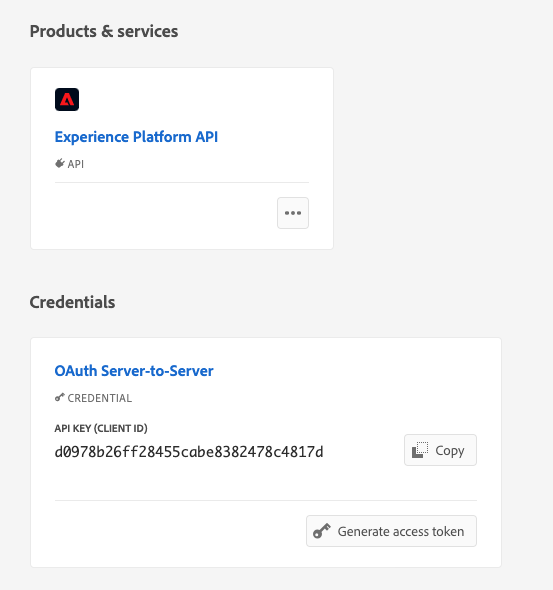
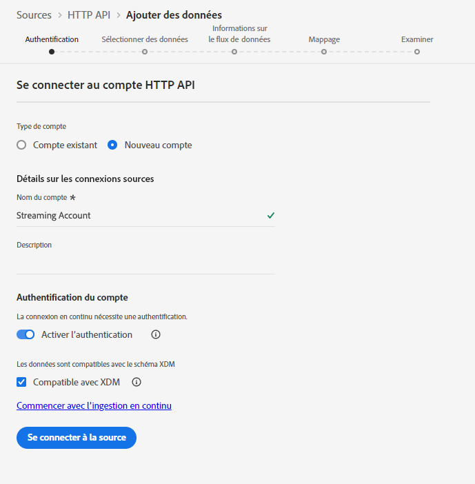
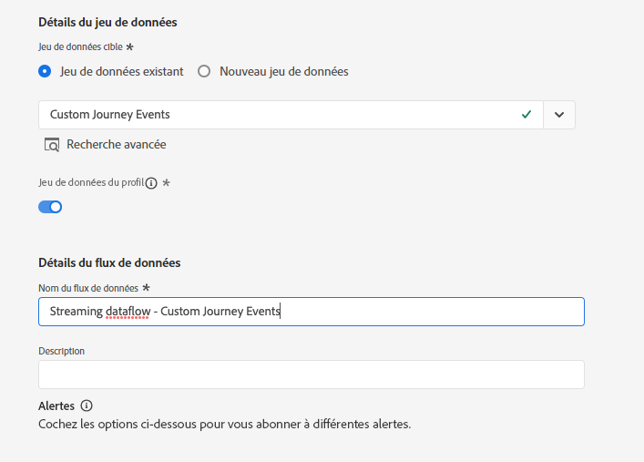
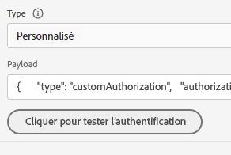

# Utiliser des actions personnalisées pour écrire des événements de parcours dans Experience Platform {#custom-action-aep}

>[!BEGINSHADEBOX]

**Sur cette page :** Découvrez comment écrire des événements de parcours personnalisés dans Adobe Experience Platform à partir de vos parcours à l’aide d’actions personnalisées et d’appels d’API authentifiés.

>[!ENDSHADEBOX]

Ce cas d’utilisation explique comment écrire des événements personnalisés dans des [!DNL Adobe Experience Platform] à partir de Parcours à l’aide d’actions personnalisées et d’appels authentifiés.

## Configurer un projet de développement {#custom-action-aep-IO}

1. Dans Adobe Developer Console, cliquez sur **Projet** et ouvrez votre projet IO.

1. Dans la section **Informations d’identification**, cliquez sur **OAuth de serveur à serveur**.

   

1. Cliquez sur **Afficher la commande cURL**.

   ![[!DNL Adobe Experience Platform] la sélection du type d’action](assets/custom-action-aep-2.png)

1. Copiez la commande cURL et stockez les éléments client_id, client_secret, grant_type et scope.

```
curl -X POST 'https://ims-na1.adobelogin.com/ims/token/v3' -H 'Content-Type: application/x-www-form-urlencoded' -d 'grant_type=client_credentials&client_id=1234&client_secret=5678&scope=openid,AdobeID,read_organizations,additional_info.projectedProductContext,session'
```

>[!CAUTION]
>
>Après avoir créé votre projet sur Adobe Developer Console, assurez vous d’accorder aux développeurs et développeuses et aux API le contrôle d’accès avec les autorisations appropriées. En savoir plus dans la [[!DNL Adobe Experience Platform] documentation](https://experienceleague.adobe.com/fr/docs/experience-platform/landing/platform-apis/api-authentication#grant-developer-and-api-access-control){target="_blank"}

## Configurer la source à l’aide de l’inlet d’API HTTP

1. Créez un point d’entrée dans [!DNL Adobe Experience Platform] pour écrire les données à partir de parcours.

1. Dans [!DNL Adobe Experience Platform], cliquez sur **Sources**, sous **Connexions** dans le menu de gauche. Sous **API HTTP**, cliquez sur **Ajouter des données**.

   ![Liste déroulante de sélection de sandbox pour [!DNL Adobe Experience Platform]](assets/custom-action-aep-3.png)

1. Sélectionnez **Nouveau compte** et activez l’authentification. Sélectionnez **Se connecter à la source**.

   

1. Cliquez sur **Suivant** et sélectionnez le jeu de données dans lequel vous souhaitez écrire les données. Cliquez sur **Suivant** et **Terminer**.

   

1. Ouvrez le flux de données nouvellement créé. Copiez la payload du schéma et enregistrez-la dans votre notepad.

```
{
"header": {
"schemaRef": {
"id": "https://ns.adobe.com/<your_org>/schemas/<schema_id>",
"contentType": "application/vnd.adobe.xed-full+json;version=1.0"
},
"imsOrgId": "<org_id>",
"datasetId": "<dataset_id>",
"source": {
"name": "Custom Journey Events"
}
},
"body": {
"xdmMeta": {
"schemaRef": {
"id": "https://ns.adobe.com/<your_org>/schemas/<schema_id>",
"contentType": "application/vnd.adobe.xed-full+json;version=1.0"
}
},
"xdmEntity": {
"_id": "test1",
"<your_org>": {
"journeyVersionId": "",
"nodeId": "", "customer_Id":""
},
"eventMergeId": "",
"eventType": "",
"producedBy": "self",
"timestamp": "2018-11-12T20:20:39+00:00"
}
}
}
```

## Configurer l’action personnalisée {#custom-action-config}

La configuration des actions personnalisées est présentée sur [cette page](../action/about-custom-action-configuration.md).

Pour cet exemple, procédez comme suit :

1. Ouvrez [!DNL Adobe Journey Optimizer] et cliquez sur **Configurations**, sous **Administration** dans le menu de gauche. Sous **Actions**, cliquez sur **Gérer** et sur **Créer une action**.

1. Définissez l’URL et sélectionnez la méthode POST.

   `https://dcs.adobedc.net/collection/<collection_id>?syncValidation=false`

1. Assurez-vous que les en-têtes (Content-Type, Charset, sandbox-name) sont configurés.

   

### Configurer l’authentification {#custom-action-aep-authentication}

1. Sélectionnez le **Type** **Personnalisé** avec la payload suivante.

1. Collez les éléments client_secret, client_id, scope et grant_type (à partir de la payload du projet IO utilisée précédemment).

   ```
   {
   "type": "customAuthorization",
   "authorizationType": "Bearer",
   "endpoint": "https://ims-na1.adobelogin.com/ims/token/v3",
   "method": "POST",
   "headers": {},
   "body": {
   "bodyType": "form",
   "bodyParams": {
   "grant_type": "client_credentials",
   "client_secret": "********",
   "client_id": "<client_id>",
   "scope": "openid,AdobeID,read_organizations,additional_info.projectedProductContext,session"
   }
   },
   "tokenInResponse": "json://access_token",
   "cacheDuration": {
   "duration": 28000,
   "timeUnit": "seconds"
   }
   }
   ```

1. Utilisez le bouton **Cliquer pour tester l’authentification** pour tester la connexion.

   

### Configurer la payload {#custom-action-aep-payload}

1. Dans les champs **Requête** et **Réponse**, collez la payload de la connexion source utilisée auparavant.

   ```
   {
   "xdmMeta": {
   "schemaRef": {
   "id": "https://ns.adobe.com/<your_org>/schemas/<schema_id>",
   "contentType": "application/vnd.adobe.xed-full+json;version=1.0"
   }
   },
   "xdmEntity": {
   "_id": "/uri-reference",
   "<your_org>": {
   "journeyVersionId": "Sample value",
   "nodeId": "Sample value",
   "customer_Id":""
   },
   "eventMergeId": "Sample value",
   "eventType": "advertising.completes,
   "producedBy": "self",
   "timestamp": "2018-11-12T20:20:39+00:00"
   }
   }
   ```

1. Modifiez la configuration du champ de **Constant** à **Variable** pour les champs qui seront renseignés dynamiquement.

1. Enregistrez l’action personnalisée.

## Parcours

1. Enfin, utilisez cette action personnalisée dans un parcours pour écrire les événements de parcours personnalisés.

1. Renseignez l’ID de version du parcours, l’ID de nœud, le nom du nœud et d’autres attributs en fonction de votre cas d’utilisation.

   

+++ Référence des connaissances sur l’IA

Cette section contient des connaissances structurées destinées à soutenir l’interprétation, la récupération et la réponse aux questions liées à ce sujet.

Pour une compréhension totale, ces informations doivent être combinées avec la documentation de cette page. Aucune des sources n’est conçue pour être autonome. La page décrit la fonctionnalité, tandis que cette section fournit un contexte supplémentaire qui permet de clarifier la terminologie, l’intention, l’applicabilité et les contraintes.

- **TL;DR:** Ce cas pratique explique comment configurer une action personnalisée dans Journey Optimizer qui écrit des données d’événement de parcours dans Adobe Experience Platform à l’aide d’une entrée d’API HTTP et d’appels authentifiés OAuth de serveur à serveur.

**Intentions:**
- Configuration d’un projet Adobe Developer Console IO avec des informations d’identification de serveur à serveur OAuth pour l’authentification de l’API AEP
- Créez une source d’entrée d’API HTTP dans Adobe Experience Platform pour recevoir des données d’événement de parcours en flux continu
- Configurez une action personnalisée dans Journey Optimizer avec l’URL appropriée, les en-têtes et l’authentification personnalisée par jeton porteur
- Mappez dynamiquement les champs de parcours (ID de version de parcours, ID de nœud et ID de client) en tant que variables dans la payload de l’action personnalisée
- Utiliser l’action personnalisée dans un parcours pour écrire des événements personnalisés dans un jeu de données AEP

**Glossaire:**
- **Entrée d’API HTTP** : connecteur source Adobe Experience Platform qui crée un point d’entrée de diffusion en continu pour ingérer des données via des requêtes HTTP POST *(spécifique au produit)*
- **OAuth de serveur à serveur** : type d’informations d’authentification dans Adobe Developer Console qui génère des jetons porteur pour les appels API de serveur à serveur sans interaction utilisateur *(spécifique au produit)*
- **Autorisation personnalisée** : type d’authentification d’action personnalisée Journey Optimizer qui récupère un jeton porteur à partir d’un point d’entrée spécifié et le met en cache pendant une durée configurée *(spécifique au produit)*
- **Entité XDM** : structure de la payload des données conforme au schéma du modèle de données d’expérience, utilisée comme corps lors de l’écriture d’événements dans AEP via le *d’entrée de l’API HTTP (spécifique au produit)*
- **cacheDuration** : paramètre de cache de jeton dans la configuration d’autorisation personnalisée qui contrôle la durée pendant laquelle le jeton porteur récupéré est réutilisé avant qu’un nouveau jeton soit demandé *(spécifique au produit)*

**Mécanismes de sécurisation :**
- Après la création du projet Adobe Developer Console, les autorisations de contrôle d’accès des développeurs et des API doivent être explicitement accordées pour que les informations d’identification puissent être utilisées
- La source d’entrée de l’API HTTP doit être créée avec l’authentification activée ; l’URL du point d’entrée de connexion et la payload du schéma doivent être copiées et stockées pour être utilisées dans la configuration de l’action personnalisée
- Les en-têtes d’action personnalisés doivent inclure Content-Type, Charset et sandbox-name.
- Les champs destinés à être renseignés dynamiquement au moment de l’exécution doivent être modifiés de Constant en Variable dans la configuration de la payload de l’action personnalisée

**Terminologie:**
- Nom canonique : Action personnalisée — Acronyme : none — variantes : configuration d’action personnalisée, action personnalisée Journey Optimizer
- Nom canonique : Adobe Experience Platform — Acronyme : AEP — variantes : Experience Platform, Platform
- Synonymes : « Inlet API HTTP » = « point d’entrée de diffusion en continu » = « point d’entrée de collection DCS »
- Ne pas confondre : « OAuth serveur à serveur » ≠ « Authentification de l’utilisateur OAuth » (serveur à serveur ne nécessite pas de connexion utilisateur ; il utilise les informations d’identification client)

**FAQ:**
- **Q : Quel type d’authentification est utilisé pour appeler l’entrée d’API HTTP AEP à partir d’une action personnalisée Journey Optimizer ?** — Authentification du jeton porteur personnalisé à l’aide des informations d’identification de client serveur à serveur OAuth récupérées à partir du point d’entrée du jeton Adobe IMS.
- **Q : Où puis-je trouver les valeurs client_id, client_secret, grant_type et scope ?** — Dans la section Informations d&#39;identification de serveur à serveur OAuth de votre projet Adobe Developer Console IO, cliquez sur Afficher la commande cURL.
- **Q : Comment rendre dynamiques les champs spécifiques au parcours (par exemple, journeyVersionId, nodeId) dans la payload ?** — Remplacez leur configuration de champ Constante par Variable dans la configuration de la payload de l’action personnalisée afin qu’ils soient renseignés à partir du contexte du parcours au moment de l’exécution.
- **Q : Quelles autorisations sont requises pour le projet Adobe Developer Console ?** — Le contrôle d’accès du développeur et de l’API doit être accordé avec les autorisations appropriées après la création du projet, comme décrit dans la documentation sur l’authentification de l’API AEP.
- **Q : Quel est l’objectif du paramètre cacheDuration dans la payload d’authentification ?** — Contrôle la durée pendant laquelle le jeton porteur récupéré est mis en cache et réutilisé (28 000 secondes dans l’exemple) avant que l’action personnalisée ne demande un nouveau jeton.

+++
