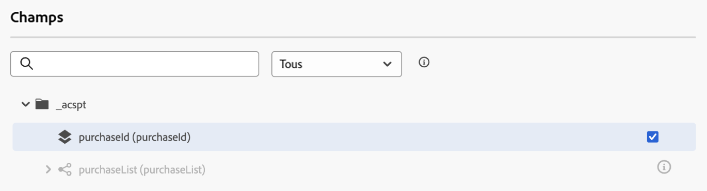
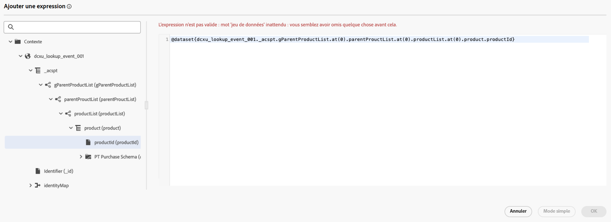

# Utiliser les données [!DNL Adobe Experience Platform] dans les parcours {#datalookup}

>[!CONTEXTUALHELP]
>id="ajo_journey_dataset_lookup"
>title="Activité de recherche de jeu de données"
>abstract="L’activité **[!UICONTROL Recherche de jeu de données]** vous permet de récupérer dynamiquement des données de jeux de données d’enregistrement [!DNL Adobe Experience Platform] au moment de l’exécution. Grâce à cette fonctionnalité, vous pouvez accéder à des données qui peuvent ne pas figurer dans la payload de profil ou d’événement, ce qui garantit des interactions clients pertinentes et au moment opportun."

L’activité **[!UICONTROL Recherche de jeu de données]** vous permet de récupérer dynamiquement des données de jeux de données d’enregistrement [!DNL Adobe Experience Platform] au moment de l’exécution. Grâce à cette fonctionnalité, vous pouvez accéder à des données qui peuvent ne pas figurer dans la payload de profil ou d’événement, ce qui garantit des interactions clients pertinentes et au moment opportun.

Avantages clés :

* **Personnalisation en temps réel** : personnalisez les expériences client à l’aide de données enrichies.
* **Prise de décision dynamique** : utilisez des données externes pour orienter la logique et les actions du parcours.
* **Accès aux données amélioré** : récupérez les métadonnées des produits, les tables de tarification ou les données relationnelles liées à des clés spécifiques.

>[!AVAILABILITY]
>
>Cette activité est disponible uniquement pour un ensemble d’organisations (disponibilité limitée). Pour en bénéficier, contactez votre représentant ou représentante Adobe.

## À lire absolument {#must-read}

Examinez ces exigences avant de configurer les recherches de jeux de données.

### Activation du jeu de données

Le jeu de données doit être activé pour la recherche dans [!DNL Adobe Experience Platform]. Vous trouverez des informations détaillées dans cette section : [Utiliser [!DNL Adobe Experience Platform] données](../data/lookup-aep-data.md).

### Limites et restrictions

* Maximum de 10 activités de recherche de jeu de données par parcours.
* 20 champs sélectionnés maximum.
* Maximum de 50 clés dans le tableau des clés de recherche.
* La taille des données enrichies est limitée à 10 Ko.

### Considérations supplémentaires relatives aux performances

Les recommandations ci-dessous visent à éviter les retards dans la délivrabilité :

| Considération | Limite recommandée | Description |
| ------- | ------- | ------- |
| Attributs par recherche | Jusqu’à 20 | Nombre de champs de données récupérés par enregistrement dans une seule activité de recherche. |
| Activités de recherche | Jusqu’à 5 par parcours | Chaque parcours peut contenir jusqu’à 5 activités de recherche distinctes. Chaque recherche peut cibler un jeu de données différent. |

## Configurer l’activité de recherche de jeu de données {#configure}

Pour configurer l’activité **[!UICONTROL Recherche de jeu de données]**, procédez comme suit :

1. Développez la catégorie **[!UICONTROL Orchestration]** et déposez une activité **[!UICONTROL Recherche de jeu de données]** dans votre zone de travail.

   ![[!DNL Adobe Experience Platform] activité de recherche de jeu de données dans le parcours ](assets/aep-data-activity.png)

1. Ajoutez un libellé et une description.

1. Cliquez sur le champ **[!UICONTROL Jeu de données]**, puis sélectionnez le jeu de données avec les attributs dont vous avez besoin.

   >[!NOTE]
   >
   >Si le jeu de données que vous recherchez ne s’affiche pas dans la liste, assurez-vous de l’avoir activé pour la recherche. Pour plus d’informations, consultez la section [À lire absolument](#must-read).

1. Sélectionnez les champs spécifiques à récupérer dans le jeu de données.

   * Vous pouvez uniquement sélectionner des nœuds feuilles (champs au niveau le plus bas du schéma). Le champ doit être une valeur primitive (chaîne, nombre, valeur booléenne, date, etc.).

   * Les listes (tableaux) et les mappages (objets clé-valeur) ne peuvent pas être sélectionnés.

   +++Exemple

   

   +++

1. Dans le champ **[!UICONTROL Clé(s) de recherche]**, choisissez une clé de jointure qui existe à la fois dans les attributs d&#39;élément de décision et dans le jeu de données. Cette clé est utilisée par le système pour effectuer une recherche dans le jeu de données sélectionné.

   * Les clés peuvent être des expressions dérivées du contexte du parcours, telles que des SKU, des ID d’e-mail ou d’autres identifiants. Exemple : `@profile.email` ou `list(@event{purchase_event.products.sku})`.

   * Seules les **chaînes** ou les **listes de chaînes** sont prises en charge.

   +++Exemple

   

   +++

## Utiliser des données enrichies dans le parcours

Les données récupérées par l’activité **[!UICONTROL Recherche de jeu de données]** sont stockées dans le contexte du parcours sous la forme d’un tableau d’objets. Ces données sont disponibles dans l’éditeur d’expression de parcours et dans l’éditeur de personnalisation, ce qui permet d’activer la logique conditionnelle et la messagerie personnalisée en fonction des données enrichies.

* **Éditeur d’expression de parcours** :

  Accédez à l&#39;éditeur **[!UICONTROL Mode avancé]** et utilisez la syntaxe : `@datasetLookup{MyDatasetLookUpActivity1.entities}`. [Découvrez comment travailler avec l’éditeur d’expression avancé](../building-journeys/expression/expressionadvanced.md).

* **Éditeur de personnalisation** :

  Utilisez la syntaxe suivante : `{{context.journey.datasetLookup.1482319411.entities}}`.

>[!NOTE]
>
>Les données enrichies sont transitoires et disponibles uniquement pendant l’exécution du parcours et dans la personnalisation des activités sortantes (e-mail, notification push, SMS, etc.)

## Exemples de cas d’utilisation

+++Filtrage basé sur les catégories de produits

**Scénario**:Send : offrir un coupon aux utilisateurs et utilisatrices qui dépensent plus de 40 $ en produits ménagers.

**Flux du parcours** :

1. **Événement d’achat** : capturez les SKU à partir du panier de l’utilisateur ou de l’utilisatrice.

1. **Activité de recherche de jeu de données** :

   * Jeu de données : `products-dataset` (SKU comme clé primaire).
   * Clés de recherche : `list(@event{purchase_event.products.sku})`.
   * Champs à renvoyer : `["SKU", "category", "price"]`.

1. **Activité de condition** :

   * Filtrez les SKU dont la catégorie est « ménage ».

     ```
     @event{purchase_event.products.all( in(currentEventField.sku, @datasetlookup{MyDatasetLookupActivity1.entities.all(currentDatasetLookupField.category == 'household').sku} ) )} 
     ```

   OU

   * Additionnez les dépenses totales pour les produits ménagers et comparez-les au seuil de 40 $.

     ```
     sum(@event{purchase_event.products.all( in(currentEventField.sku, @datasetlookup{MyDatasetLookUpActivity1.entities.all(currentDatasetLookupField.category == 'household').sku} ) )}.price}, ',', true ) > 40
     ```

1. **Éditeur de personnalisation** :

   Utilisez les données enrichies pour personnaliser le contenu de l’e-mail :

   ```
   
   {{#each journey.datasetlookup.3709000.entities as |product|}}
   
   
   {{/each}}
   "Hi, thanks for spending " +  + " on household products. Here is your reward!"
   ```

+++

+++Personnalisation utilisant des données de fidélité externes

**Scénario** : identifier le compte de messagerie pour un profil dont le statut de fidélité est Platine. Dans ce scénario, le compte de fidélité est associé à un ID d’e-mail et les données de fidélité ne sont pas disponibles dans la boutique de recherche de profil standard.

**Flux du parcours** :

1. **Déclencheur d’événement de profil** : capturez les identifiants d’e-mail du contexte de profil ou d’événement.

1. **Activité de recherche de jeu de données** :
   * Jeu de données : `loyalty-member-dataset` (e-mail comme clé primaire).
   * Clés de recherche : `@profile.email`.
   * Champs à renvoyer : `["email", "loyaltyTier"]`.

1. **Activité de condition** :

   Divisez le parcours en fonction du niveau de fidélité :

   ```
   @datasetLookup{MyDatasetLookUpActivity1.entity.loyaltyMember.loyaltyTier} == 'Platinum'
   ```

1. **Éditeur de personnalisation** :

   Utilisez les données enrichies du niveau de fidélité pour personnaliser la communication sortante :

   ```
   {{context.journey.datasetLookup.1482319411.entity.loyaltyMember.loyaltyTier}}
   ```
