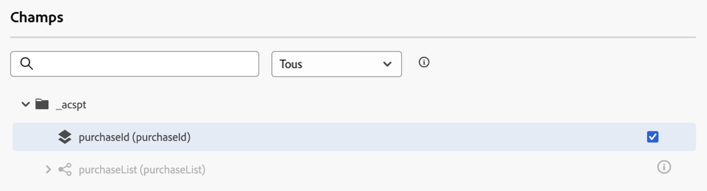
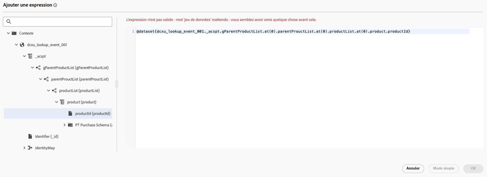

# Utiliser les données [!DNL Adobe Experience Platform] dans les parcours {#datalookup}

>[!BEGINSHADEBOX]

**Sur cette page :** Découvrez comment utiliser l’activité de recherche de jeu de données pour récupérer dynamiquement des données des jeux de données d’enregistrement Adobe Experience Platform au moment de l’exécution et enrichir vos parcours avec des données externes à des fins de personnalisation et de prise de décision.

>[!ENDSHADEBOX]

>[!CONTEXTUALHELP]
>id="ajo_journey_dataset_lookup"
>title="Activité de recherche de jeu de données"
>abstract="L’activité **[!UICONTROL Recherche de jeu de données]** vous permet de récupérer dynamiquement des données à partir de jeux de données d’enregistrement [!DNL Adobe Experience Platform] au moment de l’exécution. Grâce à cette fonctionnalité, vous avez accès à des données qui peuvent ne pas se trouver dans la payload de profil ou d’événement, ce qui garantit que vos interactions clients soient à la fois pertinentes et opportunes."

L’activité **[!UICONTROL Recherche de jeu de données]** vous permet de récupérer dynamiquement des données à partir de jeux de données d’enregistrement [!DNL Adobe Experience Platform] au moment de l’exécution. Grâce à cette fonctionnalité, vous avez accès à des données qui peuvent ne pas se trouver dans la payload de profil ou d’événement, ce qui garantit que vos interactions clients soient à la fois pertinentes et opportunes.

>[!AVAILABILITY]
>
>Cette fonctionnalité est actuellement en disponibilité limitée pour l’ensemble des clients et clientes.

Avantages clés :

* **Personnalisation en temps réel** : personnalisez les expériences client à l’aide de données enrichies.
* **Prise de décision dynamique** : utilisez des données externes pour orienter la logique et les actions du parcours.
* **Accès aux données amélioré** : récupérez les métadonnées des produits, les tables de tarification ou les données relationnelles liées à des clés spécifiques.

## À lire absolument {#must-read}

Examinez ces exigences avant de configurer les recherches de jeux de données.

### Activation du jeu de données

Le jeu de données doit être activé pour la recherche dans [!DNL Adobe Experience Platform]. Vous trouverez des informations détaillées dans cette section : [Utiliser [!DNL Adobe Experience Platform] données](../data/lookup-aep-data.md).

### Limites et restrictions

* Maximum de 10 activités de recherche de jeu de données par parcours.
* 20 champs sélectionnés maximum.
* Maximum de 50 clés dans le tableau des clés de recherche.
* La taille des données enrichies est limitée à 10 Ko.

### Considérations supplémentaires relatives aux performances

Les recommandations ci-dessous visent à éviter les retards dans la délivrabilité :

| Considération | Limite recommandée | Description |
| ------- | ------- | ------- |
| Attributs par recherche | Jusqu’à 20 | Nombre de champs de données récupérés par enregistrement dans une seule activité de recherche. |
| Activités de recherche | Jusqu’à 5 par parcours | Chaque parcours peut contenir jusqu’à 5 activités de recherche distinctes. Chaque recherche peut cibler un jeu de données différent. |

## Configurer l’activité de recherche de jeu de données {#configure}

Pour configurer l’activité **[!UICONTROL Recherche de jeu de données]**, procédez comme suit :

1. Développez la catégorie **[!UICONTROL Orchestration]** et déposez une activité **[!UICONTROL Recherche de jeu de données]** dans votre zone de travail.

   ![[!DNL Adobe Experience Platform] activité de recherche de jeu de données dans le parcours ](assets/aep-data-activity.png)

1. Ajoutez un libellé et une description.

1. Cliquez sur le champ **[!UICONTROL Jeu de données]**, puis sélectionnez le jeu de données avec les attributs dont vous avez besoin.

   >[!NOTE]
   >
   >Si le jeu de données que vous recherchez ne s’affiche pas dans la liste, assurez-vous de l’avoir activé pour la recherche. Pour plus d’informations, consultez la section [À lire absolument](#must-read).

1. Sélectionnez les champs spécifiques à récupérer dans le jeu de données.

   * Vous pouvez uniquement sélectionner des nœuds feuilles (champs au niveau le plus bas du schéma). Le champ doit être une valeur primitive (chaîne, nombre, valeur booléenne, date, etc.).

   * Les listes (tableaux) et les mappages (objets clé-valeur) ne peuvent pas être sélectionnés.

   +++Exemple

   

   +++

1. Dans le champ **[!UICONTROL Clé(s) de recherche]**, choisissez une clé de jointure qui existe à la fois dans les attributs d&#39;élément de décision et dans le jeu de données. Cette clé est utilisée par le système pour effectuer une recherche dans le jeu de données sélectionné.

   * Les clés peuvent être des expressions dérivées du contexte du parcours, telles que des SKU, des ID d’e-mail ou d’autres identifiants. Exemple : `@profile.email` ou `list(@event{purchase_event.products.sku})`.

   * Seules les **chaînes** ou les **listes de chaînes** sont prises en charge.

   >[!IMPORTANT]
   >
   >Vous devez définir la clé de recherche à l’aide du **mode avancé**. Si vous utilisez le mode simple pour définir la clé, la sortie de l’activité de recherche de jeu de données ne sera pas disponible en tant qu’attribut contextuel dans les activités en aval, et la syntaxe `@datasetLookup{}` échouera avec une erreur « Recherche de jeu de données introuvable » dans les activités de condition.

   +++Exemple

   

   +++

## Utiliser des données enrichies dans le parcours

Les données récupérées par l’activité **[!UICONTROL Recherche de jeu de données]** sont stockées dans le contexte du parcours sous la forme d’un tableau d’objets. Ces données sont disponibles dans l’éditeur d’expression de parcours et dans l’éditeur de personnalisation, ce qui permet d’activer la logique conditionnelle et la messagerie personnalisée en fonction des données enrichies.

* **Éditeur d’expression de parcours** :

  Accédez à l&#39;éditeur **[!UICONTROL Mode avancé]** et utilisez la syntaxe : `@datasetLookup{MyDatasetLookUpActivity1.entities}`. [Découvrez comment travailler avec l’éditeur d’expression avancé](../building-journeys/expression/expressionadvanced.md).

* **Éditeur de personnalisation** :

  Utilisez la syntaxe suivante : `{{context.journey.datasetLookup.1482319411.entities}}`.

>[!NOTE]
>
>Les données enrichies sont transitoires et disponibles uniquement pendant l’exécution du parcours et dans la personnalisation des activités sortantes (e-mail, notification push, SMS, etc.)

## Exemples de cas d’utilisation

+++Filtrage basé sur les catégories de produits

**Scénario**:Send : offrir un coupon aux utilisateurs et utilisatrices qui dépensent plus de 40 $ en produits ménagers.

**Flux du parcours** :

1. **Événement d’achat** : capturez les SKU à partir du panier de l’utilisateur ou de l’utilisatrice.

1. **Activité de recherche de jeu de données** :

   * Jeu de données : `products-dataset` (SKU comme clé primaire).
   * Clés de recherche : `list(@event{purchase_event.products.sku})`.
   * Champs à renvoyer : `["SKU", "category", "price"]`.

1. **Activité de condition** :

   * Filtrez les SKU dont la catégorie est « ménage ».

     ```
     @event{purchase_event.products.all( in(currentEventField.sku, @datasetlookup{MyDatasetLookupActivity1.entities.all(currentDatasetLookupField.category == 'household').sku} ) )} 
     ```

   OU

   * Additionnez les dépenses totales pour les produits ménagers et comparez-les au seuil de 40 $.

     ```
     sum(@event{purchase_event.products.all( in(currentEventField.sku, @datasetlookup{MyDatasetLookUpActivity1.entities.all(currentDatasetLookupField.category == 'household').sku} ) )}.price}, ',', true ) > 40
     ```

1. **Éditeur de personnalisation** :

   Utilisez les données enrichies pour personnaliser le contenu de l’e-mail :

   ```
   
   {{#each journey.datasetlookup.3709000.entities as |product|}}
   
   
   {{/each}}
   "Hi, thanks for spending " +  + " on household products. Here is your reward!"
   ```

+++

+++Personnalisation utilisant des données de fidélité externes

**Scénario** : identifier le compte de messagerie pour un profil dont le statut de fidélité est Platine. Dans ce scénario, le compte de fidélité est associé à un ID d’e-mail et les données de fidélité ne sont pas disponibles dans la boutique de recherche de profil standard.

**Flux du parcours** :

1. **Déclencheur d’événement de profil** : capturez les identifiants d’e-mail du contexte de profil ou d’événement.

1. **Activité de recherche de jeu de données** :
   * Jeu de données : `loyalty-member-dataset` (e-mail comme clé primaire).
   * Clés de recherche : `@profile.email`.
   * Champs à renvoyer : `["email", "loyaltyTier"]`.

1. **Activité de condition** :

   Divisez le parcours en fonction du niveau de fidélité :

   ```
   @datasetLookup{MyDatasetLookUpActivity1.entity.loyaltyMember.loyaltyTier} == 'Platinum'
   ```

1. **Éditeur de personnalisation** :

   Utilisez les données enrichies du niveau de fidélité pour personnaliser la communication sortante :

   ```
   {{context.journey.datasetLookup.1482319411.entity.loyaltyMember.loyaltyTier}}
   ```

+++

## Résolution des problèmes {#troubleshooting}

### Erreur « Recherche de jeu de données introuvable » dans l’activité de condition {#troubleshooting-not-found}

**Symptôme :** la syntaxe `@datasetLookup{}` dans l’éditeur d’expression avancé d’une activité de condition renvoie une erreur « Recherche de jeu de données introuvable », même si l’activité de recherche de jeu de données est correctement configurée dans le parcours.

**Cause :** la clé de recherche dans l’activité de recherche de jeu de données a été définie à l’aide du mode simple. Lorsque la clé n’est pas définie en mode avancé, la sortie de l’activité n’est pas exposée en tant qu’attribut de contexte dans les activités en aval.

**Correctif :** ouvrez l’activité de recherche de jeu de données, localisez le champ **[!UICONTROL Clé(s) de recherche]** et passez en **mode avancé** pour redéfinir l’expression de la clé. Enregistrez l’activité et republiez le parcours.

+++ Référence des connaissances sur l’IA

Cette section contient des connaissances structurées destinées à soutenir l’interprétation, la récupération et la réponse aux questions liées à ce sujet.

Pour une compréhension totale, ces informations doivent être combinées avec la documentation de cette page. Aucune des sources n’est conçue pour être autonome. La page décrit la fonctionnalité, tandis que cette section fournit un contexte supplémentaire qui permet de clarifier la terminologie, l’intention, l’applicabilité et les contraintes.

* **TL;DR:** Cette page explique comment configurer l’activité de recherche de jeu de données pour récupérer dynamiquement les données du jeu de données d’enregistrement AEP au moment de l’exécution du parcours pour la personnalisation en temps réel et la logique conditionnelle.

**Intentions:**

* Ajoutez une activité de recherche de jeu de données à un parcours pour récupérer des données d’enregistrement AEP externes au moment de l’exécution
* Sélectionnez des champs de jeu de données spécifiques (nœuds feuilles/valeurs primitives) à récupérer lors de la recherche.
* Définir une clé de recherche en mode avancé pour joindre le contexte du parcours aux enregistrements du jeu de données
* Utiliser des données de jeu de données enrichies dans l’éditeur d’expression de parcours ou l’éditeur de personnalisation
* Résolution des erreurs « Recherche de jeu de données introuvable » provoquées par l’utilisation du mode simple pour la clé de recherche

**Glossaire:**

* **Activité de recherche de jeu de données** : activité d’orchestration de parcours qui récupère des données des jeux de données d’enregistrement AEP au moment de l’exécution à l’aide d’une clé de jointure *(spécifique au produit)*
* **Nœud feuille** : champ au niveau le plus bas d’une hiérarchie de schéma qui contient une valeur primitive (chaîne, nombre, valeur booléenne, date) *(spécifique au produit)*
* **Clé de recherche** : expression de jointure (chaîne ou liste de chaînes) utilisée pour faire correspondre les données contextuelles du parcours aux enregistrements du jeu de données sélectionné *(spécifique au produit)*
* **Données enrichies** : données récupérées par une activité de recherche de jeu de données et stockées temporairement dans le parcours pour une utilisation dans des activités en aval *(spécifiques au produit)*

**Mécanismes de sécurisation :**

* Maximum de 10 activités de recherche de jeu de données par parcours.
* 20 champs sélectionnés maximum par activité de recherche.
* Maximum de 50 clés dans le tableau des clés de recherche.
* La taille des données enrichies est limitée à 10 Ko.
* Le jeu de données doit être activé pour la recherche dans Adobe Experience Platform avant d’apparaître dans la configuration de l’activité.
* Seuls les nœuds feuilles (valeurs primitives) peuvent être sélectionnés ; les tableaux et les mappages ne peuvent pas être sélectionnés.
* Seules les chaînes ou les listes de chaînes sont prises en charge comme clés de recherche.
* La clé de recherche doit être définie en mode avancé ; l’utilisation du mode simple entraîne l’indisponibilité de la sortie de l’activité en tant qu’attribut de contexte en aval.
* Les données enrichies sont transitoires et disponibles uniquement pendant l’exécution du parcours et dans la personnalisation de l’activité sortante.
* Pour des performances optimales, il est recommandé d’effectuer jusqu’à 5 activités de recherche par parcours et jusqu’à 20 attributs par recherche.

**Terminologie:**

* Nom canonique : activité de recherche de jeu de données — Acronyme : s.o. — variantes : recherche de données AEP, activité d’enrichissement des données
* Synonymes : « clé de recherche » = « clé de jointure »
* Ne les confondez pas : « Activité de recherche de jeu de données » ≠ « Recherche d’événement d’expérience » - La recherche de jeu de données récupère les données du jeu de données d’enregistrement, et non les événements d’expérience de série temporelle

**FAQ:**

* **Q : Pourquoi mon jeu de données n’apparaît-il pas dans le menu déroulant Champ de jeu de données ?** — Le jeu de données doit être activé pour la recherche dans Adobe Experience Platform. Suivez les instructions de la section À lire absolument pour l’activer.
* **Q : Pourquoi renvoie-`@datasetLookup{}` une erreur « Recherche de jeu de données introuvable » dans une condition ?** — La clé de recherche a été définie en mode simple au lieu du mode avancé. Redéfinissez-la en mode avancé et republiez le parcours.
* **Q : Puis-je récupérer des tableaux ou mapper des champs à partir du jeu de données ?** — Non, seuls les champs de nœud feuille primitifs (chaîne, nombre, valeur booléenne, date) peuvent être sélectionnés.
* **Q : Comment puis-je accéder aux données enrichies dans un e-mail ?** : utilisez l’éditeur de personnalisation avec le `{{context.journey.datasetLookup.<activityId>.entities}}` de syntaxe.
* **Q : Les données enrichies sont-elles conservées après la fin du parcours ?** — Non, les données enrichies sont transitoires et disponibles uniquement pendant la session d&#39;exécution du parcours.

+++
