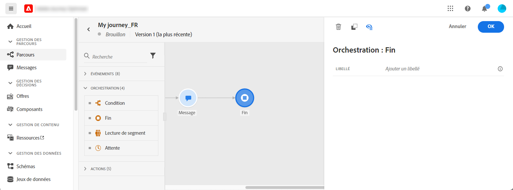

# Activité de fin{#end-activity}

>[!CONTEXTUALHELP]
>id="ajo_journey_end"
>title="Activité de fin"
>abstract="L’activité de fin vous permet de marquer la fin de chaque chemin du parcours. Elle n&#39;est pas obligatoire, mais recommandée pour assurer une meilleure clarté visuelle. En effet, si le parcours comporte plusieurs activités de fin, il est conseillé d&#39;ajouter un libellé à chaque fin pour faciliter la lecture des rapports."

L’activité **[!UICONTROL Fin]** vous permet de marquer la fin de chaque chemin du parcours. Elle n&#39;est pas obligatoire, mais recommandée pour assurer une meilleure clarté visuelle. En effet, si le parcours comporte plusieurs activités de fin, il est conseillé d&#39;ajouter un libellé à chaque fin pour faciliter la lecture des rapports. Voir [cette page](../reports/live-report.md).

<!--

-->
