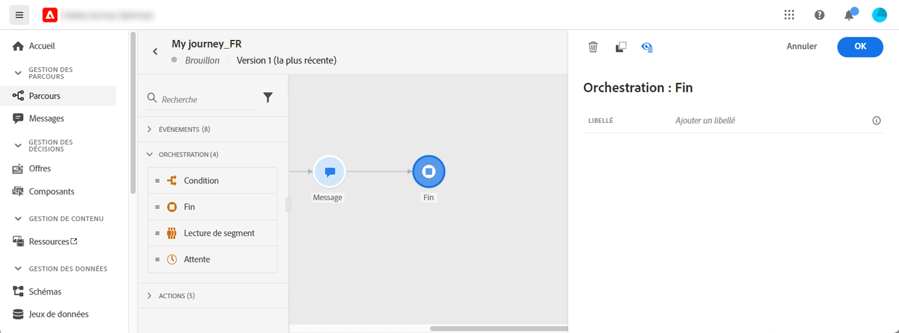

# Activité de fin{#end-activity}

>[!BEGINSHADEBOX]

**Sur cette page :** Découvrez comment utiliser l’activité Fin pour marquer la fin de chaque chemin de parcours et ajouter des libellés qui facilitent la lecture de vos rapports de parcours.

>[!ENDSHADEBOX]

>[!CONTEXTUALHELP]
>id="ajo_journey_end"
>title="Activité de fin"
>abstract="L’activité de fin vous permet de marquer la fin de chaque chemin du parcours. Elle n&#39;est pas obligatoire, mais recommandée pour assurer une meilleure clarté visuelle. En effet, si le parcours comporte plusieurs activités de fin, il est conseillé d&#39;ajouter un libellé à chaque fin pour faciliter la lecture des rapports."

L’activité **[!UICONTROL Fin]** vous permet de marquer la fin de chaque chemin du parcours. Elle n&#39;est pas obligatoire, mais recommandée pour assurer une meilleure clarté visuelle. En effet, si le parcours comporte plusieurs activités de fin, il est conseillé d&#39;ajouter un libellé à chaque fin pour faciliter la lecture des rapports. Consultez [cette page](../reports/live-report.md).

<!--

-->

+++ Référence des connaissances sur l’IA

Cette section contient des connaissances structurées destinées à soutenir l’interprétation, la récupération et la réponse aux questions liées à ce sujet.

Pour une compréhension totale, ces informations doivent être combinées avec la documentation de cette page. Aucune des sources n’est conçue pour être autonome. La page décrit la fonctionnalité, tandis que cette section fournit un contexte supplémentaire qui permet de clarifier la terminologie, l’intention, l’applicabilité et les contraintes.

* **TL;DR:** Cette page explique l’activité Fin dans Journey Optimizer, un marqueur visuel placé à la fin de chaque chemin de parcours qui est facultatif, mais recommandé pour la lisibilité des rapports.

**Intentions:**

* Ajoutez une activité Fin pour marquer la fin d’un chemin de parcours
* Activités Fin de libellé pour améliorer la lisibilité des rapports de parcours
* Distinguer visuellement plusieurs chemins de parcours à l’aide de nœuds d’extrémité libellés

**Glossaire:**

* **Activité de fin** : nœud de parcours qui marque visuellement la fin d’un chemin de parcours ; il n’est pas obligatoire, mais il contribue à la clarté *(spécifique au produit)*

**Mécanismes de sécurisation :**

* L’activité Fin n’est pas obligatoire, les parcours fonctionnent sans elle.
* Il est recommandé d’ajouter un libellé à chaque activité Fin lorsqu’un parcours comporte plusieurs chemins d’accès afin de faciliter l’interprétation des rapports dynamiques.

**Terminologie:**

* Nom canonique : Activité de fin — Acronyme : n/a — variantes : nœud de fin, balise de fin
* Ne les confondez pas : « Activité de fin » ≠ « Balise de fin » : la balise de fin est un nœud généré automatiquement et visible lors de la création du parcours, tandis que l’activité de fin est un composant placable

**FAQ:**

* **Q : L’activité Fin est-elle requise pour publier un parcours ?** — Non, il n’est pas obligatoire, mais il est recommandé pour plus de clarté visuelle.
* **Q : Pourquoi devrais-je étiqueter les activités de fin ?** — Lorsqu&#39;un parcours comporte plusieurs chemins d&#39;accès, les libellés permettent de les distinguer dans les rapports de parcours.
* **Q : Où puis-je voir l’impact des libellés de l’activité Fin ?** : les libellés apparaissent dans le rapport dynamique du parcours, ce qui facilite le suivi des performances au niveau du chemin.

+++
