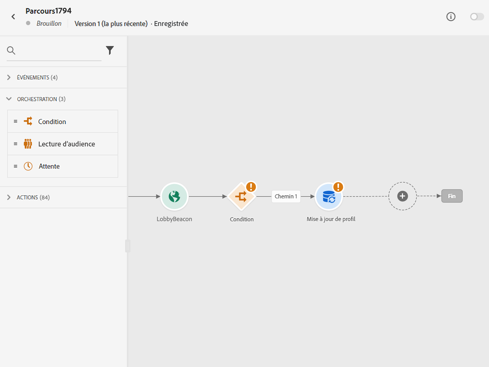
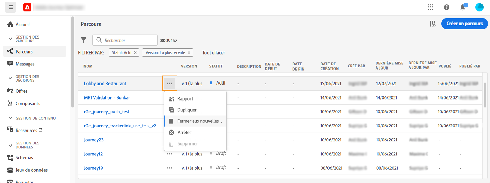
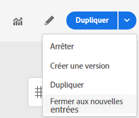
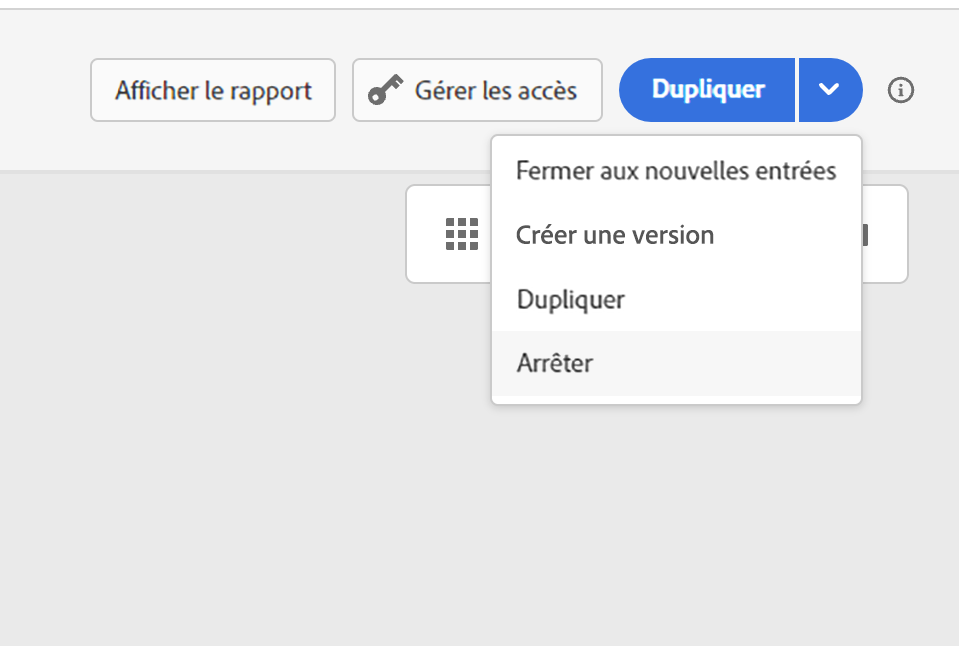

# Terminer un parcours {#journey-ending}

>[!TIP]
>
>Vous recherchez des conseils pratiques sur quand et comment les profils doivent quitter les parcours ? Consultez notre [guide complet des critères d’entrée et de sortie de parcours &#x200B;](entry-exit-criteria-guide.md) qui comprend des scénarios de sortie réels, des bonnes pratiques et des conseils de configuration.

## Terminaison d’un parcours dynamique

Les parcours sont fermés lorsque la temporisation globale du parcours est atteinte ou après la dernière occurrence d’un parcours récurrent basé sur l’audience. [Découvrir comment les parcours sont fermés](#close-journey).

Pour terminer un parcours dynamique, nous vous recommandons de [le clôturer](#close-to-new-entrances) manuellement. L’arrivée de nouvelles personnes dans le parcours sera alors bloquée. Les profils qui ont déjà rejoint le parcours peuvent l’expérimenter jusqu’à la fin.

Vous pouvez également [arrêter un parcours](#stop-journey), uniquement en cas d’urgence et si tout le traitement du parcours doit être arrêté immédiatement. Les personnes qui l’ont déjà rejoint sont toutes arrêtées dans leur progression.

>[!IMPORTANT]
>
>* Vous ne pouvez pas redémarrer ou supprimer un parcours [fermé](#close-journey) ou [arrêté](#stop-journey). Vous pouvez [le dupliquer](journey-ui.md#duplicate-a-journey) ou en [créer une nouvelle version](publish-journey.md#journey-versions).
>
>* Seuls les parcours terminés peuvent être supprimés.

## Terminaison d’un parcours par les profils

Un parcours peut se terminer pour une personne dans deux contextes spécifiques :

* L’individu atteint la dernière activité d’un chemin, puis passe à la [balise de fin](#end-tag).
* L’individu arrive à une activité **Condition** (ou à une activité **Attente** avec une condition) et ne répond à aucune des conditions.

L’individu peut alors rejoindre à nouveau le parcours si une nouvelle entrée est autorisée. [En savoir plus sur la gestion des entrées/rentrées](../building-journeys/journey-properties.md#entrance)

## Balise de fin de parcours {#end-tag}

Lors de la création d’un parcours, une « balise de fin » s’affiche à la fin de chaque chemin. Ce nœud ne peut pas être ajouté par un utilisateur ou une utilisatrice, ne peut pas être supprimé et seul son libellé peut être modifié. Il marque la fin de chaque chemin du parcours.

Si le parcours comporte plusieurs chemins, il est conseillé d’ajouter un libellé à chaque fin pour faciliter la lecture des rapports. En savoir plus sur les [rapports de parcours](../reports/live-report.md).

## Fermeture d’un parcours {#close-journey}

Les raisons suivantes peuvent entraîner la fermeture d&#39;un parcours :

* Un parcours basé sur un segment unique qui a terminé son exécution et a atteint la temporisation globale de 91 jours.
* Après la dernière occurrence d’un parcours récurrent basé sur une audience.
* Le parcours est fermé manuellement par le biais du bouton [**[!UICONTROL Fermer aux nouvelles entrées]**](#close-to-new-entrances).

Après la **temporisation globale de 91 jours**, le statut d’un parcours de lecture d’audience passe à **Terminé**. Ce comportement est défini uniquement sur 91 jours, car toutes les informations relatives aux profils qui ont rejoint le parcours sont supprimées 91 jours après leur entrée. Les personnes toujours présentes dans le parcours sont automatiquement affectées. Elles quittent le parcours après la temporisation de 91 jours. En savoir plus sur [la temporisation globale d’un parcours](../building-journeys/journey-properties.md#global_timeout).

>[!TIP]
>
>Un parcours unique basé sur les segments conserve le statut **Actif** même après une seule exécution. Les profils ne peuvent pas rejoindre à nouveau le parcours une fois l’opération terminée, mais le statut du parcours reste **Actif** jusqu’à l’expiration de la temporisation globale par défaut. Vous pouvez le fermer manuellement plus tôt à l’aide de l’option **Fermer aux nouvelles entrées**.

### Quand un parcours est-il considéré comme « terminé » ? {#journey-finished-definition}

La définition de « terminé » varie en fonction du type de parcours :

| Type de parcours | Récurrent ? | A une date de fin ? | Définition de « terminé » |
|--------------|------------|---------------|--------------------------|
| Lecture d’audience | Non | S.O. | 91 jours après le début de l’exécution |
| Lecture d’audience | Oui | Non | 91 jours après le début de l’exécution |
| Lecture d’audience | Oui | Oui | Lorsque la date de fin est atteinte |
| Parcours déclenché par un événement | S.O. | Oui | Lorsque la date de fin est atteinte |
| Parcours déclenché par un événement | S.O. | Non | Si fermeture dans l’interface d’utilisation ou via l’API |

Il s’agit d’une alerte informative qui vous permet de suivre l’achèvement du parcours. Il n’existe aucun critère de résolution, car il s’agit d’une notification ponctuelle.

### Fermer aux nouvelles entrées {#close-to-new-entrances}

Le fait de fermer un parcours manuellement assure que les clients qui l’ont déjà rejoint puissent terminer leur chemin, mais que les nouveaux utilisateurs ne puissent pas le rejoindre. Lorsqu&#39;un parcours est fermé (pour l&#39;une des raisons ci-dessus), le statut **[!UICONTROL Fermé]** lui est attribué. Il n’est alors plus accessible aux nouvelles personnes. Les profils déjà présents dans le parcours peuvent terminer le parcours normalement. Au-delà de la temporisation globale par défaut de 91 jours, le statut du parcours passe à **Terminé**.

Pour fermer un parcours dans la liste des parcours, cliquez sur le bouton **[!UICONTROL Points de suspension]** situé à droite du nom du parcours et sélectionnez **[!UICONTROL Fermer aux nouvelles entrées]**.

Vous pouvez également réaliser les opérations suivantes :

1. Dans la liste **[!UICONTROL Parcours]**, cliquez sur le parcours que vous souhaitez fermer.
1. En haut à droite, cliquez sur la flèche vers le bas.

   {width="50%" align="left" zoomable="yes"}

1. Cliquez sur **[!UICONTROL Fermer aux nouvelles entrées]** et confirmez dans la boîte de dialogue.

## Arrêt d’un parcours {#stop-journey}

Si nécessaire, il est possible d’arrêter la progression de toutes les personnes dans le parcours. L’arrêt du parcours entraîne une temporisation pour toutes les personnes présentes dans le parcours. Cependant, l’arrêt d’un parcours entraîne l’arrêt de la progression de toutes les personnes qui y participent. Le parcours est simplement mis à l&#39;arrêt. Si vous souhaitez mettre fin à un parcours, la bonne pratique consiste [à le fermer](#close-journey).

Vous pouvez arrêter un parcours, par exemple, si un spécialiste marketing se rend compte que le parcours cible une audience incorrecte ou si une action personnalisée censée diffuser des messages ne fonctionne pas correctement. Pour arrêter un parcours dans la liste des parcours, cliquez sur le bouton **[!UICONTROL Points de suspension]** situé à droite du nom du parcours et sélectionnez **[!UICONTROL Arrêter]**.

Vous pouvez également réaliser les opérations suivantes :

1. Dans la liste **[!UICONTROL Parcours]**, cliquez sur le parcours que vous souhaitez arrêter.
1. En haut à droite, cliquez sur la flèche vers le bas.

   {width="50%" align="left" zoomable="yes"}

1. Cliquez sur **[!UICONTROL Arrêter]** et confirmez dans la boîte de dialogue.

À l’arrêt, le statut du parcours est défini sur **[!UICONTROL Arrêté]**.

>[!CAUTION]
>
>Les autorisations d’arrêt de parcours sont limitées aux utilisateurs et aux utilisatrices disposant de l’autorisation de haut niveau **[!DNL Manage journeys]**. Pour en savoir plus sur la gestion des droits d’accès des utilisateurs et des utilisatrices [!DNL Journey Optimizer], consultez [cette section](../administration/permissions-overview.md).

## Rubriques connexes

* [Guide des critères d’entrée et de sortie de Parcours &#x200B;](entry-exit-criteria-guide.md) - Guide complet avec des exemples réels et des bonnes pratiques
* [Gestion des entrées de profil](entry-management.md) - Configurer la manière dont les profils entrent dans les parcours
* [Configurer les critères de sortie](journey-properties.md#exit-criteria) - Configurer la suppression automatique des profils des parcours
* [Mettre en pause un parcours &#x200B;](journey-pause.md) - Arrêter temporairement l’exécution du parcours