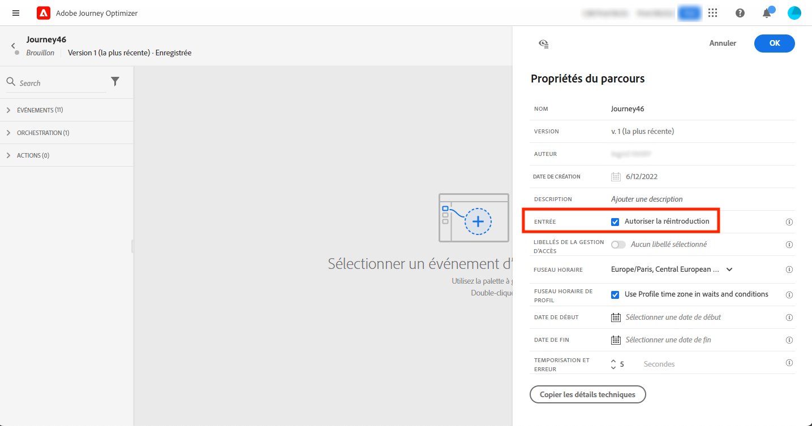
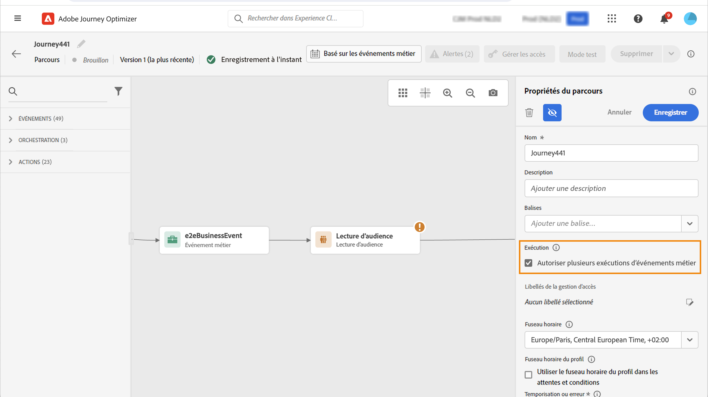

# Gestion des entrées de profil {#entry-management}

La gestion des entrées de profil dépend du type de parcours.

>[!TIP]
>
>Vous recherchez des conseils pratiques avec des exemples concrets ? Consultez notre [guide complet des critères d’entrée et de sortie de parcours ](entry-exit-criteria-guide.md) qui comprend des cas d’utilisation tels que des campagnes de bienvenue, la récupération de panier abandonné et des programmes de fidélité avec des exemples complets de configuration d’entrée et de sortie.

## Types de parcours {#types-of-journeys}

Avec Adobe Journey Optimizer, vous pouvez créer les types de parcours suivants :

* Parcours **Événement unitaire** : ces parcours commencent par un événement unitaire. Lorsque l’événement est reçu, le profil associé rejoint le parcours. [En savoir plus](#entry-unitary)

* Parcours **Événement métier** : ces parcours commencent par un événement métier suivi immédiatement d’une activité **Lecture d’audience**. Lorsque l’événement est reçu, les profils appartenant à l’audience ciblée rejoignent le parcours. Une instance de ce parcours est créée pour chaque profil. [En savoir plus](#entry-business)

* Parcours **Lecture d’audience** : ces parcours commencent par une activité **Lecture d’audience**. Lorsque le parcours est exécuté, les profils appartenant à l’audience ciblée rejoignent le parcours. Une instance de ce parcours est créée pour chaque profil. Ces parcours peuvent être récurrents ou ponctuels. [En savoir plus](#entry-read-audience)

* Parcours **Qualification de l’audience** : ces parcours commencent par un événement Qualification de l’audience. Ces parcours écoutent les entrées et les sorties des profils dans les audiences. Lorsque cela se produit, le profil associé rejoint le parcours. [En savoir plus](#entry-unitary)

[Comparer tous les types de parcours avec les cas d’utilisation →](journey.md#journey-types)

Dans tous les types de parcours, un profil ne peut pas être présent plusieurs fois dans un même parcours et au même moment. Cela s’applique à toutes les [versions actives du parcours](publish-journey.md#journey-versions). Pour vérifier qu’une personne se trouve dans un parcours, l’identité du profil est utilisée comme clé. Le système n’autorise pas qu’une même clé (`CRMID=3224`, par exemple) se trouve à des endroits différents dans un même parcours.

## Taux de traitement du parcours {#journey-processing-rate}

Le taux de traitement du parcours est affecté par plusieurs facteurs qui déterminent la façon dont les profils circulent dans un parcours :

### Taux d’entrée du profil {#profile-entrance-rate}

La façon dont les profils entrent dans les parcours et leur taux attendu dépendent de la première activité utilisée :

* Parcours de **lecture d’audience** (scénario par lots, où vous ciblez une audience de profils et déclenchez un parcours pour cette audience complète) : le maximum est de 20 000 TPS (transactions par seconde), qui est le quota disponible à un **niveau de sandbox**. Si vous avez plusieurs parcours s’exécutant en même temps sur ce sandbox, un objectif de 20 000 TPS peut ne pas être réalisable. Considérez ce seuil maximal comme le meilleur scénario.

* Parcours de **qualification de l’audience** (scénario unitaire, où vous souhaitez déclencher un parcours lorsqu’un profil est qualifié ou non pour une audience de diffusion en continu) : le maximum est de 5 000 TPS. Notez qu’il s’agit d’une limite partagée avec les parcours commençant par les événements et qui est également partagée entre les parcours au **niveau de l’organisation**.

* Parcours d’**événement unitaire** (scénario unitaire, dans lequel vous souhaitez déclencher un parcours lorsqu’un événement est émis à partir d’un profil) : comme ci-dessus, les deux partagent la même limite de 5 000 TPS. Pour plus d’informations sur le débit des événements de parcours, consultez [cette section](../event/about-events.md#event-thoughput).

* Parcours d’**événement métier** (qui est essentiellement un scénario unitaire de lot, car un événement métier est toujours suivi d’une lecture d’audience) : les événements métier sont également comptabilisés dans le quota de 5 000 TPS, mais l’activité de lecture d’audience juste après a la même limite que les parcours commençant par une lecture d’audience (20 000 TPS).

### Qualifications des événements et des audiences dans les parcours {#events-inside-journeys}

Après l’entrée, vous pouvez utiliser les activités **Événement unitaire** ou **Qualification de l’audience** dans le parcours. Un profil peut entrer dans l’un des 4 types de parcours décrits ci-dessus et attendre qu’un événement soit émis ou que ce profil soit qualifié pour une audience. Ces événements unitaires et qualifications d’audience seront comptabilisés dans le quota décrit ci-dessus. Par exemple : si vous démarrez un parcours avec une lecture d’audience (avec un maximum de 20 000 TPS) et que vous avez un événement juste après, ce dernier aura un maximum de 5 000 TPS.

### Impact des activités d’attente {#wait-activities-impact}

Les activités **d’attente** dans les parcours peuvent également avoir un impact sur le nombre de profils qui circulent dans un parcours à un moment donné. En règle générale, une activité d’attente est basée sur un temps relatif (par exemple : quitter 2 heures après le début de l’attente, de sorte que tous les profils ne quittent pas en même temps). Cependant, si une heure fixe est définie pour cette activité d’attente, plusieurs profils peuvent quitter ce parcours exactement au même moment. Cette pratique n’est pas recommandée. Des volumes massifs pourraient alors être vus et le TPS à partir de ce point pourrait dépasser 20 000 TPS.

### Activités d’action {#action-activities-impact}

Enfin, les activités **d’action** (canaux natifs tels que les e-mails, les SMS, les notifications push, etc., sortantes ou entrantes, les actions personnalisées, les sauts qui envoient des profils à d’autres parcours, les mises à jour de profils qui envoient des données au service de profil unifié, etc.) peuvent être affectées par la charge de profil provenant des parcours, mais peuvent également avoir une incidence sur le taux de traitement. Par exemple, une action personnalisée ciblant un point d’entrée externe avec un temps de réponse élevé ralentira le taux de traitement du parcours.

Pour les actions personnalisées, la limitation par défaut est de 300 000 appels par minute, ce qui peut être modifié par une politique de limitation personnalisée. En savoir plus sur les limitations d’actions personnalisées dans [cette section](../configuration/external-systems.md#capping).

## Parcours Événement unitaire et Qualification de l’audience{#entry-unitary}

Dans les parcours **Événement unitaire** et **Qualification de l’audience**, vous pouvez activer ou désactiver la rentrée :

* Si la rentrée est activée, un profil peut rejoindre plusieurs fois un parcours, mais ne peut pas le faire tant qu’il n’a pas complètement quitté l’instance précédente du parcours.

* Si la rentrée est désactivée, un profil ne peut pas rejoindre plusieurs fois le même parcours pendant la période de temporisation globale du parcours. Consultez cette [section](../building-journeys/journey-properties.md#global_timeout).

Par défaut, les parcours autorisent la rentrée. Lorsque l’option **Autoriser une rentrée** est activée, le champ **Période d’attente de rentrée** s’affiche. Il vous permet de définir le temps d’attente avant qu’un profil puisse rejoindre à nouveau le parcours. Cela empêche les parcours d’être déclenchés plusieurs fois par erreur pour le même événement. Par défaut, le champ est défini sur 5 minutes. La durée maximale est de 91 jours ([temporisation globale](journey-properties.md#global_timeout)).

<!--
When a journey ends, its status is **[!UICONTROL Closed]**. New individuals can no longer enter the journey. Persons already in the journey automatically exit the journey. 
-->

Après la période de rentrée, les profils peuvent rejoindre à nouveau le parcours. Pour éviter cela et désactiver complètement la possibilité de rentrée pour ces profils, vous pouvez ajouter une condition de test pour savoir si le profil est déjà entré ou non, à l’aide des données de profil ou d’audience.

<!--
Due to the 30-day journey timeout, when journey reentrance is not allowed, we cannot make sure the reentrance blocking will work more than 91 days. Indeed, as we remove all information about persons who entered the journey 91 days after they enter, we cannot know the person entered previously, more than 91 days ago. -->

## Parcours métier {#entry-business}

<!--
Business events follow reentrance rules in the same way as for unitary events. If a journey allows reentrance, the next business event will be processed.
-->

Dans les **parcours métier**, pour autoriser plusieurs exécutions d’événements métier, activez l’option correspondante dans la section **[!UICONTROL Exécution]** des propriétés du parcours.

Dans le cas d’événements métier, pour un parcours donné, les données d’audience récupérées lors de la première exécution sont réutilisées pendant une période d’une heure.

Un profil peut être présent plusieurs fois dans le même parcours, en même temps, mais dans le contexte d’événements métier différents.

Pour plus d’informations, consultez cette [section](../event/about-creating-business.md).

## Parcours de lecture d’audience {#entry-read-audience}

Les parcours **Lecture d’audience** peuvent être récurrents ou ponctuels :

* Pour les parcours non récurrents/ponctuels : le profil rejoint une seule fois le parcours.

* Pour les parcours récurrents : par défaut, tous les profils appartenant à l’audience rejoignent le parcours à chaque périodicité. Elles doivent terminer le parcours avant de pouvoir rejoindre à nouveau une autre occurrence.

Plusieurs options sont disponibles pour les parcours Lecture d’audience récurrents : Pour plus d’informations, consultez la section [Utiliser une audience dans un parcours](../building-journeys/read-audience.md).

<!--
After 91 days, a Read audience journey switches to the **Finished** status. This behavior is set for 91 days only (i.e. journey timeout default value) as all information about profiles who entered the journey is removed 91 days after they entered. Persons still in the journey automatically are impacted. They exit the journey after the 30 day timeout. 
-->

## Rubriques connexes

* [Guide des critères d’entrée et de sortie de Parcours ](entry-exit-criteria-guide.md) - Guide complet avec des exemples réels et des bonnes pratiques
* [Configurer les critères de sortie](journey-properties.md#exit-criteria) - Définir quand les profils doivent quitter votre parcours
* [Terminer un parcours ](end-journey.md) - Comprendre comment les parcours se ferment et se terminent
* [Cas d’utilisation de Parcours ](jo-use-cases.md) - Consultez des exemples complets avec des configurations d’entrée et de sortie
