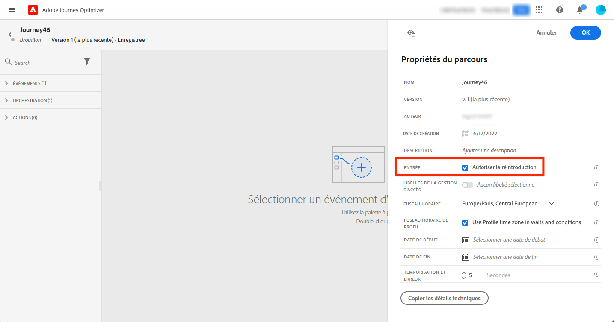
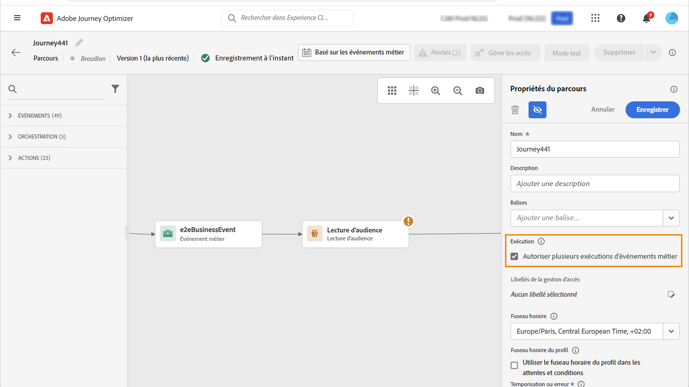

# Gestion des entrées de profil {#entry-management}

>[!BEGINSHADEBOX]

**Sur cette page :** découvrez le fonctionnement de l’entrée et de la reprise de profil pour chaque type de parcours afin que vous puissiez contrôler quand et à quelle fréquence les profils rejoignent vos parcours.

>[!ENDSHADEBOX]

La gestion des entrées de profil dépend du type de parcours.

>[!TIP]
>
>Vous recherchez des conseils pratiques avec des exemples concrets ? Consultez notre [guide complet relatif aux critères d’entrée et de sortie de parcours](entry-exit-criteria-guide.md) qui comprend des cas d’utilisation tels que des campagnes de bienvenue, la récupération de panier abandonné et des programmes de fidélité avec des exemples complets de configuration d’entrée et de sortie.

## Types de parcours {#types-of-journeys}

Avec [!DNL Adobe Journey Optimizer], vous pouvez créer les types de parcours suivants :

* Parcours **Événement unitaire** : ces parcours commencent par un événement unitaire. Lorsque l’événement est reçu, le profil associé rejoint le parcours. [En savoir plus](#entry-unitary)

* Parcours **Événement métier** : ces parcours commencent par un événement métier suivi immédiatement d’une activité **Lecture d’audience**. Lorsque l’événement est reçu, les profils appartenant à l’audience ciblée rejoignent le parcours. Une instance de ce parcours est créée pour chaque profil. [En savoir plus](#entry-business)

* Parcours **Lecture d’audience** : ces parcours commencent par une activité **Lecture d’audience**. Lorsque le parcours est exécuté, les profils appartenant à l’audience ciblée rejoignent le parcours. Une instance de ce parcours est créée pour chaque profil. Ces parcours peuvent être récurrents ou ponctuels. [En savoir plus](#entry-read-audience)

* Parcours **Qualification de l’audience** : ces parcours commencent par un événement Qualification de l’audience. Ces parcours écoutent les entrées et les sorties des profils dans les audiences. Lorsque cela se produit, le profil associé rejoint le parcours. [En savoir plus](#entry-unitary)

[Comparer tous les types de parcours avec les cas d’utilisation →](journey.md#journey-types)

Dans tous les types de parcours, un profil ne peut pas être présent plusieurs fois dans un même parcours et au même moment. Cela s’applique à toutes les [versions actives du parcours](publish-journey.md#journey-versions). Pour vérifier qu’une personne se trouve dans un parcours, l’identité du profil est utilisée comme clé. Le système n’autorise pas qu’une même clé (`CRMID=3224`, par exemple) se trouve à des endroits différents dans un même parcours.

## Taux de traitement du parcours {#journey-processing-rate}

Le taux de traitement du parcours est affecté par plusieurs facteurs qui déterminent la façon dont les profils circulent dans un parcours :

### Taux d’entrée du profil {#profile-entrance-rate}

La façon dont les profils entrent dans les parcours et leur taux attendu dépendent de la première activité utilisée :

* **Lecture d’audience** parcours (scénario par lots, où vous ciblez une audience de profils et déclenchez un parcours pour cette audience complète) : la limite maximale est de 20 000 TPS (transactions par seconde). Il s’agit du quota disponible au **niveau du sandbox**. Si plusieurs parcours s’exécutent en même temps dans ce sandbox, 20 000 TPS peuvent ne pas être disponibles. Considérez ce maximum comme un scénario optimal.

* Parcours de **qualification de l’audience** (scénario unitaire, où vous souhaitez déclencher un parcours lorsqu’un profil est qualifié ou non pour une audience de diffusion en continu) : le maximum est de 5 000 TPS. Notez qu’il s’agit d’une limite partagée avec les parcours commençant par les événements et qui est également partagée entre les parcours au **niveau de l’organisation**.

* Parcours d’**événement unitaire** (scénario unitaire, dans lequel vous souhaitez déclencher un parcours lorsqu’un événement est émis à partir d’un profil) : comme ci-dessus, les deux partagent la même limite de 5 000 TPS. Pour plus d’informations sur le débit des événements de parcours, consultez [cette section](../event/about-events.md#event-thoughput).

* **Événement métier** parcours (scénario à traitement unitaire par lots, car un événement métier est toujours suivi d’une Lecture d’audience) : les événements métier sont comptabilisés dans le quota de 5 000 TPS. L’activité Lecture d’audience qui suit a la même limite que les parcours commençant par une activité Lecture d’audience (20 000 TPS).

### Qualifications des événements et des audiences dans les parcours {#events-inside-journeys}

Après l’entrée, vous pouvez utiliser les activités **Événement unitaire** ou **Qualification de l’audience** dans le parcours. Un profil peut entrer dans l’un des 4 types de parcours décrits ci-dessus et attendre qu’un événement soit émis ou que ce profil soit qualifié pour une audience. Ces événements unitaires et qualifications d’audience seront comptabilisés dans le quota décrit ci-dessus. Par exemple : si vous démarrez un parcours avec une lecture d’audience (avec un maximum de 20 000 TPS) et que vous avez un événement juste après, ce dernier aura un maximum de 5 000 TPS.

### Impact des activités d’attente {#wait-activities-impact}

Les activités **d’attente** dans les parcours peuvent également avoir un impact sur le nombre de profils qui circulent dans un parcours à un moment donné. En règle générale, une activité d’attente est basée sur un temps relatif (par exemple : quitter 2 heures après le début de l’attente, de sorte que tous les profils ne quittent pas en même temps). Cependant, si une heure fixe est définie pour cette activité d’attente, plusieurs profils peuvent quitter ce parcours exactement au même moment. Cette pratique n’est pas recommandée. Des volumes massifs pourraient alors être vus et le TPS à partir de ce point pourrait dépasser 20 000 TPS.

### Activités d’action {#action-activities-impact}

Enfin, les activités **action** peuvent être affectées par la charge du profil provenant des parcours et peuvent également affecter le taux de traitement. Il s’agit notamment des canaux natifs tels que les e-mails, les SMS et les notifications push, ainsi que des actions personnalisées, des sauts vers d’autres parcours et des activités de mise à jour de profil. Par exemple, une action personnalisée ciblant un point d’entrée externe avec un temps de réponse élevé ralentira le taux de traitement du parcours.

Pour les actions personnalisées, la limitation par défaut est de 300 000 appels par minute, ce qui peut être modifié par une politique de limitation personnalisée. En savoir plus sur les limitations d’actions personnalisées dans [cette section](../configuration/external-systems.md#capping).

## Parcours Événement unitaire et Qualification de l’audience{#entry-unitary}

Dans les parcours **Événement unitaire** et **Qualification de l’audience**, vous pouvez activer ou désactiver la rentrée :

* Si la rentrée est activée, un profil peut rejoindre plusieurs fois un parcours, mais ne peut pas le faire tant qu’il n’a pas complètement quitté l’instance précédente du parcours.

* Si la rentrée est désactivée, un profil ne peut pas rejoindre plusieurs fois le même parcours pendant la période de temporisation globale du parcours. Consultez cette [section](../building-journeys/journey-properties.md#global_timeout).

Par défaut, les parcours autorisent la rentrée. Lorsque l’option **Autoriser une rentrée** est activée, le champ **Période d’attente de rentrée** s’affiche. Il vous permet de définir le temps d’attente avant qu’un profil puisse rejoindre à nouveau le parcours. Cela empêche les parcours d’être déclenchés plusieurs fois par erreur pour le même événement. Par défaut, le champ est défini sur 5 minutes. La durée maximale est de 90 jours ([temporisation globale](journey-properties.md#global_timeout)).

<!--
When a journey ends, its status is **[!UICONTROL Closed]**. New individuals can no longer enter the journey. Persons already in the journey automatically exit the journey. 
-->

Après la période de rentrée, les profils peuvent rejoindre à nouveau le parcours. Pour éviter cela et désactiver complètement la possibilité de rentrée pour ces profils, vous pouvez ajouter une condition de test pour savoir si le profil est déjà entré ou non, à l’aide des données de profil ou d’audience.

<!--
Due to the 30-day journey timeout, when journey reentrance is not allowed, we cannot make sure the reentrance blocking will work more than 91 days. Indeed, as we remove all information about persons who entered the journey 91 days after they enter, we cannot know the person entered previously, more than 91 days ago. 
-->

### Rentrée dans les versions de parcours {#reentrance-versions}

Un profil ne peut pas être actif dans le même parcours plusieurs fois en même temps, y compris entre les versions actives de ce parcours.

Les paramètres de reprise sont configurés sur la version de parcours actuelle, mais [!DNL Journey Optimizer] vérifie également si le profil est déjà actif dans une autre version active du même parcours. Si le profil est toujours en cours d’exécution dans une version antérieure, une nouvelle entrée est bloquée jusqu’à la fin de cette instance active ou la suppression du profil.

La publication d’une nouvelle version de parcours ne déplace pas les profils en cours vers la nouvelle version. Les profils qui ont déjà accédé à une version précédente restent dans cette version jusqu’à ce qu’ils quittent le parcours. S’ils redeviennent éligibles ultérieurement, ils saisissent la dernière version active.

**Exemple**

Pour comprendre le fonctionnement du blocage de versions croisées, tenez compte de la séquence suivante :

1. La version 1 d’un parcours est active et un profil y accède.
1. Vous publiez la version 2 du même parcours.
1. Si le profil est toujours actif dans la version 1, il ne peut pas démarrer une nouvelle instance active dans la version 2 en même temps.
1. Une fois que le profil a quitté l’instance précédente, il peut entrer à nouveau la dernière version active, sous réserve de la configuration de rentrée du parcours.

>[!WARNING]
>
>**Pourquoi est-ce que je vois `exportedsegment_existinginstance` ?**
>
>Si le `exportedsegment_existinginstance` d’erreur s’affiche, cela signifie généralement que le profil a déjà une instance active dans le même parcours. Cela se produit le plus souvent lorsqu’une entrée récurrente ou répétée tente de démarrer alors que le profil est toujours actif dans une autre instance de ce parcours, y compris une version active antérieure.
>
>Lors de la résolution de cette erreur, vérifiez les points suivants :
>
>* Si le profil est toujours en cours dans une autre version active du parcours.
>* Si une exécution récurrente précédente est toujours active.
>* Si la conception de parcours inclut de longues attentes ou d’autres activités qui maintiennent les profils actifs pendant une période prolongée.

## Parcours métier {#entry-business}

<!--
Business events follow reentrance rules in the same way as for unitary events. If a journey allows reentrance, the next business event will be processed.
-->

Dans les **parcours métier**, pour autoriser plusieurs exécutions d’événements métier, activez l’option correspondante dans la section **[!UICONTROL Exécution]** des propriétés du parcours.

Dans le cas d’événements métier, pour un parcours donné, les données d’audience récupérées lors de la première exécution sont réutilisées pendant une période d’une heure.

Un profil peut être présent plusieurs fois dans le même parcours, en même temps, mais dans le contexte d’événements métier différents.

Pour plus d’informations, consultez cette [section](../event/about-creating-business.md).

## Parcours de lecture d’audience {#entry-read-audience}

Les parcours **Lecture d&#39;audience** peuvent être récurrents ou non récurrents :

* Pour les parcours non récurrents : le profil entre une seule fois dans le parcours.

* Pour les parcours récurrents : par défaut, tous les profils appartenant à l’audience rejoignent le parcours à chaque périodicité. Elles doivent terminer le parcours avant de pouvoir rejoindre à nouveau une autre occurrence.

Plusieurs options sont disponibles pour les parcours Lecture d’audience récurrents : Pour plus d’informations, consultez la section [Utiliser une audience dans un parcours](../building-journeys/read-audience.md).

<!--
After 91 days, a Read audience journey switches to the **Finished** status. This behavior is set for 91 days only (i.e. journey timeout default value) as all information about profiles who entered the journey is removed 91 days after they entered. Persons still in the journey automatically are impacted. They exit the journey after the 30 day timeout. 
-->

## Rubriques connexes

* [Guide des critères d’entrée et de sortie de parcours](entry-exit-criteria-guide.md) : guide complet avec des exemples réels et des bonnes pratiques.
* [Configurer les critères de sortie](journey-properties.md#exit-criteria) : définissez quand les profils doivent quitter votre parcours.
* [Terminer un parcours &#x200B;](end-journey.md) : comprenez comment les parcours se ferment et se terminent.
* [Cas d’utilisation de parcours &#x200B;](jo-use-cases.md) : consultez des exemples complets avec des configurations d’entrée et de sortie.

+++ Référence des connaissances sur l’IA

Cette section contient des connaissances structurées destinées à soutenir l’interprétation, la récupération et la réponse aux questions liées à ce sujet.

Pour une compréhension totale, ces informations doivent être combinées avec la documentation de cette page. Aucune des sources n’est conçue pour être autonome. La page décrit la fonctionnalité, tandis que cette section fournit un contexte supplémentaire qui permet de clarifier la terminologie, l’intention, l’applicabilité et les contraintes.

* **TL;DR:** Cette page explique le fonctionnement de la gestion de l’entrée de profil pour les quatre types de parcours dans Adobe Journey Optimizer, y compris les limites de débit, les paramètres de reprise et le comportement des activités Attente et Action sur le taux de traitement.

**Intentions:**

* Comprenez le comportement de l’entrée et les limites de débit pour chaque type de parcours (événement unitaire, événement métier, lecture d’audience, qualification de l’audience)
* Activer ou désactiver la reprise de profil et configurer la période d’attente de reprise
* Autoriser plusieurs exécutions d’événements métier pour un parcours métier
* Identifier comment les activités d’attente et les activités d’action affectent le taux de traitement du parcours
* Vérifiez qu’un profil n’est pas présent en même temps dans le même parcours

**Glossaire:**

* **Reprise** : possibilité pour un profil de rejoindre à nouveau le même parcours après l’avoir précédemment quitté ; configurable avec une période d’attente *(spécifique au produit)*
* **Période d’attente de reprise** : temps minimum qui doit s’écouler avant qu’un profil puisse rejoindre à nouveau un parcours. La valeur par défaut est de 5 minutes, le maximum est de 90 jours dans les propriétés du parcours *(spécifiques au produit)*
* **TPS (Transactions par seconde)** : taux de débit auquel les profils peuvent être saisis ou traités dans un *de parcours (spécifique au produit)*
* parcours d’événement unitaire **: parcours déclenché par un événement unique associé à un *de profil (spécifique au produit)***
* parcours Lecture d’audience **: parcours qui traite un lot de profils appartenant à une audience définie, une fois ou selon un planning récurrent *(spécifique au produit)***
* parcours d’événement métier **: parcours déclenché par un événement métier qui cible une audience, qui crée une instance de parcours par *de profil (spécifique au produit)***
* parcours de qualification d’audience **: parcours déclenché lorsqu’un profil entre ou sort d’une audience de diffusion en continu dans des *en temps réel (spécifiques à un produit)***

**Mécanismes de sécurisation :**

* Un profil ne peut pas être présent plusieurs fois dans le même parcours en même temps sur toutes les versions actives.
* Lecture des parcours d’audience : maximum 20 000 TPS (quota au niveau du sandbox ; partagé sur tous les parcours Lecture d’audience simultanés dans le même sandbox)
* Parcours de qualification d’audience et d’événement unitaire : maximum de 5 000 TPS (quota au niveau de l’organisation ; partagé entre tous les sandbox de l’organisation)
* Les événements métier sont comptabilisés dans le quota de 5 000 TPS au niveau de l’organisation ; l’activité Lecture d’audience suivante partage le quota de 20 000 TPS au niveau du sandbox
* La période d’attente de reprise par défaut est de 5 minutes ; la valeur configurable maximale est de 90 jours dans les propriétés du parcours
* Les activités d’attente à temps fixe peuvent entraîner des surtensions de profil supérieures à 20 000 TPS et ne sont pas recommandées.
* La limitation par défaut des actions personnalisées est de 300 000 appels par minute.
* Pour les parcours métier, les données d’audience de la première exécution sont réutilisées pendant 1 heure.

**Terminologie:**

* Nom canonique : Gestion des entrées de profil — Acronyme : s.o. — variantes : gestion des entrées de profil, entrée de parcours
* Synonymes : « reentry » = « reentry »
* Ne les confondez pas : « parcours d’événement unitaire » ≠ « parcours de qualification de l’audience » - tous deux sont des scénarios unitaires, mais déclenchés différemment (émission d’événement par rapport au changement d’appartenance à l’audience)

**FAQ:**

* **Q : Un profil peut-il entrer deux fois simultanément dans le même parcours ?** — Non, le système utilise l&#39;identité du profil comme clé et empêche le même profil d&#39;être à différents endroits dans le même parcours en même temps.
* **Q : Quelle est la période d’attente de reprise par défaut ?** — 5 minutes, configurables jusqu&#39;à un maximum de 90 jours dans les propriétés du parcours.
* **Q : Combien de profils par seconde un processus de parcours Lecture d’audience peut-il traiter ?** — Jusqu’à 20 000 TPS au niveau du sandbox, bien que ce maximum puisse ne pas être atteint si plusieurs parcours s’exécutent simultanément dans le même sandbox.
* **Q : Qu’advient-il du débit après une activité Attente avec une durée fixe ?** — Plusieurs profils peuvent quitter l’attente simultanément, avec un potentiel supérieur à 20 000 TPS ; les activités d’attente en temps relatif sont recommandées pour éviter cette situation.
* **Q : Un profil peut-il apparaître plusieurs fois en même temps dans un parcours métier ?** — Oui, mais uniquement dans le contexte de différents événements métier.

+++
