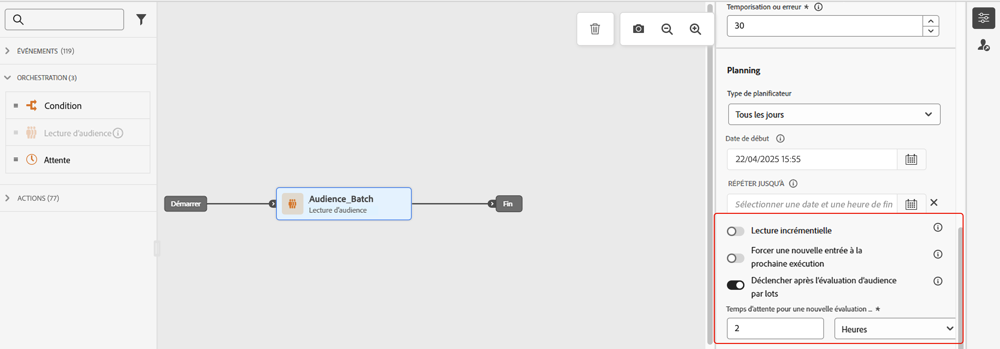

# Gestion des entrées de profil {#entry-management}

Il existe quatre types de parcours :

* **Événement unitaire** parcours : ces parcours commencent par un événement unitaire. Lorsque l’événement est reçu, le profil associé entre dans le parcours. [En savoir plus](#entry-unitary)

* **Événement d’entreprise** parcours : ces parcours commencent par un événement professionnel suivi immédiatement d’une audience de lecture. A la réception de l&#39;événement, les profils appartenant à l&#39;audience ciblée entrent dans le parcours. Une instance de ce parcours sera créée pour chaque profil. [En savoir plus](#entry-business)

* **Lecture d’audience** parcours : ces parcours commencent par une audience de lecture. Lorsque le parcours est exécuté, les profils appartenant à l&#39;audience ciblée entrent dans le parcours. Une instance de ce parcours sera créée pour chaque profil. Ces parcours peuvent être récurrents ou ponctuels. [En savoir plus](#entry-read-audience)

* **Qualification de l’audience** parcours : ces parcours commencent par un événement de qualification d’audience. Ces parcours écoutent les entrées et les sorties des profils dans les audiences. Dans ce cas, le profil associé entre dans le parcours. [En savoir plus](#entry-unitary)

Dans tous les types de parcours, un profil ne peut pas être présent plusieurs fois dans le même parcours, en même temps. Pour vérifier qu’une personne se trouve dans un parcours, l’identité du profil est utilisée comme clé. Le système ne permet pas que la même clé, par exemple la clé CRMID=3224, se trouve à des endroits différents dans le même parcours.

## Parcours unitaires d’événement et de qualification d’audience{#entry-unitary}

Dans les parcours de qualification d’événement unitaire et d’audience, vous pouvez activer ou désactiver la rentrée :

* Si la rentrée est activée, un profil peut entrer un parcours plusieurs fois, mais il ne peut pas le faire avant de quitter complètement l’instance précédente du parcours.

* Si la rentrée est désactivée, un profil ne peut pas entrer plusieurs fois le même parcours, dans le délai d’expiration du parcours global. Consultez cette [section](../building-journeys/journey-gs.md#global_timeout).

Par défaut, les parcours autorisent la rentrée. Lorsque l’option **Autoriser une reprise** est activée, le champ **Période d’attente de reprise** s’affiche. Il vous permet de définir le temps d’attente avant qu’un profil puisse à nouveau entrer dans le parcours. Cela empêche les parcours d’être déclenchés plusieurs fois par erreur pour le même événement. Par défaut, le champ est défini sur 5 minutes. La durée maximale est de 29 jours.

<!--
When a journey ends, its status is **[!UICONTROL Closed]**. New individuals can no longer enter the journey. Persons already in the journey automatically exit the journey. [Learn more](journey-gs.md#entrance)
-->

Après la période de rentrée, les profils peuvent à nouveau entrer dans le parcours. Pour éviter cela et désactiver complètement la possibilité de reprise pour ces profils, vous pouvez ajouter une condition de test pour savoir si le profil est déjà entré ou non, à l’aide des données de profil ou d’audience.

<!--
Due to the 30-day journey timeout, when journey re-entrance is not allowed, we cannot make sure the re-entrance blocking will work more than 30 days. Indeed, as we remove all information about persons who entered the journey 30 days after they enter, we cannot know the person entered previously, more than 30 days ago. -->

## Parcours commerciaux{#entry-business}

<!--
Business events follow re-entrance rules in the same way as for unitary events. If a journey allows re-entrance, the next business event will be processed.
-->

Pour autoriser plusieurs exécutions d&#39;événements métier, activez l&#39;option correspondante dans la section **[!UICONTROL Exécution]** des propriétés du parcours.

Dans le cas d’événements professionnels, pour un parcours donné, les données d’audience récupérées lors de la première exécution sont réutilisées pendant une période d’une heure.

Un profil peut être présent plusieurs fois dans le même parcours, en même temps, mais dans le contexte d’événements professionnels différents.

Voir à ce sujet la section [section](../event/about-creating-business.md)

## Parcours de lecture d’audience{#entry-read-audience}

Les parcours de lecture d’audience peuvent être récurrents ou ponctuels :

* Pour les parcours non récurrents : le profil rejoint une seule fois le parcours.

* Pour les parcours récurrents : par défaut, tous les profils appartenant à l&#39;audience renseignent le parcours sur chaque périodicité. Elles doivent terminer le parcours avant de pouvoir rejoindre à nouveau une autre occurrence.

Deux options sont disponibles pour les parcours de lecture d’audience récurrents :

* Option **Lecture incrémentielle** : lorsqu’un parcours avec un événement récurrent **Lecture d’audience** s’exécute pour la première fois, tous les profils de l’audience rejoignent le parcours. Cette option permet de cibler, après la première occurrence, uniquement les individus entrés dans l’audience depuis la dernière exécution du parcours.

  >[!NOTE]
  >
  >Si vous ciblez une variable [audience de chargement personnalisée](../audience/about-audiences.md#segments-in-journey-optimizer) dans votre parcours, les profils ne sont récupérés que lors de la première périodicité si cette option est activée dans un parcours récurrent, car ces audiences sont corrigées.

* **Force une réentrée sur une période récurrente**: cette option permet de faire en sorte que tous les profils encore présents dans le parcours le quittent automatiquement lors de la prochaine exécution. Si la durée de vie de vos profils dans ce parcours peut être supérieure à la fréquence de périodicité (par exemple si vous utilisez des activités d’attente), n’activez pas cette option pour vous assurer que les profils peuvent terminer leur parcours.

Voir à ce sujet la section [section](../building-journeys/read-audience.md#configuring-segment-trigger-activity)

<!--
After 30 days, a Read audience journey switches to the **Finished** status. This behavior is set for 30 days only (i.e. journey timeout default value) as all information about profiles who entered the journey is removed 30 days after they entered. Persons still in the journey automatically are impacted. They exit the journey after the 30 day timeout. 
-->
