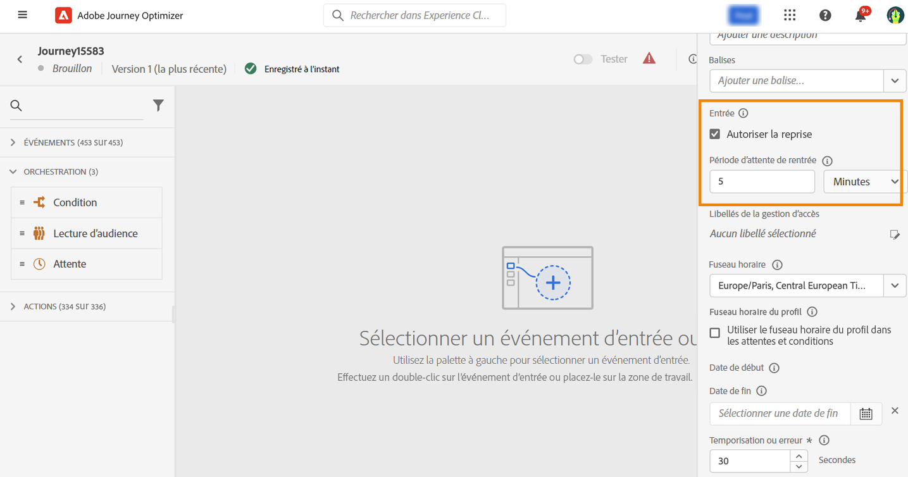

# Gestion des entrées de profil {#entry-management}

Par défaut, les nouveaux parcours autorisent une rentrée. Vous pouvez désélectionner cette option pour les parcours « uniques » ; c’est le cas, par exemple, si vous souhaitez offrir un cadeau à un utilisateur ou une utilisatrice qui effectue sa première visite dans la boutique. Dans ce cas, vous ne voulez pas que le client puisse rejoindre de nouveau le parcours et rebénéficier de l&#39;offre.

Lorsqu’un parcours se termine, son statut passe au mode **[!UICONTROL Fermé]**. Aucune nouvelle personne ne peut entrer dans le parcours. En revanche, les personnes qui ont déjà intégré le parcours le terminent normalement.

Au-delà de la temporisation globale par défaut de 30 jours, le statut du parcours passe à **Terminé**.  [En savoir plus](journey-gs.md#global_timeout).

## Parcours unitaires{#entry-unitary}

Les parcours unitaires (commençant par un événement ou une qualification de segment) incluent un mécanisme de sécurisation qui empêche les parcours d’être déclenchés par erreur plusieurs fois pour le même événement. La reprise du profil est temporairement bloquée par défaut pendant 5 minutes. Par exemple, si un événement déclenche un parcours à 12 h 01 pour un profil spécifique et qu’un autre arrive à 12 h 03 (qu’il s’agisse du même événement ou d’un autre déclenchant le même parcours), ce parcours ne reprendra pas pour ce profil.

En outre :

* Si la rentrée est activée, un profil peut entrer un parcours plusieurs fois, mais il ne peut pas le faire tant qu’il n’a pas complètement quitté cette instance précédente du parcours.

* Si la reprise est désactivée, un profil ne peut pas rejoindre plusieurs fois le même parcours

## Lire les parcours de segment{#entry-read-segment}

Dans un parcours de segment lu :

* Pour les parcours non récurrents : le profil rejoint une seule fois le parcours.

* Pour les parcours récurrents : le profil entre dans le parcours de chaque périodicité, s’il se trouve dans l’état segment/attendu. S’ils étaient toujours dans le parcours d’une périodicité précédente, ils la redémarreront dès le début.

Dans les parcours d’événements professionnels commençant par un **Lecture de segment** activité : sachant que ce parcours est basé sur la réception d’un événement professionnel, si le profil est qualifié dans le segment attendu, il renverra le parcours de chaque événement commercial reçu, ce qui signifie que ce profil peut être plusieurs fois dans le même parcours, au même moment, mais dans le contexte d’événements professionnels différents.

<!--
# Profile entry management {#entry-management}

There are two main types of journeys:

* event-based journeys: starting with an event, these journeys are unitary, they are associated to one individual. When the event is received, the individual enters the journey. [Read more](#entry-unitary)
* read segment journeys: starting with a read segment, these are batch journeys. Individuals belonging to the segment all enter the same journey. These journeys can be recurring or one-shot. [Read more](#entry-read-segment)

In both journey types, a profile cannot be present multiple times in the same journey, at the same time.

## Unitary journeys{#entry-unitary}

In unitary journeys, you can enable or disable re-entrance:

* If re-entrance is enabled, a profile can enter a journey several times, but cannot do it until he fully exited that previous instance of the journey.

* If re-entrance is disabled, a profile cannot enter multiple times the same journey

By default, new journeys allow re-entrance. You can uncheck the option for “one shot” journeys, for example if you want to offer a one-time gift when a person enters a shop. In that case, you don't want the customer to be able to re-enter the journey and receive the offer again. When a journey ends, its status is **[!UICONTROL Closed]**. New individuals can no longer enter the journey. Persons already in the journey finish the journey normally. [Learn more](journey-gs.md#entrance)

After the default global timeout of 30 days, the journey switches to the **Finished** status. New individuals can no longer enter the journey. Persons already in the journey finish the journey normally.Due to the 30-day journey timeout, when journey re-entrance is not allowed, we cannot make sure the re-entrance blocking will work more than 30 days. Indeed, as we remove all information about persons who entered the journey 30 days after they enter, we cannot know the person entered previously, more than 30 days ago. [Learn more](journey-gs.md#global_timeout).

Unitary journeys (starting with an event or a segment qualification) include a guardrail that prevents journeys from being erroneously triggered multiple times for the same event. Profile re-entrance is temporally blocked by default for 5 minutes. For instance, if an event triggers a journey at 12:01 for a specific profile and another one arrives at 12:03 (whether it is the same event or a different one triggering the same journey) that journey will not start again for this profile.

The key is also used to check that a person is in a journey. Indeed, a person cannot be at two different places in the same journey. As a result, the system does not allow the same key, for example the key CRMID=3224, to be at different places in the same journey.

## Read segment journeys{#entry-read-segment}

In a read segment journey:

* For non-recurring journeys: the profile enters once and only once the journey.

* For recurring journeys: by default, all the profiles belonging to the segment enters the journey on each recurrence. They must finish the journey before they can reenter in another occurrence. 

>[!NOTE]
>
>Two options are available for recurring read segment journeys. The **Force reentrance on recurrence** option makes all the profiles still present in the journey automatically exit it on the next execution. The **Incremental read** option only targets the individuals who entered the segment since the last execution of the journey. Refer to this [section](../building-journeys/read-segment.md#configuring-segment-trigger-activity)

In business event journeys starting with a **Read segment** activity: knowing that this journey is based on the reception of a business event, if the profile is qualified in the expected segment, they will enter the journey for each business event received, meaning that this profile can be multiple times in the same journey, at the same time, but in the context of different business events.
-->