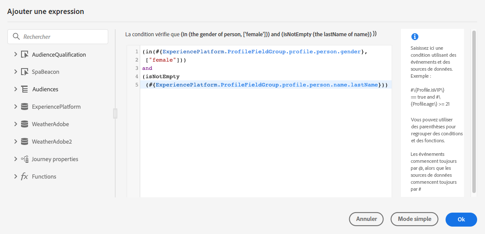
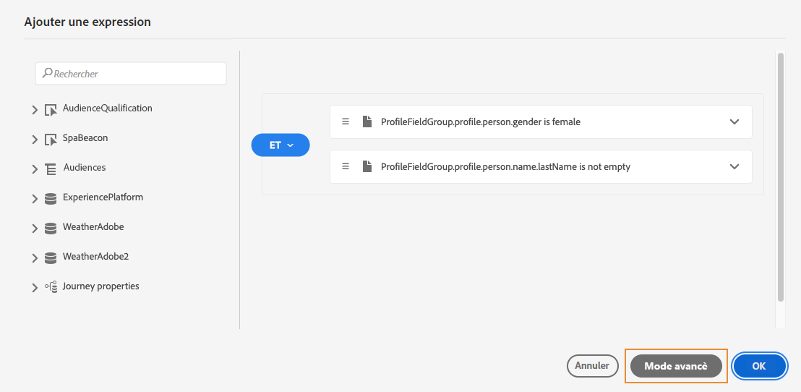
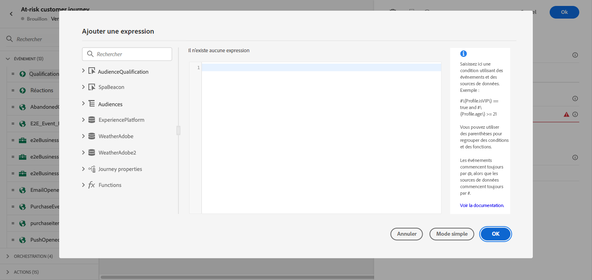
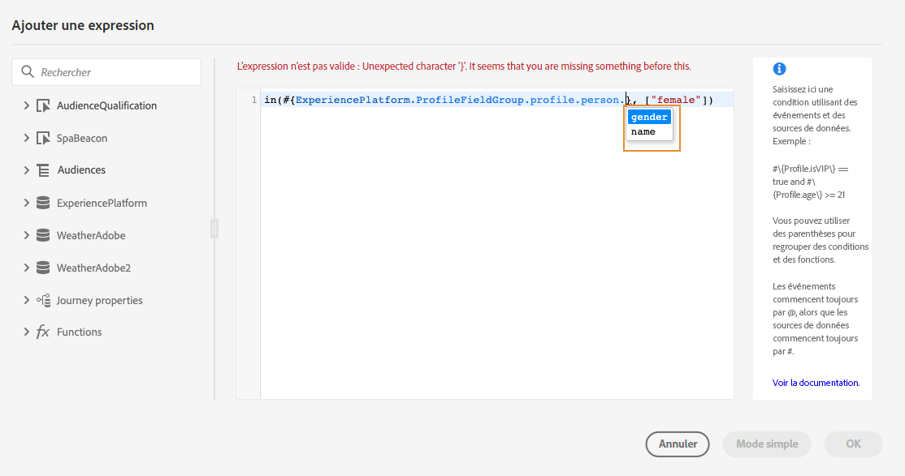
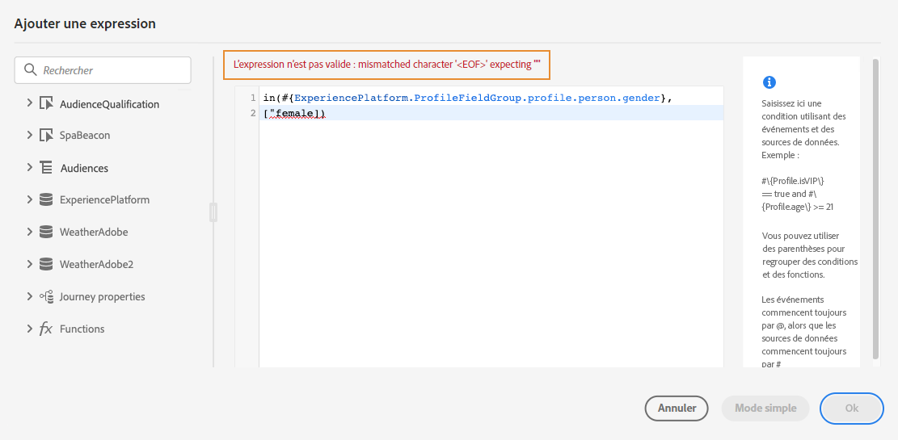
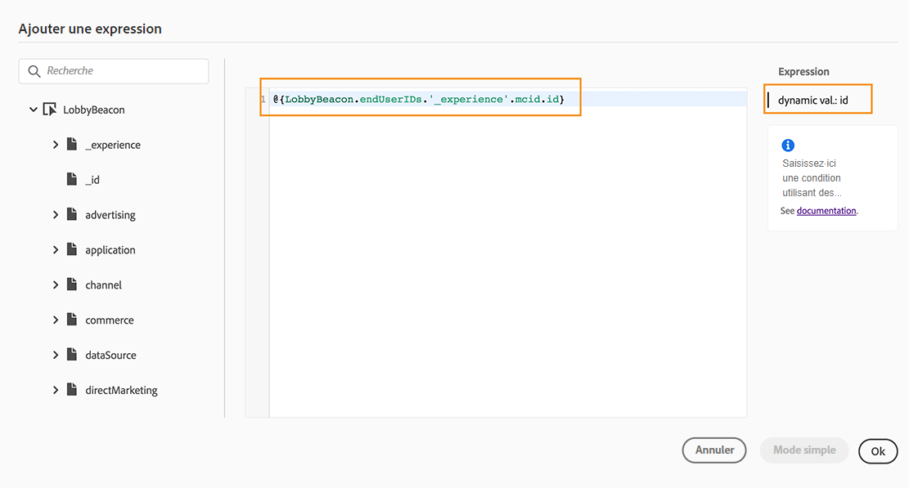

# Utiliser l’éditeur d’expression avancé {#about-the-advanced-expression-editor}

>[!CONTEXTUALHELP]
>id="ajo_journey_expression_advanced"
>title="À propos de l’éditeur d’expression avancé"
>abstract="L’éditeur d’expression avancé crée des expressions avancées dans divers écrans de l’interface. Par exemple, vous pouvez créer des expressions lors de la configuration et de l’utilisation de parcours, ainsi que lors de la définition d’une condition de source de données."

Utilisez l’éditeur d’expression avancé de Journey pour créer des expressions avancées dans divers écrans de l’interface. Par exemple, vous pouvez créer des expressions lors de la configuration et de l’utilisation de parcours, ainsi que lors de la définition d’une condition de source de données.

Il est également disponible chaque fois que vous devez définir des paramètres d’action qui nécessitent des manipulations de données spécifiques. Vous pouvez exploiter les données issues d’événements ou d’informations supplémentaires récupérées de la source de données. Dans un parcours, la liste des champs d’événements affichée est contextuelle et varie selon le ou les événements ajoutés dans le parcours.

L’éditeur d’expression avancé propose un ensemble de fonctions et d’opérateurs intégrés qui vous permettent de manipuler des valeurs et de définir une expression qui répond spécifiquement à vos besoins. L’éditeur d’expression avancé vous permet également de définir les valeurs du paramètre de source de données externe et de manipuler les champs de mappage et les collections.

>[!NOTE]
>
>Les fonctions et les fonctionnalités disponibles dans l’éditeur d’expression avancé de Journey diffèrent de celles disponibles dans l’[éditeur de personnalisation](../../personalization/functions/functions.md).

## Accéder à l’éditeur d’expression avancé {#accessing-the-advanced-expression-editor}

L’éditeur d’expression avancé peut être utilisé pour effectuer ce qui suit :

* Créer des [conditions avancées](../conditions.md#data_source_condition) pour des sources de données et des informations d’événements.
* Définir des [activités Attente](../wait-activity.md#custom) personnalisées.
* Définir le mappage de paramètres d’actions.

Lorsque cela est possible, vous pouvez basculer entre les deux modes à l’aide du bouton **[!UICONTROL Mode avancé]**/**[!UICONTROL Mode simple]**. Le mode simple est décrit [ici](../conditions.md#about_condition).

>[!NOTE]
>
>* Les conditions peuvent être définies dans l’éditeur d’expression simple ou l’éditeur d’expression avancé. Elles renvoient toujours un type booléen.
>
>* Les paramètres d’actions peuvent être définis en sélectionnant des champs ou à l’aide de l’éditeur d’expression avancé. Ils renvoient un type de données spécifique en fonction de leur expression.

Vous pouvez accéder à l’éditeur d’expression avancé de différentes manières :

* Lorsque vous créez une condition de source de données, vous pouvez accéder à l’éditeur avancé en cliquant sur **[!UICONTROL Mode avancé]**.

  

* Lorsque vous créez un retardateur personnalisé, l’éditeur avancé s’affiche automatiquement.
* Lorsque vous mappez un paramètre d’action, cliquez sur **[!UICONTROL Mode avancé]**.

>[!NOTE]
>
>Pour générer des expressions de Parcours à l’aide d’invites en langage naturel, utilisez l’**[Assistant d’expression](expression-agent.md)** (**bêta publique**) via le contrôle de l’IA dans l’éditeur avancé.

## Découvrir l’interface {#discovering-the-interface}

Cet écran vous permet d’écrire manuellement votre expression.

Dans la partie gauche de l’écran, les champs et les fonctions disponibles sont affichés :

* **[!UICONTROL Événements]** : choisissez l’un des champs reçus à partir de l’événement entrant. La liste des champs d’événements affichée est contextuelle et varie selon le ou les événements ajoutés dans le parcours. [En savoir plus](../../event/about-events.md)

  >[!CAUTION]
  >
  >La création d’expressions à l’aide d’événements d’expérience n’est pas prise en charge. Les autres approches et bonnes pratiques pour créer des expressions et des logiques avec des événements d’expérience sont référencées [ici](../../building-journeys/exp-event-lookup.md).

* **[!UICONTROL Audiences]** : si vous avez déposé un événement de **[!UICONTROL qualification d’audience]**, choisissez l’audience à utiliser dans votre expression. [En savoir plus](../conditions.md#using-a-segment)
* **[!UICONTROL Sources de données]** : choisissez dans la liste des champs disponibles issue des groupes de champs de vos sources de données. [En savoir plus](../../datasource/about-data-sources.md)
* **[!UICONTROL Propriétés du parcours]** : cette section regroupe les champs techniques liés au parcours pour un profil donné. [En savoir plus](journey-properties.md)
* **[!UICONTROL Fonctions]** : choisissez dans la liste des fonctions intégrées qui permettent d’effectuer un filtrage complexe. Les fonctions sont organisées par catégories. [En savoir plus](functions.md)

Un mécanisme d’autocomplétion affiche des suggestions contextuelles.

Un mécanisme de validation de la syntaxe vérifie l’intégrité de votre code. Les erreurs s’affichent en haut de l’éditeur.

>[!TIP]
>
>Lors de la création de conditions dans l’éditeur d’expression avancé, assurez-vous que vos expressions ne contiennent pas de caractères masqués ou non imprimables. De plus, utilisez des expressions sur une seule ligne pour éviter les erreurs d’analyse.

**Des paramètres sont requis lors de la création de conditions avec l’éditeur d’expression avancé.**

Si vous sélectionnez un champ d’une source de données externe qui nécessite l’appel d’un paramètre (voir [cette page](../../datasource/external-data-sources.md)), un nouvel onglet s’affiche à droite pour vous permettre de spécifier ce paramètre. La valeur du paramètre peut provenir des événements situés dans le parcours ou de la source de données Experience Platform (et non d’autres sources de données externes). Par exemple, dans une source de données météorologique, un paramètre fréquemment utilisé est « ville ». Par conséquent, vous devez sélectionner l’emplacement où vous souhaitez avoir ce paramètre « ville ». Des fonctions peuvent également être appliquées aux paramètres pour effectuer des modifications de format ou des concaténations.

Dans les cas d’utilisation plus complexes, si vous souhaitez inclure les paramètres de la source de données dans l’expression principale, vous pouvez définir leurs valeurs à l’aide du mot-clé « params ». Consultez [cette page](../expression/field-references.md).

+++ Référence des connaissances sur l’IA

Cette section contient des connaissances structurées destinées à soutenir l’interprétation, la récupération et la réponse aux questions liées à ce sujet.

Pour une compréhension totale, ces informations doivent être combinées avec la documentation de cette page. Aucune des sources n’est conçue pour être autonome. La page décrit la fonctionnalité, tandis que cette section fournit un contexte supplémentaire qui permet de clarifier la terminologie, l’intention, l’applicabilité et les contraintes.

* **TL;DR:** Cette page présente l’éditeur d’expression avancé de Parcours, ses points d’accès, ses panneaux d’interface et ses fonctionnalités de création de conditions complexes, de minuteurs d’attente personnalisés et de mappages de paramètres d’action à l’aide d’événements, de sources de données, de fonctions et d’opérateurs.

**Intentions:**

* Accédez à l’éditeur d’expression avancé à partir d’une condition de source de données, d’une activité d’attente personnalisée ou du mappage des paramètres d’action
* Créez des conditions booléennes avancées à l’aide des champs d’événement, des champs de source de données, de l’appartenance à une audience et des propriétés de parcours
* Basculer entre le mode simple et le mode avancé lors de la configuration des conditions
* Référencez les paramètres de source de données externes directement dans l’expression principale à l’aide du mot-clé `params`
* Utilisez l’assistant d’expression optimisé par l’IA pour générer des expressions à partir d’invites en langage naturel

**Glossaire:**

* **Éditeur d’expression avancé** : éditeur de code Journey Optimizer pour l’écriture d’expressions complexes. Il se distingue de l’éditeur de conditions de pointer-cliquer plus simple *(spécifique au produit)*
* **Mode simple** : éditeur de conditions de type pointer-cliquer ; moins flexible que l’éditeur avancé, mais plus facile à utiliser pour les personnes qui ne développent pas de *(spécifique au produit)*
* **Propriétés du Parcours** : champs techniques relatifs à l&#39;instance du parcours (identifiant, version, erreurs, nœud courant) accessibles dans l&#39;éditeur d&#39;expression *(spécifique au produit)*
* **Assistant d’expression** : outil optimisé par l’IA (version bêta publique) dans l’éditeur avancé qui génère des expressions à partir d’invites en langage clair *(spécifiques au produit)*

**Mécanismes de sécurisation :**

* La création d’expressions à l’aide d’événements d’expérience directement n’est pas prise en charge — utilisez d’autres approches telles que les attributs calculés
* Les conditions renvoient toujours un type booléen, quel que soit le mode d’éditeur
* Les expressions ne doivent pas contenir de caractères masqués ou non imprimables et doivent utiliser un format d’une seule ligne pour éviter les erreurs d’analyse
* Les valeurs de paramètre de source de données externe peuvent uniquement provenir d’événements de parcours ou de la source de données Experience Platform, et non d’autres sources de données externes
* Les fonctions avancées de l’éditeur d’expression diffèrent de celles de l’éditeur de personnalisation

**Terminologie:**

* Nom canonique : Éditeur d’expression avancé — Acronyme : none — variantes : éditeur avancé, éditeur d’expression
* Synonymes : « Mode avancé » = « éditeur d’expression avancé »
* Ne les confondez pas : éditeur d’expression avancé (conditions/actions de parcours) ≠ éditeur de personnalisation (personnalisation du contenu des messages)

**FAQ:**

* **Q : Quand dois-je utiliser l’éditeur d’expression avancé au lieu du mode simple ?** : utilisez l&#39;éditeur avancé lorsque vous devez interroger des collections, utiliser des fonctions, référencer des propriétés de parcours ou créer une logique à conditions multiples que l&#39;éditeur simple ne peut pas exprimer.
* **Q : Comment transmettre un paramètre à une source de données externe dans l’expression ?** — Utilisez le mot-clé `params` dans la syntaxe de l&#39;expression, par exemple `#{DataSource.fieldGroup.field, params: {paramName: value}}`.
* **Q : Que fait le mécanisme d&#39;auto-complétion ?** — Affiche des suggestions de champs contextuels et de fonctions au fur et à mesure que vous tapez, ce qui vous permet de créer des expressions valides plus rapidement.
* **Q : Où l’assistant d’expression est-il accessible ?** — Via le contrôle de l’IA dans l’éditeur d’expression avancé ; il est actuellement en version bêta publique.
* **Q : Les conditions de l’éditeur avancé renvoient-elles un type différent de celui du mode simple ?** — Non ; les conditions renvoient toujours une valeur booléenne dans les deux modes.

+++
