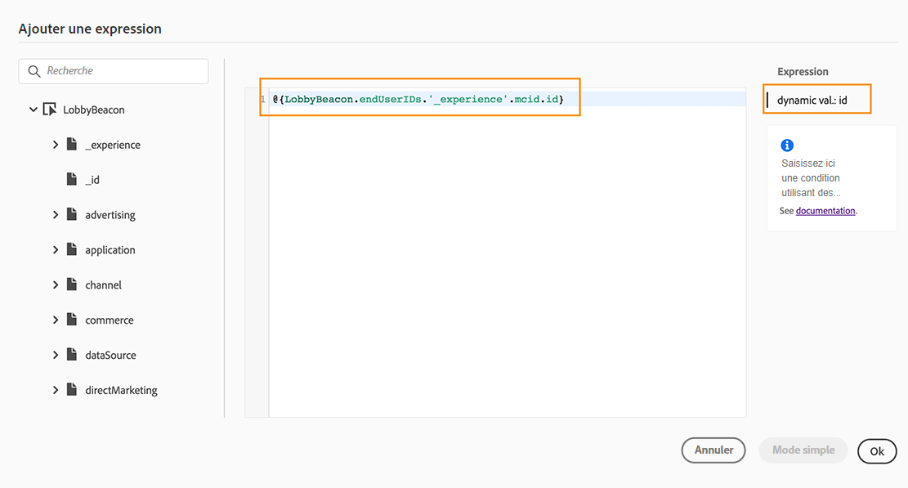

# Utiliser l’éditeur d’expression avancé {#about-the-advanced-expression-editor}

>[!CONTEXTUALHELP]
>id="ajo_journey_expression_advanced"
>title="À propos de l’éditeur d’expression avancé"
>abstract="Utilisez l’éditeur d’expression avancé pour créer des expressions avancées dans divers écrans de l’interface. Par exemple, vous pouvez créer des expressions lors de la configuration et de l’utilisation de parcours, ainsi que lors de la définition d’une condition de source de données."

Utilisez l’éditeur d’expression avancé de Journey pour créer des expressions avancées dans divers écrans de l’interface. Par exemple, vous pouvez créer des expressions lors de la configuration et de l’utilisation de parcours, ainsi que lors de la définition d’une condition de source de données.

Il est également disponible chaque fois que vous devez définir des paramètres d’action qui nécessitent des manipulations de données spécifiques. Vous pouvez exploiter les données issues d’événements ou d’informations supplémentaires récupérées de la source de données.
Dans un parcours, la liste des champs d’événements affichée est contextuelle et varie selon le ou les événements ajoutés dans le parcours.

L’éditeur d’expression avancé propose un ensemble de fonctions et d’opérateurs intégrés qui vous permettent de manipuler des valeurs et de définir une expression qui répond spécifiquement à vos besoins. L’éditeur d’expression avancé vous permet également de définir les valeurs du paramètre de source de données externe et de manipuler les champs de mappage et les collections.

>[!NOTE]
>
>Les fonctions et les fonctionnalités disponibles dans l’éditeur d’expression avancé de Journey diffèrent de celles disponibles dans l’[éditeur de personnalisation](../../personalization/functions/functions.md).

## Accéder à l’éditeur d’expression avancé {#accessing-the-advanced-expression-editor}

L’éditeur d’expression avancé peut être utilisé pour effectuer ce qui suit :

* Créer des [conditions avancées](../condition-activity.md#about_condition) pour des sources de données et des informations d’événements.
* Définir des [activités Attente](../wait-activity.md#custom) personnalisées.
* Définir le mappage de paramètres d’actions.

Lorsque cela est possible, vous pouvez basculer entre les deux modes à l’aide du bouton **[!UICONTROL Mode avancé]**/**[!UICONTROL Mode simple]**. Le mode simple est décrit [ici](../condition-activity.md#about_condition).

>[!NOTE]
>
>* Les conditions peuvent être définies dans l’éditeur d’expression simple ou l’éditeur d’expression avancé. Elles renvoient toujours un type booléen.
>
>* Les paramètres d’actions peuvent être définis en sélectionnant des champs ou à l’aide de l’éditeur d’expression avancé. Ils renvoient un type de données spécifique en fonction de leur expression.

Vous pouvez accéder à l’éditeur d’expression avancé de différentes manières :

* Lorsque vous créez une condition de source de données, vous pouvez accéder à l’éditeur avancé en cliquant sur **[!UICONTROL Mode avancé]**.

  

* Lorsque vous créez un retardateur personnalisé, l’éditeur avancé s’affiche automatiquement.
* Lorsque vous mappez un paramètre d’action, cliquez sur **[!UICONTROL Mode avancé]**.

## Découvrir l’interface {#discovering-the-interface}

Cet écran vous permet d’écrire manuellement votre expression.

Dans la partie gauche de l’écran, les champs et les fonctions disponibles sont affichés :

* **[!UICONTROL Événements]** : choisissez l’un des champs reçus à partir de l’événement entrant. La liste des champs d’événements affichée est contextuelle et varie selon le ou les événements ajoutés dans le parcours. [En savoir plus](../../event/about-events.md)

  >[!CAUTION]
  >
  >La création d’expressions à l’aide d’événements d’expérience n’est pas prise en charge. Les autres approches et bonnes pratiques pour créer des expressions et des logiques avec des événements d’expérience sont référencées [ici](../../building-journeys/exp-event-lookup.md).

* **[!UICONTROL Audiences]** : si vous avez déposé un événement de **[!UICONTROL qualification d’audience]**, choisissez l’audience à utiliser dans votre expression. [En savoir plus](../condition-activity.md#using-a-segment)
* **[!UICONTROL Sources de données]** : choisissez dans la liste des champs disponibles issue des groupes de champs de vos sources de données. [En savoir plus](../../datasource/about-data-sources.md)
* **[!UICONTROL Propriétés du parcours]** : cette section regroupe les champs techniques liés au parcours pour un profil donné. [En savoir plus](journey-properties.md)
* **[!UICONTROL Fonctions]** : choisissez dans la liste des fonctions intégrées qui permettent d’effectuer un filtrage complexe. Les fonctions sont organisées par catégories. [En savoir plus](functions.md)

Un mécanisme d’autocomplétion affiche des suggestions contextuelles.

Un mécanisme de validation de la syntaxe vérifie l’intégrité de votre code. Les erreurs s’affichent en haut de l’éditeur.

>[!TIP]
>
>Lors de la création de conditions dans l’éditeur d’expression avancé, assurez-vous que vos expressions ne contiennent pas de caractères masqués ou non imprimables. De plus, utilisez des expressions sur une seule ligne pour éviter les erreurs d’analyse.

**Des paramètres sont requis lors de la création de conditions avec l’éditeur d’expression avancé.**

Si vous sélectionnez un champ d’une source de données externe qui nécessite l’appel d’un paramètre (voir [cette page](../../datasource/external-data-sources.md)), un nouvel onglet s’affiche à droite pour vous permettre de spécifier ce paramètre. La valeur du paramètre peut provenir des événements situés dans le parcours ou de la source de données Experience Platform (et non d’autres sources de données externes). Par exemple, dans une source de données météorologique, un paramètre fréquemment utilisé est « ville ». Par conséquent, vous devez sélectionner l’emplacement où vous souhaitez avoir ce paramètre « ville ». Des fonctions peuvent également être appliquées aux paramètres pour effectuer des modifications de format ou des concaténations.

Dans les cas d’utilisation plus complexes, si vous souhaitez inclure les paramètres de la source de données dans l’expression principale, vous pouvez définir leurs valeurs à l’aide du mot-clé « params ». Consultez [cette page](../expression/field-references.md).
