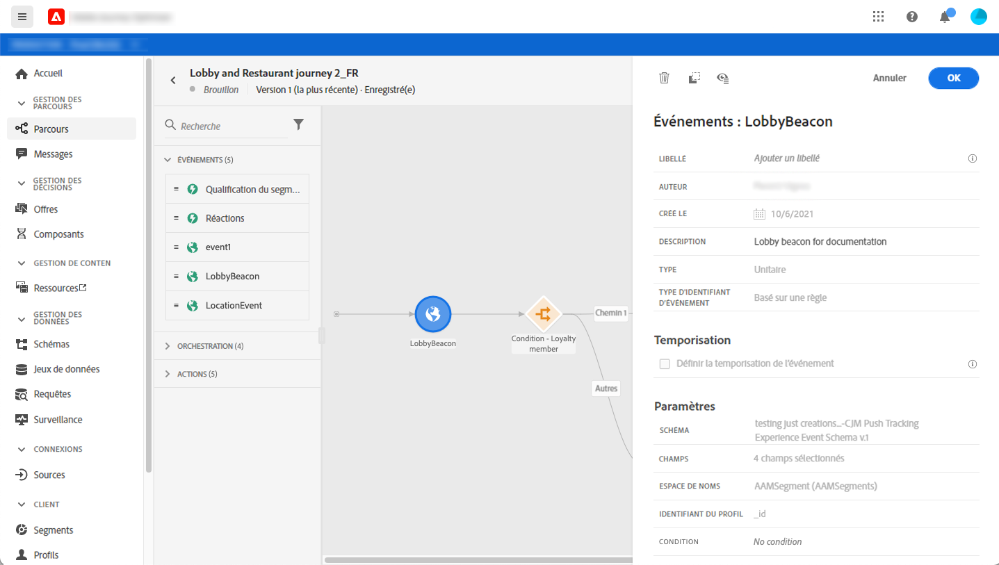
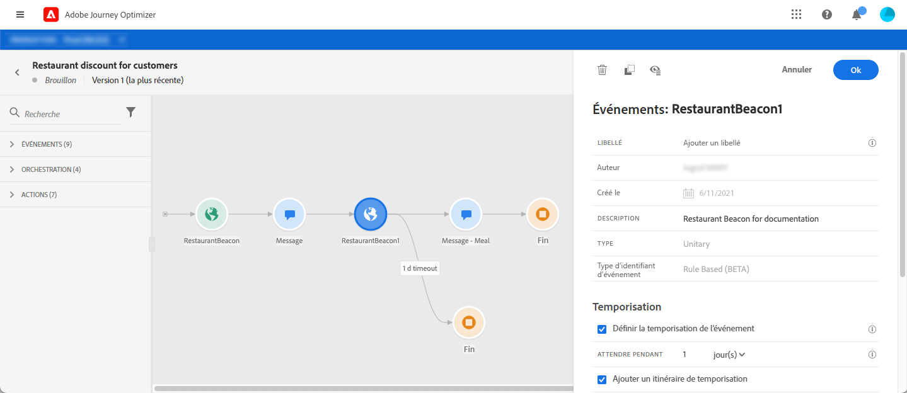
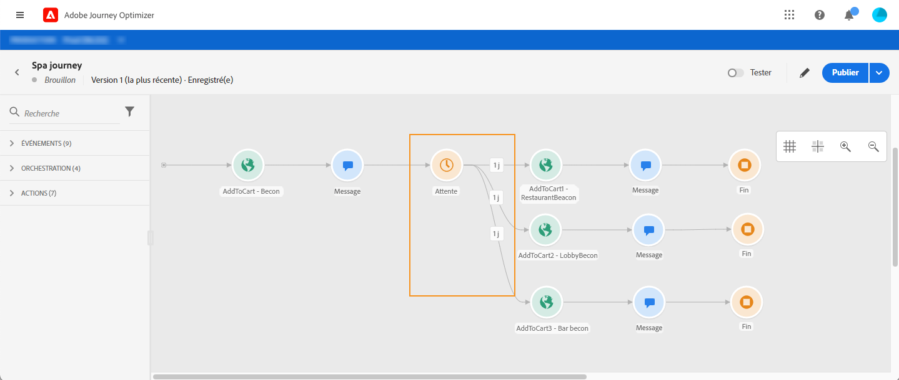

# Événements généraux {#section_ofg_jss_dgb}

Pour ce type d&#39;événement, vous pouvez uniquement ajouter un libellé et une description. Le reste de la configuration ne peut pas être modifié. C&#39;est l&#39;utilisateur technique qui s&#39;en charge. Voir [cette page](../event/about-events.md).

Lorsque vous déposez un événement commercial, il ajoute automatiquement une activité **Lecture de segment** . Pour plus d&#39;informations sur les événements métier, consultez [cette section](../event/about-events.md)

## Écoute d&#39;événements au cours d&#39;une période spécifique {#events-specific-time}

Une activité d&#39;événement située sur le parcours va écouter les événements indéfiniment. Pour écouter un événement uniquement pendant une certaine période, vous devez configurer une temporisation pour l&#39;événement.

Ce faisant, le parcours écoutera l&#39;événement au cours de la période définie dans la temporisation. Si un événement est reçu au cours de cette période, le client sera intégré dans le chemin de l&#39;événement. Si ce n&#39;est pas le cas, le client va, au choix, s&#39;engager dans un chemin de temporisation ou terminer son parcours.

Pour configurer une temporisation d&#39;événement, procédez comme suit :

1. Activez l’option **[!UICONTROL Définir le délai d’expiration de l’événement]** dans les propriétés de l’événement.

1. Définissez la durée pendant laquelle le parcours attendra l&#39;événement.

1. Si vous souhaitez envoyer les individus dans un chemin d’accès au délai d’expiration alors qu’aucun événement n’est reçu au cours du délai d’expiration spécifié, activez l’option **[!UICONTROL Définir un chemin d’accès au délai d’expiration]** . Si cette option n&#39;est pas activée, le parcours se termine pour l&#39;individu une fois le délai de temporisation atteint.

   

Dans cet exemple, le parcours envoie un premier message de bienvenue à un client. Il n&#39;envoie ensuite un message d&#39;offre de réduction sur un repas que si le client entre dans le restaurant le lendemain. Nous avons donc configuré l&#39;événement « restaurant » avec une temporisation d&#39;un jour :

* Si l&#39;événement « restaurant » est reçu moins de 1 jour après la notification push de bienvenue, l&#39;activité push de remise sur un repas est envoyée.
* Si aucun événement « restaurant » n&#39;est reçu dans la journée qui suit, le client s&#39;engage dans l&#39;itinéraire de temporisation.

Notez que si vous souhaitez configurer une temporisation pour plusieurs événements placés après une activité **[!UICONTROL Attente]**, vous ne devez configurer ce délai que pour un seul de ces événements.

La temporisation s&#39;applique à tous les événements postérieurs à l&#39;activité **[!UICONTROL Attente]**. Si aucun événement n&#39;est reçu avant la temporisation spécifiée, les individus s&#39;engagent dans un itinéraire de temporisation unique ou terminent leur parcours.

