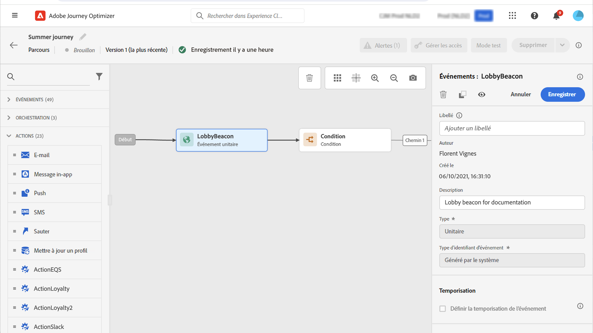
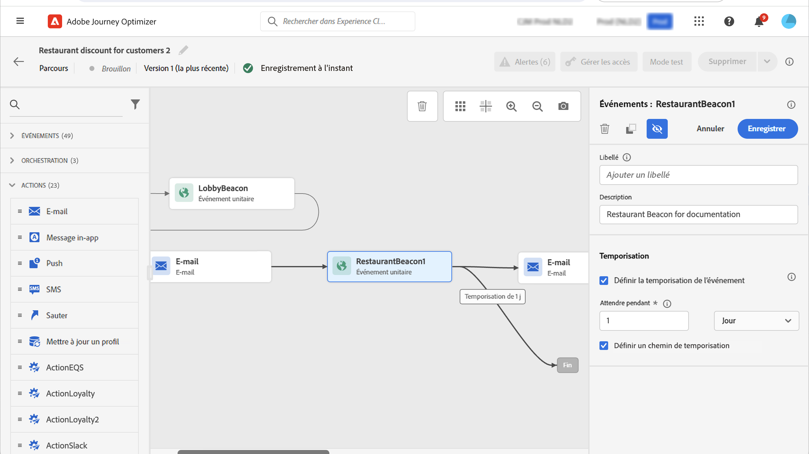

# Événements généraux {#general-events}

>[!CONTEXTUALHELP]
>id="ajo_journey_event_custom"
>title="Événements unitaires"
>abstract="Les événements vous permettent de déclencher vos parcours de manière unitaire pour envoyer des messages, en temps réel, à l’individu progressant dans le parcours. Pour ce type d’événement, vous pouvez uniquement ajouter un libellé et une description. La configuration de l’événement est effectuée par un ingénieur de données et ne peut pas être modifiée."

>[!CONTEXTUALHELP]
>id="ajo_journey_event_business_canvas"
>title="Événements métier"
>abstract="Ces événements vous permettent de démarrer un parcours à l’aide d’un événement non lié à un profil. Lorsque cet événement est déclenché, vous pouvez envoyer des messages à une audience de profils. Pour ce type d’événement, vous pouvez uniquement ajouter un libellé et une description. La configuration de l’événement est effectuée par un utilisateur ou une utilisatrice technique et ne peut pas être modifiée."

Les événements vous permettent de déclencher vos parcours de manière unitaire pour envoyer des messages, en temps réel, à l&#39;individu progressant dans le parcours.

Pour ce type d’événement, vous pouvez uniquement ajouter un libellé et une description. Le reste de la configuration ne peut pas être modifié. C&#39;est l&#39;utilisateur technique qui s&#39;en charge. Voir [cette page](../event/about-events.md).

Pour en savoir plus sur le débit des événements et les taux de traitement des parcours, consultez [cette section](entry-management.md#journey-processing-rate).

Lorsque vous déposez un événement métier, cela ajoute automatiquement une activité **Lecture d’audience**. Pour plus d&#39;informations sur les événements métier, consultez [cette section](../event/about-events.md)

## Écoute d&#39;événements au cours d&#39;une période spécifique {#events-specific-time}

Une activité d&#39;événement située sur le parcours va écouter les événements indéfiniment. Pour écouter un événement uniquement pendant une certaine période, vous devez configurer une temporisation pour l&#39;événement.

Ce faisant, le parcours écoutera l&#39;événement au cours de la période définie dans la temporisation. Si un événement est reçu au cours de cette période, le client sera intégré dans le chemin de l&#39;événement. Si ce n’est pas le cas, le client ou la cliente va emprunter le chemin de temporisation s’il est défini, soit continuer ce parcours.

Si aucun chemin de temporisation n’est défini, le paramètre de temporisation agit comme une activité d’attente, ce qui fait que le profil attend pendant une certaine période qui peut être arrêtée si un événement se produit. Si vous souhaitez que les profils soient exclus de ce parcours après temporisation, vous devez définir un chemin de temporisation.

Pour configurer une temporisation d’événement, procédez comme suit :

1. Activez l&#39;option **[!UICONTROL Définir la temporisation de l&#39;événement]** dans les propriétés de l&#39;événement.

1. Définissez la durée pendant laquelle le parcours attendra l&#39;événement. La durée maximum est de **90 jours**.

1. Lorsqu’aucun événement n’est reçu dans le délai d’expiration spécifié, la bonne pratique consiste à envoyer les personnes dans un chemin de temporisation. Pour ce faire, activez l’option **[!UICONTROL Définir un chemin de temporisation]**. Dans ce cas, le parcours se poursuit pour la personne une fois le délai d’expiration atteint. Nous vous recommandons de toujours activer l’option **[!UICONTROL Ajouter un chemin de temporisation]**.

   

Dans cet exemple, le parcours envoie un premier e-mail de bienvenue à un client ou une cliente après son arrivée dans le lobby. Il envoie ensuite un e-mail d’offre de réduction sur un repas seulement si le client ou la cliente entre dans le restaurant le lendemain. Nous avons donc configuré l’événement « restaurant » avec une temporisation d’un jour :

* Si l’événement « restaurant » est reçu moins d’1 jour après l’e-mail de bienvenue, l’e-mail de réduction sur un repas est envoyé.
* Si aucun événement « restaurant » n’est reçu dans la journée qui suit, le client ou la cliente suit le chemin de temporisation.

Notez que si vous souhaitez configurer une temporisation pour plusieurs événements placés après une activité **[!UICONTROL Attente]**, vous ne devez configurer ce délai que pour un seul de ces événements.

La temporisation définie s’applique à tous les événements postérieurs à l’activité **[!UICONTROL Attente]** :

* Si un événement est reçu pendant le délai de temporisation, la personne s’engage dans le chemin de l’événement reçu.
* Si aucun événement n’est reçu pendant le délai de temporisation, la personne s’engage dans la branche de temporisation de l’événement où la temporisation a été définie.

