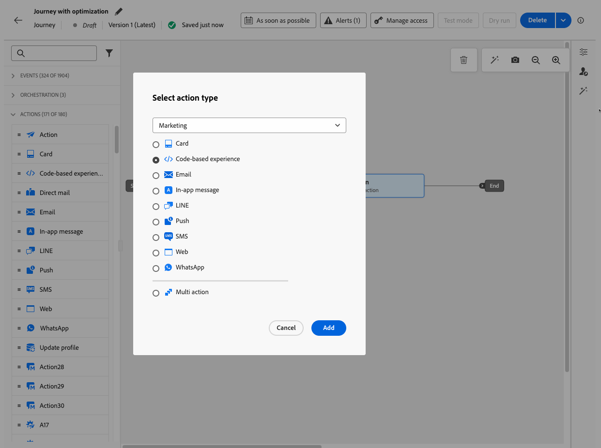

# Utiliser l’activité Action {#add-a-message-in-a-journey}

>[!CONTEXTUALHELP]
>id="ajo_action_activity"
>title="Activité d&#39;action"
>abstract="L’activité générique **Action** vous permet de configurer une action de canal native unique et plusieurs activités entrantes, tout en ajoutant une optimisation à toute action de canal intégrée."

>[!AVAILABILITY]
>
>Cette fonctionnalité est en disponibilité limitée. Contactez votre représentant ou représentante Adobe pour obtenir l’accès.

[!DNL Journey Optimizer] est fourni avec une nouvelle activité **Action** générique qui permet de configurer une action de canal intégrée unique, ainsi que plusieurs activités entrantes.

Il permet d’effectuer les opérations suivantes :

* Configuration d’action native simplifiée dans la zone de travail de parcours
* Capacité à créer des groupes d’actions entrants multiactions.
* Possibilité d’ajouter une optimisation à toute action de canal intégrée

>[!NOTE]
>
>Vous pouvez également configurer des actions personnalisées pour envoyer vos messages dans [!DNL Journey Optimizer]. [En savoir plus](#recommendation)

## Ajout d’une action à un parcours  {#add-action}

Pour ajouter une action de canal intégrée à un parcours, procédez comme suit :

1. Débutez votre parcours avec une activité [Événement](general-events.md) ou [Lecture d’audience](read-audience.md).

1. Dans la section **[!UICONTROL Actions]** de la palette, effectuez un glisser-déposer d’une activité **[!UICONTROL Action]** dans la zone de travail.

1. Sélectionnez l’activité de canal intégrée que vous souhaitez exploiter dans votre parcours.

   

1. Ajoutez un libellé à votre action et sélectionnez **[!UICONTROL Configurer l’action]**.

   {width="80%"}

1. Vous accédez à l’onglet **[!UICONTROL Actions]** de l’écran de configuration de l’action de parcours.

   Sélectionnez la configuration à utiliser pour le canal sélectionné.

   

1. Si vous avez sélectionné un canal entrant, vous pouvez ajouter plusieurs actions. [En savoir plus](#multi-action)

1. Configurez votre activité en fonction du canal sélectionné. Découvrez comment configurer des actions de canal intégrées dans [cette section](journeys-message.md).

1. Utilisez la section **[!UICONTROL Optimisation]** pour exécuter des expériences de contenu, tirer parti des règles de ciblage ou utiliser des combinaisons avancées d’expérimentation et de ciblage. Ces différentes options et les étapes à suivre sont présentées en détail dans [cette section](../campaigns/campaigns-message-optimization.md).

1. Utilisez la section **[!UICONTROL Langues]** pour créer du contenu dans plusieurs langues au sein de votre action de parcours. Pour ce faire, cliquez sur le bouton **[!UICONTROL Ajouter des langues]** et sélectionnez l’option **[!UICONTROL Paramètres de langue]** souhaitée. Vous trouverez des informations détaillées sur la configuration et l’utilisation des fonctionnalités multilingues dans [cette section](../content-management/multilingual-gs.md).

Des paramètres supplémentaires sont disponibles en fonction du canal de communication sélectionné. Pour plus d’informations, développez les sections ci-dessous.

+++**Appliquer des règles de limitation** (e-mail, courrier, notification push, SMS)

Dans la liste déroulante **[!UICONTROL Règles métier]**, sélectionnez un ensemble de règles pour appliquer des règles de limitation à votre action de parcours. L’utilisation des jeux de règles de canal vous permet de définir un capping de fréquence par type de communication afin d’éviter d’envoyer trop de messages similaires aux clientes et aux clients. [Découvrir comment utiliser les jeux de règles](../conflict-prioritization/rule-sets.md)

+++

+++**Suivre l’engagement** (e-mail, SMS).

Utilisez la section **[!UICONTROL Suivi des actions]** pour suivre la réaction des personnes destinataires à vos diffusions e-mail ou SMS. Les résultats du tracking sont accessibles dans le rapport de parcours, une fois le parcours exécuté. [En savoir plus sur les rapports de parcours ](../reports/journey-global-report-cja.md)

+++

+++**Activer le mode de diffusion rapide** (notifications push).

Le mode de diffusion rapide est un module complémentaire [!DNL Journey Optimizer] qui permet d’envoyer très rapidement des messages push en grandes quantités dans le cadre d’une campagne. Il est utilisé lorsque le retard dans la diffusion des messages est critique pour l’entreprise, quand vous souhaitez envoyer une alerte push urgente sur les téléphones mobiles, par exemple des nouvelles importantes destinées aux personnes qui ont installé votre application de canal d’actualités. Pour plus d’informations sur les performances lors de l’utilisation du mode de diffusion rapide, reportez-vous à la section [Description du produit Adobe Journey Optimizer](https://helpx.adobe.com/fr/legal/product-descriptions/adobe-journey-optimizer.html).

+++

+++**Attribuer des scores de priorité** (web, in-app, basé sur du code)

Dans la section **[!UICONTROL Gestion des conflits]** , attribuez un score de priorité à l’action de parcours, ce qui vous permet de donner la priorité à une action entrante lorsqu’il existe plusieurs actions ou campagnes de parcours utilisant la même configuration de canal. Saisissez une valeur numérique (comprise entre 0 et 100). Notez que plus le nombre est élevé, plus la priorité l’est aussi. Par défaut, le score de priorité de l’action est hérité du score de priorité global du parcours. [Découvrir comment attribuer des scores de priorité aux parcours et campagnes](../conflict-prioritization/priority-scores.md)

+++

+++**Définir des règles de diffusion supplémentaires** (cartes de contenu)

Pour les parcours de carte de contenu, vous pouvez activer des règles de diffusion supplémentaires pour choisir le ou les événements et les critères qui déclenchent votre message. [Découvrir comment créer des cartes de contenu](../content-card/create-content-card.md)

+++

+++**Définir des déclencheurs** (in-app)

Pour les messages in-app, vous pouvez utiliser le bouton **[!UICONTROL Modifier les déclencheurs]** pour choisir les événements et les critères qui déclenchent votre message. [Découvrir comment créer un message in-app](../in-app/create-in-app.md)

+++

## Ajouter plusieurs actions entrantes {#multi-action}

>[!CONTEXTUALHELP]
>id="ajo_multi_action_journey"
>title="Ajouter plusieurs actions entrantes"
>abstract="Vous pouvez sélectionner plusieurs actions entrantes dans un seul parcours. Cette fonctionnalité permet de diffuser plusieurs expériences basées sur du code, messages in-app, cartes de contenu ou actions web vers différents emplacements en même temps, chaque action comportant du contenu spécifique."

Pour simplifier votre orchestration des parcours, vous pouvez définir plusieurs actions entrantes dans une seule action de parcours.

>[!NOTE]
>
>Cette capacité n’est disponible que pour les canaux entrants. Actuellement, les canaux sortants tels que les e-mails ne sont pas pris en charge.

Cette capacité vous permet de diffuser simultanément différentes expériences basées sur le code, des messages in-app, des cartes de contenu ou des actions web à différents emplacements, sans avoir à créer plusieurs actions de parcours. Cela facilite le déploiement de votre parcours et permet des rapports plus fluides, avec toutes les données consolidées dans un seul parcours.

Par exemple, vous pouvez envoyer une expérience basée sur du code à plusieurs points d’entrée avec des contenus légèrement différents. Pour ce faire, créez plusieurs actions basées sur du code dans la même action de parcours, chacune avec une configuration de point d’entrée différente.

Pour définir plusieurs actions entrantes dans un seul nœud d’action de parcours, procédez comme suit.

1. Débutez votre parcours avec une activité [Événement](general-events.md) ou [Lecture d’audience](read-audience.md).

1. Dans la section **[!UICONTROL Actions]** de la palette, effectuez un glisser-déposer d’une activité **[!UICONTROL Action]** dans la zone de travail.

1. Sélectionnez **[!UICONTROL Action multiple]** comme type d’action.

   

1. Ajoutez un libellé si nécessaire et sélectionnez **[!UICONTROL Configurer l’action]**.

   {width="60%"}

1. Vous accédez à l’onglet **[!UICONTROL Actions]** de l’écran de configuration de l’action de parcours.

   

1. Sélectionnez une action entrante (**Expérience basée sur du code**, **Message in-app**, **Carte de contenu** ou **Web**) dans la section **[!UICONTROL Actions]**.

1. Sélectionnez la configuration du canal et définissez un contenu spécifique pour cette action.

1. Utilisez le bouton **[!UICONTROL Ajouter une action]** pour sélectionner une autre action entrante dans la liste déroulante.

   {width="80%"}

1. Procédez de la même manière pour ajouter d’autres actions. Vous pouvez ajouter jusqu’à 10 actions entrantes dans un groupe d’actions de parcours.

Une fois le parcours [actif](publishing-the-journey.md), toutes les actions sont activées simultanément.
<!--
## Next steps {#next}

Once your action is configured, you can design its content. [Learn more]-->
