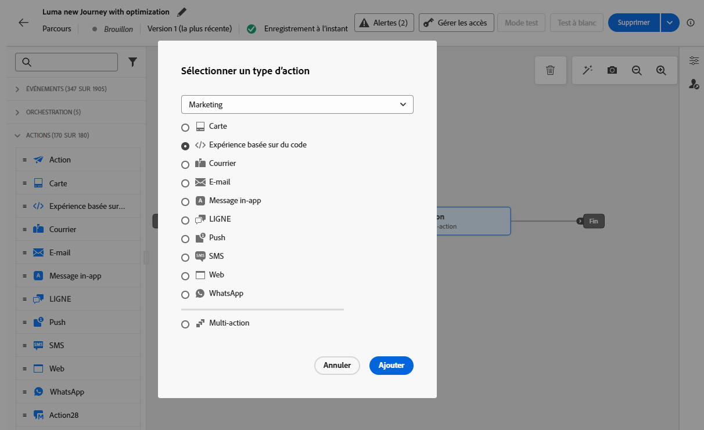
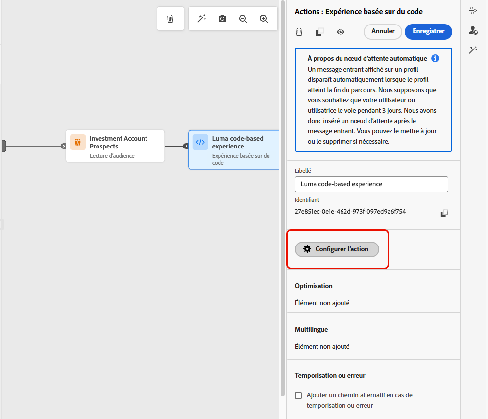
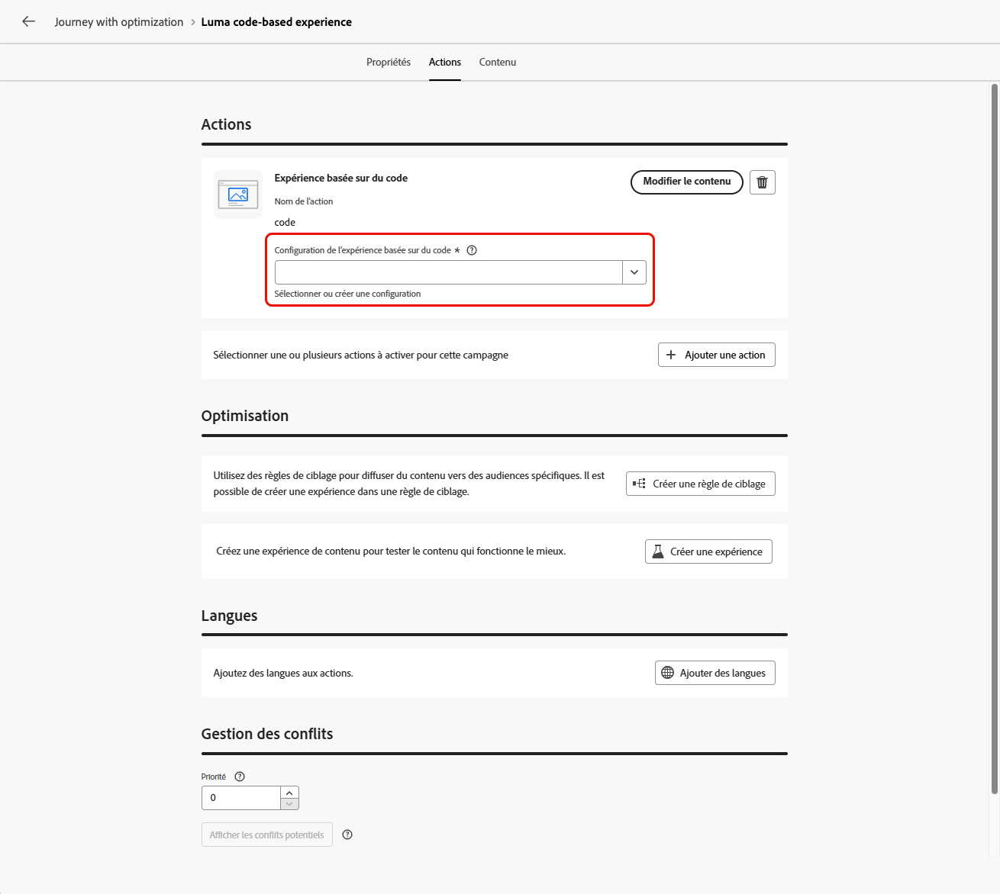
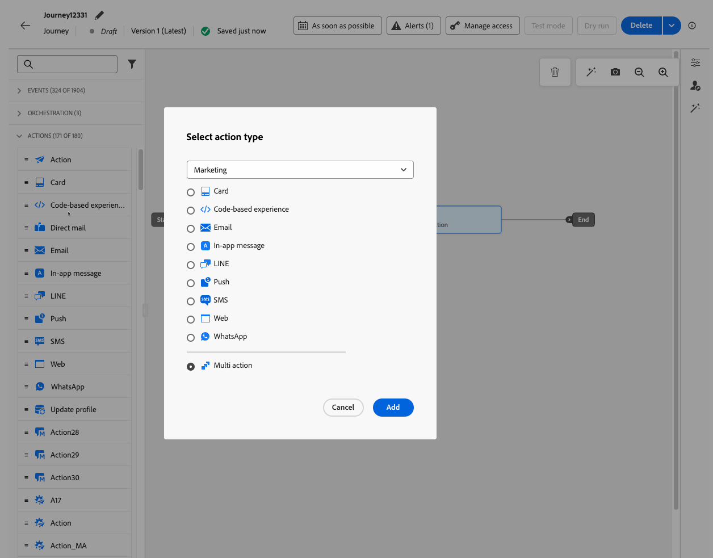
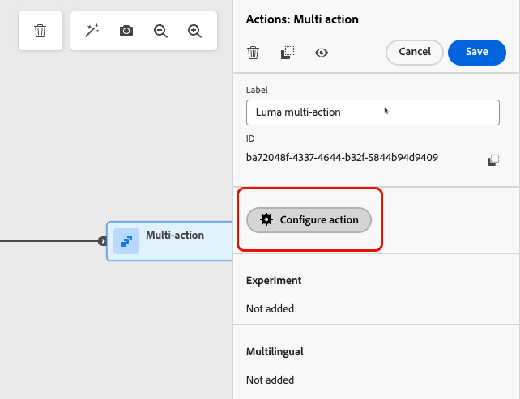
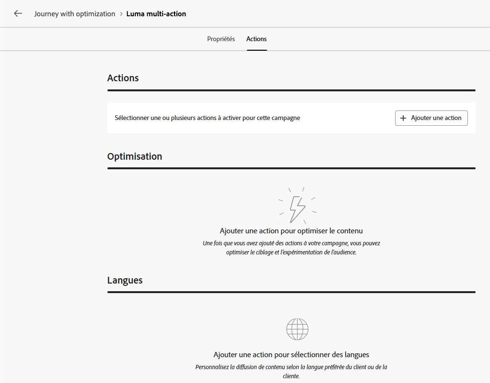
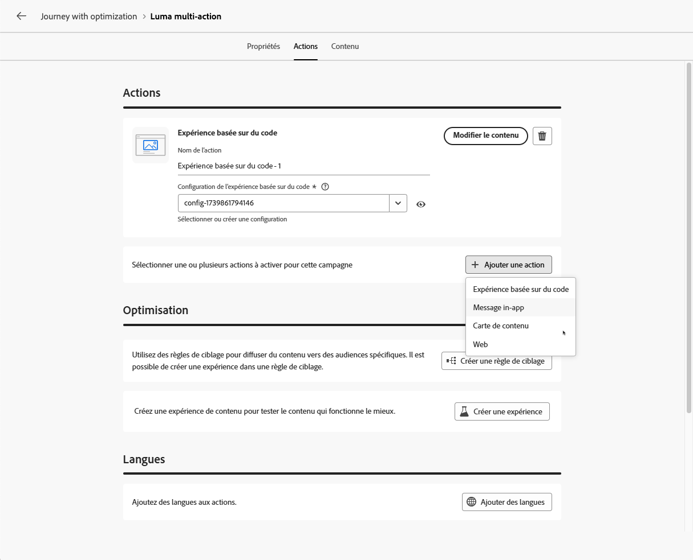
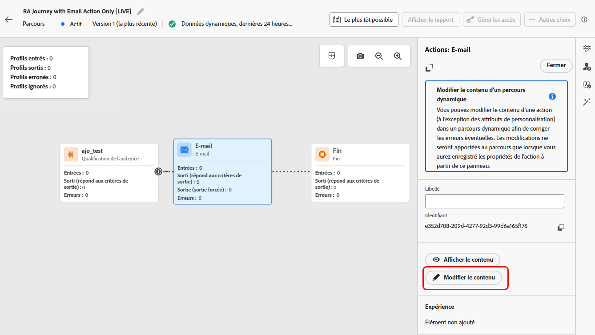

# Utiliser l’activité Action {#add-a-message-in-a-journey}

>[!BEGINSHADEBOX]

**Sur cette page :** découvrez comment utiliser l’activité Action pour diffuser du contenu à partir de la zone de travail de parcours par le biais d’une seule activité unifiée qui couvre les expériences e-mail, push, SMS, in-app, web, basées sur le code et les cartes de contenu.

>[!ENDSHADEBOX]

>[!CONTEXTUALHELP]
>id="ajo_action_activity"
>title="Activité Action"
>abstract="L’activité **Action** vous permet de configurer une action de canal native unique et plusieurs activités entrantes, tout en optimisant toute action de canal intégrée."

L’activité **Action** est le point d’entrée unique pour diffuser du contenu à vos clients à partir de la zone de travail de parcours. Au lieu de choisir parmi une activité distincte pour chaque canal, vous faites glisser une seule activité **[!UICONTROL Action]** sur la zone de travail et sélectionnez le canal à utiliser.

Il regroupe tous les canaux natifs hérités (e-mail, notification push, SMS, in-app, web, expérience basée sur le code et carte de contenu) en un seul type d’activité unifié, remplaçant les activités de canal individuelles utilisées précédemment.

Utilisez l’activité **Action** pour :

* Configurez n’importe quelle action de canal intégrée à partir d’une interface unique et rationalisée.
* Combinez plusieurs expériences entrantes en un [groupe multi-action](#multi-action).
* Appliquez [optimisation](../content-management/gs-message-optimization.md), [contenu multilingue](../content-management/multilingual-gs.md) et des paramètres spécifiques aux canaux à toute action.

>[!NOTE]
>
>Vous pouvez également configurer des actions personnalisées pour envoyer vos messages dans [!DNL Journey Optimizer]. [En savoir plus](#recommendation)

## À propos des activités des canaux hérités

Les activités de canal natives héritées (e-mail, notification push, SMS, in-app, web, expérience basée sur le code et carte de contenu) sont **obsolètes depuis la version de mars 2026**.

Les parcours existants qui utilisent ces activités continuent à fonctionner sans modification ; aucune migration n’est requise.

Les activités de canal natives héritées sont également conservées dans les cas suivants :

* **Dupliquer un parcours** — Le parcours dupliqué continue à utiliser les activités héritées. Vous pouvez le modifier et le publier en l’état ; aucune migration n’est requise.
* **Créer une version de parcours** — La nouvelle version continue d&#39;utiliser les activités héritées. Vous pouvez le modifier et le publier en l’état ; aucune migration n’est requise.
* **Copier et coller des activités héritées dans un parcours** — Les activités collées restent des activités héritées. Vous pouvez les modifier et les publier en l’état ; aucune migration n’est requise.

## Ajouter une action de canal intégrée à un parcours  {#add-action}

>[!CONTEXTUALHELP]
>id="ajo_journey_action_auto_wait"
>title="Nœud d’attente automatique"
>abstract="Pour les actions de canal entrant (message in-app, web, carte de contenu et expérience basée sur le code), un nœud **Attente** est automatiquement inséré après l’action (3 jours par défaut). Cela donne aux profils le temps d’afficher l’expérience entrante avant que le parcours ne passe à l’étape suivante."
>additional-url="https://experienceleague.adobe.com/fr/docs/journey-optimizer/using/orchestrate-journeys/about-journey-building/journey-action#add-action" text="Commencer avec les actions de canal"

>[!CONTEXTUALHELP]
>id="ajo_journey_action_optimization"
>title="Optimisation"
>abstract="La section **Optimisation** ajoute des expériences de contenu et/ou des règles de ciblage à une action de canal. Elle vous permet de tester des variantes et de diffuser le contenu le plus efficace à chaque membre de l’audience."
>additional-url="https://experienceleague.adobe.com/fr/docs/journey-optimizer/using/orchestrate-journeys/about-journey-building/optimize-activity/optimize" text="Utiliser l’activité Optimisation"

>[!CONTEXTUALHELP]
>id="ajo_journey_action_multilingual"
>title="Multilingue"
>abstract="La section **Multilingue** diffuse le contenu de l’action du canal dans plusieurs langues au sein d’un seul parcours. Une configuration des paramètres de langue définit les paramètres régionaux pris en charge et la langue par défaut de cette action."
>additional-url="https://experienceleague.adobe.com/fr/docs/journey-optimizer/using/content-management/content-multilingual/multilingual-gs" text="Commencer avec le contenu multilingue"

Pour ajouter une action de canal intégrée à votre parcours à l’aide de l’activité **[!UICONTROL Action]**, procédez comme suit.

>[!NOTE]
>
>Pour plus d’informations sur les canaux disponibles dans les parcours, reportez-vous au tableau de cette section : [Canaux dans les parcours et les campagnes](../channels/gs-channels.md#channels).

1. Débutez votre parcours avec une activité [Événement](general-events.md) ou [Lecture d’audience](read-audience.md).

1. Dans la section **[!UICONTROL Actions]** de la palette, placez une activité **[!UICONTROL Action]** dans la zone de travail.

1. Sélectionnez l’activité de canal intégrée que vous souhaitez utiliser dans votre parcours.

   

1. Ajoutez un libellé à votre action et sélectionnez **[!UICONTROL Configurer l’action]**.

   {width="80%"}

1. Vous accédez à l’onglet **[!UICONTROL Actions]** de l’écran de configuration de l’action de parcours.

   Sélectionnez la configuration à utiliser pour le canal sélectionné.

   

1. Si vous avez sélectionné un canal entrant, vous pouvez ajouter plusieurs actions. [En savoir plus](#multi-action)

1. Configurez votre activité en fonction du canal sélectionné. Des instructions de configuration détaillées sont disponibles dans les liens ci-dessous.

   * Découvrez ci-dessous les étapes détaillées pour créer votre action sortante :

     <table style="table-layout:fixed">
      <tr style="border: 0;">
      <td>
      
      
<a href="../email/create-email.md"><strong>Créer des e-mails</strong>
      

      

      </td>
      <td>
      
      

      <a href="../push/create-push.md"><strong>Créer des notifications push<strong></a>
      

      

      </td>
      <td>
      
      

      <a href="../mobile/create-mobile-message.md"><strong>Créer des messages mobiles (SMS/RCS/MMS)</strong></a>
      

      

      </td>
      </tr>
      </table>

   * Découvrez ci-dessous les étapes détaillées pour créer votre action entrante :

     <table style="table-layout:fixed">
      <tr style="border: 0;">
      <td>
      
      
<a href="../in-app/create-in-app.md"><strong>Créer des messages in-app</strong>
      

      

      </td>
      <td>
      
      
<a href="../web/create-web.md"><strong>Créer des expériences web</strong>
      

      

      </td>
      <td>
      
      
<a href="../content-card/create-content-card.md"><strong>Créer des cartes de contenu</strong>
      

      

      </td>
      <td>
      
      

      <a href="../code-based/create-code-based.md"><strong>Créer des expériences basées sur le code<strong></a>
      

      

      </td>
      </tr>
      </table>

   >[!NOTE]
   >
   >* Chaque action d’expérience entrante est fournie avec une activité **Attente** de 3 jours. [En savoir plus](wait-activity.md#auto-wait-node)
   >
   >* Pour les notifications push et les e-mails, vous pouvez activer l’optimisation de l’heure d’envoi. [En savoir plus](send-time-optimization.md)

1. Selon l’activité, vous pouvez afficher des paramètres avancés spécifiques au canal sélectionné et remplacer certaines valeurs par défaut telles que l’adresse d’exécution. [En savoir plus](about-journey-activities.md#advanced-parameters)

   >[!NOTE]
   >
   >Si les paramètres avancés sont masqués, cliquez sur le bouton **[!UICONTROL Afficher les champs en lecture seule]** en haut du volet de droite.

1. Utilisez la section **[!UICONTROL Optimisation]** pour exécuter des expériences de contenu, tirer parti des règles de ciblage ou utiliser des combinaisons avancées d’expérimentation et de ciblage.

   Ces différentes options et les étapes à suivre sont présentées dans [cette section](../content-management/gs-message-optimization.md).

1. Utilisez la section **[!UICONTROL Langues]** pour créer du contenu dans plusieurs langues au sein de votre action de parcours. Pour ce faire, cliquez sur le bouton **[!UICONTROL Ajouter des langues]** et sélectionnez l’option **[!UICONTROL Paramètres de langue]** souhaitée.

   Vous trouverez des informations détaillées sur la configuration et l’utilisation des fonctionnalités multilingues dans [cette section](../content-management/multilingual-gs.md).

Des paramètres supplémentaires sont disponibles en fonction du canal de communication sélectionné. Pour plus d’informations, développez les sections ci-dessous.

+++**Appliquer des règles de limitation** (e-mail, notification push ou SMS)

Dans la liste déroulante **[!UICONTROL Règles métier]**, sélectionnez un jeu de règles pour appliquer des règles de limitation à votre action de parcours.

L’utilisation des jeux de règles de canal vous permet de définir un capping de fréquence par type de communication afin d’éviter d’envoyer trop de messages similaires aux clientes et aux clients.

[Découvrir comment utiliser les jeux de règles](../conflict-prioritization/rule-sets.md)

+++

+++**Suivre l’engagement** (e-mail, SMS).

Utilisez la section **[!UICONTROL Suivi des actions]** pour suivre la réaction des personnes destinataires à vos diffusions e-mail ou SMS.

Les résultats du suivi sont accessibles dans le rapport du parcours, une fois celui-ci exécuté.

[En savoir plus sur les rapports de parcours](../reports/journey-global-report-cja.md)

+++

+++**Activer le mode de diffusion rapide** (notifications push).

Le mode de diffusion rapide est un module complémentaire de [!DNL Journey Optimizer] qui permet d’envoyer très rapidement des messages push en grande quantité dans le cadre d’une campagne.

La diffusion rapide est utilisée lorsque le retard dans la diffusion des messages est critique pour l’entreprise, quand vous souhaitez envoyer une alerte push urgente sur les téléphones mobiles, par exemple une nouvelle de dernière minute aux personnes qui ont installé votre application d&#39;actualités.

Découvrez comment activer le mode de diffusion rapide pour les notifications push [sur cette page](../push/create-push.md#rapid-delivery).

Pour plus d’informations sur les performances lors de l’utilisation du mode de diffusion rapide, consultez la section [[!DNL Adobe Journey Optimizer] description du produit](https://helpx.adobe.com/fr/legal/product-descriptions/adobe-journey-optimizer.html){target="_blank"}.

+++

+++**Attribuer des scores de priorité** (web, in-app, basé sur du code)

Dans la section **[!UICONTROL Gestion des conflits]**, attribuez un score de priorité à l’action de parcours, ce qui vous permet de donner la priorité à une action entrante lorsque plusieurs actions de parcours ou campagnes utilisent la même configuration des canaux.

Par défaut, le score de priorité de l’action est hérité du score de priorité global du parcours.

[Découvrir comment attribuer des scores de priorité aux actions de canal](../conflict-prioritization/priority-scores.md#priority-action)

+++

+++**Définir des règles de diffusion supplémentaires** (cartes de contenu)

Pour les parcours de cartes de contenu, vous pouvez activer des règles de diffusion supplémentaires afin de choisir les événements et critères qui déclenchent votre message.

[Découvrir comment créer des cartes de contenu](../content-card/create-content-card.md)

+++

+++**Définir des déclencheurs** (in-app)

Pour les messages in-app, vous pouvez utiliser le bouton **[!UICONTROL Modifier les déclencheurs]** pour choisir les événements et les critères qui déclenchent votre message.

[Découvrir comment créer un message in-app](../in-app/create-in-app.md)

+++

## Ajouter plusieurs actions entrantes {#multi-action}

>[!CONTEXTUALHELP]
>id="ajo_multi_action_journey"
>title="Ajouter plusieurs actions entrantes"
>abstract="Un seul parcours peut inclure plusieurs actions entrantes. Cette fonctionnalité permet de diffuser plusieurs expériences basées sur du code, messages in-app, cartes de contenu ou actions web à différents emplacements en même temps, chaque action comportant du contenu spécifique."

Pour simplifier votre orchestration de parcours, vous pouvez définir plusieurs actions entrantes dans une seule action de parcours.

>[!NOTE]
>
>Cette fonctionnalité est uniquement disponible pour les canaux entrants. Actuellement, les canaux sortants comme l’E-mail ne sont pas pris en charge.

Cette fonctionnalité permet de diffuser plusieurs expériences basées sur du code, messages in-app, cartes de contenu ou actions web à différents emplacements en même temps, sans avoir besoin de créer plusieurs actions de parcours. Le déploiement de votre parcours en est facilité et les rapports sont plus fluides, toutes les données étant consolidées dans un seul parcours.

Par exemple, vous pouvez envoyer une expérience basée sur du code à plusieurs points d’entrée avec des contenus légèrement différents. Pour ce faire, créez plusieurs actions basées sur du code dans la même action de parcours, chacune avec une configuration de point d’entrée différente.

Pour définir plusieurs actions entrantes dans une action de parcours, procédez comme suit.

1. Débutez votre parcours avec une activité [Événement](general-events.md) ou [Lecture d’audience](read-audience.md).

1. Dans la section **[!UICONTROL Actions]** de la palette, placez une activité **[!UICONTROL Action]** dans la zone de travail.

1. Sélectionnez **[!UICONTROL Action multiple]** comme type d’action.

   

1. Ajoutez un libellé si nécessaire et sélectionnez **[!UICONTROL Configurer l’action]**.

   {width="60%"}

1. Vous accédez à l’onglet **[!UICONTROL Actions]** de l’écran de configuration de l’action de parcours.

   {width="70%"}

1. Sélectionnez une action entrante (**Expérience basée sur du code**, **message in-app**, **carte de contenu** ou **web**) dans la section **[!UICONTROL Actions]**.

1. Sélectionnez la configuration des canaux et définissez un contenu spécifique pour cette action.

1. Utilisez le bouton **[!UICONTROL Ajouter une action]** pour sélectionner une autre action entrante dans la liste déroulante.

   {width="80%"}

1. Procédez de la même manière pour ajouter d’autres actions. Vous pouvez ajouter jusqu’à 10 actions entrantes dans un groupe d’actions de parcours.

Une fois le parcours [actif](publish-journey.md), toutes les actions sont activées simultanément.

## Mise à jour du contenu dynamique {#update-live-content}

Vous pouvez mettre à jour le contenu d’une action de canal intégrée dans un parcours dynamique.

Les modifications apportées au contenu ne sont pas répercutées dans le parcours tant que vous n’avez pas enregistré les propriétés de l’action. [En savoir plus](about-journey-activities.md#advanced-parameters)

Pour ce faire, ouvrez votre parcours dynamique, sélectionnez l’activité de canal et cliquez sur **Modifier le contenu**.

Cependant, vous ne pouvez pas modifier les attributs utilisés dans la personnalisation, qu’il s’agisse d’attributs de profil ou de données contextuelles (à partir des propriétés d’événement ou de parcours).

* Si vous avez modifié des données contextuelles, le message d’erreur suivant s’affiche : `ERR_AUTHORING_JOURNEYVERSION_201`.

* Si vous avez modifié des attributs de profil, le message d’erreur suivant s’affiche : `ERR_AUTHORING_JOURNEYVERSION_202`.

Notez que pour l’activité in-app, des modifications peuvent être apportées au contenu pendant que le parcours est actif, mais les déclencheurs in-app ne peuvent pas être modifiés.

## Envoi avec des actions personnalisées {#recommendation}

Au lieu d’utiliser les fonctionnalités de message intégrées, vous pouvez utiliser des actions personnalisées pour configurer la connexion d’un système tiers afin d’envoyer des messages ou des appels API.

* Si vous utilisez un système tiers pour envoyer vos messages, vous pouvez créer une action personnalisée. [En savoir plus](../action/action.md)

* Si vous utilisez Adobe Campaign, reportez-vous aux sections suivantes :

   * [[!DNL Journey Optimizer] et Campaign v7/v8](../action/acc-action.md)
   * [[!DNL Journey Optimizer] et Campaign Standard](../action/acs-action.md)

+++ Référence des connaissances sur l’IA

Cette section contient des connaissances structurées destinées à soutenir l’interprétation, la récupération et la réponse aux questions liées à ce sujet.

Pour une compréhension totale, ces informations doivent être combinées avec la documentation de cette page. Aucune des sources n’est conçue pour être autonome. La page décrit la fonctionnalité, tandis que cette section fournit un contexte supplémentaire qui permet de clarifier la terminologie, l’intention, l’applicabilité et les contraintes.

* **TL;DR:** Cette page explique comment utiliser l’activité d’action unifiée dans la zone de travail de parcours pour configurer des actions de canal intégrées (e-mail, notification push, SMS, in-app, web, carte de contenu, expérience basée sur du code), créer des groupes d’actions entrantes multiples et appliquer des paramètres d’optimisation ou multilingues.

**Intentions:**
* Ajoutez une action de canal intégrée (e-mail, notification push, SMS, in-app, web, carte de contenu, expérience basée sur le code) à un parcours à l’aide de l’activité Action .
* Configurez un groupe à actions multiples pour diffuser plusieurs actions entrantes simultanément à partir d’un seul nœud de parcours
* Appliquez des règles de limitation de la fréquence à une action de canal sortant pour éviter la fatigue des messages
* Mettre à jour le contenu du message dans un parcours dynamique sans le republier
* Connexion d’un système de messagerie tiers à un parcours à l’aide d’actions personnalisées
* Activer le mode de diffusion rapide pour les notifications push urgentes volumineuses

**Glossaire:**
* **Activité d’action** : activité de la zone de travail du parcours unifié qui sert de point d’entrée unique pour toutes les actions de canal intégrées, remplaçant les activités de canal héritées individuelles *(spécifiques au produit)*
* **Multi-action** : configuration au sein d’un nœud d’activité Action unique qui permet de diffuser simultanément jusqu’à 10 actions de canal entrant *(spécifiques au produit)*
* **Mode de diffusion rapide** : module complémentaire permettant d’envoyer très rapidement des messages push volumineux pour des alertes urgentes *(spécifiques au produit)*
* **Nœud d’attente automatique** : une activité d’attente de 3 jours automatiquement insérée après chaque action de canal entrant pour donner aux profils le temps d’afficher l’expérience avant que le parcours n’avance *(spécifique au produit)*
* **Score de priorité** : valeur attribuée à une action de parcours pour déterminer quelle expérience entrante est prioritaire lorsque plusieurs actions se disputent le même *de configuration de canal (spécifique au produit)*

**Mécanismes de sécurisation :**
* Les anciennes activités de canaux individuels (e-mail, notification push, SMS, in-app, web, expérience basée sur le code, carte de contenu) sont obsolètes depuis la version de mars 2026. Les parcours existants continuent de fonctionner sans migration
* La fonction multi-action n’est disponible que pour les canaux entrants. Les canaux sortants tels que les e-mails ne sont pas pris en charge dans les groupes multi-action
* Un groupe à actions multiples prend en charge un maximum de 10 actions entrantes
* Dans un parcours en direct, les attributs de personnalisation (attributs de profil et données contextuelles) ne peuvent pas être modifiés ; seul le contenu du message peut être mis à jour
* Les déclencheurs in-app ne peuvent pas être modifiés dans un parcours dynamique

**Terminologie:**
* Nom canonique : Activité d’action — Acronyme : aucune — variantes : action de canal, activité de message, action de canal intégrée
* Synonymes : « Activité d’action » = « activité d’action de canal »
* Ne les confondez pas : « Activité d’action » ≠ « Action personnalisée » : l’activité d’action utilise des canaux natifs intégrés, tandis qu’une action personnalisée s’intègre à un système tiers via l’API

**FAQ:**
* **Q : Quels canaux sont disponibles dans l’activité Action ?** : e-mail, notification push, SMS/RCS/MMS, in-app, web, expérience basée sur le code et carte de contenu.
* **Q : Puis-je envoyer des messages à plusieurs points d’entrée entrants dans le même nœud de parcours ?** — Oui, avec le type Multi-action, vous pouvez ajouter jusqu’à 10 actions entrantes (expérience basée sur le code, in-app, carte de contenu, web) dans un seul nœud d’activité Action.
* **Q : Qu’advient-il des parcours qui utilisent les activités de canal héritées obsolètes ?** — Ils continuent à fonctionner sans aucune modification ; aucune migration n’est requise.
* **Q : Puis-je modifier l’objet de l’e-mail d’un parcours en direct ?** — Vous pouvez mettre à jour le contenu d&#39;un message dans un parcours en ligne, mais vous ne pouvez pas modifier les attributs de personnalisation ou les données contextuelles utilisées dans ce contenu.
* **Q : Comment appliquer un capping de la fréquence à une action de canal ?** — Utilisez le menu déroulant Règles métier dans la configuration des actions pour sélectionner un ensemble de règles qui applique des règles de limitation pour le canal sélectionné.

+++
