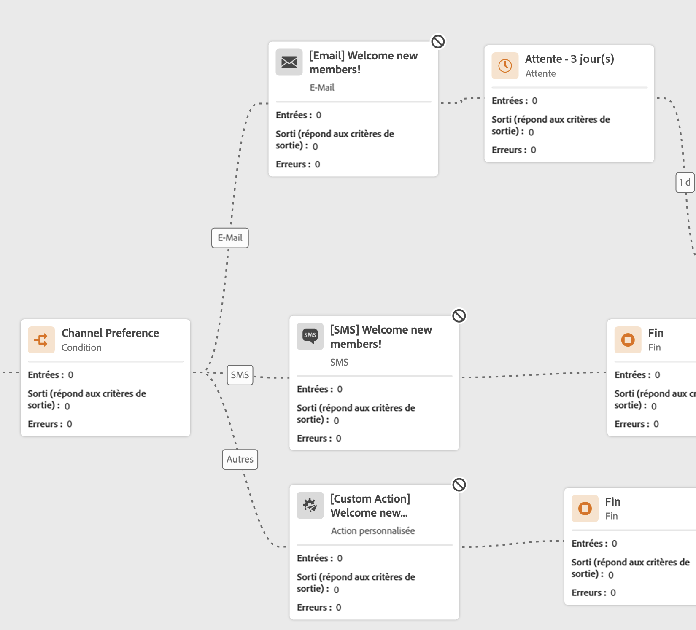
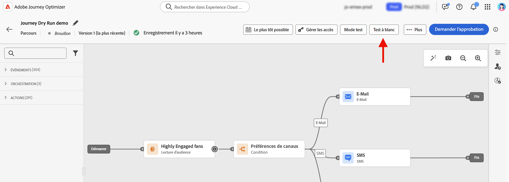
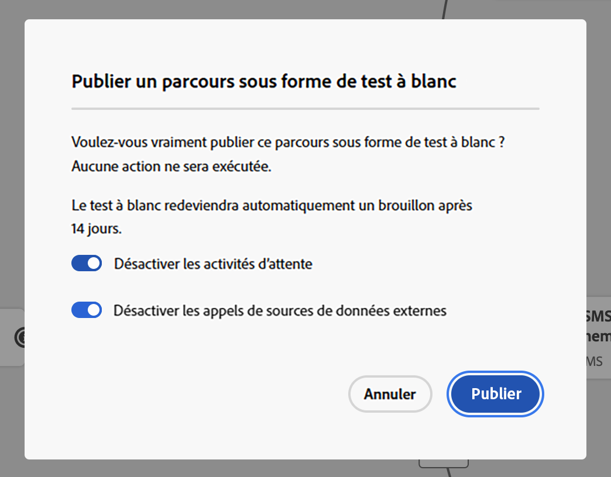
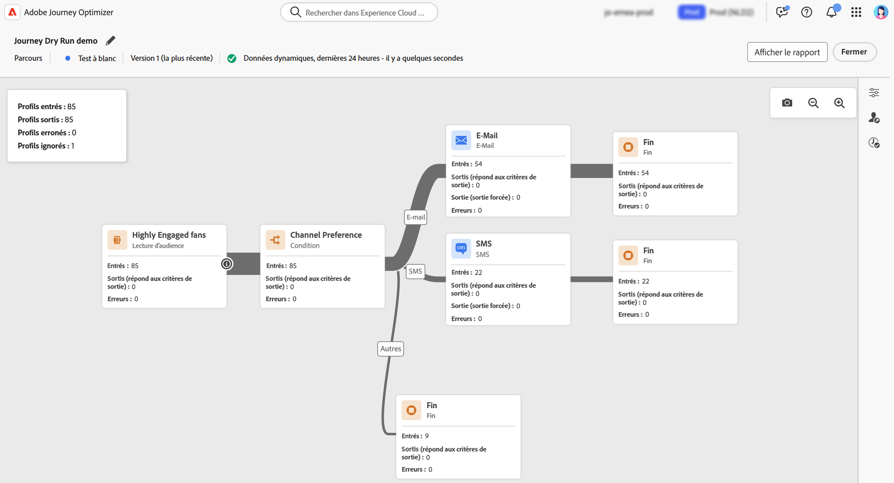
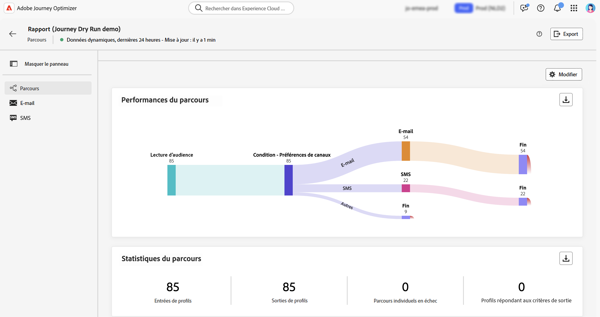
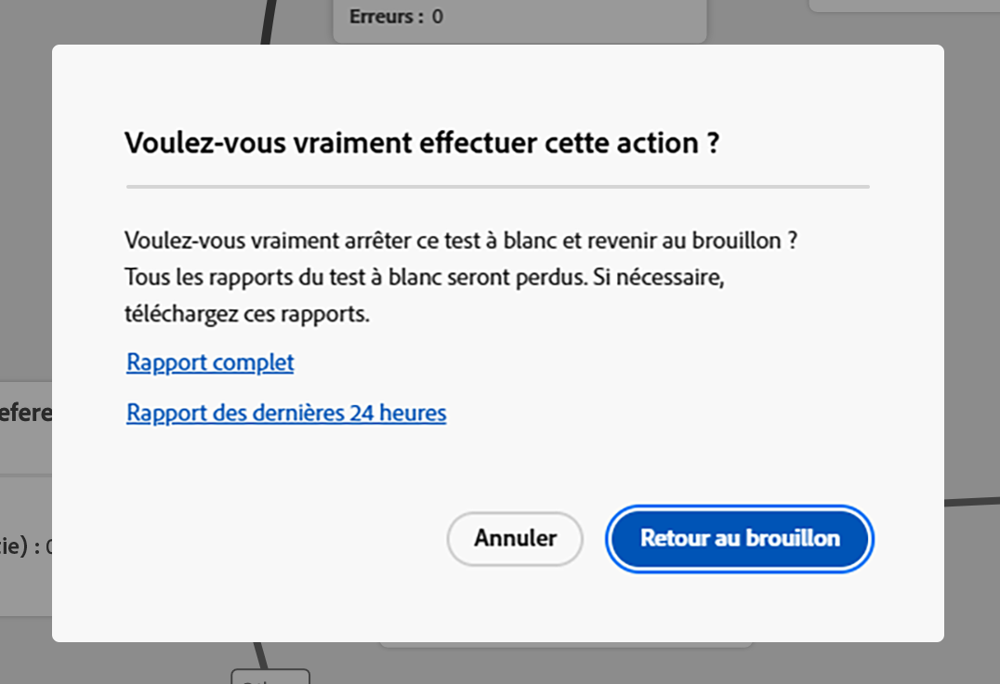
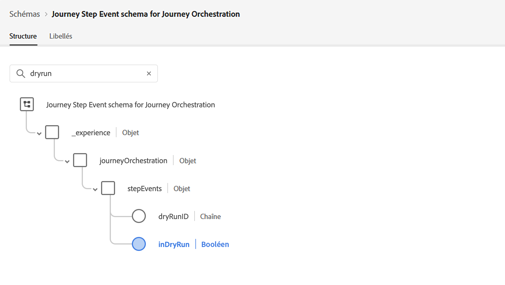

# Test à blanc du parcours {#journey-dry-run}

>[!CONTEXTUALHELP]
>id="ajo_journey_dry_run"
>title="Mode Test à blanc"
>abstract="Ce parcours est en mode Test à blanc. Le test à blanc de parcours est un mode de publication de parcours spécial dans Adobe Journey Optimizer qui permet aux responsables des parcours de tester un parcours à l’aide de données de production réelles sans contacter de véritables clientes et clients ou sans mettre à jour les informations de profil.  Cette fonctionnalité permet aux responsables des parcours d’avoir confiance dans leur conception du parcours et leur ciblage d’audience avant de publier un parcours en ligne."

>[!CONTEXTUALHELP]
>id="ajo_journey_dry_run_start"
>title="Publier un parcours en mode Test à blanc"
>abstract="Le test à blanc de parcours est un mode de publication de parcours spécial dans Adobe Journey Optimizer qui permet aux responsables des parcours de tester un parcours à l’aide de données de production réelles. Une fois que vous avez conçu votre parcours, effectuez un test à blanc pour confirmer qu’il est fonctionnel et vous assurer que les étapes sont correctes. Ce mode de publication vous permet de tester un parcours sans envoyer de communication à un profil."

Le test à blanc de parcours est un mode de publication de parcours spécial dans Adobe Journey Optimizer qui permet aux responsables des parcours de tester un parcours à l’aide de données de production réelles sans contacter de véritables clientes et clients ou sans mettre à jour les informations de profil.  Cette fonctionnalité permet aux responsables des parcours d’avoir confiance dans leur conception du parcours et leur ciblage d’audience avant de publier un parcours en ligne.

➡️ [Pour en savoir plus sur le test à blanc des parcours, regardez cette vidéo.](#dry-run-video)

## Avantages clés {#journey-dry-run-benefits}

Le test à blanc de parcours améliore la confiance des responsables des parcours et la réussite des parcours en offrant des tests sûrs et pilotés par les données des parcours clients à l’aide de données de production réelles, sans risque de contacter les clientes et clients ou de modifier les informations de profil. Cette fonctionnalité permet aux responsables des parcours de valider la portée de l’audience et la logique des branches avant l’activation, en s’assurant que les parcours s’alignent sur les objectifs commerciaux prévus.

Grâce au test à blanc de parcours, vous avez la possibilité d’identifier les problèmes dès le début, d’optimiser les stratégies de ciblage et d’améliorer la conception du parcours en fonction des données réelles, et non d’hypothèses. Directement intégré à la zone de travail du parcours, le test à blanc offre des rapports intuitifs et une visibilité sur les indicateurs de performances clés, ce qui permet aux équipes de réaliser des ajustements en toute confiance et d’optimiser les workflows d’approbation. Cela améliore l’efficacité opérationnelle, réduit les risques liés au lancement et favorise un meilleur engagement des clientes et clients.

Enfin, cette fonctionnalité améliore le délai de rentabilisation et réduit les défaillances du parcours.

Le test à blanc de parcours apporte :

1. **Environnement de test sécurisé** : les profils en mode Test à blanc ne sont pas contactés, ce qui élimine tout risque d’envoi de communications ou d’impact sur les données actives.
1. **Informations sur l’audience** : les responsables des parcours peuvent prédire l’accessibilité de l’audience à divers nœuds du parcours, y compris les opt-out et les exclusions en fonction des conditions des parcours.
1. **Commentaires en temps réel** : les mesures s’affichent directement dans la zone de travail du parcours, comme les rapports en temps réel, ce qui permet aux responsables des parcours d’affiner leur conception du parcours.

## Logique d’exécution du test à blanc {#journey-dry-run-exec}

Lors du test à blanc, le parcours s’exécute en mode simulation, en appliquant les comportements spécifiques suivants à chaque activité de parcours sans déclencher d’actions réelles :

* Les nœuds **Action de canal** notamment les e-mails, SMS ou notifications push ne sont pas exécutés.
* Les **actions personnalisées** sont désactivées pendant le test à blanc et leurs réponses sont définies sur null.

  Pour améliorer la lisibilité, les actions personnalisées et les activités de canal apparaissent grisées lors de l’exécution d’un test à blanc.

  {width="80%" align="left"}

* Les **sources de données**, y compris les sources de données externes, et les activités **Attente** sont désactivées par défaut pendant le test à blanc. Vous pouvez toutefois modifier ce comportement [lors de l’activation du mode Test à blanc](#journey-dry-run-start).

* Les nœuds **Réaction** ne sont pas exécutés : tous les profils qui y accèdent les quittent. Toutefois, les règles de priorité suivantes s’appliquent :
   * Si un nœud **Réaction** est utilisé avec un ou plusieurs nœuds d’**événement unitaire** en parallèle, les profils passeront toujours par l’événement de réaction.
   * Si un nœud **Réaction** est utilisé avec un ou plusieurs nœuds d’**événement de réaction** en parallèle, les profils passeront toujours par le premier dans la zone de travail (celui en haut).

>[!CAUTION]
>
>* Les autorisations de démarrage d’un test à blanc sont limitées aux utilisateurs et aux utilisatrices disposant de l’autorisation de haut niveau **[!DNL Publish journeys]**. Les autorisations d’arrêt d’un test à blanc sont limitées aux utilisateurs et aux utilisatrices disposant de l’autorisation de haut niveau **[!DNL Manage journeys]**. Pour en savoir plus sur la gestion des droits d’accès des utilisateurs et des utilisatrices [!DNL Journey Optimizer], consultez [cette section](../administration/permissions-overview.md).
>
>* Avant de commencer à utiliser la fonctionnalité de test à blanc, [lisez la section sur les Mécanismes de sécurisation et les limitations](#journey-dry-run-limitations).

## Démarrer un test à blanc {#journey-dry-run-start}

Vous pouvez utiliser la fonctionnalité Test à blanc dans n’importe quel brouillon de parcours sans erreur.

Pour activer le test à blanc, procédez comme suit :

1. Ouvrez le parcours que vous souhaitez tester.
1. Cliquez sur le bouton **[!UICONTROL Test à blanc]**.

   

1. Indiquez si vous souhaitez activer ou désactiver les activités **Attente** et les appels **Sources de données externes**, puis confirmez la publication du test à blanc.

   {width="50%" align="left"}

   Un message de statut, **[!UICONTROL Activation du test à blanc]**, s’affiche pendant que la transition est en cours.

1. Une fois activé, le parcours passe en mode **[!UICONTROL Test à blanc]**.

## Surveiller un test à blanc {#journey-dry-monitor}

Une fois la publication en mode Test à blanc lancée, vous pouvez visualiser l’exécution du parcours et la progression des profils dans les branches et les nœuds du parcours.

Les mesures s’affichent directement dans la zone de travail du parcours. Pour en savoir plus sur les rapports dynamiques et les mesures des parcours, consultez la section [Rapports dynamiques dans la zone de travail du parcours](report-journey.md).

Vous pouvez également accéder aux **Rapports sur les dernières 24 heures** et aux **Rapports sur la durée entière** pour le test à blanc. Pour accéder à ces rapports, cliquez sur le bouton **Afficher le rapport** dans le coin supérieur droit de la zone de travail du parcours.

>[!CAUTION]
>
> Les données de rapport sont disponibles uniquement lorsque le test à blanc est **actif**.  Dès que celui-ci s’arrête, les données de rapport ne sont plus accessibles. Utilisez le bouton **Exporter** situé au-dessus des rapports pour les télécharger si nécessaire.

## Arrêter un test à blanc {#journey-dry-run-stop}

Après 14 jours, les parcours de test à blanc passent automatiquement au statut **[!UICONTROL Brouillon]**.

Les parcours de test à blanc peuvent également être arrêtés manuellement. Pour désactiver le mode Test à blanc, procédez comme suit :

1. Ouvrez le parcours de test à blanc à arrêter.
1. Sélectionnez le bouton **[!UICONTROL Fermer]** pour terminer le test.
Les liens vers les rapports des 24 dernières heures ou de la durée entière sont disponibles dans l’écran de confirmation.

   {width="50%" align="left"}

1. Cliquez sur **[!UICONTROL Retour au brouillon]** pour confirmer.

## Mécanismes de sécurisation et limitations {#journey-dry-run-limitations}

* Les profils en mode Test à blanc sont comptabilisés dans les profils engageables.
* Les parcours en mode Test à blanc sont comptabilisés dans le quota des parcours actifs.
* Les parcours en mode Test à blanc n’ont aucune incidence sur les règles métier.
  <!--* When creating a new journey version, if a previous journey version is **Live**, then the Dry run activation is not allowed on the new version.-->
* Les actions **Saut** ne sont pas activées dans le test à blanc.
Lorsqu’un parcours source déclenche un événement de **saut** vers un parcours de destination, cet événement de saut ne s’applique pas à une version de parcours de test à blanc. Par exemple, si la dernière version d’un parcours est en test à blanc et que la version précédente est **active**, l’événement de saut ignorerait la version en test à blanc et ne s’appliquerait qu’à la version **active**.

## Événements d’étape de parcours et test à blanc {#journey-step-events}

Le test à blanc de parcours génère des **événements d’étape**. Ces événements d’étape disposent d’un indicateur et d’un ID de test à blanc spécifiques : `inDryRun` et `dryRunID`.

* `_experience.journeyOrchestration.stepEvents.inDryRun` renvoie `true` si le test à blanc est activé et `false` dans le cas contraire.
* `_experience.journeyOrchestration.stepEvents.dryRunID` renvoie l’identifiant d’une instance de test à blanc.

Si vous exportez des données d’événement d’étape vers des **systèmes externes**, vous pouvez filtrer les exécutions de test à blanc à l’aide de l’indicateur `inDryRun`.

Lors de l’analyse des **mesures de rapports de parcours** à l’aide du service de requête Adobe Experience Platform, les événements d’étape générés par le test à blanc doivent être exclus. Pour ce faire, définissez l’indicateur `inDryRun` sur `false`.

## Vidéo pratique {#dry-run-video}

Découvrez comment exécuter un test à blanc de vos parcours dans cette vidéo.

>[!VIDEO](https://video.tv.adobe.com/v/3464681/?learn=on&enablevpops)
