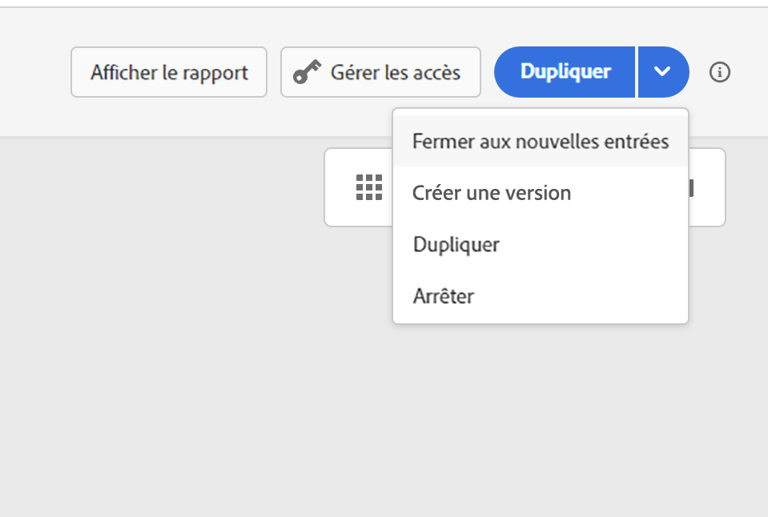

# Cycle de vie du parcours{#journey-lifecyle}

## Profils dans les parcours{#profile-journey}

Dans un parcours unitaire :

* Si la rentrée est activée, un profil peut entrer un parcours plusieurs fois, mais il ne peut pas le faire tant qu’il n’a pas complètement quitté cette instance précédente du parcours.

* Si la rentrée est désactivée, un profil ne peut pas entrer plusieurs fois le même parcours

Pour plus d&#39;informations sur la rentrée du profil, reportez-vous à cette section [section](../building-journeys/journey-gs.md#change-properties).

Dans un parcours de segment lu :

* Pour les parcours non récurrents : le profil entre une seule fois et une seule fois le parcours.
* pour les parcours récurrents : le profil entre dans le parcours de chaque périodicité, s’il est dans l’état segment/attendu. S&#39;il était toujours dans le parcours d&#39;une précédente répétition, il la redémarrera dès le début.

Dans les parcours d’événements professionnels commençant par un segment lu :

Sachant que ce parcours est basé sur la réception d’un événement commercial, si le profil est qualifié dans le segment attendu, il saisit le parcours de chaque événement commercial reçu, ce qui signifie que ce profil peut être plusieurs fois dans le même parcours, au même moment, mais dans le contexte de différents événements commerciaux.

## Fin de parcours{#journey-ending}

Un parcours peut se terminer pour un individu dans deux contextes spécifiques :

* Le client arrive à la dernière activité d&#39;un chemin.
* Le client arrive à une activité **Condition** (ou à une activité **Attente** avec une condition) et ne répond à aucune des conditions.

Il peut alors rejoindre de nouveau le parcours si la rentrée est autorisée. Voir [cette page](../building-journeys/journey-gs.md#change-properties)

Pour terminer un parcours en direct, nous vous recommandons de le fermer. L&#39;arrivée de nouveaux clients dans le parcours sera alors bloquée. Les clients qui sont déjà entrés dans le parcours peuvent l’expérimenter jusqu’à la fin. Consultez [cette section](../building-journeys/journey-end.md#close-journey)

Vous ne pouvez arrêter un parcours que si une urgence s’est produite et que tous les traitements doivent être terminés immédiatement un parcours. Les personnes qui sont déjà entrées dans un parcours sont toutes stoppées dans leur progression. Consultez [cette section](../building-journeys/journey-end.md#stop-journey)

>[!NOTE]
>
>Notez que vous ne pouvez pas reprendre un parcours fermé ou arrêté.

<!--

### Journey end tag{#end-tag}

While authoring a journey, an "end node" is displayed at the end of each path. This node cannot be added by a user, cannot be removed and only its label can be changed. It marks the end of each path of the journey. If the journey has several paths, we recommend that you add a label to each end to make reports easier to read. See [this page](../reports/live-report.md).

-->

### Activité de fin{#journey-end-activity}

L’activité **[!UICONTROL Fin]** vous permet de marquer la fin de chaque chemin du parcours. Elle n&#39;est pas obligatoire, mais recommandée pour assurer une meilleure clarté visuelle. Voir [cette page](../building-journeys/end-activity.md)

### Fermeture d’un parcours{#close-journey}

Les raisons suivantes peuvent entraîner la fermeture d&#39;un parcours :

* Le parcours est fermé manuellement par le biais du bouton **[!UICONTROL Fermer aux nouvelles entrées]**.
* Un parcours basé sur un segment « unique » qui a terminé son exécution.
* Après la dernière occurrence d&#39;un parcours récurrent basé sur un segment.

La fermeture manuelle d’un parcours permet de s’assurer que les clients qui ont déjà accédé au parcours peuvent terminer leur chemin, mais que les nouveaux utilisateurs ne peuvent pas entrer dans le parcours. Lorsqu&#39;un parcours est fermé (pour l&#39;une des raisons ci-dessus), le statut **[!UICONTROL Fermé]** lui est attribué. Il n&#39;est alors plus accessible aux nouveaux individus. En revanche, la procédure suit son cours normal pour les personnes qui ont déjà rejoint le parcours. Au-delà de la temporisation globale par défaut de 30 jours, le statut du parcours passe à **Terminé**. Consultez cette [section](../building-journeys/journey-gs.md#global_timeout).

La version d&#39;un parcours fermé ne peut pas être redémarrée ni supprimée. Vous pouvez la dupliquer ou en créer une nouvelle version. Seuls les parcours terminés peuvent être supprimés.

Pour fermer un parcours dans la liste des parcours, cliquez sur le bouton **[!UICONTROL Points de suspension]** situé à droite du nom du parcours et sélectionnez **[!UICONTROL Fermer aux nouvelles entrées]**.

Vous pouvez également réaliser les opérations suivantes :

1. Dans la liste **[!UICONTROL Parcours]**, cliquez sur le parcours que vous souhaitez fermer.
1. En haut à droite, cliquez sur la flèche vers le bas.

   

1. Cliquez sur **[!UICONTROL Fermer aux nouvelles entrées]** et confirmez dans la boîte de dialogue.

### Arrêt d’un parcours{#stop-journey}

Si nécessaire, il est possible d&#39;arrêter la progression de tous les individus dans le parcours. L&#39;arrêt du parcours entraîne la temporisation de tous les individus qui en font partie. Toutefois, arrêter un parcours implique que les personnes qui sont déjà entrées dans un parcours soient toutes stoppées dans leur progression. Le parcours est simplement mis à l&#39;arrêt. Si vous souhaitez mettre fin à un parcours, nous vous recommandons de le fermer.

La version d&#39;un parcours arrêté ne peut pas être redémarrée.

À l’arrêt, le statut du parcours est défini sur **[!UICONTROL Arrêté]**.

Vous pouvez arrêter un parcours, par exemple, si un spécialiste marketing se rend compte que le parcours cible une audience incorrecte ou si une action personnalisée censée diffuser des messages ne fonctionne pas correctement. Pour arrêter un parcours dans la liste des parcours, cliquez sur le bouton **[!UICONTROL Points de suspension]** situé à droite du nom du parcours et sélectionnez **[!UICONTROL Arrêter]**.

Vous pouvez également réaliser les opérations suivantes :

1. Dans la liste **[!UICONTROL Parcours]**, cliquez sur le parcours que vous souhaitez arrêter.
1. En haut à droite, cliquez sur la flèche vers le bas.

1. Cliquez sur **[!UICONTROL Arrêter]** et confirmez dans la boîte de dialogue.
