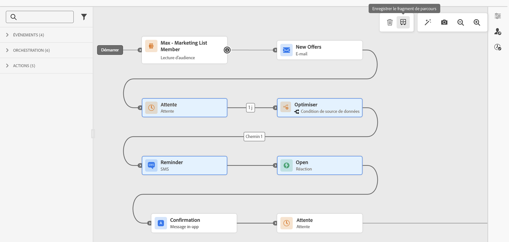
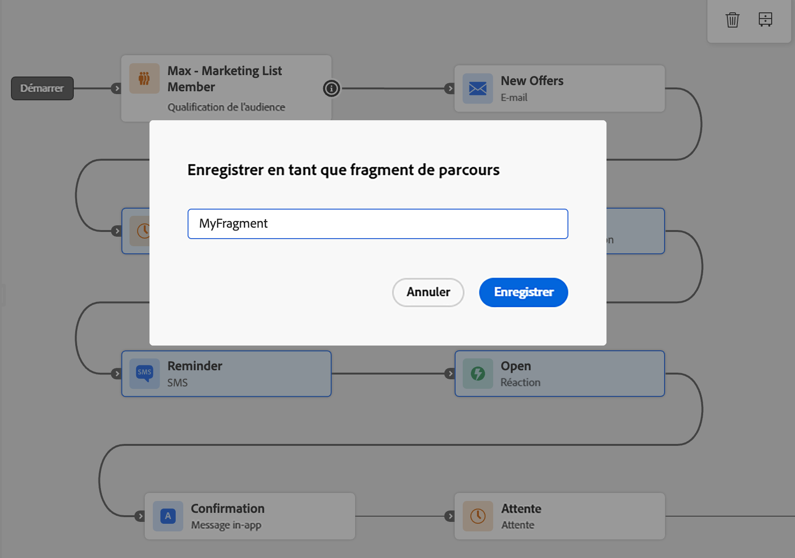
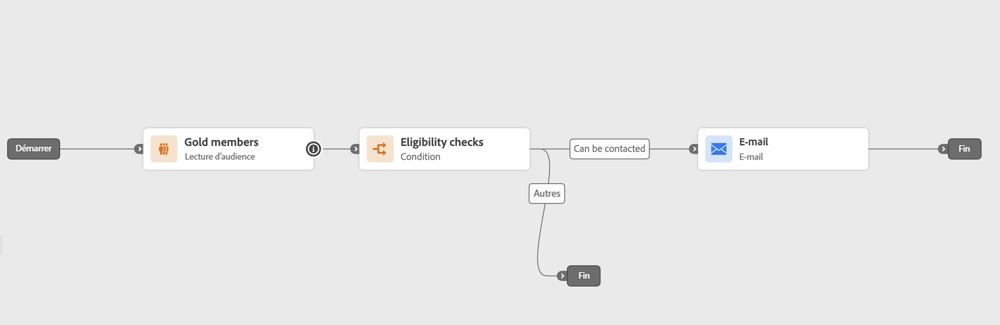
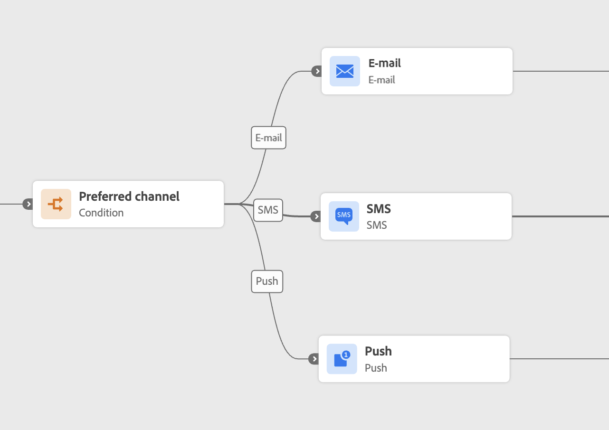
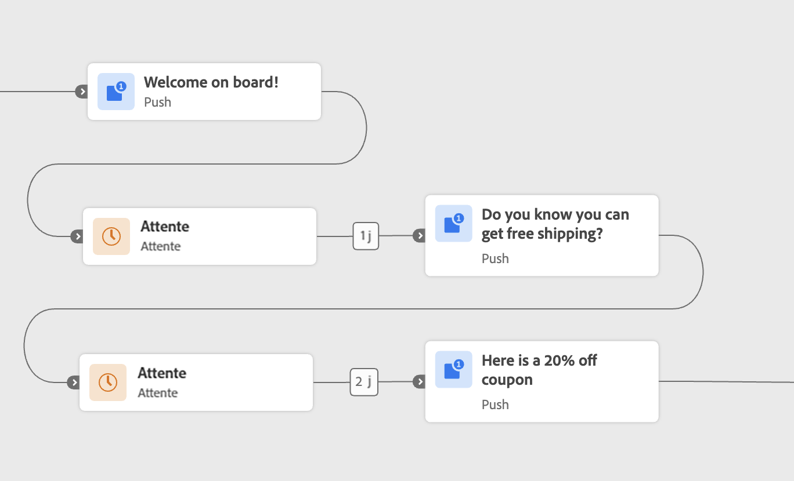
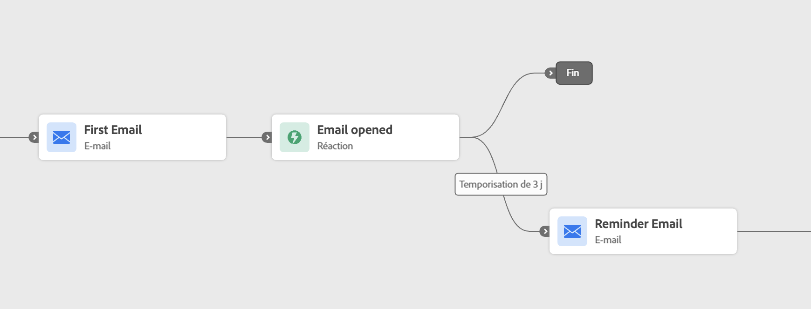

# Fragments de parcours {#journey-fragments}

>[!AVAILABILITY]
>Cette fonctionnalité est actuellement en disponibilité limitée. Pour obtenir l’accès, contactez votre représentant ou représentante Adobe.

Les fragments de parcours sont des ensembles réutilisables de nœuds de parcours que vous pouvez créer une fois et déposer dans n’importe quel parcours de votre sandbox. Qu’il s’agisse d’une vérification d’éligibilité, d’une logique de routage de canal préférée ou d’une séquence de bienvenue, les fragments aident les équipes à se déplacer plus rapidement et à rester cohérentes, sans avoir à reconstruire la même logique à chaque fois. [Voir les exemples de cas d’utilisation.](#examples)

Une fois créés, les fragments sont stockés dans un **[!UICONTROL inventaire des fragments]** dédié et peuvent être insérés dans n’importe quel parcours à l’aide de l’activité **[!UICONTROL Fragments de Parcours]**.

>[!NOTE]
>Pour cette première version, les fragments de parcours utilisent un comportement de **copie** : l’insertion d’un fragment dans un parcours crée une copie statique des nœuds d’origine. Les mises à jour apportées au fragment d’origine ne sont pas automatiquement répercutées dans les parcours qui l’ont déjà utilisé.

## Autorisations {#journey-fragments-permissions}

Pour utiliser les fragments de parcours, vous avez besoin des [autorisations](../administration/permissions.md) suivantes :

* **Gérer les Parcours** : permet de créer, modifier et supprimer des fragments.
* **Publier les Parcours** — requis pour activer un fragment.

## Accès à l’inventaire des fragments {#journey-fragments-inventory}

Les fragments de parcours sont accessibles à partir de la section **[!UICONTROL Parcours]**. Ouvrez l’onglet **[!UICONTROL Fragments]** pour parcourir tous les fragments disponibles dans votre sandbox.

Vous pouvez filtrer la liste par nom de fragment, statut, date de création, créateur, date de dernière modification ou balise.

## Création d’un fragment de parcours {#create-journey-fragment}

>[!CONTEXTUALHELP]
>id="ajo_journey_fragment_create_canvas"
>title="Enregistrer en tant que fragment de parcours"
>abstract="Saisissez un nom unique pour votre fragment et cliquez sur Enregistrer. Les nœuds sélectionnés seront enregistrés en tant que fragment réutilisable disponible dans l’inventaire des fragments."

Vous pouvez créer un fragment de parcours de deux manières : directement à partir de la zone de travail de parcours (recommandé) ou à partir de l’inventaire des fragments.

>[!BEGINTABS]

>[!TAB Dans la zone de travail du parcours ]

Pour enregistrer les nœuds de parcours en tant que fragment directement à partir de la zone de travail de parcours :

1. Ouvrez un parcours et sélectionnez un ou plusieurs nœuds connectés sur la zone de travail.
1. Cliquez sur l’icône **[!UICONTROL Enregistrer en tant que fragment]** dans la barre d’outils.

   

1. Saisissez un nom unique pour le fragment dans votre sandbox.

   

1. Cliquez sur **[!UICONTROL Enregistrer]**. Le fragment est enregistré en tant que brouillon.

>[!TIP]
>Si vous créez un fragment à partir d’un parcours, [testez votre parcours ](testing-the-journey.md) **avant** enregistrez le fragment pour vous assurer que les nœuds sélectionnés se comportent comme prévu.

>[!TAB Dans l’inventaire des fragments]

Pour créer un fragment directement à partir de l’inventaire :

1. Accédez à l’onglet **[!UICONTROL Parcours]** > **[!UICONTROL Fragments]**.
1. Cliquez sur **[!UICONTROL Créer un fragment]**.
1. Dans la zone de travail de création de fragments, ajoutez et configurez des activités de parcours.
1. Lorsque vous avez terminé, cliquez sur **[!UICONTROL Enregistrer]** pour enregistrer le fragment en tant que brouillon.

>[!CAUTION]
>Le mode Test n’est pas disponible dans l’éditeur de fragments. Cela signifie que vous ne pouvez pas valider le comportement des activités configurées avant que le fragment ne soit activé et inséré dans un parcours. Pour les fragments dont la précision logique est essentielle, pensez à [créer et tester les nœuds dans un parcours complet](testing-the-journey.md) tout d’abord, puis à les enregistrer en tant que fragment dans l’onglet Zone de travail ci-dessus.

>[!ENDTABS]

## Modifier un fragment {#edit-journey-fragment}

>[!CONTEXTUALHELP]
>id="ajo_journey_fragment_properties"
>title="Propriétés du fragment de parcours"
>abstract="Ouvrez un fragment de l’inventaire pour modifier ses nœuds, propriétés, balises ou libellés. Les fragments actifs doivent être désactivés avant de pouvoir être modifiés."

Pour modifier un fragment, ouvrez-le dans l’**[!UICONTROL inventaire des fragments]** en cliquant sur son nom. Dans l’interface utilisateur de création de fragments, vous pouvez :

* Ajouter, supprimer ou modifier des activités.
* Définissez ou mettez à jour les propriétés du fragment : nom, balises et libellés.

>[!NOTE]
>
>* Seuls les fragments **[!UICONTROL Brouillon]** peuvent être modifiés. Pour modifier un fragment **[!UICONTROL actif]**, commencez par le désactiver.
>
>* Le mode Test n’est pas disponible dans l’éditeur de fragments. Testez toute logique au niveau du parcours dans le parcours complet avant d’enregistrer les nœuds en tant que fragment.
>
>* Les activités [Saut](jump.md) ne sont pas autorisées dans un fragment.

## Gérer vos fragments {#manage-journey-fragments}

### Statuts des fragments {#fragment-statuses}

Les fragments de parcours suivent un cycle de vie à deux états :

| État | Description |
|---|---|
| **[!UICONTROL Brouillon]** | Le fragment est en cours de création et ne peut pas encore être utilisé dans les parcours. |
| **[!UICONTROL Actif]** | Le fragment est prêt à être utilisé dans les parcours. |

Pour activer un fragment **[!UICONTROL Brouillon]**, ouvrez-le et utilisez l’icône **[!UICONTROL Activer]**. Pour désactiver un fragment **[!UICONTROL actif]**, ouvrez-le et utilisez l’icône **[!UICONTROL Désactiver]**.

### Actions sur le fragment {#fragment-actions}

Dans l’inventaire des fragments, vous pouvez effectuer les actions suivantes sur un fragment :

* **[!UICONTROL Ouvrir]** : modifiez le fragment en cliquant sur son nom.
* **[!UICONTROL Dupliquer]** : créez une copie du fragment, à partir de l’icône **[!UICONTROL Plus d’actions]** (...).
* **[!UICONTROL Supprimer]** : supprimez un fragment de l&#39;inventaire actif, à partir de l&#39;icône **[!UICONTROL Plus d&#39;actions]** (...).
* **[!UICONTROL Modifier les balises]** — ajoutez ou supprimez les balises d’un fragment à partir de l’icône **[!UICONTROL Plus d’actions]** (...).

## Utiliser un fragment dans un parcours {#use-journey-fragment}

>[!CONTEXTUALHELP]
>id="ajo_journey_fragment_add"
>title="Ajouter un fragment de parcours"
>abstract="Seuls les fragments **[!UICONTROL actifs]** sont disponibles dans le sélecteur. L’insertion d’un fragment crée une **copie statique** de ses nœuds ; les mises à jour ultérieures apportées au fragment d’origine ne sont pas répercutées dans le parcours."

Pour insérer un fragment dans un parcours :

1. Ouvrez votre parcours et faites glisser l’activité **[!UICONTROL Fragments de Parcours]** depuis le rail de gauche.
1. Déposez-la dans une branche existante. Un sélecteur de fragment s’affiche.
1. Recherchez ou recherchez le fragment que vous souhaitez utiliser. Vous pouvez prévisualiser un fragment ou l’ouvrir dans un autre onglet avant de l’insérer.
1. Sélectionnez le fragment. Ses nœuds sont copiés dans la zone de travail au niveau du point de dépôt.

>[!NOTE]
>Seuls les fragments **[!UICONTROL actifs]** sont disponibles dans le sélecteur. L’insertion d’un fragment crée une **copie statique** de ses nœuds ; les mises à jour ultérieures apportées au fragment d’origine ne sont pas répercutées dans le parcours.

## Mécanismes de sécurisation et limitations {#guardrails}

Les mécanismes de sécurisation suivants s’appliquent aux fragments de parcours :

**Création de fragment**

* Les noms de fragment doivent être **uniques par sandbox**.
* Un fragment ne peut avoir qu’**un seul chemin d’entrée**. Les sélections comportant plusieurs points d’entrée ne peuvent pas être enregistrées en tant que fragment.
* Seuls les **nœuds connectés** peuvent être enregistrés ensemble en tant que fragment.
* Un fragment **ne peut pas contenir d’activité [Saut](jump.md)**.
* Un fragment peut contenir **maximum 20 nœuds**.
* Un sandbox peut contenir un **maximum de 200 fragments actifs**.

**Utilisation des fragments**

* Seuls les fragments **[!UICONTROL actifs]** peuvent être insérés dans un parcours.
* L’insertion d’un fragment crée une **copie statique** de ses nœuds. Les mises à jour du fragment d’origine ne sont pas propagées aux parcours où il a été utilisé.
* Un fragment doit être inséré dans une branche **existante** dans la zone de travail.

**Général**

* Les fragments se trouvent à l’aide de la barre [Recherche unifiée](../start/search-filter-categorize.md) sous la catégorie **[!UICONTROL Fragments de Parcours]**.
* [Balises](tags.md) et **Libellés** sont pris en charge sur les fragments.
* Les [ Journaux d’audit ](../privacy/audit-logs.md) sont pris en charge.
* Les parcours s’exécutant sur l’ancienne pile (à l’aide de campagnes intégrées) ne prennent pas en charge les fragments de parcours. Dupliquez un tel parcours pour le déplacer vers la nouvelle pile avant d’utiliser cette fonctionnalité.

## Exemples de cas d’utilisation {#examples}

Les exemples suivants illustrent des modèles de parcours courants qui peuvent être enregistrés et réutilisés en tant que fragments de parcours.

**Contrôles d’éligibilité**

Un modèle d’entrée standard, tel qu’un nœud [Lecture d’audience](read-audience.md) suivi de filtres d’éligibilité, peut être encapsulé dans un fragment. Cela permet aux équipes de maintenir une cohérence dans la manière dont les profils rejoignent les parcours tout en réduisant le temps de configuration. Le fragment peut être uniquement la [condition](condition-activity.md) ou les options Lecture d’audience et Condition réunies.

**Canal préféré**

Un fragment peut évaluer le canal de communication préféré d’un profil (e-mail, notification push ou SMS) et acheminer le profil en conséquence. Cette logique peut être réutilisée dans n’importe quel parcours impliquant des messages sortants, ce qui permet d’assurer une gestion cohérente des préférences de canal. Le fragment peut inclure la [condition](condition-activity.md) et les trois branches de canal.

**Séquence d’accueil de l’intégration**

Une séquence de bienvenue programmée, telle qu’une série de trois messages présentant un produit ou un service, peut être enregistrée en tant que fragment. Cela s’avère utile pour l’intégration de nouveaux utilisateurs dans différents segments d’audience ou lignes de produits. Le fragment peut inclure les activités [Attente](wait-activity.md) et les nœuds de message.

**Attente et rappel basés sur une réaction**

Un fragment peut encapsuler une activité E-mail suivie d’une [Réaction](reaction-events.md), en attendant que le profil ouvre l’e-mail dans un nombre de jours défini et en envoyant un rappel si ce n’est pas le cas. Cette logique est généralement réutilisée pour alimenter les parcours et tester les flux de conversion. Le fragment peut inclure les activités E-mail et Réaction .

