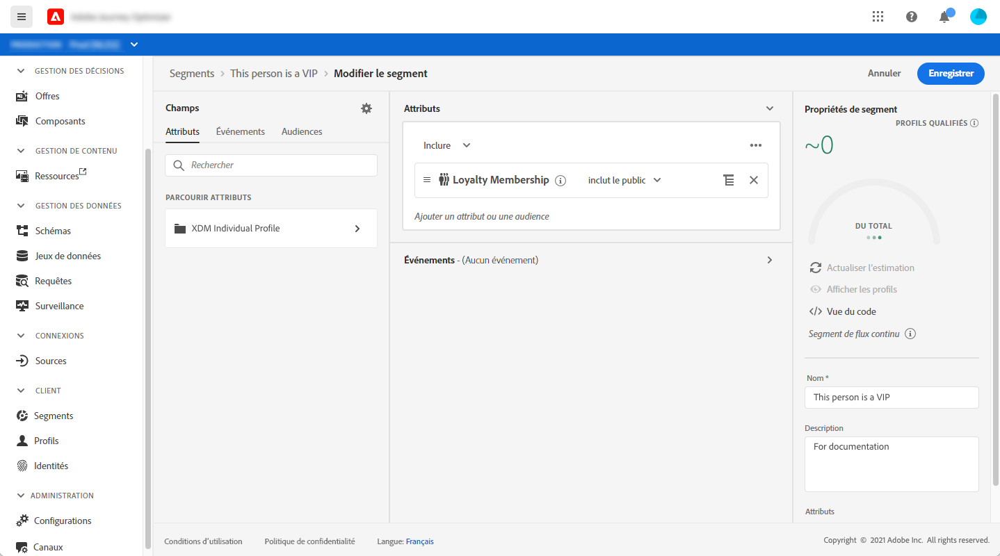
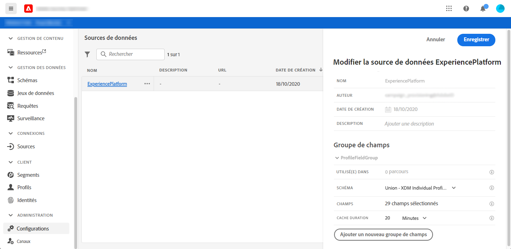
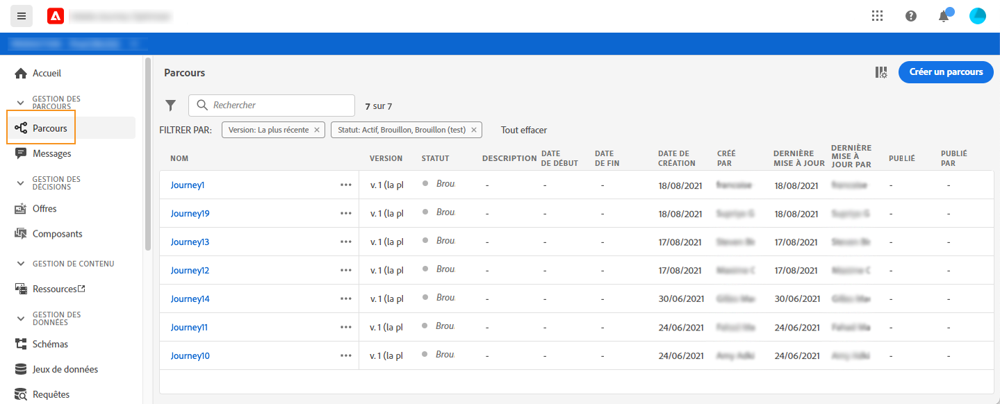
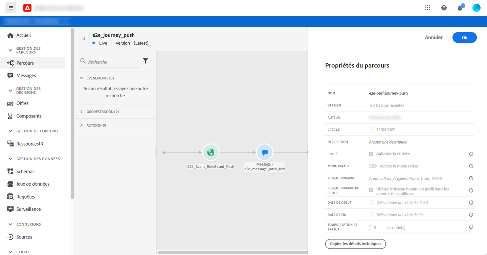
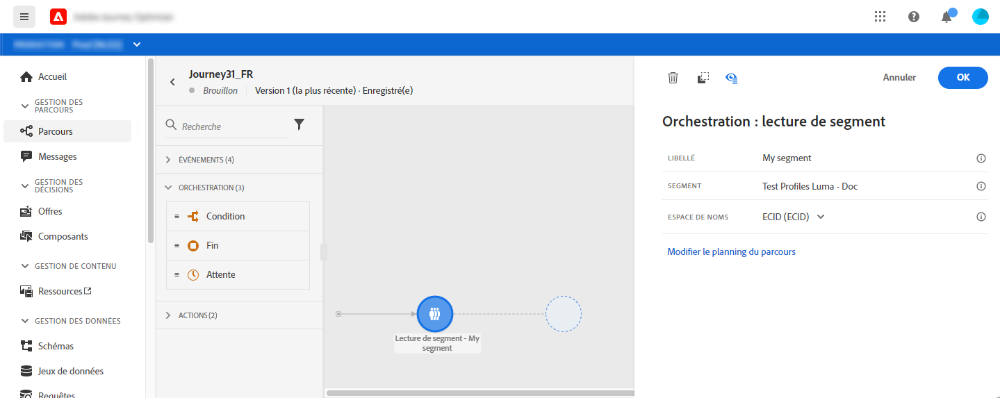
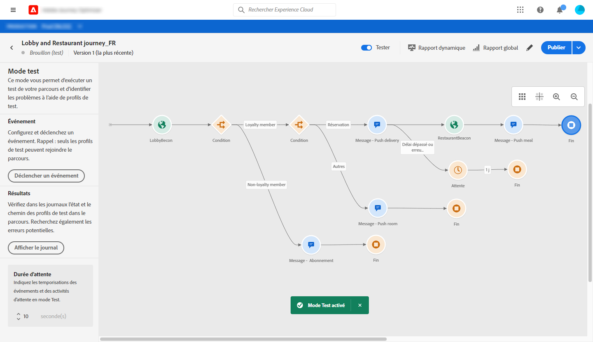
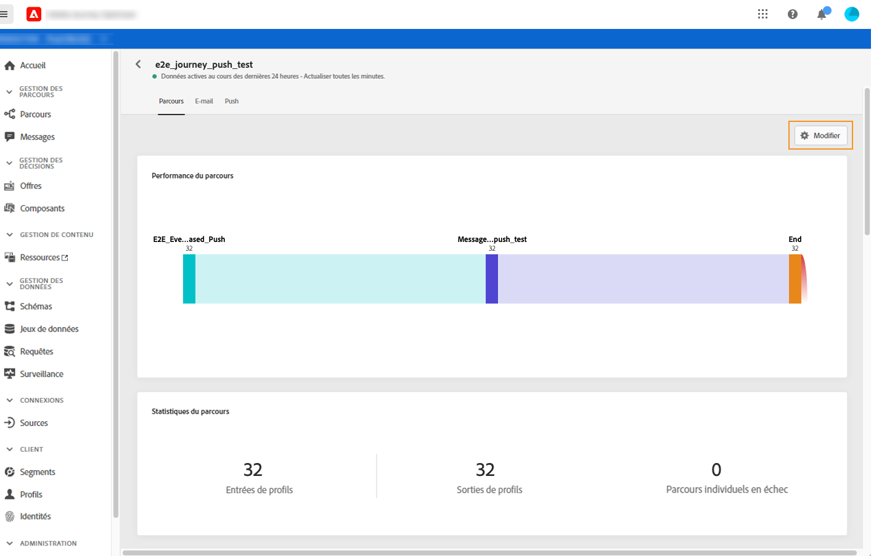
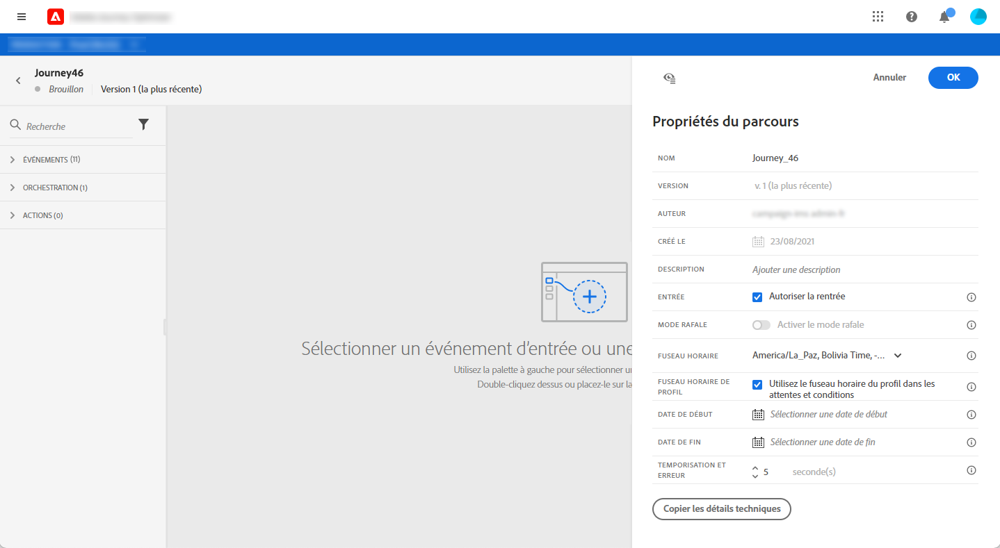
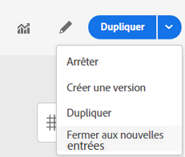

# Commencer avec parcours{#jo-quick-start}

## Conditions préalables

Pour envoyer des messages avec des parcours, la configuration suivante est requise :

1. **Configurer un événement** : si vous souhaitez déclencher vos parcours une fois qu’un événement est reçu, vous devez configurer un événement. Vous définissez les informations attendues et comment les traiter. Cette étape est effectuée par un **utilisateur technique**. [En savoir plus](../event/about-events.md).

   

1. **Créez un segment** : votre parcours peut également écouter les segments Adobe Experience Platform afin d’envoyer des messages par lots à un ensemble de profils spécifié. Pour cela, vous devez créer des segments. [En savoir plus](../segment/about-segments.md).

   

1. **Configurez la source** de données : vous pouvez définir une connexion à un système pour récupérer des informations supplémentaires qui seront utilisées dans vos parcours, par exemple dans vos conditions. Une source de données Adobe Experience Platform intégrée est également configurée au moment de la mise en service. Cette étape n’est pas requise si vous utilisez uniquement les données des événements de votre parcours. Cette étape est effectuée par un **utilisateur technique**. [En savoir plus](../datasource/about-data-sources.md)

   

1. **Configurez une action** : Les fonctionnalités de message Journey Optimizer sont intégrées, il vous suffit de concevoir votre contenu et de publier votre message. Voir [cette section](../get-started-content.md). Si vous utilisez un système tiers pour envoyer vos messages, vous pouvez créer une action personnalisée. Pour en savoir plus, consultez cette [section](../action/action.md). Cette étape est effectuée par un **utilisateur technique**.

   

## Création de votre parcours{#jo-build}

Cette étape est effectuée par l&#39;**utilisateur commercial**. C&#39;est là que vous créez vos parcours. Combinez les différentes activités d’événement, d’orchestration et d’action pour élaborer vos scénarios à plusieurs étapes sur plusieurs canaux.

Voici les étapes principales pour envoyer des messages par parcours :

1. Dans le menu de gauche, cliquez sur **[!UICONTROL Parcours]**. La liste des parcours s’affiche.

   

1. Cliquez sur **[!UICONTROL Créer]** pour créer un parcours.

1. Modifiez les propriétés du parcours dans le volet de configuration affiché sur le côté droit. Pour en savoir plus, consultez cette [section](journey-gs.md#change-properties).

   

1. Début en faisant glisser un événement ou une activité **Lire le segment** de la palette vers le canevas. Pour en savoir plus sur la conception de parcours, consultez [cette section](using-the-journey-designer.md).

   

1. Faites glisser et déposez les étapes suivantes que l’utilisateur doit suivre. Par exemple, vous pouvez ajouter une condition suivie d’un message. Pour en savoir plus sur les activités, consultez [cette section](using-the-journey-designer.md).

1. Testez votre parcours à l’aide de profils de test. En savoir plus sur cette [section](testing-the-journey.md)

1. Publiez votre parcours pour l’activer. Pour en savoir plus, consultez cette [section](publishing-the-journey.md).

   

1. Surveillez votre parcours en utilisant les outils de rapports dédiés pour mesurer l&#39;efficacité de votre parcours. Pour en savoir plus, consultez cette [section](../reports/live-report.md).

   

## Modification des propriétés {#change-properties}

Cliquez sur l&#39;icône représentant un crayon, dans la partie supérieure droite pour accéder aux propriétés du parcours.

Vous pouvez modifier le nom du parcours, ajouter une description, autoriser la réentrée, choisir les dates de début et de fin et définir une **[!UICONTROL durée d’expiration et d’erreur]** si vous êtes administrateur.

Le fichier **Copier les détails techniques** vous permet de copier des informations techniques sur le parcours que l&#39;équipe d&#39;assistance peut utiliser pour résoudre les problèmes. Les informations suivantes sont copiées : UID JourneyVersion, OrgID, orgName, sandboxName.

### Entrée{#entrance}

Par défaut, les nouveaux parcours autorisent la réentrée. Vous pouvez désélectionner l’option pour les parcours &quot;un seul cliché&quot;, par exemple si vous souhaitez offre un cadeau unique lorsqu’une personne entre dans un magasin. Dans ce cas, vous ne souhaitez pas que le client puisse entrer de nouveau dans le parcours et recevoir à nouveau l’offre.

Lorsqu&#39;un parcours se termine, il aura le statut **[!UICONTROL Fermé (sans entrée)]**. Le parcours cessera de laisser de nouveaux individus entrer sur le parcours. Les personnes déjà présentes au parcours finiront normalement le parcours.

Après le délai d’expiration global par défaut de 30 jours, le parcours passe à l’état **Terminé**. Voir cette [section](../building-journeys/journey-gs.md#global_timeout).

### Délai d&#39;attente et erreur dans les activités de parcours {#timeout_and_error}

Lors de la modification d’une activité d’action ou de condition, vous pouvez définir un autre chemin en cas d’erreur ou d’expiration. Si le traitement de l’activité qui interroge un système tiers dépasse la durée d’expiration définie dans les propriétés du parcours (**[!UICONTROL Délai d’expiration et champ d’erreur]**), le deuxième chemin est choisi pour effectuer une action de secours potentielle.

Les valeurs autorisées sont comprises entre 1 et 30 secondes.

Nous vous recommandons de définir une valeur très courte **[!UICONTROL Délai et erreur]** si votre parcours est sensible au temps (par exemple : Réaction à l’emplacement en temps réel d’une personne) parce que vous ne pouvez pas retarder votre action de plus de quelques secondes. Si votre parcours est moins sensible au temps, vous pouvez utiliser une valeur plus longue pour accorder plus de temps au système appelé pour envoyer une réponse valide.

Les parcours utilisent également un délai d’expiration global. Voir la section [suivante](#global_timeout).

### Délai d’expiration du parcours mondial {#global_timeout}

Outre le délai d’expiration  utilisé dans les activités de parcours, il existe également un délai d’expiration de parcours global qui n’est pas affiché dans l’interface et ne peut pas être modifié. Ce délai d&#39;attente mettra fin à la progression des individus dans le parcours 30 jours après leur entrée. Cela signifie que le parcours d&#39;un individu ne peut pas durer plus de 30 jours. Après la période de temporisation de 30 jours, les données de la personne sont supprimées. Les personnes qui continuent de circuler dans le parcours à la fin du délai d&#39;attente seront arrêtées et seront prises en compte comme des erreurs dans le rapports.

>[!NOTE]
>
>Les parcours ne réagissent pas directement aux demandes d’exclusion, d’accès ou de suppression de la confidentialité. Cependant, le délai d&#39;attente global garantit que les individus ne restent jamais plus de 30 jours dans un parcours.

En raison du délai de parcours de 30 jours, lorsque la réadmission du parcours n&#39;est pas autorisée, nous ne pouvons pas nous assurer que le blocage de la réadmission fonctionnera plus de 30 jours. En effet, comme nous supprimons toutes les informations sur les personnes qui sont entrées dans le parcours 30 jours après leur entrée, nous ne pouvons pas connaître la personne entrée précédemment, il y a plus de 30 jours.

### Fuseau horaire et fuseau horaire profil {#timezone}

Les fuseaux horaires sont définis au niveau du parcours.

Vous pouvez entrer un fuseau horaire fixe ou utiliser des profils Adobe Experience Platform pour définir le fuseau horaire du parcours.

Pour plus d’informations sur la gestion des fuseaux horaires, voir [cette page](../building-journeys/timezone-management.md).

## Fin d’un parcours

Un parcours peut se terminer pour une personne pour deux raisons :

* La personne arrive à la dernière activité d&#39;un chemin. Cette dernière activité peut être une activité finale ou une autre activité. Il n&#39;y a pas d&#39;obligation de terminer un chemin par une activité finale. Voir [cette page](../building-journeys/end-activity.md).
* La personne arrive à une activité de condition (ou à une activité d’attente avec une condition) et ne correspond à aucune des conditions.

La personne peut alors entrer de nouveau dans le parcours si elle y est autorisée. Voir [cette page](../building-journeys/journey-gs.md#change-properties)

Un parcours peut se fermer pour les raisons suivantes :

* Le parcours est fermé manuellement via le bouton **[!UICONTROL Proche des nouvelles entrées]**.
* Parcours basé sur un segment à une prise qui a terminé son exécution.
* Après la dernière occurrence d’un parcours récurrent basé sur un segment.

Lorsqu&#39;un parcours est fermé (pour l&#39;une des raisons ci-dessus), il aura le statut **[!UICONTROL Fermé (sans entrée)]**. Le parcours cessera de laisser de nouveaux individus entrer sur le parcours. Les personnes déjà présentes au parcours finiront normalement le parcours. Après le délai d’expiration global par défaut de 30 jours, le parcours passe à l’état **Terminé**. Voir cette [section](../building-journeys/journey-gs.md#global_timeout).

Au cas où vous auriez besoin d&#39;arrêter la progression de tous les individus dans le parcours, vous pouvez l&#39;arrêter. L&#39;arrêt du parcours aura pour effet de temporiser toutes les personnes du parcours.

Voici comment fermer ou arrêter manuellement un parcours :

Les options **[!UICONTROL Stop]** et **[!UICONTROL Proche des nouvelles entrées]** vous permettent de terminer les parcours **en direct**. La fermeture d&#39;un parcours implique **que l&#39;arrivée de nouveaux clients dans le parcours est bloquée** et que les clients qui sont déjà entrés dans le parcours sont en mesure de l&#39;expérimenter jusqu&#39;à la fin. Il s’agit de la méthode la plus recommandée pour mettre un terme à un parcours car elle offre la meilleure expérience pour les clients. L&#39;arrêt d&#39;un parcours implique que les personnes qui sont déjà entrées dans un parcours sont toutes stoppées dans leur progression. Le parcours est en gros éteint.

>[!NOTE]
>
>Notez que vous ne pouvez pas reprendre un parcours fermé ou arrêté.

### Fermeture d&#39;un parcours

Vous pouvez fermer un parcours manuellement pour vous assurer que les clients qui sont déjà entrés dans le parcours peuvent terminer leur chemin mais que les nouveaux utilisateurs ne peuvent pas entrer dans le parcours.

Une fois fermé, un parcours a le statut **[!UICONTROL Fermé (pas d&#39;entrée)]**. Après le délai d’expiration global par défaut de 30 jours, le parcours passe à l’état **Terminé**. Voir cette [section](../building-journeys/journey-gs.md#global_timeout).

Une version de parcours fermée ne peut pas être redémarrée ni supprimée. Vous pouvez en créer une nouvelle version ou la duplicata. Seuls les parcours terminés peuvent être supprimés.

Vous pouvez fermer un parcours en cliquant sur **[!UICONTROL Près des nouvelles entrées]** tout en survolant un parcours dans la liste des parcours.

Vous pouvez également :

1. Dans la liste **[!UICONTROL Parcours]**, cliquez sur le parcours à fermer.
1. En haut à droite, cliquez sur la flèche vers le bas.

   

1. Cliquez sur **[!UICONTROL Près des nouvelles entrées]**. Une boîte de dialogue s’affiche.
1. Cliquez sur **[!UICONTROL Près des nouvelles entrées]** pour confirmer.

### Arrêt d’un parcours

Vous pouvez arrêter un parcours lorsqu’une urgence s’est produite et que tous les traitements doivent être terminés immédiatement sur un parcours.

Impossible de redémarrer une version de parcours arrêtée.

Lorsqu’elle est arrêtée, un parcours a l’état **[!UICONTROL Arrêté]**.

Vous pouvez arrêter un parcours (par exemple si un spécialiste du marketing se rend compte que le parcours cible une audience incorrecte ou qu’une action personnalisée censée diffuser des messages ne fonctionne pas correctement...) en cliquant sur **[!UICONTROL Arrêter]** tout en passant la souris sur un parcours dans la liste des parcours.

Vous pouvez également :

1. Dans la liste **[!UICONTROL Parcours]**, cliquez sur le parcours à arrêter.
1. En haut à droite, cliquez sur la flèche vers le bas.

1. Cliquez sur **[!UICONTROL Arrêter]**. Une boîte de dialogue s’affiche.
1. Cliquez sur **[!UICONTROL Arrêter]** pour confirmer.
