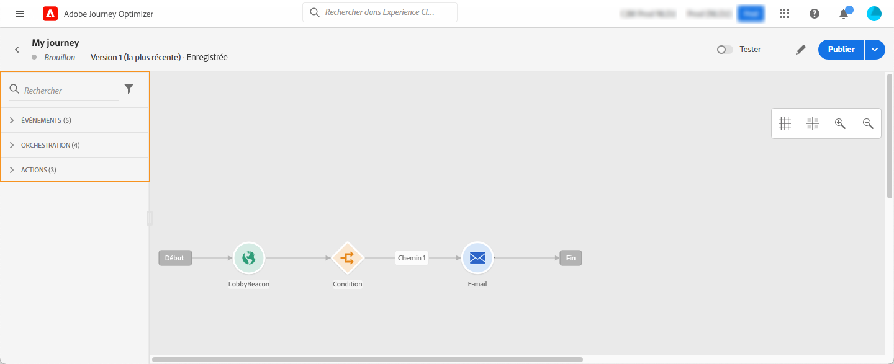
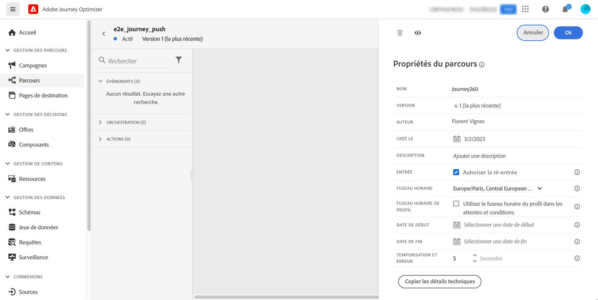
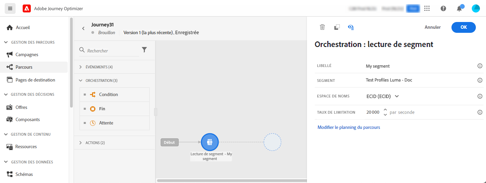
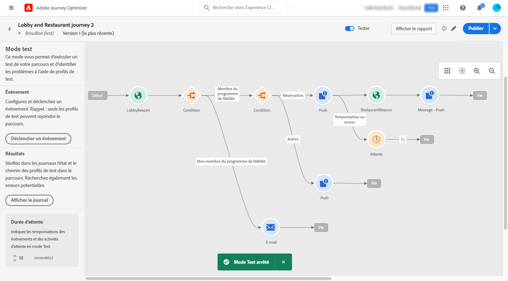
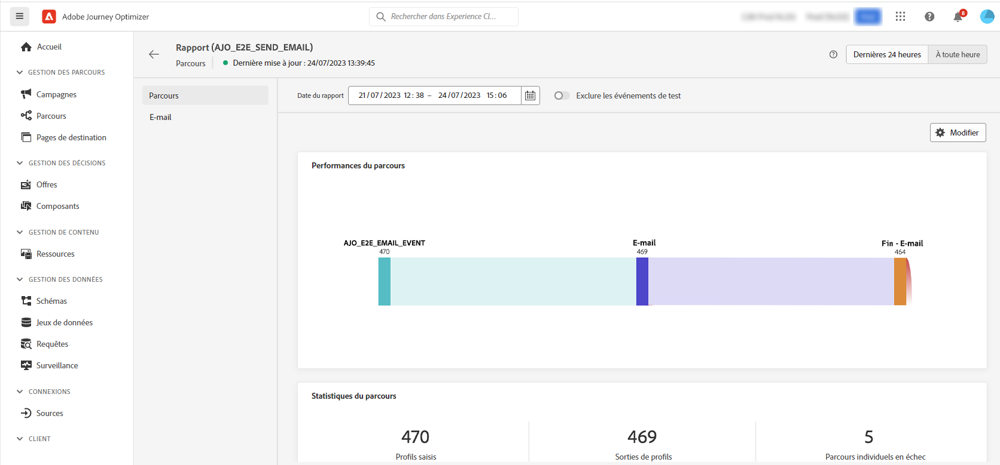

# Créer votre premier parcours {#jo-quick-start}

>[!CONTEXTUALHELP]
>id="ajo_homepage_card2"
>title="Créer des parcours"
>abstract="Utilisez **[!DNL Adobe Journey Optimizer]** pour créer des cas d’utilisation d’orchestration en temps réel à l’aide de données contextuelles stockées dans des événements ou des sources de données."

>[!CONTEXTUALHELP]
>id="ajo_journey_create"
>title="Parcours"
>abstract="Concevoir des parcours clients pour offrir des expériences contextuelles personnalisées. Journey Optimizer vous permet de créer des cas d’utilisation d’orchestration en temps réel avec des données contextuelles stockées dans des événements ou des sources de données. L’onglet **Vue d’ensemble** affiche un tableau de bord avec les mesures clés liées à vos parcours : L’onglet **Parcourir** affiche la liste des parcours existants."

[!DNL Adobe Journey Optimizer] comprend une zone de travail d’orchestration omnicanal qui permet aux marketeurs d’harmoniser la portée marketing avec l’engagement client individuel. L’interface utilisateur vous permet de faire glisser facilement des activités de la palette vers la zone de travail pour créer votre parcours. L’interface d’utilisation du parcours est présentée sur [cette page](journey-ui.md).

Les étapes principales de la création d’un parcours sont détaillées sur cette page. Les voici :

Dans ce guide, vous allez :

* Définir un point d’entrée de parcours : un segment d’audience ou un événement en temps réel
* Ajouter des actions de message sur plusieurs canaux (e-mail, push ou SMS)
* Tester votre parcours avec des profils de test avant l’activation
* Publiez votre parcours et surveillez ses performances

Créez des parcours clients à plusieurs étapes pour démarrer une séquence d’interactions, d’offres et de messages sur plusieurs canaux en temps réel. Cette approche garantit que les clientes et clients interagissent aux moments optimaux en fonction de leurs actions et des signaux commerciaux pertinents. Les audiences cibles sont définies en fonction du comportement, des données contextuelles et des événements métier. Les prérequis dépendent de votre cas d’utilisation et du [type de parcours](entry-management.md#types-of-journeys) que vous créez.

En savoir plus sur la circulation des profils dans les parcours et les taux de traitement des parcours dans [cette section](entry-management.md#journey-processing-rate).

<!-->[!TIP]
>>
Vous ne savez pas s’il faut utiliser un parcours ou une campagne ? [Découvrez comment choisir la bonne approche](../start/journeys-vs-campaigns.md).
>—>

## Avant de commencer {#prerequisites}

Ce que vous devez configurer avant de créer dépend de la manière dont votre parcours est déclenché. La plupart des parcours partent de l’un de ces deux points d’entrée :

* **Entrée basée sur l’audience** — Le parcours s’exécute pour un ensemble défini de profils à une heure planifiée. [Créez une audience](../audience/about-audiences.md) dans Adobe Experience Platform avant de créer votre parcours. Il s’agit du point de départ recommandé si vous découvrez Journey Optimizer.

* **Entrée basée sur un événement** — Le parcours est déclenché en temps réel lorsqu&#39;une personne effectue une action, comme un achat ou une inscription. [Configurer un événement](../event/about-events.md) pour définir le déclencheur et les données qu’il transporte.

Les éléments suivants sont facultatifs, mais peuvent être requis selon votre cas d’utilisation :

* **Source de données** — Pour enrichir les conditions du parcours ou la personnalisation avec des données provenant d&#39;un système externe, configurez une [source de données](../datasource/about-data-sources.md).

* **Action personnalisée** — Si vous diffusez des messages par l&#39;intermédiaire d&#39;un système tiers plutôt que par les canaux intégrés, configurez une [action personnalisée](../action/action.md).

>[!NOTE]
>
>Si vous êtes un ingénieur de données responsable de la configuration technique (événements, sources de données et actions), consultez [cette section](../configuration/about-data-sources-events-actions.md).

>[!NOTE]
>
>Les mécanismes de sécurisation et limitations du parcours sont détaillés sur [cette page](../start/guardrails.md).

## Créer un parcours {#jo-build}

Pour créer un parcours à plusieurs étapes, procédez comme suit :

1. Dans la section du menu GESTION DES PARCOURS, cliquez sur **[!UICONTROL Parcours]**.

1. Cliquez sur le bouton **[!UICONTROL Créer un parcours]** pour créer un parcours.

1. Modifiez le volet de configuration du parcours pour définir le nom du parcours et ses propriétés. Découvrez comment définir les propriétés de votre parcours sur [cette page](journey-properties.md).

   >[!TIP]
   >
   >**Quel type de parcours dois-je choisir ?** Si vous découvrez Journey Optimizer, commencez par utiliser un parcours basé sur les audiences avec une activité **[!UICONTROL Lecture d’audience]**. Il ne nécessite aucune configuration d’événement préalable et est le moyen le plus simple de vous familiariser avec la zone de travail. Pour les expériences déclenchées par un événement en temps réel (par exemple, en réaction à un achat ou à un envoi de formulaire), configurez d’abord un événement et utilisez une entrée basée sur un événement. En savoir plus sur les [types de parcours](entry-management.md#types-of-journeys).

   

Vous pouvez ensuite commencer à concevoir votre parcours.

## Concevoir le parcours {#jo-design}

Le concepteur de parcours vous permet de créer des parcours à plusieurs étapes à l’aide d’une interface intuitive par glisser-déposer. Les activités de la palette de gauche sont organisées en trois catégories : **Événements**, **Orchestration** et **Actions**. Pour une présentation complète de la zone de travail et de ses commandes, reportez-vous à [cette page](using-the-journey-designer.md).

Pour concevoir votre parcours, procédez comme suit :

1. **Ajouter un point d’entrée** — Faites glisser un événement ou une activité **[!UICONTROL Lecture d’audience]** de la palette vers la zone de travail. Cela définit la manière dont les profils rejoignent le parcours : individuellement en temps réel (en fonction de l’événement) ou tous en même temps à partir d’une audience définie (en fonction de l’audience).

   

1. **Ajouter des actions de message** — Dans la section **[!UICONTROL Actions]** de la palette, faites glisser une action de canal sur la zone de travail pour envoyer des messages aux profils qui traversent le parcours. Les actions sont disponibles pour les e-mails, les notifications push, les SMS, etc.

1. **Ajouter des activités d’orchestration** — Utilisez une activité **[!UICONTROL Condition]** pour diviser le parcours en plusieurs chemins d’accès en fonction des attributs de profil ou du comportement. Utilisez une activité **[!UICONTROL Attente]** pour introduire un délai entre les étapes.

>[!TIP]
>
>Pour les parcours comportant plusieurs phases ou plusieurs points de contact, pensez à diviser le flux de bout en bout en sous-parcours plus petits liés à l’activité **[!UICONTROL Saut]**. Cela réduit la complexité et facilite le test indépendant de chaque sous-parcours. En savoir plus dans [Stratégie de conception : sous-parcours de petite taille](jump.md#jump-strategy).

## Tester le parcours {#jo-test}

Une fois que vous avez créé votre parcours, testez-le avant de le publier. Journey Optimizer propose un **mode de test** pour afficher les profils de test au fur et à mesure de leur progression dans le parcours et ainsi détecter les erreurs potentielles avant l’activation. L’exécution de tests rapides vous permet de vérifier que les parcours fonctionnent correctement afin de pouvoir les publier en toute confiance. Découvrez comment tester votre parcours dans [cette section](testing-the-journey.md).

Vous pouvez également exécuter votre parcours en mode **test à blanc**. Le test à blanc de parcours est un mode de publication de parcours spécial dans Adobe Journey Optimizer qui permet aux concepteurs et conceptrices de tester un parcours à l’aide de données de production réelles sans contacter les clients et clientes ni mettre à jour les informations de profil. Cette fonctionnalité permet aux concepteurs et conceptrices de parcours d’avoir confiance dans leur conception de parcours et leur ciblage d’audience avant de publier un parcours en ligne. Découvrez comment publier un parcours en mode Test à blanc dans [cette section](journey-dry-run.md).

## Publiez le parcours. {#jo-pub}

Vous devez publier un parcours pour l’activer et le rendre disponible pour que de nouveaux profils puissent le rejoindre. Avant de publier votre parcours, vérifiez qu’il est valide et qu’il ne comporte aucune erreur. Vous ne pouvez pas publier un parcours comportant des erreurs. Pour plus d’informations sur la publication d’un parcours, consultez cette [section](publish-journey.md).

Une fois publié, vous pouvez surveiller votre parcours à l’aide des outils de rapports dédiés afin de mesurer l’efficacité de votre parcours.

En savoir plus sur les rapports de parcours dans [cette section](../reports/live-report.md).

## Cas d’utilisation courants {#use-cases}

Vous ne savez pas par où commencer ? Voici trois scénarios typiques dans lesquels les parcours offrent la plus grande valeur :

<table style="table-layout:fixed">
  <tr style="border: 0;">
    <td>
      
      
<strong>Série de bienvenue</strong> Intégrez automatiquement les nouveaux utilisateurs avec une séquence de messages après leur inscription, les guidant tout au long de votre produit ou service.

    </td>
    <td>
      
      
<strong>Abandon de panier</strong> Réengagez les clients qui ont quitté le produit sans effectuer d’achat en envoyant un rappel opportun avec du contenu personnalisé.

    </td>
    <td>
      
      
<strong>Réengagement</strong> Récupérez les utilisateurs inactifs avec des offres ou des mises à jour ciblées en fonction de leur dernier comportement connu.

    </td>
  </tr>
  <tr style="border: 0;">
    <td align="center"></td>
    <td align="center"></td>
    <td align="center"></td>
  </tr>
</table>

## Ressources supplémentaires

* **[Présentation du concepteur de parcours](using-the-journey-designer.md)** : maîtrisez l’interface de zone de travail du parcours pour concevoir et orchestrer des parcours client.
* **[Activités de parcours](about-journey-activities.md)** : découvrez toutes les activités disponibles, y compris les événements, les actions et les composants d’orchestration.
* **[Test des parcours](testing-the-journey.md)** : découvrez comment tester vos parcours à l’aide du mode test avant de les publier en production.
* **[Publication de parcours](publish-journey.md)** : découvrez le processus de publication des parcours et comment gérer les parcours en direct.
* **[Rapports de parcours](report-journey.md)** : suivez et analysez les performances du parcours avec des mesures et des informations détaillées.
* **[Dépannage des parcours](troubleshooting.md)** : trouvez des solutions aux problèmes courants du parcours et consultez les bonnes pratiques de débogage.
* **[Tutoriels sur les parcours](https://experienceleague.adobe.com/fr/docs/journey-optimizer-learn/tutorials/journeys/introduction-to-building-a-journey){target="_blank"}** : consultez des tutoriels vidéo détaillés sur la création de parcours et les bonnes pratiques.

