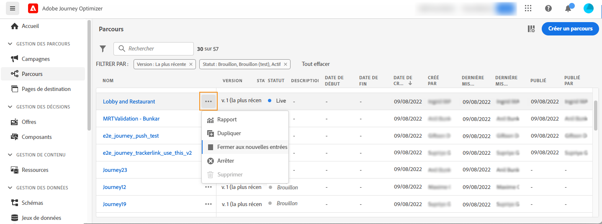

# Prise en main des parcours{#jo-quick-start}

## Prérequis

Pour envoyer des messages avec des parcours, la configuration suivante est requise :

1. **Configurer un événement** : si vous souhaitez déclencher vos parcours une fois qu&#39;un événement est reçu, vous devez configurer un événement. Vous devez définir les informations attendues et comment les traiter. Cette étape est effectuée par un **utilisateur technique**. [En savoir plus](../event/about-events.md).

   

1. **Créer un segment** : votre parcours peut également écouter les segments Adobe Experience Platform afin d’envoyer des messages par lots à un ensemble de profils spécifié. Pour cela, vous devez créer des segments. [En savoir plus](../segment/about-segments.md).

   

1. **Configurer la source de données** : vous devez définir une connexion à un système pour récupérer des informations supplémentaires qui seront utilisées pour vos parcours, par exemple dans vos conditions. Une source de données Adobe Experience Platform intégrée est également définie au moment de l&#39;approvisionnement. Cette étape n&#39;est pas obligatoire si vous n&#39;exploitez que les données des événements de votre parcours. Cette étape est effectuée par un **utilisateur technique**. [En savoir plus](../datasource/about-data-sources.md)

   

1. **Configurer une action** : les fonctionnalités de messagerie Journey Optimizer sont intégrées ; il vous suffit de concevoir votre contenu et de publier votre message. Consultez [cette section](../messages/get-started-content.md). Si vous utilisez un système tiers pour envoyer vos messages, vous pouvez créer une action personnalisée. En savoir plus dans cette [section](../action/action.md). Cette étape est effectuée par un **utilisateur technique**.

   

## Création de votre parcours{#jo-build}

>[!CONTEXTUALHELP]
>id="ajo_journey_create"
>title="Création de votre parcours"
>abstract="Cet écran affiche la liste des parcours précédemment créés. Ouvrez un parcours ou cliquez sur &quot;Créer un parcours&quot;, puis combinez les différentes activités d’événement, d’orchestration et d’action pour créer vos scénarios cross-canal à plusieurs étapes."

Cette étape est effectuée par l&#39;**utilisateur chargé de la conception de parcours**. C&#39;est là que vous créez vos parcours. Combinez les différentes activités d&#39;événement, d&#39;orchestration et d&#39;action afin de créer des scénarios cross-canal à plusieurs étapes.

Voici les étapes principales pour envoyer des messages à travers des parcours :

1. Dans la section du menu GESTION DES PARCOURS, cliquez sur **[!UICONTROL Parcours]**. La liste des parcours s&#39;affiche.

   

1. Cliquez sur **[!UICONTROL Créer un parcours]** pour créer un parcours.

1. Modifiez les propriétés du parcours dans le volet de configuration qui s&#39;affiche dans la partie droite. En savoir plus dans cette [section](journey-gs.md#change-properties).

   

1. Commencez par effectuer un glisser-déposer d’un événement ou d’une activité **Lecture de segment** de la palette vers la zone de travail. Pour en savoir plus sur la conception d&#39;un parcours, consultez [cette section](using-the-journey-designer.md).

   

1. Faites glisser et déposez les étapes suivantes que l&#39;individu doit suivre. Par exemple, vous pouvez ajouter une condition suivie d&#39;un message. Pour en savoir plus sur les activités, consultez [cette section](using-the-journey-designer.md).

1. Testez votre parcours à l&#39;aide de profils de test. En savoir plus dans cette [section](testing-the-journey.md)

1. Publiez votre parcours pour l&#39;activer. En savoir plus dans cette [section](publishing-the-journey.md).

   

1. Surveillez votre parcours à l&#39;aide des outils de rapports dédiés afin de mesurer l&#39;efficacité de votre parcours. En savoir plus dans cette [section](../reports/live-report.md).

   

## Modification des propriétés {#change-properties}

>[!CONTEXTUALHELP]
>id="ajo_journey_properties"
>title="Propriétés du parcours"
>abstract="Vous pouvez modifier le nom du parcours, ajouter une description, autoriser une rentrée, choisir les dates de début et de fin, et définir une durée Temporisation et erreur si vous êtes administrateur."

Cliquez sur l&#39;icône en forme de crayon en haut à droite pour accéder aux propriétés du parcours.

Vous pouvez modifier le nom du parcours, ajouter une description, autoriser une rentrée, choisir les dates de début et de fin, et définir une durée **[!UICONTROL Temporisation et erreur]** si vous êtes administrateur.

Pour les parcours actifs, cet écran affiche la date de publication et le nom de l’utilisateur qui a publié le parcours.

La fonction **Copier les détails techniques** permet de copier les informations techniques relatives au parcours qui seront utiles à l&#39;équipe d&#39;assistance technique pour résoudre les problèmes. Les informations suivantes sont copiées : UID JourneyVersion, OrgID, orgName, sandboxName, lastDeployedBy, lastDeployedAt.

### Entrée{#entrance}

Par défaut, les nouveaux parcours autorisent une rentrée. Vous pouvez désélectionner cette option pour les parcours « uniques » ; c&#39;est le cas, par exemple, si vous souhaitez offrir un cadeau à un utilisateur qui effectue sa première visite dans la boutique. Dans ce cas, vous ne voulez pas que le client puisse rejoindre de nouveau le parcours et rebénéficier de l&#39;offre.

Lorsqu&#39;un parcours prend fin, le statut **[!UICONTROL Fermé]** lui est attribué. Il n&#39;est alors plus accessible aux nouveaux individus. En revanche, la procédure suit son cours normal pour les personnes qui ont déjà intégré le parcours.

Au-delà de la temporisation globale par défaut de 30 jours, le statut du parcours passe à **Terminé**. Consultez cette [section](../building-journeys/journey-gs.md#global_timeout).

### Temporisation et erreur dans les activités du parcours {#timeout_and_error}

Lorsque vous modifiez une action ou une activité de condition, vous pouvez définir un autre chemin en cas d&#39;erreur ou de temporisation. Si la durée de traitement de l&#39;activité qui interroge un système tiers dépasse la durée de temporisation définie dans les propriétés du parcours (champ **[!UICONTROL Temporisation et erreur]**), le deuxième chemin d&#39;accès est choisi pour effectuer une éventuelle action de remplacement.

Les valeurs autorisées sont comprises entre 1 et 30 secondes.

Nous vous recommandons de définir une valeur très basse pour **[!UICONTROL Temporisation et erreur]** si votre parcours est sensible au temps (c&#39;est le cas, par exemple, lorsqu&#39;il convient de réagir à la position en temps réel d&#39;une personne), car l&#39;action ne peut pas être différée de plus de quelques secondes. Si le facteur temps revêt une importance moindre, vous pouvez définir un délai plus long afin d&#39;accorder davantage de temps au système appelé pour envoyer une réponse valide.

Les parcours utilisent également une temporisation globale. Pour plus d&#39;informations, consultez la [section suivante](#global_timeout).

### Temporisation de parcours globale {#global_timeout}

Outre la [temporisation](#timeout_and_error) utilisée dans les activités de parcours, il existe une temporisation globale qui n&#39;est pas affichée dans l&#39;interface et qui ne peut pas être modifiée. Cette valeur de temporisation mettra fin à la progression des individus dans le parcours 30 jours après leur entrée. En d&#39;autres termes, la durée du parcours d&#39;un individu ne peut pas excéder 30 jours. Après cette période de temporisation de 30 jours, les données le concernant sont supprimées. Les individus qui sont encore actifs dans le parcours au terme de cette période de temporisation sont arrêtés et considérés comme des « erreurs » dans le cadre du reporting.

>[!NOTE]
>
>Les parcours ne réagissent pas directement aux demandes de désinscription, de suppression ou d&#39;accès. Cependant, la temporisation globale limite à 30 jours la durée d&#39;activité d&#39;un individu au sein d&#39;un parcours.

Compte tenu de la temporisation de 30 jours, lorsque la rentrée n&#39;est pas autorisée, nous sommes dans l&#39;impossibilité de garantir que le blocage de rentrée fonctionnera plus de 30 jours. En effet, étant donné que nous supprimons toutes les informations sur les personnes qui ont rejoint le parcours 30 jours après leur entrée, rien ne nous permet de savoir qu&#39;une personne l&#39;a déjà rejoint il y a plus de 30 jours.

### Fuseau horaire et fuseau horaire du profil {#timezone}

Les fuseaux horaires sont définis au niveau du parcours.

Vous pouvez entrer un fuseau horaire fixe ou utiliser les profils Adobe Experience Platform pour définir le fuseau horaire du parcours.

Pour plus d&#39;informations sur la gestion des fuseaux horaires, voir [cette page](../building-journeys/timezone-management.md).

### Mode rafale {#burst}

Le mode rafale est un module complémentaire payant qui permet d&#39;envoyer des messages push très rapidement en grandes quantités. Il est utilisé pour les parcours simples qui incluent une lecture de segment et un message push simple. Le mode rafale est utilisé lorsque le retard dans la diffusion des messages est critique pour l&#39;entreprise, quand vous souhaitez envoyer une alerte push urgente sur les téléphones mobiles, par exemple des nouvelles importantes destinées aux utilisateurs qui ont installé votre application de canal d&#39;actualités.

Limites :

* Le parcours doit commencer par une lecture de segment. Les événements ne sont pas autorisés.
* L&#39;étape suivante doit être un message push. Aucune autre activité ou étape n&#39;est autorisée (à l&#39;exception de l&#39;activité de fin facultative) :
   * Canal push uniquement
   * Aucune personnalisation n&#39;est autorisée dans le message
   * Le message doit être de petite taille (&lt;2 Ko).

Remarque importante :

Si l&#39;une des exigences n&#39;est pas remplie, le mode rafale ne sera pas disponible dans le parcours.

Pour activer le mode rafale, ouvrez votre parcours et cliquez sur l&#39;icône en forme de crayon, en haut à droite, pour accéder aux propriétés du parcours. Activez ensuite le bouton d&#39;activation/de désactivation **Activer le mode rafale**.

Le mode rafale sera désactivé si vous modifiez un parcours rafale et ajoutez une activité non conforme au mode rafale (message, toute autre action, un événement, etc.). Un message s&#39;affiche.

Ensuite, testez et publiez votre parcours normalement. Les messages du mode test ne sont pas envoyés via le mode rafale.

## Terminaison d&#39;un parcours

Deux raisons peuvent entraîner la terminaison d&#39;un parcours pour un individu :

* Le client arrive à la dernière activité d&#39;un chemin. Il ne doit pas nécessairement s&#39;agir d&#39;une activité de fin. De plus, le chemin ne doit pas obligatoirement se terminer par une activité de fin. Voir [cette page](../building-journeys/end-activity.md).
* Le client arrive à une activité de condition (ou à une activité d&#39;attente avec une condition) et ne répond à aucune des conditions.

Il peut alors rejoindre de nouveau le parcours si la rentrée est autorisée. Voir [cette page](../building-journeys/journey-gs.md#change-properties)

Les raisons suivantes peuvent entraîner la fermeture d&#39;un parcours :

* Le parcours est fermé manuellement par le biais du bouton **[!UICONTROL Fermer aux nouvelles entrées]**.
* Un parcours basé sur un segment « unique » qui a terminé son exécution.
* Après la dernière occurrence d&#39;un parcours récurrent basé sur un segment.

Lorsqu&#39;un parcours est fermé (pour l&#39;une des raisons ci-dessus), le statut **[!UICONTROL Fermé]** lui est attribué. Il n&#39;est alors plus accessible aux nouveaux individus. En revanche, la procédure suit son cours normal pour les personnes qui ont déjà rejoint le parcours. Au-delà de la temporisation globale par défaut de 30 jours, le statut du parcours passe à **Terminé**. Consultez cette [section](../building-journeys/journey-gs.md#global_timeout).

Si nécessaire, il est possible d&#39;arrêter la progression de tous les individus dans le parcours. L&#39;arrêt du parcours entraîne la temporisation de tous les individus qui en font partie.

Voici comment fermer ou arrêter manuellement un parcours :

Les options **[!UICONTROL Arrêter]** et **[!UICONTROL Fermer aux nouvelles entrées]** permettent de terminer les parcours **actifs**. Fermer un parcours suppose le **blocage de tout nouvel accès** et la possibilité, pour les clients ayant déjà rejoints le parcours, de poursuivre l&#39;expérience jusqu&#39;à son terme. Il s&#39;agit de la méthode recommandée pour mettre fin à un parcours, car elle offre la meilleure expérience pour les clients. L&#39;arrêt d&#39;un parcours suppose qu&#39;il soit mis un terme à la progression de toutes les personnes qui y participent. Le parcours est simplement mis à l&#39;arrêt.

>[!NOTE]
>
>Notez que vous ne pouvez pas reprendre un parcours fermé ou arrêté.

### Fermeture d&#39;un parcours

Vous pouvez fermer un parcours manuellement pour vous assurer que les clients qui l&#39;ont déjà rejoint puissent terminer leur chemin, mais que les nouveaux utilisateurs ne puissent pas le rejoindre.

Lorsqu&#39;un parcours est fermé, le statut **[!UICONTROL Fermé]** lui est attribué. Au-delà de la temporisation globale par défaut de 30 jours, le statut du parcours passe à **Terminé**. Consultez cette [section](../building-journeys/journey-gs.md#global_timeout).

La version d&#39;un parcours fermé ne peut pas être redémarrée ni supprimée. Vous pouvez la dupliquer ou en créer une nouvelle version. Seuls les parcours terminés peuvent être supprimés.

Pour fermer un parcours dans la liste des parcours, cliquez sur le bouton **[!UICONTROL Points de suspension]** situé à droite du nom du parcours et sélectionnez **[!UICONTROL Fermer aux nouvelles entrées]**.

Vous pouvez également réaliser les opérations suivantes :

1. Dans la liste **[!UICONTROL Parcours]**, cliquez sur le parcours que vous souhaitez fermer.
1. En haut à droite, cliquez sur la flèche vers le bas.

   

1. Cliquez sur **[!UICONTROL Fermer aux nouvelles entrées]**. Une boîte de dialogue s&#39;affiche.
1. Cliquez sur **[!UICONTROL Fermer aux nouvelles entrées]** pour confirmer.

### Arrêt d&#39;un parcours

Vous pouvez arrêter un parcours lorsqu&#39;une urgence s&#39;est produite et qu&#39;il doit être mis fin immédiatement à tout processus.

La version d&#39;un parcours arrêté ne peut pas être redémarrée.

Lorsqu&#39;un parcours est arrêté, le statut **[!UICONTROL Arrêté]** lui est attribué.

Vous pouvez arrêter un parcours, par exemple, si un spécialiste marketing se rend compte que le parcours cible une audience incorrecte ou si une action personnalisée censée diffuser des messages ne fonctionne pas correctement. Pour arrêter un parcours dans la liste des parcours, cliquez sur le bouton **[!UICONTROL Points de suspension]** situé à droite du nom du parcours et sélectionnez **[!UICONTROL Arrêter]**.

Vous pouvez également réaliser les opérations suivantes :

1. Dans la liste **[!UICONTROL Parcours]**, cliquez sur le parcours que vous souhaitez arrêter.
1. En haut à droite, cliquez sur la flèche vers le bas.

1. Cliquez sur **[!UICONTROL Arrêter]**. Une boîte de dialogue s&#39;affiche.
1. Cliquez sur **[!UICONTROL Arrêter]** pour confirmer.
