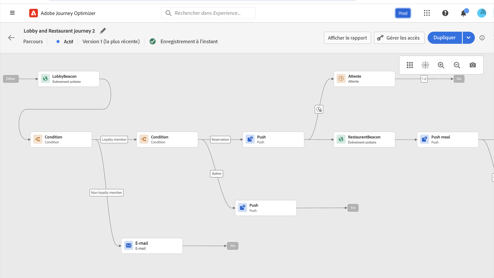
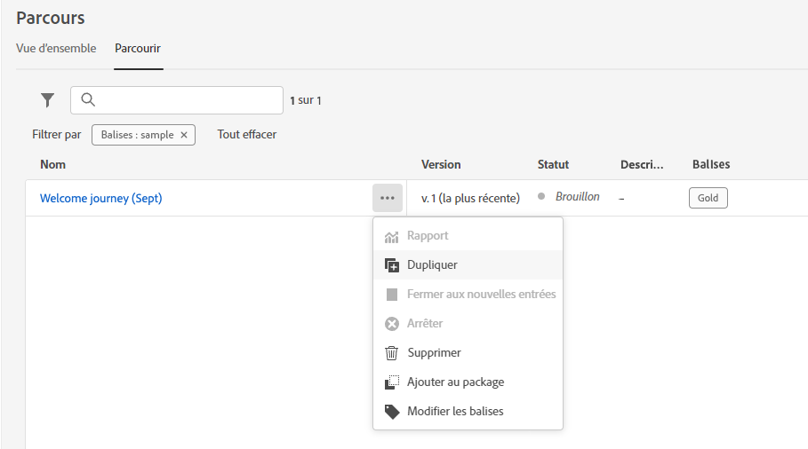
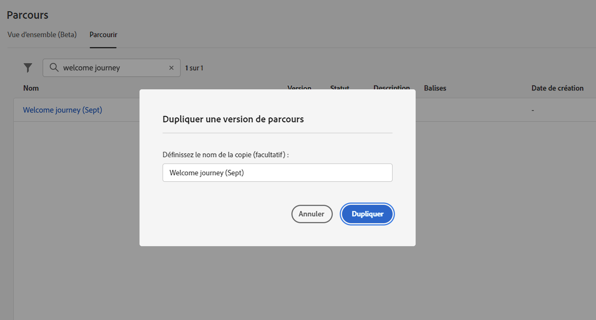

# Créer votre premier parcours{#jo-quick-start}

>[!CONTEXTUALHELP]
>id="ajo_homepage_card2"
>title="Créer des parcours"
>abstract="Utilisez **Adobe Journey Optimizer** pour créer des cas d’utilisation d’orchestration en temps réel à l’aide de données contextuelles stockées dans des événements ou des sources de données."

## Conditions préalables{#start-prerequisites}

Pour envoyer des messages avec des parcours, les configurations suivantes sont requises :

1. **Configurer un événement** : si vous souhaitez déclencher vos parcours une fois qu&#39;un événement est reçu, vous devez configurer un événement. Vous devez définir les informations attendues et comment les traiter. Cette étape est effectuée par un **utilisateur technique**. [En savoir plus](../event/about-events.md).

   

1. **Créer une audience** : votre parcours peut également écouter les audiences Adobe Experience Platform afin d’envoyer des messages par lots à un ensemble de profils spécifié. Pour cela, vous devez créer des audiences. [En savoir plus](../audience/about-audiences.md).

   

1. **Configurer la source de données** : vous devez définir une connexion à un système pour récupérer des informations supplémentaires qui seront utilisées pour vos parcours, par exemple dans vos conditions. Une source de données Adobe Experience Platform intégrée est également définie au moment de l&#39;approvisionnement. Cette étape n&#39;est pas obligatoire si vous n&#39;exploitez que les données des événements de votre parcours. Cette étape est effectuée par un **utilisateur technique**. [En savoir plus](../datasource/about-data-sources.md)

   

1. **Configurer une action** : si vous utilisez un système tiers pour envoyer vos messages, vous pouvez créer une action personnalisée. En savoir plus dans cette [section](../action/action.md). Cette étape est effectuée par un **utilisateur technique**. Si vous utilisez les fonctionnalités de message intégrées à Journey Optimizer, vous devez simplement ajouter une action de canal à votre parcours et concevoir votre contenu.

   

## Accéder aux parcours {#journey-access}

>[!CONTEXTUALHELP]
>id="ajo_journey_create"
>title="Parcours"
>abstract="Concevoir des parcours clients pour offrir des expériences contextuelles personnalisées. Journey Optimizer vous permet de créer des cas d’utilisation d’orchestration en temps réel avec des données contextuelles stockées dans des événements ou des sources de données. L’onglet **Vue d’ensemble** affiche un tableau de bord avec les mesures clés liées à vos parcours : L’onglet **Parcourir** affiche la liste des parcours existants."

### Mesures clés et liste des parcours {#access-metrics}

Dans la section du menu GESTION DES PARCOURS, cliquez sur **[!UICONTROL Parcours]**. Deux onglets sont disponibles :

**Vue d’ensemble** : cet onglet affiche un tableau de bord avec les mesures clés liées à vos parcours :

* **Profils traités** : nombre total de profils traités au cours des dernières 24 heures
* **Parcours dynamiques** : nombre total de parcours dynamiques avec trafic au cours des dernières 24 heures. Les parcours dynamiques incluent les **parcours unitaires** (basés sur un événement) et les **parcours par lots** (lecture d’audience).
* **Taux d’erreur** : ratio de tous les profils en erreur par rapport au nombre total de profils entrés au cours des dernières 24 heures.
* **Taux de rejet** : ratio de tous les profils rejetés par rapport au nombre total de profils entrés au cours des dernières 24 heures. Un profil rejeté représente une personne qui ne répond pas aux conditions d’entrée du parcours, par exemple en raison d’un espace de noms incorrect ou des règles de reprise.

>[!NOTE]
>
>Ce tableau de bord prend en compte les parcours avec trafic au cours des dernières 24 heures. Seuls les parcours auxquels vous avez accès s’affichent. Les mesures sont actualisées toutes les 30 minutes et uniquement lorsque de nouvelles données sont disponibles.

**Parcourir** : cet onglet affiche la liste des parcours existants. Vous pouvez rechercher des parcours, utiliser des filtres et effectuer des actions de base sur chaque élément. Vous pouvez par exemple dupliquer ou supprimer un élément. Voir à ce sujet [cette section](../start/user-interface.md#filter-lists).

### Filtrer les parcours {#filter}

Dans la liste des parcours, vous pouvez utiliser différents filtres pour affiner la liste des parcours afin d’en améliorer la lisibilité.

Voici les différentes opérations de filtrage que vous pouvez effectuer :

Filtrez les parcours en fonction de leur statut, type, version et balises attribuées depuis les **[!UICONTROL Filtres de statut et de version]**.

Les différents types sont les suivants : **[!UICONTROL Événement unitaire]**, **[!UICONTROL Qualification de l’audience]**, **[!UICONTROL Lecture d’audience]**, **[!UICONTROL Événement métier]**.

Le statut peut être :

* **Fermé** : le parcours a été fermé à l’aide du bouton **Fermer aux nouvelles entrées**. Il n’est alors plus accessible aux nouveaux individus. En revanche, les personnes qui ont déjà intégré le parcours peuvent le terminer normalement.
* **Brouillon** : le parcours en est à sa première étape. Il n’a pas encore été publié.
* **Brouillon (test)** : le mode test a été activé à l’aide du bouton **Mode test**.
* **Terminé**: le parcours passe automatiquement à ce statut après les 91 jours [expiration globale](journey-properties.md#global_timeout). Les profils de clientes et clients qui ont déjà intégré le parcours le terminent normalement. Les nouveaux profils ne peuvent plus rejoindre le parcours.
* **Actif** : le parcours a été publié à l’aide du bouton **Publier**.
* **Arrêté** : le parcours a été désactivé à l’aide du bouton **Arrêter**. Toutes les personnes quittent instantanément le parcours.

>[!NOTE]
>
>Le cycle de vie de création de Parcours comprend également un ensemble d’états intermédiaires qui ne sont pas disponibles pour le filtrage : &quot;Publication&quot; (entre &quot;Version préliminaire&quot; et &quot;En direct&quot;), &quot;Activation du mode test&quot; ou &quot;Désactivation du mode test&quot; (entre &quot;Version préliminaire&quot; et &quot;Version préliminaire (test)&quot;) et &quot;Arrêt&quot; (entre &quot;En direct&quot; et &quot;Arrêt&quot;). Lorsqu’un parcours se trouve dans un état intermédiaire, il est en lecture seule.

Utilisez les **[!UICONTROL filtres de création]** pour filtrer les parcours en fonction de leur date de création ou de la personne qui les a créés.

Affichez les parcours qui utilisent un événement, un groupe de champs ou une action spécifique à l’aide des **[!UICONTROL filtres d’activité]** et des **[!UICONTROL filtres de données]**.

Utilisez les **[!UICONTROL filtres de publication]** pour sélectionner une date de publication ou une personne. Vous pouvez choisir, par exemple, d’afficher les dernières versions des parcours actifs publiées la veille.

Pour filtrer les parcours selon une période spécifique, sélectionnez **[!UICONTROL Personnalisé]** dans la liste déroulante **[!UICONTROL Publié]**.

Dans les volets de configuration des événements, des sources de données et des actions, le champ **[!UICONTROL Utilisé dans]** affiche également le nombre de parcours qui utilisent cet événement, ce groupe de champs ou cette action spécifique. Vous pouvez cliquer sur le bouton **[!UICONTROL Afficher les parcours]** pour faire apparaître la liste des parcours correspondants.

## Créer votre parcours {#jo-build}

Créez des parcours pour offrir des expériences contextuelles personnalisées. [!DNL Journey Optimizer] vous permet de créer des cas d’utilisation d’orchestration en temps réel avec des données contextuelles stockées dans des événements ou des sources de données. Concevez des scénarios avancés à plusieurs étapes avec les fonctionnalités suivantes :

* Envoyez des **diffusions unitaires** en temps réel déclenchées lors de la réception d’un événement ou **par lots** à l’aide d’audiences Adobe Experience Platform.

* Tirez parti des **données contextuelles** issues des événements, des informations d’Adobe Experience Platform ou des données provenant de services d’API tiers.

* Utilisez la variable **actions de canal intégrées** (Email, SMS, Push, InApp) pour envoyer des messages conçus dans [!DNL Journey Optimizer] ou créer **actions personnalisées** si vous utilisez un système tiers pour envoyer vos messages.

* Avec le **concepteur de parcours**, créez vos cas d’utilisation à plusieurs étapes : faites glisser et déposez facilement un événement d’entrée ou une activité de lecture d’audience, ajoutez des conditions et envoyez des messages personnalisés.

➡️ [Découvrir cette fonctionnalité en vidéo](journey.md#video)

Les étapes pour envoyer des messages par parcours sont répertoriées ci-dessous :

1. Dans l’onglet **Parcourir**, cliquez sur **[!UICONTROL Créer un Parcours]** pour créer un parcours.

1. Modifiez les propriétés du parcours dans le volet de configuration qui s&#39;affiche dans la partie droite. Découvrez comment définir les propriétés de votre parcours dans cette [cette page](journey-properties.md).

   

1. Commencez par effectuer un glisser-déposer d’un événement ou d’une activité **Lecture d’audience** de la palette vers la zone de travail. Pour en savoir plus sur la conception d&#39;un parcours, consultez [cette section](using-the-journey-designer.md).

   

1. Faites glisser et déposez les étapes suivantes que l&#39;individu doit suivre. Par exemple, vous pouvez ajouter une condition suivie d’une action de canal. Pour en savoir plus sur les activités, consultez [cette section](using-the-journey-designer.md).

1. Testez votre parcours à l&#39;aide de profils de test. En savoir plus dans cette [section](testing-the-journey.md)

1. Publiez votre parcours pour l&#39;activer. En savoir plus dans cette [section](publishing-the-journey.md).

   

1. Surveillez votre parcours à l&#39;aide des outils de rapports dédiés afin de mesurer l&#39;efficacité de votre parcours. En savoir plus dans cette [section](../reports/live-report.md).

   

## Dupliquer un parcours {#duplicate-a-journey}

Vous pouvez dupliquer un parcours existant à partir de l’onglet **Parcourir**. Tous les objets et paramètres sont dupliqués dans la copie de parcours.

Pour ce faire, suivez les étapes ci-après :

1. Accédez au parcours à copier, puis cliquez sur l’icône **Autres actions** (les points de suspension en regard du nom du parcours).
1. Sélectionnez **Dupliquer**.

   

1. Saisissez le nom du parcours et confirmez. Vous pouvez également modifier le nom dans l’écran des propriétés du parcours. Par défaut, le nom est défini comme suit : `[JOURNEY-NAME]_copy`

   

1. Le nouveau parcours est créé et disponible dans la liste des parcours.
