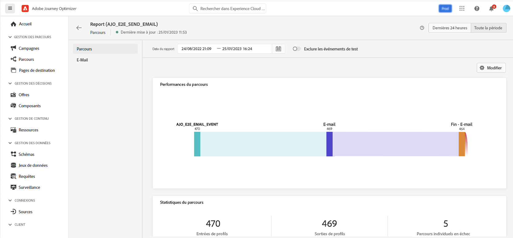

# Créer votre premier parcours{#jo-quick-start}

## Conditions préalables{#start-prerequisites}

Pour envoyer des messages avec des parcours, les configurations suivantes sont requises :

1. **Configurer un événement**: si vous souhaitez déclencher vos parcours unitairement à la réception d’un événement, vous devez configurer un événement. Vous définissez les informations attendues et comment les traiter. Cette étape est effectuée par une **utilisateur technique**. [En savoir plus](../event/about-events.md).

   

1. **Création d’un segment**: votre parcours peut également écouter les segments Adobe Experience Platform afin d’envoyer des messages par lots à un ensemble spécifié de profils. Pour ce faire, vous devez créer des segments. [En savoir plus](../segment/about-segments.md).

   

1. **Configuration de la source de données**: vous pouvez définir une connexion à un système pour récupérer des informations supplémentaires qui seront utilisées dans vos parcours, par exemple dans vos conditions. Une source de données Adobe Experience Platform intégrée est également configurée au moment de l’approvisionnement. Cette étape n’est pas nécessaire si vous utilisez uniquement les données des événements de votre parcours. Cette étape est effectuée par une **utilisateur technique**. [En savoir plus](../datasource/about-data-sources.md)

   

1. **Configuration d’une action**: Si vous utilisez un système tiers pour envoyer vos messages, vous pouvez créer une action personnalisée. En savoir plus à ce sujet [section](../action/action.md). Cette étape est effectuée par une **utilisateur technique**. Si vous utilisez les fonctionnalités de message intégré de Journey Optimizer, vous devez simplement ajouter une action de canal à votre parcours et concevoir votre contenu.

   

## Créer votre parcours{#jo-build}

>[!CONTEXTUALHELP]
>id="ajo_journey_create"
>title="Créer votre parcours"
>abstract="Cet écran affiche la liste des parcours existants. Ouvrez un parcours ou cliquez sur &quot;Créer un parcours&quot;, puis combinez les différentes activités d’événement, d’orchestration et d’action pour créer vos scénarios cross-canal à plusieurs étapes."

Cette étape est effectuée par la fonction **utilisateur professionnel**. C’est là que vous créez vos parcours. Combinez les différentes activités d’événement, d’orchestration et d’action pour créer vos scénarios cross-canal à plusieurs étapes.

Voici les principales étapes pour envoyer des messages dans les parcours :

1. Dans la section du menu GESTION DU PARCOURS , cliquez sur **[!UICONTROL Journeys]**. La liste des parcours s’affiche.

   

1. Cliquez sur **[!UICONTROL Create Journey]** pour créer un parcours.

1. Modifiez les propriétés du parcours dans le volet de configuration affiché sur le côté droit. En savoir plus à ce sujet [section](journey-gs.md#change-properties).

   

1. Commencez par faire glisser un événement ou une **Lecture de segment** de la palette vers la zone de travail. Pour en savoir plus sur la conception de parcours, reportez-vous à la section [cette section](using-the-journey-designer.md).

   

1. Effectuez un glisser-déposer des étapes suivantes que l’individu doit suivre. Par exemple, vous pouvez ajouter une condition suivie d’une action de canal. Pour en savoir plus sur les activités, reportez-vous à la section [cette section](using-the-journey-designer.md).

1. Testez votre parcours à l’aide de profils de test. En savoir plus à ce sujet [section](testing-the-journey.md)

1. Publiez votre parcours pour l’activer. En savoir plus à ce sujet [section](publishing-the-journey.md).

   

1. Surveillez votre parcours à l’aide d’outils de reporting dédiés afin de mesurer l’efficacité de celui-ci. En savoir plus à ce sujet [section](../reports/live-report.md).

   

## Définition des propriétés du parcours {#change-properties}

>[!CONTEXTUALHELP]
>id="ajo_journey_properties"
>title="Propriétés du parcours"
>abstract="Cette section présente les propriétés du parcours. Par défaut, les paramètres en lecture seule sont masqués. Les paramètres disponibles dépendent de l’état du parcours, de vos autorisations et de la configuration du produit."

Cliquez sur l’icône en forme de crayon, en haut à droite, pour accéder aux propriétés du parcours.

Vous pouvez modifier le nom du parcours, ajouter une description, autoriser une rentrée, choisir les dates de début et de fin et, en tant qu’utilisateur administrateur, définir une **[!UICONTROL Timeout and error]** durée.

Pour les parcours actifs, cet écran affiche la date de publication et le nom de l’utilisateur qui a publié le parcours.

Le **Copier les détails techniques** vous permet de copier des informations techniques sur le parcours que l’équipe d’assistance peut utiliser pour résoudre les problèmes. Les informations suivantes sont copiées : UID JourneyVersion, OrgID, orgName, sandboxName, lastDeployedBy, lastDeployedAt.

### Entrée{#entrance}

Par défaut, les nouveaux parcours permettent une rentrée. Vous pouvez décocher l’option correspondant aux parcours &quot;ponctuels&quot;, par exemple si vous souhaitez offrir un cadeau ponctuel lorsqu’une personne entre dans une boutique.

En savoir plus sur la gestion des entrées de profil, dans [cette section](entry-management.md).

### Délai dépassé et erreur dans les activités de parcours {#timeout_and_error}

Lors de la modification d’une action ou d’une activité de condition, vous pouvez définir un autre chemin en cas d’erreur ou d’expiration. Si le traitement de l’activité qui interroge un système tiers dépasse le délai d’expiration défini dans les propriétés du parcours (**[!UICONTROL Timeout and  error]** ), le deuxième chemin sera choisi pour effectuer une éventuelle action de secours.

Les valeurs autorisées sont comprises entre 1 et 30 secondes.

Nous vous recommandons de définir une valeur très courte **[!UICONTROL Timeout and error]** si votre parcours est sensible au temps (exemple : Réaction à l’emplacement en temps réel d’une personne), car vous ne pouvez pas retarder votre action de plus de quelques secondes. Si votre parcours est moins sensible au temps, vous pouvez utiliser une valeur plus longue pour accorder plus de temps au système appelé pour envoyer une réponse valide.

Les parcours utilisent également un délai d’expiration global. Voir [section suivante](#global_timeout).

### Délai de parcours global {#global_timeout}

En plus de la variable [timeout](#timeout_and_error) utilisé dans les activités de parcours, il existe également un délai d’expiration de parcours global qui n’est pas affiché dans l’interface et ne peut pas être modifié. Ce délai d’expiration arrête la progression des individus dans le parcours 30 jours après leur entrée. Cela signifie que le parcours d’un individu ne peut pas durer plus de 30 jours. Après le délai d’expiration de 30 jours, les données de l’individu sont supprimées. Les personnes qui continuent à circuler dans le parcours à la fin de la période d’expiration seront arrêtées et prises en compte comme des erreurs dans les rapports.

>[!NOTE]
>
>Les parcours ne réagissent pas directement aux demandes d’exclusion, d’accès ou de suppression des informations personnelles. Cependant, le délai d’expiration global garantit que les individus ne restent jamais plus de 30 jours dans aucun parcours.

En raison du délai de parcours de 30 jours, lorsque la rentrée n’est pas autorisée, nous ne pouvons pas nous assurer que le blocage de la rentrée fonctionnera plus de 30 jours. En effet, comme nous supprimons toutes les informations sur les personnes qui sont entrées dans le parcours 30 jours après leur entrée, nous ne pouvons pas savoir la personne qui y est entrée plus tôt, il y a plus de 30 jours.

### Fuseau horaire et fuseau horaire du profil {#timezone}

Le fuseau horaire est défini au niveau du parcours.

Vous pouvez entrer un fuseau horaire fixe ou utiliser les profils Adobe Experience Platform pour définir le fuseau horaire du parcours.

Si un fuseau horaire est défini dans le profil Adobe Experience Platform, il peut être récupéré dans le parcours.

Pour plus d’informations sur la gestion des fuseaux horaires, voir [cette page](../building-journeys/timezone-management.md).

### Gérer l’accès {#access}

Pour attribuer des libellés d’utilisation des données personnalisés ou de base au parcours, cliquez sur le bouton **[!UICONTROL Manage access]** bouton . [En savoir plus sur le contrôle d’accès au niveau de l’objet (OLA)](../administration/object-based-access.md)

