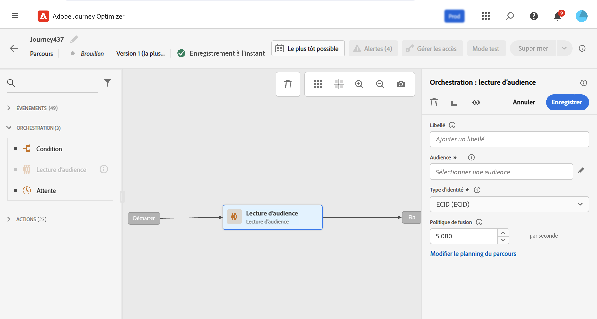

# Créer votre premier parcours {#jo-quick-start}

>[!CONTEXTUALHELP]
>id="ajo_homepage_card2"
>title="Créer des parcours"
>abstract="Utilisez **Adobe Journey Optimizer** pour créer des cas d’utilisation d’orchestration en temps réel à l’aide de données contextuelles stockées dans des événements ou des sources de données."

>[!CONTEXTUALHELP]
>id="ajo_journey_create"
>title="Parcours"
>abstract="Concevoir des parcours clients pour offrir des expériences contextuelles personnalisées. Journey Optimizer vous permet de créer des cas d’utilisation d’orchestration en temps réel avec des données contextuelles stockées dans des événements ou des sources de données. L’onglet **Vue d’ensemble** affiche un tableau de bord avec les mesures clés liées à vos parcours : L’onglet **Parcourir** affiche la liste des parcours existants."

Adobe Journey Optimizer comprend une zone de travail d’orchestration omnicanal qui permet aux spécialistes du marketing d’harmoniser la portée marketing avec l’engagement client individuel. L’interface utilisateur vous permet de faire glisser facilement des activités de la palette vers la zone de travail pour créer votre parcours. L’interface d’utilisation du parcours est présentée sur [cette page](journey-ui.md).

Les étapes principales de la création d’un parcours sont détaillées sur cette page. Les voici :

Créez des parcours clients à plusieurs étapes pour démarrer une séquence d’interactions, d’offres et de messages sur plusieurs canaux en temps réel. Cette approche garantit que les clientes et clients interagissent aux moments optimaux en fonction de leurs actions et des signaux commerciaux pertinents. Les audiences cibles sont définies en fonction du comportement, des données contextuelles et des événements métier. Les prérequis dépendent de votre cas d’utilisation et du [type de parcours](entry-management.md#types-of-journeys) que vous créez.

En savoir plus sur la circulation des profils dans les parcours et les taux de traitement des parcours dans [cette section](entry-management.md#journey-processing-rate).

Avant de commencer à créer votre parcours, vérifiez que les étapes de configuration appropriées sont effectuées :

* Si vous souhaitez déclencher individuellement vos parcours lorsqu’un événement se produit, **configurez un événement**. Définissez les informations attendues et la manière de les traiter. [En savoir plus](../event/about-events.md).

<!--     -->

* Votre parcours peut également écouter les audiences Adobe Experience Platform afin d’envoyer des messages par lots à un ensemble de profils spécifié. Pour ce faire, **créez des audiences**. [En savoir plus](../audience/about-audiences.md).

<!--     -->

* Définissez une connexion à un système pour récupérer des informations supplémentaires qui seront utilisées dans vos parcours, par exemple dans vos conditions. Cette connexion repose sur une **source de données**. [En savoir plus](../datasource/about-data-sources.md).

<!--     -->

* Journey Optimizer propose des fonctionnalités de [message intégrées](../building-journeys/journeys-message.md). Si vous utilisez un système tiers pour envoyer vos messages, vous pouvez **créer une action personnalisée**. En savoir plus dans cette [section](../action/action.md).

<!--      -->

Les personnes chargées de l’ingénierie de données peuvent consulter [cette section](../configuration/about-data-sources-events-actions.md) pour en savoir plus sur la procédure de configuration des parcours, y compris les sources de données, les événements et les actions.

>[!NOTE]
>
>Les mécanismes de sécurisation et limitations des parcours sont détaillés sur [cette page](../start/guardrails.md).

## Créer un parcours {#jo-build}

Pour créer un parcours à plusieurs étapes, procédez comme suit :

1. Dans la section du menu GESTION DES PARCOURS, cliquez sur **[!UICONTROL Parcours]**.

1. Cliquez sur le bouton **[!UICONTROL Créer un parcours]** pour créer un parcours.

1. Modifiez le volet de configuration du parcours pour définir le nom du parcours et ses propriétés. Découvrez comment définir les propriétés de votre parcours sur [cette page](journey-properties.md).

   

Vous pouvez ensuite commencer à concevoir votre parcours.

## Concevoir le parcours {#jo-design}

Le concepteur de parcours omnicanaux dispose d’une interface intuitive par glisser-déposer, qui vous permet de créer des parcours à plusieurs étapes avec des audiences ciblées, des mises à jour basées sur des interactions client ou commerciale en temps réel et des messages omnicanaux.

1. Commencez par effectuer un glisser-déposer d’un événement ou d’une activité **Lecture d’audience** de la palette vers la zone de travail. Pour plus d’informations sur la conception d’un parcours, consultez [cette section](using-the-journey-designer.md).

   

1. Effectuez un glisser-déposer d’un événement ou d’une activité **Lecture d’audience** de la palette vers la zone de travail. Pour plus d’informations sur la conception d’un parcours, consultez [cette section](using-the-journey-designer.md).

## Tester le parcours {#jo-test}

Une fois que vous avez créé votre parcours, testez-le avant de le publier. Journey Optimizer propose un **mode de test** pour afficher les profils de test au fur et à mesure de leur progression dans le parcours et ainsi détecter les erreurs potentielles avant l’activation. L’exécution de tests rapides vous permet de vérifier que les parcours fonctionnent correctement afin de pouvoir les publier en toute confiance. Découvrez comment tester votre parcours dans [cette section](testing-the-journey.md).

Vous pouvez également exécuter votre parcours en mode **test à blanc**. Le test à blanc de parcours est un mode de publication de parcours spécial dans Adobe Journey Optimizer qui permet aux concepteurs et conceptrices de tester un parcours à l’aide de données de production réelles sans contacter les clients et clientes ni mettre à jour les informations de profil. Cette fonctionnalité permet aux concepteurs et conceptrices de parcours d’avoir confiance dans leur conception de parcours et leur ciblage d’audience avant de publier un parcours en ligne. Découvrez comment publier un parcours en mode Test à blanc dans [cette section](journey-dry-run.md).

## Publiez le parcours. {#jo-pub}

Vous devez publier un parcours pour l’activer et le rendre disponible pour que de nouveaux profils puissent le rejoindre. Avant de publier votre parcours, vérifiez qu’il est valide et qu’il ne comporte aucune erreur. Vous ne pouvez pas publier un parcours comportant des erreurs. Journey Optimizer valide également la taille de la payload au moment de l’enregistrement et de la publication pour préserver la stabilité et les performances. En savoir plus sur la publication des parcours dans cette [section](publish-journey.md) et consultez [Validation de la taille de la payload du parcours ](../start/guardrails.md#journey-payload-size).

Une fois publié, vous pouvez surveiller votre parcours à l’aide des outils de rapports dédiés afin de mesurer l’efficacité de votre parcours.

En savoir plus sur les rapports de parcours dans [cette section](../reports/live-report.md).

## Ressources supplémentaires

* **[Présentation du concepteur de parcours](using-the-journey-designer.md)** : maîtrisez l’interface de zone de travail du parcours pour concevoir et orchestrer des parcours client.
* **[Activités de parcours](about-journey-activities.md)** : découvrez toutes les activités disponibles, y compris les événements, les actions et les composants d’orchestration.
* **[Test des parcours](testing-the-journey.md)** : découvrez comment tester vos parcours à l’aide du mode test avant de les publier en production.
* **[Publication de parcours](publish-journey.md)** : découvrez le processus de publication des parcours et comment gérer les parcours en direct.
* **[Rapports de parcours](report-journey.md)** : suivez et analysez les performances du parcours avec des mesures et des informations détaillées.
* **[Dépannage des parcours](troubleshooting.md)** : trouvez des solutions aux problèmes courants du parcours et consultez les bonnes pratiques de débogage.
* **[Tutoriels sur les parcours](https://experienceleague.adobe.com/fr/docs/journey-optimizer-learn/tutorials/journeys/introduction-to-building-a-journey){target="_blank"}** : consultez des tutoriels vidéo détaillés sur la création de parcours et les bonnes pratiques.

>[!NOTE]
>
>Si vous devez apporter des modifications à un parcours **actif**, [créez une nouvelle version](journey-ui.md#journey-filter) de votre parcours.
