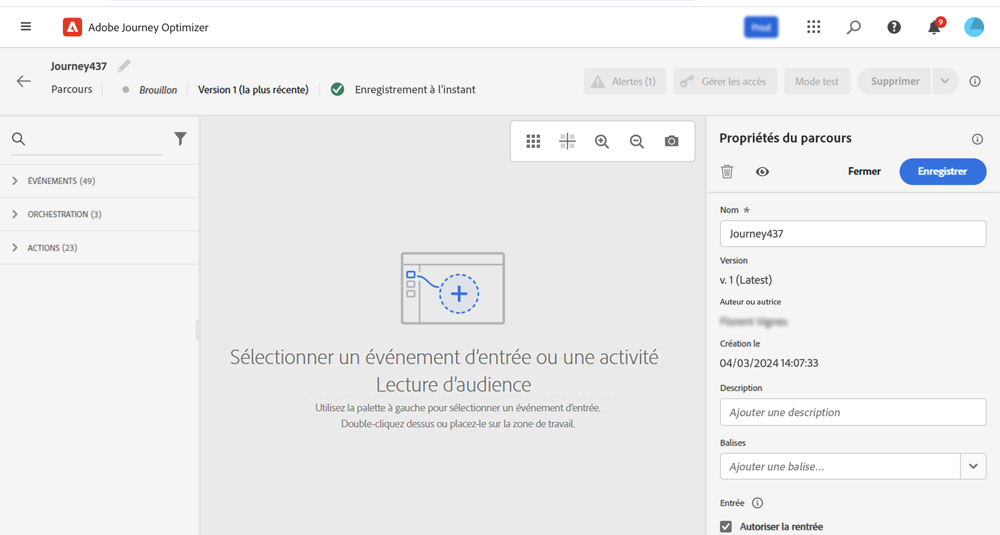

# Créer votre premier parcours{#jo-quick-start}

## Conditions préalables{#start-prerequisites}

Pour envoyer des messages avec des parcours, les configurations suivantes sont requises :

1. **Configurer un événement** : si vous souhaitez déclencher vos parcours une fois qu&#39;un événement est reçu, vous devez configurer un événement. Vous devez définir les informations attendues et comment les traiter. Cette étape est effectuée par un **utilisateur technique**. [En savoir plus](../event/about-events.md).

   

1. **Créer un segment** : votre parcours peut également écouter les segments Adobe Experience Platform afin d’envoyer des messages par lots à un ensemble de profils spécifié. Pour cela, vous devez créer des segments. [En savoir plus](../segment/about-segments.md).

   

1. **Configurer la source de données** : vous devez définir une connexion à un système pour récupérer des informations supplémentaires qui seront utilisées pour vos parcours, par exemple dans vos conditions. Une source de données Adobe Experience Platform intégrée est également définie au moment de l&#39;approvisionnement. Cette étape n&#39;est pas obligatoire si vous n&#39;exploitez que les données des événements de votre parcours. Cette étape est effectuée par un **utilisateur technique**. [En savoir plus](../datasource/about-data-sources.md)

   

1. **Configurer une action** : si vous utilisez un système tiers pour envoyer vos messages, vous pouvez créer une action personnalisée. En savoir plus dans cette [section](../action/action.md). Cette étape est effectuée par un **utilisateur technique**. Si vous utilisez les fonctionnalités de message intégrées à Journey Optimizer, vous devez simplement ajouter une action de canal à votre parcours et concevoir votre contenu.

   

## Accéder aux parcours {#journey-access}

Dans la section du menu GESTION DES PARCOURS, cliquez sur **[!UICONTROL Parcours]**. Deux onglets sont disponibles :

**Vue d’ensemble** : cet onglet affiche un tableau de bord avec les mesures clés liées à vos parcours :

* **Profils traités** : nombre total de profils traités au cours des dernières 24 heures
* **Parcours dynamiques** : nombre total de parcours dynamiques avec trafic au cours des dernières 24 heures. Les parcours dynamiques incluent les **parcours unitaires** (basés sur un événement) et les **parcours par lots** (lire le segment).
* **Taux d’erreur** : ratio de tous les profils en erreur par rapport au nombre total de profils entrés au cours des dernières 24 heures.
* **Taux d’abandon**: ratio de tous les profils ignorés par rapport au nombre total de profils entrés au cours des dernières 24 heures. Un profil ignoré représente une personne qui n’est pas éligible pour entrer dans le parcours, par exemple en raison d’un espace de noms incorrect ou des règles de rentrée.

>[!NOTE]
>
>Ce tableau de bord prend en compte les parcours avec trafic au cours des dernières 24 heures. Seuls les parcours auxquels vous avez accès s’affichent.

**Parcourir** : cet onglet affiche la liste des parcours existants. Vous pouvez rechercher des parcours, utiliser des filtres et effectuer des actions de base sur chaque élément. Vous pouvez par exemple dupliquer ou supprimer un élément. Voir à ce sujet [cette section](../start/user-interface.md#filter-lists).

Dans la liste des parcours, vous pouvez filtrer les parcours en fonction de leur statut, de leur type et de leur version à partir des **[!UICONTROL filtres de statut et de version]**. Le type peut être : **[!UICONTROL Événement unitaire]**, **[!UICONTROL Qualification du segment]**, **[!UICONTROL Lecture de segment]**, **[!UICONTROL Événement métier]** ou **[!UICONTROL Rafale]**.

Vous pouvez choisir d’afficher uniquement les parcours qui utilisent un événement, un groupe de champs ou une action spécifique à l’aide des **[!UICONTROL filtres d’activité]** et des **[!UICONTROL filtres de données]**. Les **[!UICONTROL filtres de publication]** vous permettent également de sélectionner une date de publication ou un utilisateur ou une utilisatrice. Il est possible, par exemple, d&#39;afficher les dernières versions des parcours actifs publiées hier. [En savoir plus](../building-journeys/using-the-journey-designer.md).

Utilisez les colonnes **[!UICONTROL Dernière mise à jour]** et **[!UICONTROL Dernière mise à jour par]** pour vérifier quand s&#39;est produit la dernière mise à jour de vos parcours et qui l&#39;a enregistrée.

Dans les volets de configuration des événements, des sources de données et des actions, le champ **[!UICONTROL Utilisé(e) dans]** affiche le nombre de parcours qui utilisent cet événement, ce groupe de champs ou cette action spécifique. Vous pouvez cliquer sur le bouton **[!UICONTROL Afficher les parcours]** pour faire apparaître la liste des parcours correspondants.

## Création de votre parcours{#jo-build}

>[!CONTEXTUALHELP]
>id="ajo_journey_create"
>title="Création de votre parcours"
>abstract="Cet écran affiche la liste des parcours existants. Ouvrez un parcours ou cliquez sur « Créer un parcours », puis combinez les différentes activités d’événement, d’orchestration et d’action pour créer vos scénarios cross-canal à plusieurs étapes."

Cette étape est effectuée par l&#39;**utilisateur chargé de la conception de parcours**. C&#39;est là que vous créez vos parcours. Combinez les différentes activités d&#39;événement, d&#39;orchestration et d&#39;action afin de créer des scénarios cross-canal à plusieurs étapes.

Voici les étapes principales pour envoyer des messages à travers des parcours :

1. Dans l’onglet **Parcourir**, cliquez sur **[!UICONTROL Créer un Parcours]** pour créer un parcours.

1. Modifiez les propriétés du parcours dans le volet de configuration qui s&#39;affiche dans la partie droite. En savoir plus dans cette [section](journey-gs.md#change-properties).

   

1. Commencez par effectuer un glisser-déposer d’un événement ou d’une activité **Lecture de segment** de la palette vers la zone de travail. Pour en savoir plus sur la conception d&#39;un parcours, consultez [cette section](using-the-journey-designer.md).

   

1. Faites glisser et déposez les étapes suivantes que l&#39;individu doit suivre. Par exemple, vous pouvez ajouter une condition suivie d’une action de canal. Pour en savoir plus sur les activités, consultez [cette section](using-the-journey-designer.md).

1. Testez votre parcours à l&#39;aide de profils de test. En savoir plus dans cette [section](testing-the-journey.md)

1. Publiez votre parcours pour l&#39;activer. En savoir plus dans cette [section](publishing-the-journey.md).

   

1. Surveillez votre parcours à l&#39;aide des outils de rapports dédiés afin de mesurer l&#39;efficacité de votre parcours. En savoir plus dans cette [section](../reports/live-report.md).

   

## Définition des propriétés de votre parcours {#change-properties}

>[!CONTEXTUALHELP]
>id="ajo_journey_properties"
>title="Propriétés du parcours"
>abstract="Cette section présente les propriétés du parcours. Par défaut, les paramètres en lecture seule sont masqués. Les paramètres disponibles dépendent du statut du parcours, de vos autorisations et de la configuration de votre produit."

Cliquez sur l&#39;icône en forme de crayon en haut à droite pour accéder aux propriétés du parcours.

Vous pouvez modifier le nom du parcours, ajouter une description, autoriser une rentrée, choisir les dates de début et de fin, et, si vous être administrateur, définir une durée de **[!UICONTROL Temporisation et erreur]**. Vous pouvez également attribuer des balises unifiées Adobe Experience Platform à votre parcours. Vous pouvez ainsi facilement les classer et améliorer la recherche à partir de la liste des campagnes. [Découvrir comment utiliser les balises](../start/search-filter-categorize.md#tags)

Pour les parcours actifs, cet écran affiche la date de publication et le nom de l’utilisateur qui a publié le parcours.

La fonction **Copier les détails techniques** permet de copier les informations techniques relatives au parcours qui seront utiles à l&#39;équipe d&#39;assistance technique pour résoudre les problèmes. Les informations suivantes sont copiées : UID JourneyVersion, OrgID, orgName, sandboxName, lastDeployedBy, lastDeployedAt.

### Entrée{#entrance}

Par défaut, les nouveaux parcours autorisent une rentrée. Vous pouvez désélectionner l’option **Autoriser la reprise** pour les parcours « uniques », par exemple, si vous souhaitez offrir un cadeau unique à un utilisateur ou une utilisatrice qui effectue sa première visite dans la boutique.

Lorsque l’option **Autoriser une reprise** est activée, le champ **Période d’attente de reprise** s’affiche. Ce champ vous permet de définir le temps d’attente avant d’autoriser un profil à entrer à nouveau dans le parcours en parcours unitaires (en commençant par un événement ou une qualification de segment). Cela empêche les parcours d’être déclenchés plusieurs fois par erreur pour le même événement. Par défaut, le champ est défini sur 5 minutes.

Pour en savoir plus sur la gestion des entrées de profil, consultez [cette section](entry-management.md).

### Gérer l’accès {#access}

Pour attribuer des libellés d’utilisation des données personnalisés ou de base au parcours, cliquez sur le bouton **[!UICONTROL Gérer l’accès]**. [En savoir plus sur le contrôle d’accès au niveau de l’objet (OLA)](../administration/object-based-access.md)

### Fuseau horaire et fuseau horaire du profil {#timezone}

Le fuseau horaire est défini au niveau du parcours.

Vous pouvez entrer un fuseau horaire fixe ou utiliser les profils Adobe Experience Platform pour définir le fuseau horaire du parcours.

Si un fuseau horaire est défini dans le profil Adobe Experience Platform, il peut être récupéré dans le parcours.

Pour plus d&#39;informations sur la gestion des fuseaux horaires, voir [cette page](../building-journeys/timezone-management.md).

### Dates de début et de fin {#dates}

Vous pouvez définir une **date de début**. Si vous n’en avez pas spécifié une, elle sera automatiquement définie au moment de la publication.

Vous pouvez également ajouter une **date de fin**. Cela permet aux profils de se fermer automatiquement lorsque la date est atteinte. Si vous ne spécifiez pas de date de fin, les profils peuvent rester jusqu’au délai d’expiration par défaut du parcours (généralement 30 jours, 7 jours avec l’offre de module complémentaire Healthcare Shield). La seule exception concerne les parcours de segment de lecture récurrente avec l’option **Forcer une reprise sur la périodicité** activée, qui se termine à la date de début de l’occurrence suivante.

### Temporisation et erreur dans les activités du parcours {#timeout_and_error}

Lors de la modification d’une action ou d’une activité de condition, vous avez la possibilité de spécifier un autre chemin en cas d’erreur ou de dépassement de délai. Si le traitement de l’activité, qui implique l’interrogation d’un système tiers, dépasse la durée spécifiée dans les propriétés du parcours pour le délai d’expiration et la gestion des erreurs (**[!UICONTROL Délai d’expiration et erreur]** ), le deuxième chemin d’accès est sélectionné pour exécuter une action de secours si nécessaire.

Les valeurs autorisées sont comprises entre 1 et 30 secondes.

Nous vous recommandons de définir une valeur très basse pour **[!UICONTROL Temporisation et erreur]** si votre parcours est sensible au temps (c&#39;est le cas, par exemple, lorsqu&#39;il convient de réagir à la position en temps réel d&#39;une personne), car l&#39;action ne peut pas être différée de plus de quelques secondes. Si le facteur temps revêt une importance moindre, vous pouvez définir un délai plus long afin d&#39;accorder davantage de temps au système appelé pour envoyer une réponse valide.

Les parcours utilisent également une temporisation globale. Pour plus d&#39;informations, consultez la [section suivante](#global_timeout).

### Temporisation de parcours globale {#global_timeout}

Outre la [temporisation](#timeout_and_error) utilisée dans les activités de parcours, il existe une temporisation globale qui n&#39;est pas affichée dans l&#39;interface et qui ne peut pas être modifiée. Cette valeur de temporisation mettra fin à la progression des individus dans le parcours 30 jours après leur entrée. En d&#39;autres termes, la durée du parcours d&#39;un individu ne peut pas excéder 30 jours. Après cette période de temporisation de 30 jours, les données le concernant sont supprimées. Les individus qui sont encore actifs dans le parcours au terme de cette période de temporisation sont arrêtés et considérés comme des « erreurs » dans le cadre du reporting.

>[!NOTE]
>
>Les parcours ne réagissent pas directement aux demandes d&#39;opt-out, de suppression ou d&#39;accès. Cependant, la temporisation globale limite à 30 jours la durée d&#39;activité d&#39;un individu au sein d&#39;un parcours.

Compte tenu de la temporisation de 30 jours, lorsque la rentrée n&#39;est pas autorisée, nous sommes dans l&#39;impossibilité de garantir que le blocage de rentrée fonctionnera plus de 30 jours. En effet, étant donné que nous supprimons toutes les informations sur les personnes qui ont rejoint le parcours 30 jours après leur entrée, rien ne nous permet de savoir qu&#39;une personne l&#39;a déjà rejoint il y a plus de 30 jours.

