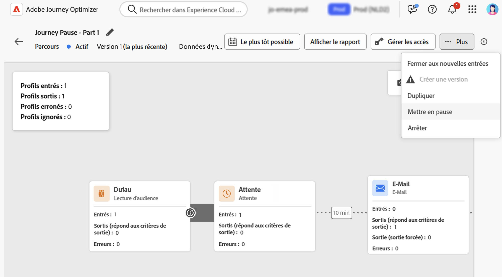
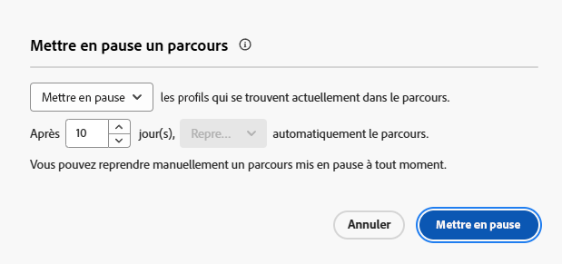
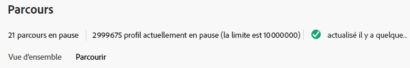
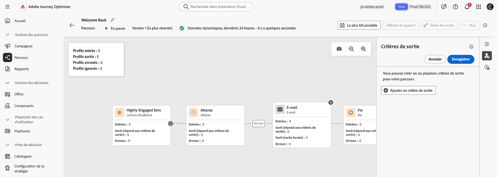
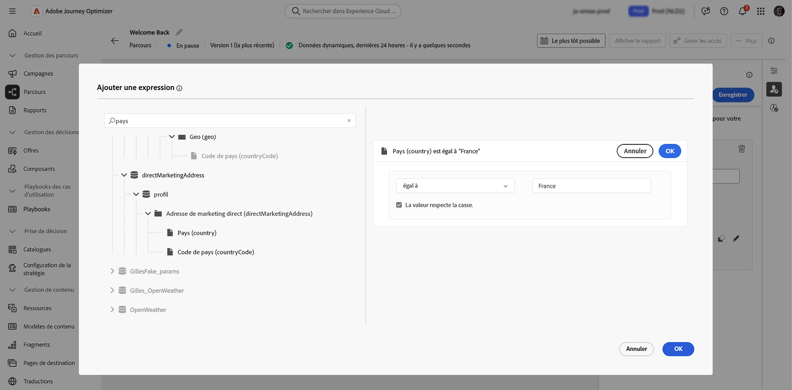
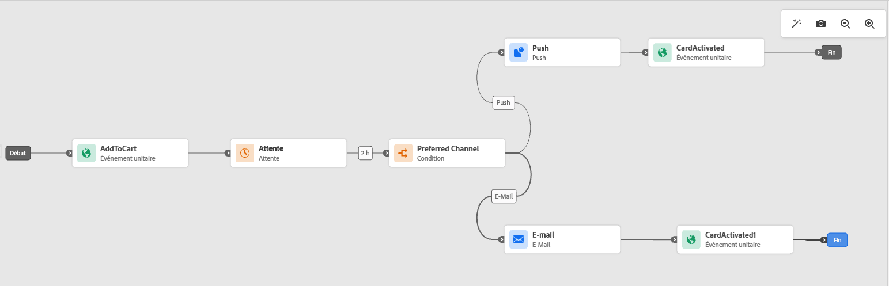

# Suspendre un parcours {#journey-pause}

>[!CONTEXTUALHELP]
>id="ajo_journey_pause"
>title="Mettre en pause votre parcours"
>abstract="Mettez en pause un parcours actif pour empêcher de nouveaux profils de le rejoindre. Choisissez de supprimer ou de conserver les profils actuellement dans le parcours. S’ils sont conservés, ils reprendront l’exécution à l’activité d’action suivante lors de la reprise du parcours. Idéal pour les mises à jour ou les arrêts d’urgence, sans perte de la progression."

Vous pouvez mettre en pause vos parcours actifs, effectuer toutes les modifications nécessaires, puis les reprendre à tout moment.<!--You can choose whether the journey is resumed at the end of the pause period, or whether it stops completely. --> Pendant la pause, vous pouvez [appliquer des critères de sortie d’attribut de profil](#journey-exit-criteria) pour exclure des profils en fonction de leurs attributs. Le parcours est automatiquement repris à l’issue de la période de pause. Vous pouvez également le [reprendre manuellement](#journey-resume-steps).

## Avantages clés {#journey-pause-benefits}

La mise en pause et la reprise des parcours offrent aux responsables de parcours davantage de contrôle et de flexibilité en permettant de suspendre temporairement les parcours actifs sans perturber l’expérience client. Lorsque le parcours est suspendu, aucune communication n’est envoyée et les profils restent suspendus jusqu’à la reprise du parcours.

Cette fonctionnalité réduit le risque d’envoi de messages indésirables lors d’erreurs ou de mises à jour (par exemple, une modification du contenu du message), offre une gestion des parcours plus sûre et renforce la confiance du ou de la responsable de parcours. L’affichage des parcours en pause et de leur statut directement dans l’interface d’utilisation améliore la transparence et l’agilité opérationnelle.

>[!CAUTION]
>
>* Les autorisations de mise en pause et de reprise des parcours sont limitées aux utilisateurs et aux utilisatrices qui disposent de l’autorisation de haut niveau **[!DNL Publish journeys]**. Pour en savoir plus sur la gestion des droits d’accès des utilisateurs et des utilisatrices [!DNL Journey Optimizer], consultez [cette section](../administration/permissions-overview.md).
>
>* Avant de commencer à utiliser la fonctionnalité de mise en pause/reprise, [lisez la section sur les Mécanismes de sécurisation et les limitations](#journey-pause-guardrails).


## Mise en pause d’un parcours {#journey-pause-steps}

Vous pouvez mettre en pause n’importe quel parcours **actif**.

Pour mettre en pause votre parcours, procédez comme suit :

1. Ouvrez le parcours que vous souhaitez mettre en pause.
1. Cliquez sur le bouton **...Plus** situé en haut à droite de la zone de travail du parcours, puis sélectionnez **Mettre en pause**.

   

1. Sélectionnez les options de gestion des profils qui se trouvent actuellement dans le parcours.

   {width="50%" align="left"}

   Vous pouvez effectuer les actions suivantes :

   * **Mettre en pause les profils** - Les profils attendront le nœud **Action** suivant pour reprendre le parcours.
   * **Ignorer les profils** - Les profils seront exclus du parcours lors du nœud **Action** suivant.

   Lorsque vous suspendez un parcours, il est supposé que vous prévoyez de le reprendre à un moment donné. Cependant, un parcours ne peut pas rester en pause indéfiniment. Pour éviter cela, vous pouvez définir la durée pendant laquelle le parcours doit rester en pause (entre 1 et 14 jours). Le parcours reprend automatiquement après le nombre de jours sélectionné.

1. Cliquez sur le bouton **Mettre en pause** pour confirmer l’opération.

Le nombre maximal de profils pouvant être conservés dans des parcours mis en pause pour votre organisation est visible dans l’inventaire des parcours. Il n’est visible que lorsqu’au moins un parcours est en pause. Cet indicateur affiche également le nombre total de parcours mis en pause. Il est réactualisé toutes les 30 minutes. En savoir plus dans la section [Mécanismes de sécurisation et limitations](#guardrails-and-limitations).

{width="50%" align="left"}

Dans la liste de vos parcours, vous pouvez mettre en pause un ou plusieurs parcours **actifs**. Pour mettre en pause un groupe de parcours (_pause par lots_), sélectionnez-les dans la liste et cliquez sur le bouton **Mettre en pause** dans la barre bleue en bas de l’écran. Le bouton **Mettre en pause** n’est disponible que lorsque des parcours **actifs** sont sélectionnés.


## Logique d’exécution des parcours mis en pause {#journey-pause-exec}

Lorsqu’un parcours est en pause, les nouvelles entrées sont toujours supprimées, quel que soit le mode choisi (mettre en pause/ignorer).

Lorsqu’un parcours est en pause, la gestion des profils et l’exécution des activités dépendent de l’activité. Les comportements sont détaillés ci-dessous. Afin de comprendre pleinement ces principes, consultez également cet [exemple de bout en bout](#journey-pause-sample).


| Activité de parcours | Lorsque le parcours est en pause |
|-------------------------|--------------------------------------------------|
| [Qualification de l’audience](audience-qualification-events.md) | <ul> <li>Lors du premier nœud de la zone de travail : toute qualification de profil pour l’audience est ignorée. </li><li>Dans les autres nœuds : même comportement que dans un parcours actif, mais si la qualification de l’audience se situe après une activité <strong>Action</strong> et que l’utilisateur ou l’utilisatrice est mis en pause lors de cette action, la qualification de l’audience est ignorée. </li></ul> |
| [Événement unitaire](general-events.md) | <ul> <li>Lors du premier nœud de la zone de travail : l’événement est ignoré.</li><li>Dans les autres nœuds : même comportement que dans un parcours actif. Cependant, si l’événement se situe après une activité <strong>Action</strong> et que l’utilisateur ou l’utilisatrice est mis en pause lors de cette action, l’événement est ignoré. </li></ul> |
| [Lecture d’audience](read-audience.md) | Même comportement que dans un parcours actif, avec quelques spécificités : <ol> <li> Si le bouton <strong>Mettre en pause</strong> a été utilisé après le démarrage de l’activité <strong>Lecture d’audience</strong>, les profils déjà entrés dans le parcours le poursuivront (jusqu’à l’activité <strong>Action</strong> suivante). Étant donné que le parcours lit les audiences à une certaine vitesse, si l’audience entière n’est pas encore entrée, les profils restants dans la file d’attente seront ignorés.</li><li> Pour les exécutions uniques : aucune erreur ne s’affichera au moment de la reprise si la date planifiée est antérieure à la date de reprise. Cette planification sera ignorée.</li><li>Pour les parcours incrémentiels : <ul><li>Si une pause se produit avant la première occurrence, l’audience complète sera lue lors de la reprise. </li><li>Si une pause se produit, par exemple, le 4e jour d’une périodicité quotidienne et que le parcours reste en pause jusqu’au 9e jour, alors, lors de la reprise, tous les profils qui sont entrés entre le 4e et le 9e jour seront inclus.  </li></ul></ol> |
| [Réaction](reaction-events.md) | Même comportement que dans un parcours actif. Cependant, si la réaction se situe après une activité <strong>Action</strong> et que l’utilisateur ou l’utilisatrice est mis en pause lors de cette action, l’événement de réaction est ignoré. |
| [Attente](wait-activity.md) | Même comportement que dans un parcours actif. |
| [Condition](condition-activity.md) | Même comportement que dans un parcours actif. |
| [Décision de contenu](content-decision.md) | Les profils sont conservés ou ignorés en fonction de ce que l’utilisateur ou l’utilisatrice a choisi lorsque le parcours a été suspendu. |
| [Action de canal](journeys-message.md) | Les profils sont conservés ou ignorés en fonction de ce que l’utilisateur ou l’utilisatrice a choisi lorsque le parcours a été suspendu. |
| [Action personnalisée](../action/action.md) | Les profils sont conservés ou ignorés en fonction de ce que l’utilisateur ou l’utilisatrice a choisi lorsque le parcours a été suspendu. |
| [Mettre à jour le profil](update-profiles.md) et [Sauter](jump.md) | Les profils sont conservés ou ignorés en fonction de ce que l’utilisateur ou l’utilisatrice a choisi lorsque le parcours a été suspendu. |
| [Source de données externe](../datasource/external-data-sources.md) | Même comportement que dans un parcours actif. |
| [Critères de sortie](journey-properties.md#exit-criteria) | Même comportement que dans un parcours actif. |


Découvrez comment résoudre les problèmes liés aux rejets dans [cette section](#discards-troubleshoot).

## Reprise d’un parcours en pause {#journey-resume-steps}

>[!CONTEXTUALHELP]
>id="ajo_journey_resume"
>title="Reprendre votre parcours"
>abstract="Reprenez un parcours en pause pour permettre à de nouveaux profils de rejoindre le parcours. Si des profils étaient en attente pendant la pause, ils continueront leur parcours. Idéal pour redémarrer des parcours en toute sécurité après des mises à jour ou des pauses."

Les parcours en pause sont automatiquement repris à l’issue d’une période de pause maximale de 14 jours. Ils peuvent être repris manuellement à tout moment. Reprenez un parcours en pause pour permettre à de nouveaux profils de rejoindre à nouveau le parcours. Si des profils étaient en attente pendant la pause, ils continueront leur parcours. Idéal pour redémarrer des parcours en toute sécurité après des mises à jour ou des pauses.

Pour reprendre un parcours en pause et recommencer à écouter les événements de parcours, procédez comme suit :

1. Ouvrez le parcours que vous souhaitez reprendre.
1. Cliquez sur le bouton **...Plus** situé en haut à droite de la zone de travail du parcours, puis sélectionnez **Reprendre**.

   Le statut du parcours devient **Reprise en cours**. Lorsque le parcours reprend, les nouvelles entrées démarrent en moins d’une minute. La reprise des profils qui ont été mis en pause peut prendre un certain temps : les profils sont repris à un taux de 5 000 tps.  Étant donné que tous les profils doivent reprendre pour que le parcours soit à nouveau **actif**, la transition du statut **reprise en cours** au statut **actif** peut prendre un certain temps.

1. Cliquez sur le bouton **Reprendre** pour confirmer l’opération.


Dans la liste de vos parcours, vous pouvez reprendre un ou plusieurs parcours **en pause**. Pour reprendre un groupe de parcours (_reprise par lots_), sélectionnez-les et cliquez sur le bouton **Reprendre** situé dans la barre bleue en bas de l’écran. Notez que le bouton **Reprendre** n’est disponible que lorsque des parcours **en pause** sont sélectionnés.


## Appliquer un critère de sortie dans un parcours mis en pause {#journey-exit-criteria}

Lorsqu’un parcours est mis en pause, vous pouvez appliquer un critère de sortie basé sur des attributs de profil. Ce filtre permet d’exclure au moment de la reprise les profils qui correspondent à une expression définie. Après la définition des critères de sortie basés sur des attributs de profil, ceux-ci sont appliqués sur les nœuds d’action, même pour les nouvelles entrées de profils. Les profils existants correspondant aux critères et les nouveaux profils entrant dans le parcours seront exclus du parcours **sur le nœud d’action suivant** qu’ils rencontrent.

Par exemple, pour exclure toutes les clientes et tous les clients français d’un parcours en pause, procédez comme suit :

1. Accédez au parcours en pause que vous souhaitez modifier.

1. Cliquez sur l’icône **Critères de sortie**.

   

1. Dans les paramètres **Critères de sortie**, cliquez sur **Ajouter des critères de sortie** pour définir un filtre en fonction des attributs de profil.

1. Définissez l’expression pour exclure les profils dont l’attribut de pays est égal à « France ».

   

1. Enregistrez votre filtre et cliquez sur le bouton **Mettre à jour le parcours** pour appliquer vos modifications.

1. [Reprenez le parcours](#journey-resume-steps).

   Au moment de la reprise, tous les profils dont l’attribut de pays est défini sur France seront automatiquement exclus du parcours au niveau du nœud d’action suivant. Tous les nouveaux profils dont l’attribut de pays est défini sur France qui tenteront d’entrer dans le parcours seront bloqués au nœud d’action suivant.

N’oubliez pas que les exclusions de profils, pour les profils actuellement dans le parcours et pour les nouveaux profils, ne se produiront que **lorsqu’ils atteindront un nœud d’action**.

>[!CAUTION]
>
>* Vous ne pouvez définir qu’**un** seul critère de sortie basé sur un attribut de profil pour chaque parcours.
>
>* Vous pouvez uniquement créer, mettre à jour ou supprimer un critère de sortie basé sur un attribut de profil dans les parcours **mis en pause**.
>
>* Pour en savoir plus sur les critères de sortie basés sur des attributs de profil, consultez [cette section](journey-properties.md#profile-exit-criteria).

## Mécanismes de sécurisation et limitations {#journey-pause-guardrails}

* Une version de parcours peut être mise en pause pendant **14 jours** avec un maximum de **10 millions de profils** autorisés dans les parcours en pause dans l’ensemble de votre organisation.
Cette limite tient compte du nombre total de profils conservés sur tous les parcours en pause, et non de profils distincts. Par exemple, si les mêmes profils de 5 millions sont conservés dans deux parcours en pause, la limite de 10 millions est atteinte.
Cette limite est vérifiée toutes les 30 minutes. Cela signifie que vous pouvez temporairement dépasser le seuil de 10 millions, mais une fois que le système le détecte, tous les profils supplémentaires sont automatiquement ignorés.

  Si vous reprenez les parcours pour ramener le nombre de profils conservés en dessous de la limite, le parcours reprend immédiatement, mais la mise à jour du nombre de profils peut prendre jusqu’à 30 minutes. Pendant ce temps, le système peut toujours considérer ces profils comme étant en pause.

* Pour les parcours qui incluent des [activités entrantes](../channels/gs-channels.md#inbound-channels) (par exemple, in-app, web, etc.), la suspension du parcours n’interrompt pas les communications qui ont déjà été déclenchées. Si un profil s’est qualifié pour une activité entrante avant la suspension, le message correspondant sera toujours diffusé. Pour arrêter complètement toutes les communications entrantes, vous devez arrêter le parcours.
* Les parcours en pause sont comptabilisés dans le quota des parcours actifs.
* Les profils qui sont entrés dans le parcours mais ignorés pendant la pause sont toujours comptabilisés comme des profils engageables.
* Les parcours en pause sont pris en compte dans toutes les règles métier, de la même manière que s’ils étaient actifs.
* Le délai d’expiration global des parcours s’applique toujours aux parcours en pause. Par exemple, si un profil se trouve dans un parcours pendant 90 jours et que ce parcours est mis en pause, ce profil quittera toujours le parcours le 91e jour.
* Les profils sont **supprimés** dans un parcours en pause lorsqu’ils atteignent une activité d’action. S’ils restent en attente pendant la mise en pause d’un parcours et quittent cette attente après la reprise du parcours, ils poursuivront le parcours et ne seront pas ignorés. [Voir l’exemple de bout en bout](#journey-pause-sample)
* Même après la pause, à mesure que les événements continuent d’être traités, ces événements sont comptabilisés dans le quota d’événements de parcours par seconde. Si celui-ci est dépassé, une limitation est appliquée pour les événements unitaires.
* Lorsque les profils sont mis en pause dans un parcours en pause, les attributs de profil sont actualisés au moment de la reprise.
* Les conditions sont toujours exécutées dans des parcours en pause. Ainsi, si un parcours a été mis en pause en raison de problèmes de qualité des données, toute condition préalable à un nœud d’action peut être évaluée avec des données incorrectes.
* Pour les parcours de **lecture d’audience** basés sur une audience incrémentale, la durée de pause est prise en compte. Ce n’est pas le cas pour la qualification d’audience ou les parcours basés sur un événement : si une qualification d’audience ou un événement est reçu pendant une pause et qu’il s’agit de la première activité du parcours, ces événements sont ignorés.
* Si des profils sont mis en pause dans un parcours et que ce parcours reprend automatiquement au bout de quelques jours, ces profils continuent le parcours et ne sont pas supprimés. Si vous voulez les supprimer, vous devez arrêter le parcours.
* Dans les parcours mis en pause, les alertes ne se déclenchent pas pour les [alertes de segment par lot](../reports/alerts.md#alert-read-audiences).
* Il n’existe aucun journal d’audit dans le système lorsque l’état de mise en pause du parcours est arrêté après 14 jours.
* Certains profils ignorés peuvent être visibles dans l’événement d’étape du parcours, mais pas dans les rapports. Par exemple :
   * Ignorer les événements métier pour **Lecture d’audience**
   * Les tâches de **Lecture d’audience** sont abandonnées en raison d’un parcours en pause
   * Événements ignorés lorsque l’activité **Événement** se situe après une activité d’action où le profil est en attente


## Exemple de bout en bout {#journey-pause-sample}

Prenons l’exemple du parcours ci-dessous :

{zoomable="yes"}

Lorsque vous mettez en pause ce parcours, vous choisissez si les profils sont **Supprimés** ou **Conservés** et ensuite, la gestion des profils est la suivante :

1. Activité **AddToCart** : toutes les nouvelles entrées de profils sont bloquées. Si un profil est déjà entré dans le parcours avant une pause, il poursuit le parcours jusqu’au nœud d’action suivant.
1. Activité **Attente** : les profils continuent à attendre normalement sur le nœud et le quitteront, même si le parcours est en pause.
1. **Condition** : les profils continuent de passer par les conditions et se dirigent vers la bonne branche, en fonction de l’expression définie sur la condition.
1. Activités **Push**/**E-mail** : lorsqu’un parcours est suspendu, les profils commencent à attendre ou sont ignorés (selon le choix effectué par l’utilisateur ou l’utilisatrice au moment de la suspension) sur le nœud d’action suivant. Les profils vont donc commencer à attendre ou seront ignorés.
1. **Événements** après les nœuds **Action** : si un profil est en attente sur un nœud **Action** et qu’une activité **Événement** suit, si cet événement est déclenché, il est ignoré.

Selon ce comportement, vous pouvez voir le nombre de profils augmenter sur le parcours en pause, principalement dans les activités précédant les activités **Action**. Dans cet exemple, l’activité **Attente** est toujours activée, ce qui augmente le nombre de profils qui passent par l’activité **Condition** lorsqu’ils la quittent.

Lorsque vous reprenez ce parcours :

1. Les entrées du parcours débutent en l’espace d’une minute.
1. Les profils qui étaient en attente dans le parcours sur les activités **Action** sont rétablis à un taux de 5 000 tps. Ils peuvent alors entrer dans l’activité **Action** pour laquelle ils attendaient et continuer le parcours.

## Résoudre les problèmes liés aux rejets de profils dans les parcours en pause {#discards-troubleshoot}

Vous pouvez utiliser le [service de requête Adobe Experience Platform](https://experienceleague.adobe.com/docs/experience-platform/query/api/getting-started.html?lang=fr){target="_blank"} pour interroger les événements d’étape, ce qui peut fournir plus d’informations sur les rejets de profils, selon le moment où ils se sont produits.

* Pour les rejets qui se produisent avant que le profil ne rejoigne le parcours, utilisez le code suivant :

  ```sql
  SELECT
  TIMESTAMP,
  _experience.journeyOrchestration.profile.ID,
  to_json(_experience.journeyOrchestration)
  FROM
  journey_step_events
  WHERE
  _experience.journeyOrchestration.serviceEvents.dispatcher.eventType = 'PAUSED_JOURNEY_VERSION'
  AND _experience.journeyOrchestration.journey.versionID=<jvId>  
  ```

  Il permet de répertorier les rejets qui se sont produits au niveau du point d’entrée du parcours :

   1. Lorsqu’un parcours d’audience est en cours d’exécution et que le premier nœud est toujours en cours de traitement, si le parcours est mis en pause, tous les profils non traités sont ignorés.

   1. Lorsqu’un nouvel événement unitaire arrive vers le nœud de départ (pour déclencher une entrée) lorsque le parcours est en pause, l’événement est ignoré.

* Pour les rejets qui se produisent lorsque le profil est déjà dans le parcours, utilisez le code suivant :

  ```sql
  SELECT
  TIMESTAMP,
  _experience.journeyOrchestration.profile.ID,
  to_json(_experience.journeyOrchestration)
  FROM
  journey_step_events
  WHERE
  _experience.journeyOrchestration.serviceEvents.stateMachine.eventType = 'JOURNEY_IN_PAUSED_STATE'
  AND _experience.journeyOrchestration.journey.versionID=<jvId> 
  ```

  Cette commande liste les rejets qui se produisent lorsque les profils se trouvent dans un parcours :

   1. Si le parcours est mis en pause avec l’option Ignorer activée et qu’un profil a rejoint le parcours avant la mise en pause, ce profil sera ignoré lorsqu’il atteindra le nœud d’action suivant.

   1. Si le parcours a été mis en pause avec l’option Conserver sélectionnée, mais que des profils ont été ignorés en raison d’un dépassement du quota de 10 millions, ces profils seront toujours ignorés lorsqu’ils atteindront le nœud d’action suivant.


