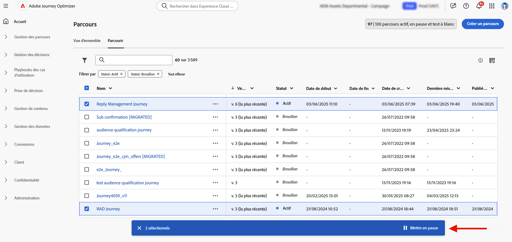

# Mettre en pause un parcours {#journey-pause}

>[!CONTEXTUALHELP]
>id="ajo_journey_pause"
>title="Mettre le parcours en pause"
>abstract="Mettre en pause un parcours dynamique pour empêcher l’entrée de nouveaux profils. Choisissez de supprimer les profils actuellement dans le parcours ou de les conserver en place. S’ils sont conservés, ils reprendront l’exécution à l’activité d’action suivante une fois le parcours redémarré. Parfait pour les mises à jour ou les arrêts d&#39;urgence sans perdre la progression."

Vous pouvez mettre en pause vos parcours actifs, effectuer toutes les modifications nécessaires, puis les reprendre à tout moment.<!--You can choose whether the journey is resumed at the end of the pause period, or whether it stops completely. --> Pendant la pause, vous pouvez [appliquer des filtres globaux](#journey-global-filters) pour exclure des profils en fonction de leurs attributs. Le parcours est automatiquement repris à l’issue de la période de pause. Vous pouvez également le [reprendre manuellement](#journey-resume-steps).

>[!AVAILABILITY]
>
>Cette fonctionnalité n’est disponible que pour un ensemble d’organisations (disponibilité limitée) et sera proposée à tous les utilisateurs et utilisatrices dans une prochaine version.

## Avantages clés {#journey-pause-benefits}

La mise en pause et la reprise des parcours offrent aux responsables de parcours davantage de contrôle et de flexibilité en permettant de suspendre temporairement les parcours actifs sans perturber l’expérience client. Lorsqu’un parcours est mis en pause, aucune communication n’est envoyée et les profils restent suspendus jusqu’à la reprise du parcours.

Cette fonctionnalité réduit le risque d’envoi de messages indésirables lors d’erreurs ou de mises à jour (par exemple, une modification du contenu du message), offre une gestion des parcours plus sûre et renforce la confiance du responsable de parcours. L’affichage des parcours en pause et de leur statut directement dans l’interface d’utilisation améliore la transparence et l’agilité opérationnelle.

>[!CAUTION]
>
>* Les autorisations de mise en pause et de reprise des parcours sont limitées aux utilisateurs et aux utilisatrices qui disposent de l’autorisation de haut niveau **[!DNL Publish journeys]**. Pour en savoir plus sur la gestion des droits d’accès des utilisateurs et des utilisatrices [!DNL Journey Optimizer], consultez [cette section](../administration/permissions-overview.md).
>
>* Avant de commencer à utiliser la fonctionnalité de pause/reprise, [lisez les mécanismes de sécurisation et limitations](#journey-pause-guardrails).

## Mise en pause d’un parcours {#journey-pause-steps}

Vous pouvez mettre en pause n’importe quel parcours **actif**.

Pour mettre en pause votre parcours, procédez comme suit :

1. Ouvrez le parcours que vous souhaitez mettre en pause.
1. Cliquez sur le bouton **...Plus** situé dans la section supérieure droite de la zone de travail du parcours, puis sélectionnez **Mettre en pause**.

   

1. Sélectionnez comment gérer les profils qui se trouvent actuellement dans le parcours.

   {width="50%" align="left"}

   Vous pouvez effectuer les actions suivantes :

   * **Suspendre** profils - Les profils attendront le nœud **Action** suivant pour que le parcours soit repris
   * **Ignorer** profils - Les profils seront exclus du parcours sur le nœud **Action** suivant

1. Cliquez sur le bouton **Mettre en pause** pour confirmer l’opération.

Dans la liste de vos parcours, vous pouvez mettre en pause un ou plusieurs parcours **actifs**. Pour mettre en pause un groupe de parcours (_pause en masse_), sélectionnez-les dans la liste et cliquez sur le bouton **Mettre en pause** dans la barre bleue en bas de l’écran. Le bouton **Mettre en pause** n’est disponible que lorsque des parcours **actifs** sont sélectionnés.

### Comportement dans les parcours en pause

Lorsqu’un parcours est en pause, les nouvelles entrées sont toujours ignorées, quel que soit le mode de conservation/d’exclusion.

Lorsqu’un parcours est en pause, la gestion des profils et l’exécution des activités dépendent de l’activité. Les comportements sont détaillés ci-dessous. Pour une compréhension complète, consultez également cet [exemple de bout en bout](#journey-pause-sample).

| Activité parcours | Lorsque le parcours est en pause |
|-------------------------|--------------------------------------------------|
| [Qualification de l’audience](audience-qualification-events.md) | <ul> <li>Au premier nœud de la zone de travail : toute qualification de profil pour l’audience est ignorée </li><li>Dans les autres nœuds : même comportement que dans un parcours en ligne, mais si la qualification de l’audience se fait après une activité <strong>Action</strong> et que l’utilisateur ou l’utilisatrice est mis en pause sur cette action, la qualification de l’audience est ignorée. </li></ul> |
| [Événement unitaire](general-events.md) | <ul> <li>Au premier nœud de la zone de travail : l’événement est ignoré</li><li>Dans les autres nœuds : même comportement que dans un parcours en direct, cependant, si l’événement se produit après une activité <strong>Action</strong> et que l’utilisateur est mis en pause sur cette action, l’événement est ignoré. </li></ul> |
| [Lecture d’audience](read-audience.md) | Même comportement que dans un parcours en ligne, avec quelques spécificités : <ol> <li> Si l’action <strong>Pause</strong> a été activée après le démarrage de l’activité <strong>Lecture d’audience</strong>, les profils entrés dans le parcours continueront (jusqu’à l’activité <strong>Action</strong> suivante). Comme le parcours lit les audiences à une certaine vitesse, si l’audience complète n’est pas encore entrée, les profils restants dans la file d’attente seront ignorés.</li><li> Pour les exécutions uniques : aucune erreur ne s’affiche au moment de la reprise si la date planifiée était antérieure à la date de reprise. Cet échéancier serait ignoré.</li><li>Pour les parcours incrémentiels : <ul><li>Si une pause se produit avant la première occurrence, l’audience complète sera lue lors de la reprise. </li><li>Si une pause se produit, par exemple, le 4e jour d’une périodicité quotidienne et que le parcours reste en pause jusqu’au 9e jour, alors, lors de la reprise, tous les profils qui sont entrés du 4e au 9e jour seront inclus  </li></ul></ol> |
| [Réaction](reaction-events.md) | Même comportement que dans un parcours dynamique, cependant, si la réaction se produit après une activité <strong>Action</strong> et que l’utilisateur est mis en pause sur cette action, l’événement de réaction est ignoré. |
| [Attente](wait-activity.md) | Même comportement que dans un parcours dynamique |
| [Condition](condition-activity.md) | Même comportement que dans un parcours dynamique |
| [Décision de contenu](content-decision.md) | Les profils sont mis en attente ou ignorés en fonction de ce que l’utilisateur a choisi lorsque le parcours a été suspendu |
| [Action de canal](journeys-message.md) | Les profils sont mis en attente ou ignorés en fonction de ce que l’utilisateur a choisi lorsque le parcours a été suspendu |
| [Action personnalisée](../action/action.md) | Les profils sont mis en attente ou ignorés en fonction de ce que l’utilisateur a choisi lorsque le parcours a été suspendu |
| [Mettre à jour le profil](update-profiles.md) et [Saut](jump.md) | Même comportement que dans un parcours dynamique |
| [Source de données externes](../datasource/external-data-sources.md) | Même comportement que dans un parcours dynamique |
| [Critères de sortie](journey-properties.md#exit-criteria) | Même comportement que dans un parcours dynamique |

## Reprise d’un parcours en pause {#journey-resume-steps}

>[!CONTEXTUALHELP]
>id="ajo_journey_resume"
>title="Reprendre le parcours"
>abstract="Reprenez un parcours en pause pour permettre aux nouveaux profils de rejoindre à nouveau le parcours. Si les profils étaient en attente pendant la pause, ils continueront leur parcours. Idéal pour redémarrer les parcours en toute sécurité après des mises à jour ou des pauses."

Les parcours en pause sont automatiquement repris à l’issue d’une période de pause maximale de 14 jours. Ils peuvent être repris manuellement à tout moment. La reprise d’un parcours en pause permet à de nouveaux profils de saisir à nouveau. Si les profils étaient en attente pendant la pause, ils continueront leur parcours. Idéal pour redémarrer les parcours en toute sécurité après des mises à jour ou des pauses.

Pour reprendre un parcours en pause et recommencer à écouter les événements de parcours, procédez comme suit :

1. Ouvrez le parcours que vous souhaitez reprendre.
1. Cliquez sur le bouton **...Plus** situé dans la section supérieure droite de la zone de travail du parcours, puis sélectionnez **Reprendre**.

   Le statut du parcours devient **Reprise en cours**. Lorsque le parcours reprend, de nouvelles entrées démarrent dans la minute qui suit. La reprise des profils qui ont été conservés peut prendre un certain temps : les profils sont repris à un taux de 5 000 tps.  Comme tous les profils doivent reprendre pour que le parcours soit à nouveau **actif**, la transition du statut **Reprise** au statut **actif** peut prendre un certain temps.

1. Cliquez sur le bouton **Reprendre** pour confirmer l’opération.

Dans la liste de vos parcours, vous pouvez reprendre un ou plusieurs parcours **en pause**. Pour reprendre un groupe de parcours (_reprise en masse_), sélectionnez-les et cliquez sur le bouton **Reprendre** situé dans la barre bleue en bas de l’écran. Notez que le bouton **Reprendre** n’est disponible que lorsque des parcours **en pause** sont sélectionnés.

## Appliquer un filtre global aux profils d’un parcours en pause {#journey-global-filters}

Lorsqu’un parcours est en pause, vous pouvez appliquer un filtre global basé sur des attributs de profil. Ce filtre permet d’exclure au moment de la reprise les profils qui correspondent à une expression définie. Une fois le filtre global défini, il est appliqué sur les nœuds d’action, même pour les nouvelles entrées de profils. Les profils existants correspondant aux critères et les nouveaux profils entrant dans le parcours seront exclus du parcours **sur le nœud d’action suivant** qu’ils rencontrent.

Par exemple, pour exclure tous les clients français d’un parcours en pause, procédez comme suit :

1. Accédez au parcours en pause que vous souhaitez modifier.

1. Cliquez sur l’icône **Critères de sortie et filtre global**.

   

1. Dans les paramètres **Critères de sortie et filtre global**, cliquez sur **Ajouter un filtre global** pour définir un filtre en fonction des attributs de profil.

1. Définissez l’expression pour exclure les profils dont l’attribut de pays est égal à « France ».

   

1. Enregistrez votre filtre et cliquez sur le bouton **Mettre à jour le parcours** pour appliquer vos modifications.

1. [Reprenez le parcours](#journey-resume-steps).

   Au moment de la reprise, tous les profils dont l’attribut de pays est défini sur France seront automatiquement exclus du parcours au niveau du nœud d’action suivant. Tous les nouveaux profils dont l’attribut de pays est défini sur France qui tentent d’entrer dans le parcours sont également bloqués au nœud d’action suivant.

N’oubliez pas que les exclusions de profils, pour les profils actuellement dans le parcours et pour les nouveaux profils, ne se produiront que lorsqu’ils atteindront un nœud d’action.

>[!CAUTION]
>
>* Vous ne pouvez définir qu’**un seul** filtre global par parcours.
>
>* Vous pouvez uniquement créer, mettre à jour ou supprimer un filtre global dans les parcours **en pause**.

## Mécanismes de sécurisation et limitations {#journey-pause-guardrails}

* Une version de parcours peut être suspendue pendant 14 jours au maximum
* Les parcours suspendus sont comptabilisés dans le quota de parcours vivants
* Les profils entrés sur le parcours mais ignorés pendant la pause seraient toujours comptabilisés comme des profils engageables
* Les parcours en pause sont pris en compte dans toutes les règles métier, de la même manière que s’ils étaient actifs
* La temporisation globale des parcours s’applique toujours aux parcours en pause. Par exemple, si un profil a été dans un parcours pendant 90 jours et que le parcours est suspendu, ce profil quittera toujours le parcours le 91
* Les profils sont **ignorés** dans un parcours en pause lorsqu’ils atteignent une activité d’action. S’ils restent en attente pendant la mise en pause d’un parcours et quittent cette attente après sa reprise, ils poursuivront le parcours et ne seront pas ignorés. [Voir l’exemple complet](#journey-pause-sample)
* Même après la pause, à mesure que les événements continuent d’être traités, ces événements sont comptabilisés dans le nombre d’événements de Parcours par seconde, quota au-delà duquel la limitation est prise en compte pour l’unité
* Lorsque les profils sont conservés dans un parcours en pause, les attributs de profil sont actualisés au moment de la reprise.
* Les conditions sont toujours exécutées dans des parcours en pause. Ainsi, si un parcours a été suspendu en raison de problèmes de qualité des données, toute condition préalable à un nœud d’action peut être évaluée avec des données incorrectes
* Pour les parcours basés sur l’audience incrémentielle **Lecture d’audience**, la durée de pause est prise en compte. Ce n’est pas le cas pour la qualification d’audience ou les parcours basés sur un événement (si une qualification d’audience ou un événement sont reçus pendant une pause et qu’ils sont la première activité du parcours, ces événements sont ignorés)
* Si des profils sont conservés dans un parcours et que ce parcours reprend automatiquement au bout de quelques jours, ces profils continuent le parcours et ne sont pas supprimés. Si vous voulez les laisser tomber, vous devez arrêter le parcours
* Dans les parcours en pause, les alertes ne se déclenchent pas pour les [alertes de segments par lots](../reports/alerts.md#alert-read-audiences)
* Il n’existe aucun journal d’audit dans le système lorsque l’état de pause du parcours est arrêté après 14 jours
* Certains profils ignorés peuvent être visibles dans l’événement d’étape de Parcours, mais pas dans les rapports. Par exemple :
   * Ignorer les événements métier pour **Lecture d’audience**
   * **Lecture d’audience** les tâches sont abandonnées en raison d’un parcours en pause
   * Événements ignorés lorsque l’activité **Événement** se trouvait après une activité d’action en attente du profil
     <!--* There is a guardrail (at an org level) on the max number of profiles that can be held in paused journeys. This guardrail is per org, and is visible in the journey inventory on a new bar (only visible when there are paused journeys).-->

## Exemple complet {#journey-pause-sample}

Prenons l’exemple du parcours ci-dessous :

{zoomable="yes"}

Lorsque vous suspendez ce parcours, vous choisissez si les profils sont **Ignorés** ou **Bloqués**, puis la gestion des profils est la suivante :

1. Activité **AddToCart** : toutes les nouvelles entrées de profil sont bloquées. Si un profil est déjà entré dans le parcours avant une pause, il passe au nœud d’action suivant.
1. Activité **Attente** : les profils continuent à attendre normalement sur le nœud et le quitteront, même si le parcours est en pause.
1. **Condition** : les profils continuent de remplir des conditions et de se déplacer vers la branche de droite, en fonction de l’expression définie sur la condition.
1. Activités **Push**/**Email** : lors d&#39;un parcours en pause, les profils commencent à attendre ou sont ignorés (selon le choix effectué par l&#39;utilisateur au moment de la pause) sur le nœud d&#39;action suivant. Les profils vont donc commencer à attendre ou seront ignorés.
1. **Événements** après les nœuds **Action** : si un profil est en attente sur un nœud **Action** et qu’une activité **Événement** suit, si cet événement est déclenché, le profil est ignoré.

Selon ce comportement, vous pouvez voir le nombre de profils augmenter sur le parcours en pause, principalement dans les activités précédant les activités **Action**. Par exemple, dans cet exemple, l’activité **Attente** est toujours activée, ce qui augmente le nombre de profils qui passent par l’activité **Condition** lorsqu’ils la quittent.

Lorsque vous reprenez ce parcours :

1. Les entrées du parcours débutent dans une minute.
1. Les profils qui étaient en attente dans le parcours sur les activités **Action** sont rétablis à un taux de 5 000 tps. Ils peuvent alors entrer le **Action** qu’ils attendaient et continuer le parcours.
